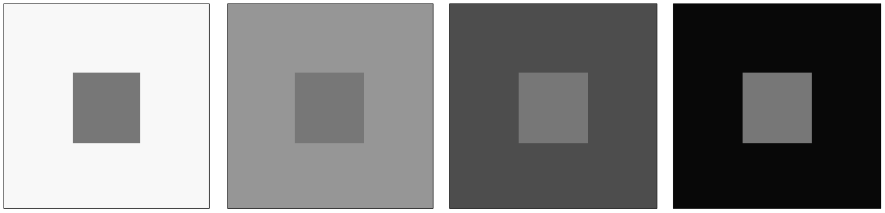
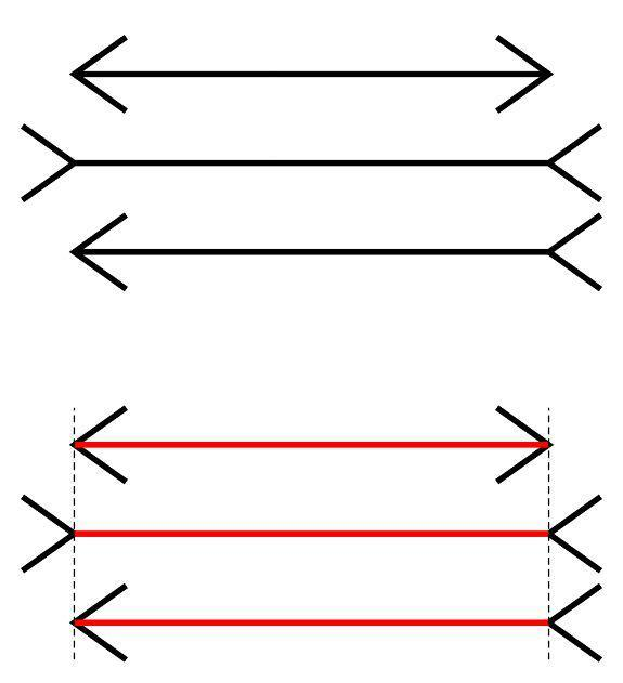

### 壹  数字图像处理基础

#### 述：
#####
#####

###### · 视觉过程：
· 生物视觉：人类通过眼睛看世界，在视网膜上成像，通过改变眼睛各项参数，清晰感知场景内容

（图一：生物视觉的形成过程）

· 数字视网膜成为联接城市大脑的 “慧眼”，通过 “特征实时汇聚 + 视频按需调取” 来支撑城市
· 视频大数据分析与搜索
· 首先探索视网膜编码视觉刺激的工作机理这个科学问题，再面向仿生物视网膜的视觉传感器研究如何构建基于脉冲的超高速视觉算法

（图二：视觉过程的“视”和“觉”）

· 视觉过程包括“视”过程和“觉”过程：
	· “视”过程是一个图像采集的过程
	· “觉”过程是一个图像感知的过程

· 人眼球的断面图可看作一个光学系统的光路图
· 人的眼睛是人类视觉系统的重要组成部分，是实现光学过程的物理基础
· 眼睛是一个平均直径约为 20mm 的球体
· 晶状体（lens）对应于照相机的镜头
· 晶状体前的瞳孔（pupil）对应于照相机的光圈
· 视网膜（retina）对应于照相机的胶片，是含有光感受器和神经组织网络的薄膜

                               （图三：人眼球的断面图）

· 网膜中的视觉感知器：柱状细胞 Rods vs. 锥状细胞 Cones
· *锥状体 Cones*：
	· 600-700 万个
	· 在中央凹的中间部分
	· 对颜色敏感
	· 每个锥状体连接一个神经末梢，使人可以分辨图像细节
· 锥状体视觉称为白昼视觉或亮视觉

                          （图四：距视轴（中央凹中心）的度数）
· *杆状体 Rods*：
	· 7500-15000 万个
	· 分布面积大
	· 多个杆状体连接到一个神经末梢，降低了感知细节的能力
	· 没有颜色感觉，对低照明度敏感。如白天色彩鲜艳的物体，在月光下没有颜色
· 暗视觉或微光视觉

· 睫状体、虹膜、瞳孔：
	· 脉络膜最前端为睫状体和虹膜
	· 虹膜的收缩控制进入眼睛的光亮

· 瞳孔：
	 虹膜中间开口（瞳孔）直径可变，范围为 2-8 mm

· 晶状体：
	· 60%-70% 水、6% 脂肪、蛋白质构成
	· 稍黄的色素着色，颜色随年龄递增
	· 白内障等引起混浊，降低颜色辨别能力和视觉清晰度
	· 吸收红外光和紫外光，过量时伤害眼睛

                           （图五：望远时晶体减薄瞳孔扩大）

                            （图六：晶状体颜色随年龄递增）

· **视觉特性**：
	· *视觉特性是视觉感知的外在表现*
	· 视觉特性包括视觉对光强，对各种波长、色彩的光谱响应，对物体边缘等空间频率变化的响应，以及视觉对时间瞬时变化运动的响应等
	· 亮度对比度、主观亮度、亮度适应等
	· 亮度对比度：图像中亮度的最大值与最小值的比值称为亮度对比度，用下式表示：
$$C=\frac{I_{max}}{I_{min}}$$
	· 有时还采用相对对比度
	· 相对对比度是物体亮度 $I_T$ 和背景亮度 $I_B$ 的差值与背景亮度 $I_B$ 的比值，用下式表示：
$$C=\frac{I_T-I_B}{I_B}$$

· *主观亮度*：
· 人的视觉系统感受到的物体的亮度称为主观亮度，亮度视觉范围是人眼能够感觉到的亮度范围
· 人眼对景物亮度的主观感觉不仅取决于景物实际亮度值，而且还与周围环境的平均亮度有关
· 人眼的明暗感觉是相对的：在不同环境亮度下，人眼对同一亮度的主观感觉会不同

· *亮度适应现象：同时对比度（丘布（Chubb）错觉 ）*：
· 大小一样且亮度相同的目标物处于不同的亮度背景中，人眼所感受到的主观亮度不同
· 通常，人眼会感到背景亮度较暗的目标物较亮，而背景较亮的目标物较暗，这种效应称为同时对比度

（图七：亮度适应现象——同时对比度）

                   （图八：丘布错觉的示例（中间的长条是整体完全同色的））

· *亮度适应现象：马赫带*：
· 马赫带现象是 1868 年由奥地利物理学家 E.Mach 发现的一种亮度对比现象，即是指人眼在明暗交界处感到亮处更亮，暗处更暗的现象

                              （图九：马赫与马赫带现象）

· *亮度适应现象：视觉错觉*：

（图十：视觉错觉的示例）

                                （图十一：穆勒-莱尔幻觉）

                                （图十二：移动的灰色点）

                           （图十三：飘动的“树叶”视觉现象）

###### · 采样量化：
· 我们日常生活中见到的图像一般是连续形式的模拟图像，可由一个二维连续函数 $f(x, y)$ 来描述；其中 $(x, y)$ 是图像平面上任意一个二维坐标点，$f(x, y)$ 则是该点颜色的深浅
· 数字图像处理的一个先决条件就是将连续图像经采样、量（离散）化，转换为数字图像
· 空间坐标的离散化叫做空间采样（简称采样），它确定了图像的空间分辨率
· 灰度值（颜色深浅幅度）的离散化叫做灰度量化（简称量化），它确定了图像的幅度分辨率
· 采样过程可看作将图像平面划分成规则网格，每个网格中心点的位置由一对笛卡尔坐标 $(x,y)$ 决定，$x$ 和 $y$ 均取整数
· 量化过程是给点 $(x,y)$ 赋予灰度值 $f$，$f$ 取整数

                        （图十四：模拟图像和数字图像的灰度量化）

                            （图十五：采样和量化示意图）

· *空间分辨率*：如果一副图像的尺寸为 $M\times N$，则表明在成像时采了 $M\times N$ 个样，图像包含 $M\times N$ 个像素
· *幅度分辨率*：如果对每个像素都用 $L$ 个灰度值中的一个来赋值，则表明在成像时量化成了 $L$ 个灰度级 $[0, L-1]$
· 在数字图像处理中，一般将这些量均取为 $2$ 的整数次幂
	· 图像水平尺寸 $M$：$M=2^m$，$m$ 为正整数
	· 图像垂直尺寸 $N$：$N=2^n$，$n$ 为正整数
	· 像素灰度级数 $L$：$L=2^k$，$k$ 为正整数，即 $k$ 位图像
	· 图像所需比特数 $b$：$b=M\times N\times k$
	· 如果 $M=N$，则：$b=N^2\times k$

                        （图十六：$M\times N$ 的图像的存储示意图）

· 例：手机配置中通常列出相机的以下参数：
	· $2K$（$2048\times1080$）和 $4K$（$4096\times2160$）都只描述了分辨率，而 $1080p$ 既描述了分辨率（$1920\times1080$），又描述了显示的过程和方法：
	· $i$ 表示隔行扫描 （Interlaced scan ）
	· $p$ 则表示逐行扫描（Progressive scan）

                      （图十七：手机配置中通常列出相机的参数示例）

· 图像分辨率和灰度级对图像大小的影响：

| $k(K)/M\times N$ | $32\times 32$ | $64\times 64$ | $128\times 128$ | $256\times 256$ | $512\times 512$ | $800\times 600$ | $1024\times 768$ | $1280\times 720$ |
| :--------------- | :------------ | :------------ | :-------------- | :-------------- | :-------------- | :-------------- | :--------------- | ---------------- |
| $1(2)$           | $1024$        | $4096$        | $16384$         | $65536$         | $262144$        | $480000$        | $786432$         | $921600$         |
| $4(16)$          | $4096$        | $19384$       | $65536$         | $262144$        | $1048576$       | $1920000$       | $3145728$        | $3686400$        |
| $8(256)$         | $8192$        | $32768$       | $131072$        | $524288$        | $2097152$       | $3840000$       | $6291456$        | $7372800$        |
| $24(16777216)$   | $24576$       | $98304$       | $393216$        | $1572684$       | $6291456$       | $11520000$      | $18874368$       | $22118400$       |

· **例**：试求一段采用 PAL 制式、分辨率为 $1024\times 768$、长度为 $1$ 分钟的高清彩色视频所占用的存储空间的大小（ PAL 制式为 $25$ 帧/秒，即每秒播放 $25$ 副 $24$ 位图像）
· **解**：$1$ 分钟的视频共需存储 $25\times60=1500$ 副图像；由于彩色图像每个像素需要用 $3$ 个字节（Byte）存储，因此，一副分辨率为 $1024\times 768$ 的图像需要占用 $1024\times768\times3(Bytes)=2359296(Bytes)=2303(KBytes)=2.25(MBytes)$；因此该段视频所占用的存储空间为：$1500\times2.25(MBytes)=3375(MBytes)=3.30(GBytes)$

· **空间分辨率和幅度分辨率的变化对图像质量的影响**：
1. 空间分辨率变化—幅度分辨率不变（256 级灰度）：

                        （图十八：空间分辨率对图像质量的影响）
· 采样方法：后一幅图像从前一幅图像中每隔一行或一列删除一行或一列

（图十九：空间分辨率变化后的图像，对尺寸进行归一化处理）
· 空间分辨率减小、幅度分辨率不变时，图像质量由精细变得粗糙：图十九—（d）中的景物已几乎不能分辨
· 因此图像空间分辨率的变化对图像质量有较大影响

2. 空间分辨率不变—幅度分辨率变化（256×256 像素）：

（图二十：幅度分辨率对图像质量的影响）
· 空间分辨率不变、幅度分辨率减小时，图像质量由精细变得粗糙
· 图二十—（c）中只有 4 种不同的灰度，图二十—（d）中仅有两种不同的灰度，且景物已几乎不能分辨
· 因此图像幅度分辨率的变化对图像质量有较大影响

3. 空间分辨率变化，同时幅度分辨率变化：

（图二十一：空间分辨率和幅度分辨率均变化下的图像质量对比）
· 空间分辨率减小、同时幅度分辨率减小时，图像质量由精细变得粗糙，且变化的速度加快
· 图二十一—（c）中的景物就已经不能分辨，图二十一—（d）中的景物更是没有意义

###### · 颜色深度与颜色度：
· *颜色深度*：数字图像的颜色深度表示每一个像素的颜色值所占的二进制位数
例如：颜色深度为 $8$，表示每一个像素的颜色值占 $8$ 个二进制位，即 $1$ 个字节
· *颜色数*：数字图像的颜色数表示每一个像素所有可能的颜色值的个数，即图像颜色表的表项数
例如：颜色深度为 $8$ 的图像的颜色数为 $2^8=256$

· *二值图像*也称单色图像或 $1$ 位图像，即颜色深度为 $1$ 的图像
	· 颜色深度为 $1$ 表示每个像素点仅占 $1$ 位
	· 一般地，$0$ 表示黑，$1$ 表示白
· *灰度图像*是包含灰度级（亮度）的图像

· *灰度图像的特点*包括：
1. 灰度图像的存储文件包含图像颜色表，该颜色表有 $256$ 项，每一项由红、绿、蓝颜色分量组成，且红、绿、蓝颜色分量的值都相等
$$f_G(x,y)=f_R(x,y)=f_B(x,y)$$
2. 每个像素由 $8$ 位组成，其值范围从 $0$~$255$，表示 $256$ 种不同的灰度级
3. 像素的像素值 $f(x,y)$ 是图像颜色表的表项入口地址

                        （图二十二：二值图像及对应的图像数据）

                        （图二十三：灰度图像及对应的图像数据）

· *真彩色图像的特点*包括：
1. 真彩色图像的图像文件中不包含图像颜色表
2. 每个像素由 R、G、B 三个分量组成，每个分量各占 $8$ 位，每个像素共占 $24$ 位
3. 每个分量 $f_G(x,y)、 f_R(x,y)、 f_B(x,y)$ 的取值范围从 $0$~$255$

                       （图二十四：真彩色图像及对应的图像数据）

###### · 图像存储格式：
· 数字图像根据其不同特性，可分为两类：位图（又称点阵图）和矢量图
· 数字图像文件格式有很多种，不同的操作系统和应用软件常使用不同的图像文件格式：
	· BMP 文件格式
	· JPEG 文件格式
	· TIFF 文件格式
	· GIF 文件格式
	· PNG 文件格式

1. **位图**：
· 放大位图时，增大每个像素，从而使线条和形状参差不齐
· 缩小位图时，也使原图变形
· 位图方式下，影响图像质量的关键因素是颜色的数量和图像的分辨率

· *BMP 文件*：基本的 Windows 位图格式文件，在图标、背景等中使用；为处理方便，一般不压缩
· *PCX 文件*：广泛使用的图像格式文件之一，与图形显示硬件有关，使用时都经过压缩，压缩和解压缩速度较快
· *TIFF 文件*：最早用于扫描仪和桌面出版系统；支持几乎所有图形类型，被许多图形软件支持；TIFF 有压缩和非压缩，压缩后为 TIEF
· *GIF 文件*：译为图形交换格式；使用时都经压缩，压缩比较高，文件较小， 目前 Internet 的 Web 浏览器主页图片的标准格式文件
· *TGA 文件*：在 PC 机上常用；用于表示色彩较复杂并极富变化的图像，例如相片、3D 图形等；由于变化大，重复性低，一般不强调压缩
· *JPEG 文件*：是按图像联合专家组（Joint Photographic Experts Group）制定的标准来压缩存储的图像文件格式，是一种有损压缩算法；JPEG 文件在 PC 机上很流行，文件较小，适用于处理大图像的场合

2. **矢量图**：
· 矢量图是一种使用点、线和形状（即“矢量”）来表示图像的计算机图形
· 这些元素都是根据数学表达式来创建的，这使得它们可以在任何尺寸下保持清晰度和精度
· 矢量图具有可编辑性
· 矢量图通常具有较小的文件大小
· 创建矢量图需要特殊的软件，例如 Pixso、 Adobe Illustrator、CorelDRAW 或者 Inkscape 等
· 格式包括 SVG（Scalable Vector Graphics）、EPS（Encapsulated PostScript）、AI（Adobe Illustrator）、PDF（Portable Document Format）、DXF（Drawing Exchange Format）等

###### · 像素空间关系：
· **邻域**：
· ⼀个像素的邻近像素组成该像素的邻域

                           （图二十五：像素邻域的类型示意）

· *像素邻域的类型*：
1. $4$ - 邻域 $N_4(p)$：
· 由 $p$ 的⽔平（左右）和垂直（上下）共 $4$ 个近邻像素组成
· 这些近邻像素的坐标分别是 $(x+1,y)$，$(x-1,y)$，$(x,y-1)$，$(x,y+1)$
· 组成 $p$ 的 $4$ - 邻域 的 $4$ 个像素均⽤ $r$ 表示
2. 对角邻域 $N_D(p)$：
· 由 $p$ 的对角（左上、右上、左下、右下）共 $4$ 个近邻像素组成
· 这些近邻像素的坐标分别是 $(x+1,y+1)$，$(x+1, y-1)$，$(x-1,y+1)$，$(x-1,y-1)$
· 组成 $p$ 的对角邻域的 $4$ 个像素均用 $s$ 表示
3. $8$ - 邻域 $N_8(p)$：
· 由 $p$ 的 $4$ 个 $4$ - 邻域像素与 $4$ 个对角邻域像素共同组成

· 如果像素 $p$ 本身处在图像的边缘，则它的 $N_4(p)$，$N_D(p)$ 和 $N_8(p)$ 中的若干个像素将落在图像之外

· **邻接性**：
1. 是否接触
2. 灰度值是否满足某个特定的相似准则
· “灰度值”也可以是其它属性值
· “相似准则”可以是灰度值相等，或同在一个灰度值集合中取值
· 例如：设 $V$ 表示定义邻接的灰度值集合，则有：在一幅二值图像中，考虑两个灰度值为 $1$ 的像素之间的邻接，取 $V=\{1\}$
· 在一幅有 $32$ 个灰度级的灰度图中，考虑灰度值在 $8$ 到 $15$ 间的两个像素的邻接时，取 $V=\{8,9,\ldots,15\}$

· **像素邻接的类型**：
1. $4$ - 邻接：
· 两个像素 $p$ 和 $r$ 在 $V$ 中取值且 $r$ 在 $N_4(p)$ 中
· $r$ 在 $N_4(p)$ 中意味着 $p$ 也在 $N_4(r)$ 中
2. $8$ - 邻接：
· 两个像素 $p$ 和 $r$ 在 $V$ 中取值且 $r$ 在 $N_8(p)$ 中
· $r$ 在 $N_8(p)$ 中意味着 $p$ 也在 $N_8(r)$ 中
3. $m$ - 邻接（混合邻接）：
· 两个像素 $p$ 和 $r$ 在 $V$ 中取值且满足下列两个条件之一：
1. $r$ 在 $N_4(p)$ 中，即两个像素 $p$ 和 $r$ 是 $4$ - 连接
2. $r$ 在 $N_D(p)$ 中且 $N_4(p)\cap N_4(r)$ 在 $V$ 的意义下是空集
· 即 $N_4(p)\cap N_4(r)$ 不包含 $V$ 中取值的像素
· **口诀**：“或四，或八而不四，为混邻”

                      （图二十六：像素空间关系——混合邻接的判定）

                    （图二十七：像素空间关系——混合邻接解决多路问题）

· **连通性**：
· 具有坐标 $(x, y)$ 的像素 $p$ 到具有坐标 $(s, t)$ 的像素 $q$ 的一条通路由一系列具有坐标 $(x_0, y_0)$，$(x1, y1)$，…，$(x_n, y_n)$ 的独立像素组成
1. $(x_0, y_0)=(x, y)$，$(x_n, y_n)=(s, t)$
2. $(x_i, y_i)$ 与 $(x_i-1, y_i-1)$ 邻接
3. $1\leq i\leq n$，$n$ 为通路长度
· 根据不同的邻接定义，可以得到不同的通路
· 如：$4$ - 邻接 $=>$ $4$ - 通路，$8$ - 邻接 $=>$ $8$ - 通路

                        （图二十八：不同邻接类型下图的连通性）
· 像素间通路上所有像素的灰度值均满足某个特定的相似准则，则像素 $p$ 和 $q$ 是连通的
· 根据不同的连接定义，可以得到不同的连通（如：$4$ - 连接 => $4$ - 连通，$8$ - 连接 $=>$ $8$ - 连通）
· 连接可以看作是像素连通的一种特例（两个连通的像素也是连接的，$n=1$ 时）

· **连通分量**：
· 令 $S$ 是图像中的⼀个像素⼦集
· 如果 $S$ 的全部像素之间存在⼀个通路，则可以说任意两个像素 $p$ 和 $q$ 在 $S$ 中是连通的
· 对于 $S$ 中任何元素 $p$，$S$ 中连通到该像素集称为 $S$ 的连通分量

· **连通集**：
· 如果 $S$ 仅有一个连通分量，即 $S$ 中所有像素都互相连通，则集合 $S$ 称为连通集

                              （图二十九：连通集的概念）

· **几个重要概念**：
· *区域*：
	· 令 $R$ 是图像中的一个像素子集
	· 如果 $R$ 是连通集，则称 $R$ 为一个区域
	· 在谈区域时，必须指定邻接的类型（$4$ - 邻接或 $8$ - 邻接）
· *邻接区域、不邻接区域*
· *前景、背景*
· *边界*：
	· 一个 $R$ 的边界（也称为边缘或轮廓）是区域中像素的集合
	· 内边界、外边界

· **像素间的距离**：
· 像素间的距离是指像素在空间的接近程度
· 设 $3$ 个像素为 $p$、$q$ 和 $r$，坐标分别为 $(x,y)$、$(s,t)$ 和 $(u,v)$，则距离量度函数 $D$ 必须满足下列三个条件：
1. $D(p,q)\geq0$
2. $D(p,q)=D(q,p)$
3. $D(p,r)\leq D(p,q)+D(q,r)$
· 条件一表明两个像素之间的距离总是为正值，若 $D(p,q)=0$ 当且仅当 $p=q$
· 条件二表明像素之间的距离与起点和终点的选择无关
· 条件三表明像素之间最短距离是沿直线的
· 常见的距离度量方法包括欧式距离、城区距离、棋盘距离和混合距离：

· $D_E$ 距离即欧氏（Euclidean）距离，是范数为 $2$ 的距离，点 $p$ 和 $q$ 之间的欧氏距离定义为：
$$D_E(p,q)=[(x-s)^2+(y-t)^2]^{\frac{1}{2}}$$
· $D_4$ 距离即城区（city-block）距离，是范数为 $1$ 的距离，点 $p$ 和 $q$ 之间的欧氏距离定义为：
$$D_4(p,q)=\lvert x-s\rvert+\lvert y-t\rvert$$
· $D_8$ 距离即棋盘（chessboard）距离，是范数为 $\infty$ 的距离，点 $p$ 和 $q$ 之间的欧氏距离定义为：
$$D_8(p,q)=\max(\lvert x-s\rvert,\ \lvert y-t\rvert)$$

· 两点 $p$ 和 $q$ 之间的 $D_4$ 距离等于它们之间最短的 $4$ - 通路的长度
· 两点 $p$ 和 $q$ 之间的 $D_8$ 距离等于它们之间最短的 $8$ - 通路的长度

                           （图三十：两点不同距离下的示例）
· 像素点之间的混合距离（$D_m$）同样刻画了像素在空间的接近程度，其大小不仅与像素的坐标有关，还与像素本身及其邻近像素的属性值有关
· 两个像素点 $p$ 和 $q$ 之间的混合距离 $D_m(p,q)$ 等于它们之间满足混合连通的通路的长度

                       （图三十一：像素空间关系——混合距离示例）
· 在上图三十一中：
	· 当像素 $s$ 和 $t$ 的灰度值如图 (b) 取值时，满足混合连通的通路如图所示，$D_m(p,q)=2$
	· 当像素 $s$ 和 $t$ 的灰度值如图 (c) 取值时，满足混合连通的通路如图所示，$D_m(p,q)=3$
	· 当像素 $s$ 和 $t$ 的灰度值如图 (d) 取值时，满足混合连通的通路如图所示，$D_m(p,q)=3$
	· 当像素 $s$ 和 $t$ 的灰度值如图 (e) 取值时，满足混合连通的通路如图所示，$D_m(p,q)=4$

· **口诀**：
N 区 D 距 4, 8, m，欧拉为 E 混合 m
城区四面横加竖，棋盘八角大横竖

###### · 数字图像处理中涉及的数学工具：
1. ***数值运算***：
· 阵列与矩阵操作：
	· 考虑下面的 $2\times2$ 图像：
$$\begin{bmatrix}a_{11}&a_{12}\\ a_{21}&a_{22}\end{bmatrix}\ \ and\ \ \begin{bmatrix}b_{11}&b_{12}\\ b_{21}&b_{22}\end{bmatrix}$$
	· 逐元素相乘（elementwise product）：
$$\begin{bmatrix}a_{11}&a_{12}\\ a_{21}&a_{22}\end{bmatrix}\odot\begin{bmatrix}b_{11}&b_{12}\\ b_{21}&b_{22}\end{bmatrix}=\begin{bmatrix}a_{11}b_{11}&a_{12}b_{12}\\ a_{21}b_{21}&a_{22}b_{22}\end{bmatrix}$$
	· 矩阵乘法（matrix product）：
$$\begin{bmatrix}a_{11}&a_{12}\\ a_{21}&a_{22}\end{bmatrix}\begin{bmatrix}b_{11}&b_{12}\\ b_{21}&b_{22}\end{bmatrix}=\begin{bmatrix}a_{11}b_{11}+a_{12}b_{21}&a_{11}b_{12}+a_{12}b_{22}\\ a_{21}b_{11}+a_{22}b_{21}&a_{21}b_{12}+a_{22}b_{22}\end{bmatrix}$$

                      （图三十二：图像处理中的数值运算——加减乘除）

               （图三十三：图像处理中的数值运算——非线性灰度变换与亮度控制）

                （图三十四：图像处理中的数值运算——像素变化比例的校正作用）

                  （图三十五：图像处理中的数值运算示例：数字减影血管造影）

2. ***逻辑运算***：

                        （图三十六：逻辑运算、维恩图及其真值表）

                       （图三十七：逻辑运算在图像“交叠”上的作用）

