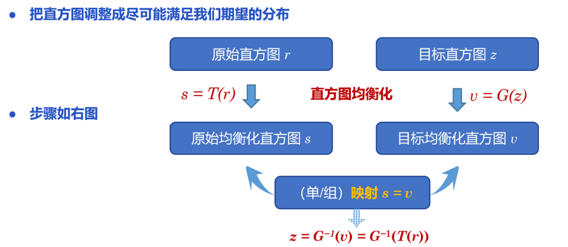

### 壹  空域变换增强

#### 述：
#####
#####

###### · 图像增强基础：
· *灰度变换和空间滤波基础*：
	· 空域
	· 空间滤波
	· 空间滤波器（空间掩模、核、模板或窗⼝）
	· 灰度变换函数
	· 对⽐度拉伸、阈值处理函数

                           （图一：灰度变换和空间滤波基础）
· 对⽐度拉伸、阈值处理函数：增强图只剩下 2 个灰度级，对⽐度最⼤但细节全丢失了

                 （图二：增强图只剩下 2 个灰度级时对比度最大但细节尽失）

· *图像增强技术*：
• 图像增强技术
	· 目的是对图像进行加工，以得到对具体应⽤来说视觉效果更“好”、更“有用”的图像
· 空域增强方法指直接作用于像素改变其特性的增强方法
	· 具体的增强操作可仅定义在每个像素位置 $(x,y)$ 上，此时称为点操作
	· 增强操作还可定义在每个 $(x, y)$ 的某个邻域上，此时常称为模板操作或邻域操作

（图三：用图像平均消除随机噪声）

· 由于点可以看作是尺度为 $1\times1$ 的邻域，因此点操作可以看作是模板操作的特例
· 几何变换、灰度变换和直方图处理

###### · 几何变换：
· 几何变换将图像的几何信息进行变换来获取新图像的变换方法，包括*平移变换、缩放变换、旋转变换、镜像变换、剪切变换、透视变换*等
· 二维图像和三维图像的几何变换原理基本相同，本节主要基于二维图像几何变换的原理进行介绍

1. **缩放变换（Scale Transformation）**：
· 设空间中一个点的笛卡尔坐标为 $(x,y)$，基于放缩向量 $(S_x,S_y)$ 将其放缩到新的坐标 $(x^{'},y^{'})$，则放缩变换公式可表示为：$$\begin{bmatrix}x^{'}\\ y^{'}\end{bmatrix}=\begin{bmatrix}S_x&0\\ 0&S_y\end{bmatrix}\begin{bmatrix}x\\ y\end{bmatrix}$$
· 需要注意的是，当放缩系数不为整数时，原始图像中某些像素放缩后的坐标可能不为整数，导致变换后的图像中出现“孔洞”现象，此时*需要经过取整或插值等操作来进行失真校正*

                           （图四：“孔洞”现象与失真校正对比图）

2. **剪切变换（Shear Transformation）**：
· 剪切变换也称为错切变换，刻画了类似四边形不稳定性的性质，包括水平剪切和垂直剪切
· 水平剪切指将图像一条水平边固定，并沿水平方向拉长图像来获取新图像的变换方法
· 垂直剪切指将图像一条垂直边固定，并沿垂直方向拉长图像来获取新图像的变换方法

                                （图五：水平剪切的原理）

                              （图六：几种剪切变化示例）

3. **旋转变换（Rotation Transformation）**：
· 旋转变换是一种刚体变换（Rigid-Body Transformation），指将图像以某点为轴进行旋转来获取新图像的变换方法
· 首先考虑 $2D$ 平面上一个点绕原点的旋转
· 设平面上一个点的笛卡尔坐标为 $(x_0,y_0)$，将该点绕原点 $O$ 顺时针旋转角度 a 后到达新的坐标 $(x_1,y_1)$，其中 $r$ 为该点到原点 $O$ 的距离；$b$ 为旋转前 $r$ 与 $x$ 轴之间的夹角

                              （图七：$2D$ 旋转变换示意图）
· 旋转前：$$x_0=r\cdot cos\ b,\ \ \ \ y_0=r\cdot sin\ b$$
· 旋转后：$$x_1=r\cdot cos(b-a)=r\cdot cos\ b\cdot cos\ a+r\cdot sin\ b\cdot sin\ a=x_0\cdot cos\ a+y_0\cdot sin\ a$$$$y_1=r\cdot sin(b-a)=r\cdot sin\ b\cdot cos\ a-r\cdot cos\ b\cdot sin\ a=-x_0\cdot sin\ a+y_0\cdot cos\ a$$
· 以矩阵的形式表示：$$\begin{bmatrix}x_1\\ y_1\end{bmatrix}=\begin{bmatrix}cos\ a&sin\ a\\ -sin\ a&cos\ a\end{bmatrix}\begin{bmatrix}x_0\\ y_0\end{bmatrix}$$

                              （图八：逆时针旋转的原理）

· 通过上面几种变换可以看出几何变换的本质是矩阵运算：
空间一个点的笛卡尔坐标为 $(x,y)$，基于某个条件将其变换到新的坐标 $(x^{'},y^{'})$，则几何变换（以线性变换为例）公式可表示为下式所示的矩阵形式：
$$x^{'}=ax+by,\ \ \ \ y^{'}=cx+dy$$$$\begin{bmatrix}x^{'}\\ y^{'}\end{bmatrix}=\begin{bmatrix}a&b\\ c&d\end{bmatrix}\begin{bmatrix}x\\ y\end{bmatrix}$$$$\vec{x}^{'}=M\ \vec{x}$$

4. **平移变换（Translation Transformation）**：
· 平移变换是一种刚体变换（Rigid-Body Transformation），指将图像沿某方向平移来获取新图像的变换方法

                               （图九：平移变换示意图）
· 设空间中一个点的笛卡尔坐标为 $(x,y)$，基于平移向量 $(T_x,T_y)$ 将其平移到新的坐标 $(x^{'},y^{'})$，则平移变换公式可表示为：$$x^{'}=x+t_x,\ \ \ \ y^{'}=y+t_y$$
写成矩阵形式：$$\begin{bmatrix}x^{'}\\ y^{'}\end{bmatrix}=\begin{bmatrix}a&b\\ c&d\end{bmatrix}\begin{bmatrix}x\\ y\end{bmatrix}+\begin{bmatrix}t_x\\ t_y\end{bmatrix}$$

5. **镜像变换（Mirror Transformation）**：
· 水平镜像指将图像左半部分和右半部分以图像垂直中轴线为中心进行镜像对换来获取新图像的变换方法
· 设空间中一个点的笛卡尔坐标为 $(x,y)$，将其水平镜像到新的坐标 $(x^{'},y^{'})$，则水平镜像变换公式可表示：$$x^{'}=-x+w,\ \ \ \ y^{'}=y$$
写出矩阵形式：$$\begin{bmatrix}x^{'}\\ y^{'}\end{bmatrix}=\begin{bmatrix}-1&0\\ 0&1\end{bmatrix}\begin{bmatrix}x\\ y\end{bmatrix}+\begin{bmatrix}w\\ 0\end{bmatrix}$$$$\begin{bmatrix}x^{'}\\ y^{'}\\ 1\end{bmatrix}=\begin{bmatrix}-1&0&w\\ 0&1&0\\ 0&0&1\end{bmatrix}\begin{bmatrix}x\\ y\\ 1\end{bmatrix}=\begin{bmatrix}-x+w\\ y\\ 1\end{bmatrix}$$

· 垂直镜像指将图像上半部分和下半部分以图像水平中轴线为中心进行镜像对换来获取新图像的变换方法
· 设空间中一个点的笛卡尔坐标为 $(x,y)$，将其垂直镜像到新的坐标 $(x^{'},y^{'})$，则垂直镜像变换公式可表示：$$x^{'}=x,\ \ \ \ y^{'}=-y+h$$

                                （图十：镜像变换示意图）

· *齐次变换问题*：
· 齐次坐标是指把一个 $n$ 维向量用一个 $n+1$ 维向量来表示
· 设空间中一个点的笛卡尔坐标为 $(x,y)$，则其对应的齐次坐标为 $(H_x,H_y,H)$；当 $H=1$ 时，坐标 $(x,y,1)$ 称为坐标 $(x,y)$ 对应的规范化齐次坐标
· 齐次坐标的表示方式是不唯一的，引入齐次坐标的主要目的是合并矩阵运算中的乘法和加法，它提供了一种利用矩阵运算把二维、三维甚至高维空间中的一个点集从一个坐标系变换到另一个坐标系的有效方法
· 二维点 $(x,y,1)^T$
· 二维向量 $(x,y,0)^T$

· 验证引入齐次坐标系的操作
	· 向量+向量=向量
	· 点-点=向量
	· 点+向量=点
	· $(x,y,w)^T$ 也表示二维点 $(\frac{x}{w},\frac{y}{w},1)^T$，当 $w\neq0$
· 平移变换的矩阵形式：$$\begin{bmatrix}x^{'}\\ y^{'}\\ 1\end{bmatrix}=\begin{bmatrix}1&0&t_x\\ 0&1&t_y\\ 0&0&1\end{bmatrix}\begin{bmatrix}x\\ y\\ 1\end{bmatrix}+\begin{bmatrix}x+t_x\\ y+t_y\\ 1\end{bmatrix}$$
· 水平剪切变换的矩阵形式：$$\begin{bmatrix}x^{'}\\ y^{'}\\ 1\end{bmatrix}=\begin{bmatrix}-1&0&w\\ 0&1&0\\ 0&0&1\end{bmatrix}\begin{bmatrix}x\\ y\\ 1\end{bmatrix}+\begin{bmatrix}-x+w\\ y\\ 1\end{bmatrix}$$
· 旋转变换的矩阵形式：$$\begin{bmatrix}x^{'}\\ y^{'}\\ 1\end{bmatrix}=\begin{bmatrix}cos\theta&-sin\theta&0\\ sin\theta&cos\theta&0\\ 0&0&1\end{bmatrix}\begin{bmatrix}x\\ y\\ 1\end{bmatrix}+\begin{bmatrix}x\\ y\\ 1\end{bmatrix}$$
· <font color="#ff337d">口诀</font>：<font color="#00ffb0">“逆右而上”</font>

6. **投影变换（Projection Transformation）**：

                            （图十一：正交变换与透视变换 Ⅰ）

                            （图十二：正交变换与透视变换 Ⅱ）

                              （图十三：正交变换的原理）
· 摄像机正交投影：
	1. 摄像机位于原点，从 $-Z$ 方向观察，$Y$ 方向向上
	2. “扔掉” $Z$ 方向
	3. 平移缩放到 $[-1,1] ^2$

· *正交投影*：
· 在 $x$ 轴上定义左和右 $[l,r]$（左比右小），$y$ 轴上定义下和上 $[b,t]$（下比上小），$z$ 轴上定义远和近 $[f,n]$（远比近小）
· $[l,r]\times[b,t]\times[f,n]$ —> cube $[-1,1]^3$

                            （图十四：正交变换矩阵表示）
· 步骤：
1) 原始图像以角点为 $(0,0,0)$，其中心点是 $(\frac{r+l}{2},\frac{t+b}{2},\frac{n+f}{2})$，缩放处理前先将中心点平移到原点，利用平移变换矩阵：$$M_{Translate}=\begin{bmatrix}1&0&0&-\frac{r+l}{2}\\ 0&1&0&-\frac{t+b}{2}\\ 0&0&1&-\frac{n+f}{2}\\ 0&0&0&1\end{bmatrix}$$
2) 将平移后的图像进行缩放，缩放因子 $=\frac{目标范围长度}{原始范围长度}$，故缩放矩阵为：$$M_{Scale}=\begin{bmatrix}\frac{2}{r-l}&0&0&0\\ 0&\frac{2}{t-b}&0&0\\ 0&0&\frac{2}{n-f}&0\\ 0&0&0&1\end{bmatrix}$$
3) 乘积得到正交变换矩阵：$$M_{Orthographic}=\begin{bmatrix}\frac{2}{r-l}&0&0&-\frac{r+l}{r-l}\\ 0&\frac{2}{t-b}&0&-\frac{t+b}{t-b}\\ 0&0&\frac{2}{n-f}&-\frac{n+f}{n-f}\\ 0&0&0&1\end{bmatrix}$$
· <font color="#ffc000">正交投影的本质</font>：正交投影是一种<font color="#00ffb0">线性变换</font>，它保持了空间中直线的平行性（没有“近大远小”）

· *透视投影*：
	1. 将椎体（frustum）“挤压”到长方体（cuboid）中
	2. 执行正交投影变换

                               （图十五：透视变换简图）
· <font color="#00ffb0">挤压</font>：通过非线性变换，将不规则的视锥体（“近大远小”的空间形状）压缩成规则的长方体
	1. 压过程中近平面上任何一个点不变
	2. 远平面 $Z$ 值不变
	3. 远平面的中心也不会发生变化

                            （图十六：透视变换的侧视图）

                            （图十七：齐次坐标下的挤压变换）

                               （图十八：挤压变换的特点）

· **三维变换**：
· 三维平移变换（Translation Transformation）：$$P^{'}=\begin{bmatrix}x^{'}\\ y^{'}\\ z^{'}\\ 1\end{bmatrix}=\begin{bmatrix}1&0&0&a\\ 0&1&0&b\\ 0&0&1&c\\ 0&0&0&1\end{bmatrix}\begin{bmatrix}x\\ y\\ z\\ 1\end{bmatrix}=TP=\begin{bmatrix}x+a\\ y+b\\ z+c\\ 1\end{bmatrix}$$
· 三维放缩变换（Scale Transformation）：$$P^{'}=\begin{bmatrix}x^{'}\\ y^{'}\\ z^{'}\\ 1\end{bmatrix}=\begin{bmatrix}a&0&0&0\\ 0&b&0&0\\ 0&0&c&0\\ 0&0&0&1\end{bmatrix}\begin{bmatrix}x\\ y\\ z\\ 1\end{bmatrix}=SP=\begin{bmatrix}ax\\ by\\ cz\\ 1\end{bmatrix}$$
· 三维旋转变换（绕 $Z$ 轴）：$$P^{'}=\begin{bmatrix}x^{'}\\ y^{'}\\ z^{'}\\ 1\end{bmatrix}=\begin{bmatrix}cos\gamma&sin\gamma&0&0\\ -sin\gamma&cos\gamma&0&0\\ 0&0&1&0\\ 0&0&0&1\end{bmatrix}\begin{bmatrix}x\\ y\\ z\\ 1\end{bmatrix}=R_\gamma P=\begin{bmatrix}x\ cos\gamma+y\ sin\gamma\\ -x\ sin\gamma+y\ cos\gamma\\ z\\ 1\end{bmatrix}$$
· 三维旋转变换（绕 $X$ 轴）：$$P^{'}=\begin{bmatrix}x^{'}\\ y^{'}\\ z^{'}\\ 1\end{bmatrix}=\begin{bmatrix}1&0&0&0\\ 0&cos\alpha&sin\alpha&0\\ 0&-sin\alpha&cos\alpha&0\\ 0&0&0&1\end{bmatrix}\begin{bmatrix}x\\ y\\ z\\ 1\end{bmatrix}=R_\alpha P=\begin{bmatrix}x\\ y\ cos\alpha+z\ sin\alpha\\ -y\ sin\alpha+z\ cos\alpha\\ 1\end{bmatrix}$$
· 三维旋转变换（绕 $Y$ 轴）：$$P^{'}=\begin{bmatrix}x^{'}\\ y^{'}\\ z^{'}\\ 1\end{bmatrix}=\begin{bmatrix}cos\beta&0&sin\beta&0\\ 0&1&0&0\\ -sin\beta&0&\cos\beta&0\\ 0&0&0&1\end{bmatrix}\begin{bmatrix}x\\ y\\ z\\ 1\end{bmatrix}=R_\beta P=\begin{bmatrix}x\ cos\beta+z\ sin\beta\\ y\\ -x\ sin\beta+z\ cos\beta\\ 1\end{bmatrix}$$

7. **几何变换的反变换**：
· 反变换指执行与对应几何变换相反操作的变换
· 许多几何变换都有对应的反变换：
	· 平移变换的反变换
	· 放缩变换的反变换
	· 旋转变换的反变换
	· 镜像变换的反变换
	· 剪切变换的反变换

                               （图十九：几何变换的反变换）
· 矩阵的逆：
1) 旋转矩阵的逆矩阵就是反向旋转矩阵：$$M=\begin{bmatrix}cos\gamma&sin\gamma&0&0\\ -sin\gamma&cos\gamma&0&0\\ 0&0&1&0\\ 0&0&0&1\end{bmatrix},\ \ \ \ M^{-1}=\begin{bmatrix}cos\gamma&-sin\gamma&0&0\\ sin\gamma&cos\gamma&0&0\\ 0&0&1&0\\ 0&0&0&1\end{bmatrix}$$
2) 平移矩阵的逆矩阵就是反向平移矩阵：$$M=\begin{bmatrix}1&0&0&a\\ 0&1&0&b\\ 0&0&1&c\\ 0&0&0&1\end{bmatrix},\ \ \ \ M^{-1}=\begin{bmatrix}1&0&0&-a\\ 0&1&0&-b\\ 0&0&1&-c\\ 0&0&0&1\end{bmatrix}$$
3) 缩放矩阵的逆矩阵就是反向缩放矩阵：$$M=\begin{bmatrix}a&0&0&0\\ 0&b&0&0\\ 0&0&c&0\\ 0&0&0&1\end{bmatrix},\ \ \ \ M^{-1}=\begin{bmatrix}\frac{1}{a}&0&0&0\\ 0&\frac{1}{b}&0&0\\ 0&0&\frac{1}{c}&0\\ 0&0&0&1\end{bmatrix}$$
4) 剪切变换的逆矩阵就是反向剪切矩阵：$$x^{'}=x+ay\Rightarrow x=x^{'}-ay$$$$M=\begin{bmatrix}1&a&0&0\\ 0&1&0&0\\ 0&0&1&0\\ 0&0&0&1\end{bmatrix},\ \ \ \ M^{-1}=\begin{bmatrix}1&-a&0&0\\ 0&1&0&0\\ 0&0&1&0\\ 0&0&0&0\end{bmatrix}$$

8. **复合变换**：
· 复合变换指多个几何变换复合而成的变换，其变换矩阵为各个几何变换的变换矩阵相乘：$$P^{'}=A_1A_2\ldots  A_nP=AP$$式子中，$P=(x,y,z,1)^T$ 为点 $(x,y,z)$ 对应的规范化齐次坐标
$P^{'}=(x^{'},y^{'},z^{'},1)^T$ 为变换后点 $(x^{'},y^{'},z^{'})$ 对应的规范化齐次坐标
$A_1$、$A_2$、……、$A_n$ 为各个几何变换的变换矩阵；$A$ 称为复合变换矩阵

· 例如，设空间中一个点的笛卡尔坐标为 $(x,y,z)$，依次进行平移、放缩、绕 $Z$ 轴旋转将其变换到新的坐标 $(x^{'},y^{'},z^{'})$，则复合变换公式可表示为：$$P^{'}=\begin{bmatrix}x^{'}\\ y^{'}\\ z^{'}\\ 1\end{bmatrix}=\begin{bmatrix}cos\gamma&sin\gamma&0&0\\ -sin\gamma&cos\gamma&0&0\\ 0&0&1&0\\ 0&0&0&1\end{bmatrix}\begin{bmatrix}1&0&0&a_1\\ 0&1&0&b_1\\ 0&0&1&c_1\\ 0&0&0&1\end{bmatrix}\begin{bmatrix}a_2&0&0&0\\ 0&b_2&0&0\\ 0&0&c_2&0\\ 0&0&0&1\end{bmatrix}\begin{bmatrix}x\\ y\\ z\\ 1\end{bmatrix}$$$$=R_\gamma(S(TP))=R_\gamma STP=AP$$

                         （图二十：绕任意点旋转的复合变换）
· 绕任意点旋转公式：$$绕任意点旋转：\begin{bmatrix}1&0&x_0\\ 0&1&y_0\\ 0&0&1\end{bmatrix}\begin{bmatrix}\cos{\theta}&-\sin{\theta}&0\\ \sin{\theta}&\cos{\theta}&0\\ 0&0&1\end{bmatrix}\begin{bmatrix}1&0&-x_0\\ 0&1&-y_0\\ 0&0&1\end{bmatrix}\begin{bmatrix}x\\ y\\ 1\end{bmatrix}$$$$=\begin{bmatrix}(x-x_0)\cos{\theta}-(y-y_0)\sin{\theta}+x_0\\ (x-x_0)\sin{\theta}+(y-y_0)\cos{\theta}+y_0\\ 1\end{bmatrix}$$
· <font color="#ff337d">口诀</font>：<font color="#00ffb0">“减心换系转后回”</font>

· **基本坐标变换总结**：

（图二十一：基本坐标变换总结）

                           （图二十二：几种基本坐标变换）

                            （图二十三：坐标变换的自由度）
· <font color="#ffc000">自由度（对于二维而言）</font>：
· 平移变换的自由度是 2（x 与 y 向均可独立变换），体现在变换矩阵的最右一列（去掉最下的“1”）
· 旋转本身的自由度是 1，体现在变换矩阵的变量仅有 $\theta$，故刚体变换（平移加旋转）的自由度是 3
· 等比缩放变换的自由度是 1，体现在变换矩阵的变量只有 $s$，故相似变换（刚体变换+缩放）的自由度是 4
· 不等比缩放变换的自由度是 2，体现在变换矩阵中对角变量 $S_x$ 和 $S_y$
· 仿射变换的自由度是 6，体现在变换矩阵中左上角控制线性变换的自由变量 $a_1$ ~ $a_4$ 加上平移变换
· 投影变换的自由度是 8，体现在 $3\times3$ 变换矩阵的所有变量都可变，但是 9 个变量同时扩大 2 倍，对于变换结果是没有影响的，因此取其中一个作为基准“1”，剩下 8 个变量是自由的

· *几何变换的应用案例——人脸对齐*：

                         （图二十四：几何变换实现人脸对齐 Ⅰ）

                         （图二十五：几何变换实现人脸对齐 Ⅱ）

                         （图二十六：几何变换实现人脸对齐 Ⅲ）

                         （图二十七：几何变换实现人脸对齐 Ⅳ）

                         （图二十八：几何变换实现人脸对齐 Ⅴ）

###### · 灰度变换：
· *灰度变换*属于空域变换增强技术
· 目的：一般成像系统形成图像的亮度有限，对比度不足，使图像的视觉效果差，灰度变换即可有效地改善视觉效果
· 灰度变换是⼀种<font color="#00b0f0">点操作</font>：根据原始图像中每个像素的灰度值，按照某种映射规则将其转化为另一灰度值
· 灰度变换可有效改善图像的视觉效果，变换原理可表示为：$$t=E(k)$$
· k 为原始图像的灰度值 $f(x,y)$，$t$ 为变换图像的灰度值 $g(x,y)$，$E()$ 为灰度增强函数

1. **灰度映射原理**：
	· 灰度映射是一种基于图像像素的点操作，映射函数：$t=T(s)$

                     （图二十九：需增强的原始图像和增强后的图像）
 
 · *基本灰度变换函数*：
 · <font color="#ffc000">图像反转函数</font>：将原图灰度值反转：$v=O-4-u$
 · <font color="#ffc000">对数变换函数</font>：原图像为 $f(x,y)$，目标图像为 $g(x,y)$，最⼤灰度级为 $L-1$，对数变换原理示意图如图三十所示；变换关系如式：$t=C\log(1+k)$，变换将增加图像的亮度，实现图像的动态范围压缩

                      （图三十：对数变换原理示意图及变换公式）
式中 $C$ 为⽐例系数，恰当选择可使压缩后的动态范围刚好能全部显示，通常 $C=\frac{255}{log(1+255)}$

· 利用对数函数实现图像的动态范围压缩，可以实现<font color="#00b0f0">扩展低亮度、压缩高亮度</font>的目的
· 较大地提高原图中灰度较小像素的灰度及这些像素间的灰度差，减少原图中灰度较大像素的（灰度及这些像素间的）灰度差
· 原因：图像的灰度范围超出显示设备允许的动态范围，在显示时可能丢失一部分细节

                    （图三十一：利用对数函数实现图像的动态范围压缩）

· <font color="#ffc000">幂次变换</font>：利用幂次函数对图像进行处理，达到特定的图像增强目的
· 特点：
	· 当 $\gamma\textless1$ 时，类似于对数变换
	· 当 $\gamma\textgreater1$ 时，能较大地提高原图中灰度较大像素的灰度及这些像素的灰度差，减少原图中灰度较小像素的灰度及这些像素间的灰度差，可用来<font color="#ffc000">增加原图的灰度对比度及以及原图明亮部分的反差</font>，适合应用于原图像动态范围过小或原图像背景偏亮的场合
· 幂次变换原理：
设原图像为 $f(x,y)$，目标图像为 $g(x,y)$，最大灰度级为 $L-1$，幂次变换原理示意图如图三十二所示，变换关系如式所示：$t=Ck^\gamma$

                          （图三十二：幂次变换原理示意图）
式中 $C$ 为比例系数，恰当选择可使压缩后的动态范围刚好能全部显示，通常 $C=\frac{1}{255^{\gamma-1}}$；$\gamma$ 为幂次系数，当 $\gamma\textless1$ 和 $\gamma\textgreater1$ 时，将产生相反的效果，具体来说，当 $\gamma\textless1$ 时，可以增加原始图像中灰度较小的像素的灰度差，减少原始图像中灰度较大的像素的灰度差，<font color="#ffc000">减小原始图像明亮部分的反差，适合于动态范围过大或背景偏暗的场合，实现图像的动态范围压缩</font>

                    （图三十三：幂次变换中 $\gamma$ 的取值对于图像灰度的影响）

                       （图三十四：幂率变换应用案例——对比度增强）

                   （图三十五：不同变换曲线在图像灰度处理上的作用）

###### · 直方图处理：
· *直方图处理*属于空域变换增强技术
· 直方图变换可以清晰图像细节，突出目标物体，改善亮度比例关系，增强图像对比度
· 直方图变换基于概率论
· 通过观察图像的直方图，我们可以直观的了解图像的对比度，亮度，亮度分布等
· OpenCV 中函数 CvHistogram（同学们自行安装 OpenCV，编程）

· 灰度直方图是一种关于灰度级的函数，它表示数字图像中每一灰度级与该灰度级出现的频数之间的对应关系，是一幅特定的图像有唯一的直方图，但反之不成立
· 直方图在一定程度上可以反映图像的状况
· 例如：有时可以根据直方图确定分割物体和背景的边界

                        （图三十六：将图像转换成直方图的示例）

                            （图三十七：灰度直方图的特点）

· *直方图修正*：

                      （图三十八：通过直方图修正增强图像的对比度）

1. **直方图均衡化**：

                        （图三十九：直方图均衡化的基本原理）
· 借助灰度统计直方图和灰度累积直方图来进⾏
· 灰度统计直⽅图反映了图像中不同灰度级出现的统计情况
· 灰度统计直⽅图是⼀个⼀维离散函数，可表示为：$h(k)=n_k,\ \ (k=0,1,\ldots,L-1)$
式中：$k$ 为某个灰度级；$L$ 为灰度级的数量，最大取 $256$；$n$ 为具有第 $k$ 级灰度值的像素的数目
· 灰度统计直方图如图四十所示，其中，图 (a) 为灰度图像数据；图 (b) 为灰度统计直方图，横轴表示不同的灰度级，纵轴表示具有对应灰度级的像素的个数

                        （图四十：灰度图像和灰度统计直方图）

· 灰度统计直方图写成归一化的概率表达形式为：$p_r(k_r)=\frac{n_k}{N},\ \ 0\leq r_k\leq1,\ \ k=0,1,\ldots,L-1$
式中：$k$ 为某个灰度级；$L$ 为灰度级的数量，最大取 $256$；$r$ 为第 $k$ 级灰度值的归一化表达形式，$r_k=\frac{k}{255}$，故 $r\in[0,1]$；$n_k$ 为具有第 $k$ 级灰度值的像素的数目；$N$ 为图像中像素的总数，故 $(\frac{n_k}{N})\in[0,1]$
· 灰度统计直方图的归一化概率表达形式如图四十一，其中图 (a) 为灰度图像数据；图 (b) 为归一化概率表达形式，横轴表示不同的灰度级，纵轴表示具有对应灰度级的像素的概率

                      （图四十一：灰度图像和归一化概率表达形式）

· 灰度统计直方图的归一化概率表达形式具有如下特点：
	· 由于 $r_k\in[0,1]$ 且 $p_k(r_k)\in[0,1]$，该条件保证了变换前后图像的灰度值的动态范围保持一致
	· $p_k(r_k)$ 在 $r_k\in[0,1]$ 范围内是一个单值单增函数，该条件保证了原始图像各灰度级在变换后仍保持从黑到白（或从白到黑）的排列次序

· *灰度累积直方图*反映了图像中灰度级小于或等于某值的像素的个数
· 灰度累积直方图是一个一维离散函数，可表示为：$$H(k)=\Sigma_{i=0}^kn_i,\ \ k=0,1,2,\ldots,L-1$$
式中：$k$ 为某个灰度级；$L$ 为灰度级的数量，最大取 $255$；$n_i$ 为具有第 $i$ 级灰度值的像素的数目
· 灰度累积直方图如图四十二所示，其中，图 (a) 为灰度图像数据；图 (b) 为灰度累积直方图，横轴表示不同的灰度级，纵轴表示小于或等于对应灰度级的像素的个数

                        （图四十二：灰度图像和灰度累计直方图）

· 灰度累积直方图的归一化概率表达形式称为累积分布函数（CDF，Cumulative Distribution Function），能将 $s$ 的分布转换为 $t$ 的均匀分布，可表示为：$$t_k=E(s_k)=\Sigma_{i=0}^k\frac{n_i}{N}=\Sigma_{i=0}^kp_s(s_i),\ \ k=0,1,2,\ldots,L-1$$
式中：$k$ 为某个灰度级；$L$ 为灰度级的数量，最大取 $255$；$s_k$ 为第 $k$ 级灰度值的归一化表达形式，$s_k=\frac{k}{255}$，故 $s_k\in[0,1]$；$n_i$ 为具有第 $i$ 级灰度值的像素的数目；$N$ 为图像中像素的总数，故 $(\frac{n_i}{N})\in[0,1]$；$E()$ 为增强函数

                     （图四十三：图像的视觉效果和其直方图有对应关系）

· *直方图均衡化的目标是求变换函数*：

            （图四十四：直方图均衡化的目标是求变换函数（连续和离散两种情况））

· <font color="#ffc000">直方图均衡化</font>主要用于增强动态范围偏小的图像的反差
· 基本思想：把原图像的直方图转换为均匀分布的形式，增加像素灰度值的动态范围，增强图像整体对比度
· 算法步骤：
1) 列出原始图像的灰度级 $k,\ \ k=0,1,2,\ldots,L-1$，$L$ 为灰度级的数量
2) 列出原始图像第 $k$ 级灰度值的归一化表达形式 $s_k$
3) 统计各灰度级的像素数目 $n_k,\ \ k = 0,1,2,\ldots,L-1$
4) 得到灰度统计直方图的归一化概率表达形式：$p_r(r_k)=\frac{n_k}{N}$
5) 基于累积分布函数计算灰度累积直方图
6) 进行取整扩展，计算映射后输出图像各灰度级对应灰度值的归一化表达形式 $t_k$：$t_k=INT((L-1)E(s_k)+0.5)$ 其中，$INT$ 为取整函数
7) 确定映射关系 $s_k$—>$t_k$
8) 统计映射后各灰度级的像素数目 $n_k$
9) 得到新的灰度统计直方图的归一化概率表达形式：$p_t(t_k)=\frac{n_k}{N}$，$N$ 为输出图像的像素数目，即原始图像的像素数目
· <font color="#ff337d">口诀</font>：<font color="#00ffb0">“累计大倍再舍入”</font>

                        （图四十五：直方图均衡化列表计算示例）

                           （图四十六：直方图均衡化的一般步骤）

                        （图四十七：直方图均衡化更简单的步骤 Ⅰ）

                         （图四十八：直方图均衡化更简单的步骤 Ⅱ）

· *直方图均衡化的优点*：能够增强整个图像的对比度；直方图均衡化的实质就是找到一种灰度非线性变换，使像素灰度分布更加均匀；同时直方图均衡化也保证了灰度变换范围与原来一致，以保持图像原有的强度特征，避免整体变亮或变暗
· *直方图均衡化的缺点*：
1) 增强效果不易控制，处理的结果总是得到全局均匀化的直方图
2) 均衡化图像的动态范围扩大了，本质上是扩大了量化间隔，但量化级别（灰度级）反而减少了，导致某些细节消失
3) 某些图像，若直方图有高峰，经处理后对比度可能过分增强
4) 导致出现伪轮廓；原来灰度不同的像素经过处理后可能变得相同，形成了一片相同灰度的区域，各区域之间有明显的边界，从而出现了伪轮廓

2. **直方图规定化**：
· 直方图规定化指通过*灰度映射函数*，将原灰度直方图改造成所希望的直方图，从而有选择地增强某个灰度值范围内的对比度，使图像灰度值的分布满足特定的要求；*灰度映射函数*是直方图规定化的关键

                   （图四十九：把直方图调整成尽可能满足我们期望的分布）

· *算法步骤*：
1) 列出原始图像的灰度级 $k,\ \ k=0,1,\ldots,L-1$，$L$ 是灰度级的数量
2) 列出原始图像第 $k$ 级灰度值的归一化表达形式 $s_k$
3) 统计各灰度级的像素数目 $n_k,\ \ k=0,1,\ldots,L-1$
4) 得到灰度统计直方图的归一化概率表达形式：$p_s(s_k)=\frac{n_k}{N}$，$N$ 为原始图像的像素数目
5) 基于累积分布函数计算灰度累积直方图
6) 列出规定图像的灰度级 $l,\ \ l = 0,1,2,\ldots,M-1$，$M$ 为灰度级的数量
7) 列出规定化图像第 $l$ 级灰度值的归一化表达形式 $t_l$
8) 规定直方图，即得到规定化图像的灰度统计直方图的归一 化概率表达形式：$p_t(t_l)=\frac{n_l}{N}$
9) 于累积分布函数计算规定化图像的灰度累积直方图：$E(t_l)=\Sigma_{i=1}^l\frac{n_i}{N}=\Sigma_{i=1}^l\ p_t(t_i)$
10) 采用灰度映射规则，计算映射后输出图像各灰度级对应灰度值的归一化表达形式 $t_k$
11) 确定映射关系：$s_k$—>$t_k$
12) 统计映射后各灰度级的像素数目 $n_l$
13) 得到新的灰度统计直方图的归一化概率表达形式：$p_t(t_l)=\frac{n_l}{N}$，$N$ 为输出图像的像素数目，即原始图像的像素数目

· *常用灰度映射函数*：
· 直方图规定化的关键是灰度映射函数，因为存在取整误差的影响
· 常用的灰度映射函数包括 *单映射规则（SML）* 和 *组映射规则（GML）*

1) *单映射规则（SML-single mapping law）*：
	1) 从小到大依次找到使下式<font color="#ff337d">最小</font>的 $k$ 和 $l$：$$\lvert\Sigma_{i=0}^k\ p_s(s_i)-\Sigma_{j=0}^l\ p_u(u_j)\rvert,\ \ k=0,1,\ldots,M-1,\ \ l=0,1,\ldots,N-1$$
	2) 对于每组 $k$ 和 $l$，分别将 $p_s(s_k)$ 对应映射到 $p_u(u_l)$
	· 特点：简单直观，但有时会产生较大的取整误差
2) *组映射规则（GML-group mapping law）*：
	1) 设一个整数函数 $I(l),\ \ l=0,1,\ldots,N-1$，满足：$0\leq I(0)\leq\ldots\leq I(l)\leq I(N-1)\leq M-1$
	2) 确定能使下式达到最小的 $I(l)$：$\lvert\Sigma_{i=0}^{I(l)}\ p_s(s_i)-\Sigma_{j=0}^l\ p_u(u_j)\rvert,\ \ l=0,1,\ldots,N-1$
	3) 若 $l=0$，则将 $i$ 从 $0$ 到 $I(0)$ 的 $p_s(s_i)$ 对应到 $p_u(u_0)$
	4) 若 $l\geq1$，则将 $i$ 从 $I(l-1)+1$ 到 $I(l)$ 的 $p_s(s_i)$ 对应到 $p_u(u_j)$
	· 特点：具有较好的效果

· 计算直方图规定化的步骤和结果：

                           （图五十：直方图规定化计算列表）
· 浅显而言，SML 就是原灰度级概率累计和目标图像概率累计更接近，则映射；GML 就是原图一段灰度级概率和与目标图像这一段概率和更接近，则以组为单位映射（最接近的一段分配）

· SML 映射过程如图五十一的红色字所示；以行为单位，从上到下观察
· GML 映射过程如图五十一的蓝色框所示
1) 以列为单位，从左到右观察
2) 原图像有 $8$ 个灰度级，故 $M=8$；目标图像有 $3$ 个灰度级，故 $N=3$
3) 由图可知，整数函数 $I(l)$ 满足：$0\leq I(0)=0\leq I(1)=3\leq I(2)=7\leq7$，其中，$l=0,1,2$
                                           （图五十一：SML 和 GML 计算列表）

                           （图五十二：两种映射规则的绘图计算）
· 单映射是比较原灰度级概率累计和哪一目标灰度级概率累计接近，就映射到哪个目标灰度级
· 组映射类似于“资源分配”，每一目标灰度级概率与哪一段原灰度级概率和接近，就将这一段原灰度级映射到对应的目标灰度级


### 贰  空域滤波增强

#### 述：
#####
#####

###### · 空域滤波基础：
· *空域滤波增强*也称为模板操作空域增强，主要以像素邻域为基础对图像进行增强，增强函数 $E()$ 定义在像素点 $(x,y)$ 的某个邻域上
· 模板是指滤波器、核、掩模或窗口
· 邻域可以是任意形状，通常采用正方形或矩形阵列
· *按功能划分*：
1) 平滑滤波
	· 属于低通滤波，即减弱或消除图像中的高频分量，不影响低频分量，可达到减少局部灰度起伏，平滑图像的目的
	· 高频分量对应图像中的区域边缘等灰度值具有较大较快变化的部分
2) 锐化滤波
	· 属于高通滤波，即减弱或消除图像中的低频分量，不影响高频分量，可达到增强局部灰度反差，锐化目标边缘的目的
	· 低频分量对应图像中灰度值变化缓慢的部分

· 空域滤波增强的基本原理是利用图像与模板的卷积来进行
· 模板通常取尺寸为 $n\times n$ 的小图像，$n$ 一般为奇数，此时模板的半径定义为：$r=\frac{n-1}{2}$

· *基于卷积的空域滤波增强的步骤*：
1) 将模板在原始图像中漫游，并将模板中心与原始图像中的某个像素重合
2) 将模板上的各系数与模板下对应像素的灰度值相乘，再将所有乘积相加
3) 将运算结果（模板的输出响应）赋值给变换图像中对应模板中心位置的像素

· *卷积与相关*：

                        （图五十三：卷积—模板绕中心旋转 180 度）

                           （图五十四：相关得到模板输出响应）

                            （图五十五：卷积和相关的对比）

· *离散卷积的边缘效应*：

                           （图五十六：离散卷积的边缘效应 Ⅰ）
· 卷积输出图像尺寸公式：$$O=\frac{I-F+P_{start}+P_{end}}{S}+1$$
1) $I$：输入的大小（Input Size）
    - 通常指输入的图像或特征图的边长，例如输入是 $I\times I$ 的正方形图像，$I$ 表示边长
2) $F$：卷积核的大小（Filter Size）
    - 通常指卷积核的边长，例如 $F\times F$ 的卷积核，$F$ 表示边长
3) $P_{\text{start}}$​，$P_{\text{end}}$：填充大小（Padding Size）
    - 卷积前在输入图像的边缘填充的像素数量
    - $P_{\text{start}}$：输入的顶部或左侧的填充大小
    - $P_{\text{end}}$：输入的底部或右侧的填充大小
    - 如果 $P_{\text{start}}=P_{\text{end}}=P$，公式可以简化为：$O=\frac{I-F+2P}{S}+1$
4) $S$：步幅（Stride）
    - 每次卷积核移动的步长
    - 如果步幅 $S=1$，卷积核逐像素移动；如果 $S=2$，卷积核每次移动两像素
5) $O$：输出的大小（Output Size）
    - 卷积操作后生成的输出特征图的边长
· <font color="#ff337d">口诀</font>：<font color="#00ffb0">“路长得步数加本位”</font>

                           （图五十七：离散卷积的边缘效应 Ⅱ）

                          （图五十八：离散卷积的边缘效应 Ⅲ）

                          （图五十九：离散卷积的边缘效应 Ⅳ）

###### · 卷积原理：

1. **卷积积分**：
· 在信号与系统分析中，对于一给定的线性时不变系统，它的输出可以通过该系统的冲激响应 $h(t)$ 与输入 $e(t)$ 的卷积积分运算求得：$$r(t)=\int_{-\infty}^{\infty}e(\tau)\ h(t-\tau)\ d\tau$$
· 卷积积分在物理学、工程科学和数学中经常出现
· 系统的输出不仅与系统在时刻的响应有关，还与它在时刻之前的相应有关，不过系统有个衰减过程，所以 $\tau$ 时刻的输入对 $t$ 时刻的影响通常可以表示为 $e(\tau)h(t-\tau)$
· 所以 $t$ 时刻的输出为 $t$ 时刻之前系统响应函数在各个时刻响应的叠加，这就是卷积
· 卷积积分的类型包括：*一维连续卷积*、*一维离散卷积*、*二维连续卷积*、*二维离散卷积*

2. **一维连续卷积**：
· 设 $f(x)$ 和 $g(x)$ 为两个一维连续函数，则：一维连续卷积 $h(x)$ 定义为 $h(x)=f(x)\otimes g(x)=\int_{-\infty}^{\infty}f(u)g(x-u)du$

· *卷积的实际举例*：
· 假设馒头的生产速率为 $f(t)$（单位 个/h ），那么一天后生产出的馒头总量为：$$\int_0^{24}f(t)\ dt$$
· 馒头生产出来之后，就会慢慢腐败，假设腐败函数为 $g(t)$，比如 10 个馒头，24 小时会腐败：$10g(24)$
· 可以发现，第一个小时生产出的馒头，一天后会经历 24 小时的腐败，第二个小时生产出的馒头，一天后会经历 23 小时的腐败，以此类推
· 如此可以知道，一天后馒头总共腐败了：$$\int_0^{24}\ f(t)\ g(24-t)\ dt$$
· 这就是连续的卷积

· 从信号分析的角度解释：输入信号 $f(t)$ 是随时间变化的，系统响应函数 $g(t)$ 是随时间指数下降的，如果在 $t=0$ 的时刻有一个输入，那么随着时间的流逝，这个输入将不断衰减；换言之，到了 $t=T$ 时刻，原来在 $t=0$ 时刻的输入 $f(0)$ 的值将衰减为 $f(0)g(T)$；考虑到信号是连续输入的，其最终输出的是所有之前输入信号的累积效果；把 $g$ 函数对折一下，变成 $g(-t)$，$g$ 函数对折之后，平移 $T$ 个单位

· 再举一个例子：两枚骰子，把它们都抛出去，两枚骰子点数加起来为 $4$ 的概率是多少？
· $f$ 表示第一枚骰子，例如 $f(1)$ 表示第一枚骰子投出 $1$ 的概率，同样，$g$ 表示第二枚骰子
· 两枚骰子点数加起来为 $4$ 有三种情况：$1+3$，$2+2$，$3+1$，因此两枚骰子点数加起来为 $4$ 的概率为：$f(1)g(3)+f(2)g(2)+f(3)g(1)$
· 写成卷积的形式：$(f*g)(4)=\Sigma_{m=1}^3\ f(4-m)\ g(m)$

                        （图六十：骰子实验—“翻转法”解释卷积原理）

3. **一维离散卷积**：
· 设 $f(i),\ \ i=0,\ldots,m-1$ 和 $g(j),\ \ j=0,\ldots,n-1$ 为两个一维离散函数，则一维离散卷积 $h(i)$ 定义为：$h(i)=f(i)\otimes g(i)=\Sigma_{u=-\infty}^{\infty}\ f(u)\ g(i-u)=\Sigma_{u=0}^{m-1}\ f(u)\ g(i-u)$
$h(i)$ 的长度为 $m+n-1$

                           （图六十一：一维离散卷积示例）

                            （图六十二：离散卷积计算流程图）

4. **二维连续卷积**：
· 设 $f(x,y)$ 和 $g(x,y)$ 为两个二维函数，则二位连续卷积 $h(x,y)$ 的定义为：$$h(x,y)=f(x,y)\otimes g(x,y)=\int_{-\infty}^{\infty}\int_{-\infty}^{\infty}\ f(u,v)\ g(x-u,y-v)\ du\ dv$$

                           （图六十三：二维连续卷积的物理解释）

5. **二维离散卷积**：
· 设 $f(i,j),\ \ i=0,\ldots,m_1-1,\ \ j=0,\ldots,n_1-1$ 和 $g(i,j),\ \ i=0,\ldots,m_2-1,\ \ j=0,\ldots,n_2-1$ 为两个二维离散函数，则二维离散卷积 $h(i,j)$ 定义为：$$h(i,j)=f(i,j)\otimes g(i,j)=\Sigma_{m=-\infty}^{\infty}\Sigma_{n=-\infty}^{\infty}\ f(m,n)\ g(i-m,j-n)$$$$=\Sigma_{m=0}^{m_1-1}\Sigma_{n=0}^{n_1-1}\ f(m,n)\ g(i-m,j-n)$$其中 $f(i,j)$ 的大小为 $m_1\times n_1$，$g(i,j)$ 的大小为 $m_2\times n_2$
若取 $h(i,j)$ 的大小为 $M\times N$（该矩阵是二维离散卷积的一个周期）
则有：$M=m_1+m_2-1$，$N=n_1+n_2-1$

                           （图六十四：二维离散卷积的过程）

###### · 线性平滑滤波：
· 在原始图像中取出 $(u,v)$ 处的矩阵：$$f=\begin{bmatrix}a_{u-1,v-1}&a_{u-1,v}&a_{u-1,v+1}\\ a_{u,v-1}&a_{u,v}&a_{u,v+1}\\ a_{u+1,v-1}&a_{u+1,v}&a_{u+1,v+1}\end{bmatrix}$$

                               （图六十五：翻转模板矩阵）

1. **均值滤波**：
· 设原始图像 $f(x,y)$ 为 $M\times N$ 的阵列，平滑后的图像为 $g(x,y)$
· 则 $g(x,y)$ 的每个像素的灰度由包含 $(x,y)$ 的预定邻域的几个像素的灰度值的平均值决定，如下式：$$g(x,y)=\frac{1}{k}\ \Sigma_{(i,j)\in S}\ f(i,j),\ \ \ x=0,1,\ldots,M-1,\ \ \ y=0,1,\ldots,N-1$$$S$ 是点 $(x,y)$ 的域定邻域
$k$ 是 $S$ 内的像素点总数，以保证模板所有系数之和为 $1$

                           （图六十六：常用的典型邻域）

· 均值滤波的特点：
算法简单，计算速度快，但会造成图像一定程度上的模糊；均值滤波器（邻域平均法）的平滑效果与所采用领域的半径（模板大小）有关；半径越大，则图像的模糊程度越大

                             （图六十七：均值滤波的原理）

· 函数讲解：
```C++
cv2.blur(src,ksize,dst=None, anchor=None, borderType=None)
```
~~~
· src：原图片
· ksize：卷积核大小，格式为（height,width）
· dst：返回值，表示进行均值滤波后得到的处理结果
· anchor：锚点，其默认值是（-1,-1），表示当前计算均值的点位于核的中心点位置；该值使用默认值即可，在特殊情况下可以指定不同的点作为锚点
· borderType：边界样式，该值决定了以何种方式处理边界；一般情况下不需要考虑该值取值，直接采用默认值即可
~~~


                            （图六十八：均值滤波的效果）

2. **选择平均**：
· *选择平均法*以邻域平均法为基础，它只对灰度相同或相近的像素进行平均，或者按照灰度特殊的程度加权之后再求和，以免造成目标边缘的模糊
· 用的选择平均法包括*阈值法*和*半邻域法*

1) *阈值法*：
$$g(x,y)=\begin{cases}\frac{1}{M}\Sigma_{(i,j)\in S}\ f(i,j),\ \ \ \ \lvert f(x,y)-\frac{1}{M}\Sigma_{(i,j)\in S}\ f(i,j)\rvert\textgreater T\\ f(x,y),\ \ \ \ \ \ else\end{cases}$$式中 $S$ 是点 $(i,j)$ 的一个邻域，$M$ 是邻域内像素点的数量，$T$ 是非负阀值
· 当像素值与其邻域灰度均值之差较大时：它必然是噪声，则取像素值为其邻域灰度均值
· 当像素值与其邻域灰度均值之差较小时：仍保留该像素的值

2) *半邻域法*：
	1) 设模板为 $3\times 3$ 的矩阵
	2) 对 $A_i$ 排序，灰度值较小的 $3$ 点构成 $A$ 组，灰度值较大的 $5$ 点构成 $B$ 组
	3) 设定门限阈值 $T$ 并计算 $A$、$B$ 两组的平均值 $A_{avg}$ 和 $B_{avg}$
	4) 若 $\lvert A_{avg}-B_{avg}\rvert\leq T$，则认为无边缘通过，采用 $8$ 邻域平均；反之，则认为有边缘通过，待处理的像素点与 $B$ 组中的 $5$ 点进行 $6$ 点平均

· <font color="#ff337d">口诀</font>：<font color="#00ffb0">“大而均化阈值法，三五成群半邻域，三五大差要随五，小差全均大五均”</font>

3. **加权平均**：
· *基本思想*：离模板中心像素越近的像素对滤波结果的贡献越大，因此可使接近模板中心的系数大些而模板边缘附件的系数小些
· 设一幅 $M\times N$ 的图像经过一个 $m\times n$（$m$ 和 $n$ 是奇数）的加权均值滤波器滤波的过程由下式给出：$$g(x,y)=\frac{\Sigma_{s=-a}^a\Sigma_{t=-b}^b\ w(s,t)\ f(x+s,y+t)}{\Sigma_{s=-a}^a\Sigma_{t=-b}^b\ w(s,t)}$$$$a=\frac{m-1}{2},\ \ b=\frac{n-1}{2},\ \ x\in[0,M-1],\ \ y\in[0,N-1]$$

· *高斯滤波*：
· 一种常见的模板叫做高斯（Gause）模板，因为模板系数由采样二维高斯函数得到：$$G(x,y)=e^{-\frac{x^2+y^2}{2\sigma^2}}=e^{-\frac{r^2}{2\sigma^2}}$$
· <font color="#ffc000">旋转对称性</font>：二维高斯函数具有旋转对称性，保证滤波时各方向平滑程度相同
· <font color="#ffc000">单调递减</font>：离中心点越远权值越小，确保边缘细节不被模糊
· <font color="#ffc000">傅立叶变换是其本身</font>：保留所需信号
· <font color="#ffc000">参数</font> $\sigma$ <font color="#ffc000">调节平滑程度</font>：在过平滑与欠平滑之间取得平衡
· <font color="#ffc000">可分离性</font>：降低计算复杂度

· 高斯模板生成：要产生一个 $3\times3$ 的高斯滤波器模板，以模板的中心位置为坐标原点进行取样；将各个位置的坐标带入到高斯函数中，得到的值就是模板的系数
· 对于窗口模板的大小为 $(2k+1)\times(2k+1)$，模板中各个元素值的计算公式如下：$$H_{i,j}=\frac{1}{2\pi\sigma^2}e^{-\frac{(i-k-1)^2+(j-k-1)^2}{2\sigma^2}}$$
· 当取 $\sigma^2=2$ 且 $k=2$ 时，$e^{-\frac{i^2+j^2}{2\sigma^2}}$：

| $[i,j]$ | -2    | -1    | 0     | 1     | 2     |
| :------ | :---- | :---- | :---- | :---- | :---- |
| -2      | 0.135 | 0.287 | 0.368 | 0.287 | 0.135 |
| -1      | 0.287 | 0.606 | 0.779 | 0.606 | 0.287 |
| 0       | 0.368 | 0.779 | 1     | 0.779 | 0.368 |
| 1       | 0.287 | 0.606 | 0.779 | 0.606 | 0.287 |
| 2       | 0.135 | 0.287 | 0.368 | 0.287 | 0.135 |
· 整数化和归一化后：

| $[i,j]$ | -2  | -1  | 0   | 1   | 2   |
| :------ | :-- | :-- | :-- | :-- | :-- |
| -2      | 1   | 2   | 3   | 2   | 1   |
| -1      | 2   | 4   | 6   | 4   | 2   |
| 0       | 3   | 6   | 7   | 6   | 3   |
| 1       | 2   | 4   | 6   | 4   | 2   |
| 2       | 1   | 2   | 3   | 2   | 1   |

· 函数讲解：
```C
cv2.GaussianBlur(src, ksize, sigmaX, sigmaY, borderType)
```
~~~
· src：原图片
· ksize：卷积核大小，格式为（height,width），二者必须为奇数
· sigmaX, sigmaY：X、Y方向的标准偏差
· borderType：边界样式，该值决定了以何种方式处理边界；一般情况下不需要考虑该值取值，直接采用默认值即可
~~~


                   （图六十九：高斯滤波的应用：希克森紧致星群区域提取）

                       （图七十：高斯滤波的应用：去阴影运算）

           （图七十一：高斯滤波函数的可分离性意味着 $2D$ 卷积可以分解为两次 $1D$ 卷积）

4. **Wiener（维纳）滤波**：
· *基本思想*：Wiener 滤波是一种在平稳条件下采用最小均方误差准则得出的最佳滤波准则；经典的线性降噪滤波器，其思想产生于 20 世纪 40 年代；Wiener 滤波方法将寻找一个最佳的线性滤波器，使得均方误差最小，其实质是解维纳-霍夫（Wiener-Hoof）方程
· *基本原理*：
· 设原始图像 $f(x,y)$ 为 $M\times N$ 的阵列，滤波后的图像为 $g(x,y)$：$$g(x,y)=\frac{\sigma^2-\nu^2}{\sigma^2}(f(x,y)-\mu)+\mu$$
1) $x=0,1,\ldots,M-1$，$y=0,1\ldots,N-1$
2) $\nu^2$ 是整幅图像的方差
3) $\mu$ 和 $\sigma^2$ 分别为点 $(x,y)$ 的邻域矩阵均值和方差，由下式给出：$$\mu=\frac{1}{mn}\Sigma_{(i,j)\in s}\ f(i,j),\ \ \sigma^2=(\frac{1}{mn}\Sigma_{(i,j)\in s}\ f(i,j)^2)-\mu^2$$$S$ 是点 $(x,y)$ 的 $m\times n$ 邻域（方差公式：$\sigma^2=E(X^2)-E^2(X)$）
4) 最后将 $\mu$ 加回去，是为了恢复原区域的平均灰度值
· 方程变换：$$[g(x,y)-\mu]\cdot\sigma^2=[f(x,y)-\mu]\cdot(\sigma^2-\nu^2)$$
· <font color="#ff337d">口诀</font>：<font color="#00ffb0">“局方减均方倍原偏，局方后偏”</font>

· Wiener 滤波器根据图像的局部方差来调整滤波器的输出，是一种自适应的滤波器
· 对于图像中对比度较小的区域，其局部方差就较小，而滤波器的效果反而较强，达到了局部增强的目的
· 对于图像中对比度较大的区域，其局部方差就较大，而滤波器的效果反而较弱


                          （图七十二：不同图像去椒盐噪声分析）

###### · 非线性平滑滤波：
· **中值滤波**是一种非线性滤波技术，由 Turky 于 1971 年提出
· *基本原理*：把数字图像或图像序列中一点的值用该点的一个邻域中各点值的中值代替

（图七十三：中值滤波的基本原理抽象表示）
· *中值滤波的特点*：
1) 既能消除噪声，又能保持图像细节
2) 不适宜于一些细节多，特别是点、线和尖顶多的图像
3) 中值滤波计算量比均值滤波大
· *中值滤波的要素*：
	· 邻域的空间范围和中值计算中涉及的像素数（当空间范围较大时，一般只用某个稀疏矩阵做计算）

1. **一维中值滤波**：
· 一维中值滤波亦称作<font color="#00ffb0">游程操作</font>，可通过滑动奇数长度的模板来实现
· 设一维信号序列 $\{f_i\}$ 由下式给出：$$f(i)=\begin{cases}\neq0,\ \ 1\leq i\leq l\\ =0,\ \ i\leq0\ ||\ i\geq l+1\end{cases}$$式中 $l$ 为信号长度，$i=1,2,\ldots,l$
· 一维中值滤波的基本原理如下式所示：$g_j=median[f_{j-r},\ldots,f_j,\ldots,f_{j+r}]$
· 式中 $\{f_i\}$ 为一维信号序列，长度为 $l,\ \ i=1,2,\ldots,l$；$r$ 为滤波模板半径，模板尺寸 $M=2r+1$；`median()` 为取中值函数，即对模板覆盖的信号序列按数值大小排序，并取排序后处在中间位置的值
· 中值滤波可以完全消除孤立脉冲噪声而不对通过的理想边缘产生任何影响

· 一维中值滤波噪声消除示例如图七十四
	· 一维 $8$ 比特灰度图像的数据如 $(a)$ 所示， 试采用 $1\times3$ 模板对其进行中值滤波

                         （图七十四：一维中值滤波噪声消除示例）

2. **二维中值滤波**：
$$g_{median}(x,y)=median_{(s,y)\in N(x,y)}\ [f(s,t)]$$式中 $N(x,y)$ 为点 $(x,y)$ 的一个邻域

· *滤波步骤*：
1) 将模板在图中漫游，并将模板中心与图中某个像素位置重合
2) 读取模板下各对应像素的灰度值
3) 将这些灰度值从小到大排成一列
4) 找出这些值里排在中间的一个
5) 将这个中间值赋给对应模板中心位置的像素
注意：模板尺寸一般先选 $3\times3$，再选 $5\times5$， 逐渐增大，直到滤波效果满意为止
                                        （图七十五：$3\times3$ 邻域二维中值滤波示例）

· *中值滤波器与均值滤波器的比较*：
1) 对于椒盐噪声，中值滤波效果比均值滤波效果好：
· 中值滤波的原理是取合理的邻近像素值来替代噪声点
· 椒盐噪声是幅值近似相等但随机分布在不同位置上，图像中有干净点也有污染点
· 中值滤波是选择适当的点来替代污染点的值，所以处理效果好
· 因为噪声的均值不为 $0$，所以均值滤波不能很好地去除噪声点
2) 对于高斯噪声，均值滤波效果比中值滤波效果好
· 高斯噪声是幅值近似正态分布，但分布在每点像素上
· 因为图像中的每点都是污染点，所中值滤波选不到合适的干净点
· 因为正态分布的均值为 $0$，所以根据统计数学，均值可以消除噪声

3. **加权中值滤波**：
· 如果使用加权系数模板，并用模板系数（<font color="#00ffb0">代表对像素的重复读取次数</font>）为对应的图像像素进行加权来计算中值，就可实现加权中值滤波；参加图七十六，左侧为图像，右侧为加权模板；根据模板系数值重复读取图像像素，左上角像素读 $1$ 次，上行中像素读 $2$ 次，以此类推，中心像素读 $3$ 次，最后读出的像素序列如图中上部所示；模板系数之和为 $17$，所以读出的像素序列长度为 $17$；对这 $17$ 个像素进行排序（与中值滤波器相同），得途中下部所示的像素序列，选取序列中间的那个值 $6$ 作为加权中值滤波器的输出

（图七十六：加权中值滤波器计算示例）

· <font color="#ffc000">加权中值滤波不仅能消除噪声，还能较好地保留图像中的结构细节</font>

4. **其他排序统计滤波**：
· 指滤波原理基于模板所覆盖像素的灰度值的排序的滤波器

1) *最大值滤波器*：
· 取有序序列中位于 $100\%$ 位置处的像素，由下式给出：$$g_{max}(x,y)=max_{(s,t)\in N(x,y)}\ [f(s,t)]$$最大值滤波器用来检测图像中最亮的点并可减弱低取值的椒盐噪声

2) *最小值滤波器*：
· 选取有序序列中位于 $0\%$ 位置处的像素，由下式给出：$$g_{min}(x,y)=min_{(s,t)\in N(x,y)}\ [f(s,t)]$$最小值滤波器用来检测图像中最暗的点并可减弱高取值的椒盐噪声

3) *中点滤波器*：
· 滤波器的输出为最大值和最小值中点的值，由下式给出：$$g_{mid}(x,y)=\frac{1}{2}\{max_{(s,t)\in N(x,y)}\ [f(s,t)]+min_{(s,t)\in N(x,y)}\ [f(s,t)]\}$$$$=\frac{1}{2}\{g_{max}(x,y)+g_{min}(x,y)\}$$该滤波器结合了排序滤波器和均值滤波器，对多种随机分布的噪声（如 高斯噪声、均匀噪声）都比较有效
· 注意：中点滤波器的“中点”是指最大值和最小值的平均，要与“中值”区分开！

· 几种常见的排序统计滤波器效果示意：

                              （图七十七：排序统计滤波器）

###### · 锐化空间滤波：
· *图像锐化的目的*：
· 突出图像的边缘信息，加强图像的轮廓特征
· 图像锐化技术常用于物体的边缘检测

· *图像锐化的方法*：
· 从数学的观点来看，检查图像某区域内灰度的变化就是微分的概念，可通过微分方法实现
· 图像平滑后变得模糊的根本原因是图像受到了平均或积分的运算，而微分是积分的逆运算

· 锐化空间滤波器：

                            （图七十八：锐化空间滤波器 Ⅰ）

                            （图七十九：锐化空间滤波器 Ⅱ）

                              （图八十：锐化空间滤波器 Ⅲ）

· 对数字图像进行微分操作必须表示为离散形式，在离散空间，微分用差分实现
· 一元函数 $f(x)$ 的一阶微分的差分定义：$$\frac{\partial f}{\partial x}=\frac{\mathrm{d}f}{\mathrm{d}x}=\lim_{\Delta x\rightarrow0}\frac{\Delta f}{\Delta x}=\frac{f(x+1)-f(x)}{(x+1)-x}=f(x+1)-f(x)$$
· 一元函数 $f(x)$ 的二阶微分的差分定义：$$\frac{\partial^2f}{\partial x^2}=\frac{\partial\frac{\partial f}{\partial x}}{\partial x}=\frac{[f(x+1)-f(x)]-[f(x-1+1)-f(x-1)]}{x-(x-1)}$$$$=f(x+1)+f(x-1)-2f(x)$$

· *一阶算子*：梯度法，Prewitt 算子，Sobel 算子，Log 算子，高通滤波，掩模法
· *二阶算子*：拉普拉斯算子，Log 算子

1. **梯度法**：
· *梯度法*是基于一阶微分的图像<font color="#00ffb0">非线性</font>锐化增强方法，二元函数 $f(x,y)$ 在坐标 $(x,y)$ 的梯度定义为一个二维列向量：$$grad[f(x,y)]=\nabla f=\begin{bmatrix}\frac{\partial f}{\partial x}&\frac{\partial f}{\partial y}\end{bmatrix}^T=\begin{bmatrix}G_X\\ G_Y\end{bmatrix}$$式中：$grad(x)$ 为梯度函数
· 梯度（矢量）指向函数最大变化率的方向 ，梯度的方向角定义为：$$a(f(x,y))=\arctan{\frac{G_y}{G_x}}=\arctan{(\frac{\partial f}{\partial y}/\frac{\partial f}{\partial x})}$$式中：$\alpha(x)$ 为方向角函数

                            （图八十一：梯度法与梯度向量）
· 梯度的模用 $G(f(x,y))$ 来表示，有三种常用的非线性的定义方式
	· 以 $2$ 为范数的欧式距离：$\lvert\nabla f_{(2)}\rvert=mag(\nabla f)=[G_x^2+G_Y^2]^{\frac{1}{2}}$
	· 以 $1$ 为范数的城区距离：$\lvert\nabla f_{(1)}\rvert=\lvert G_X\rvert+\lvert G_Y\lvert$，实际操作中常得到应用，因为比欧式距离简单
	· 以 $\infty$ 为范数的棋盘距离：$\lvert\nabla f_{(\infty)}\rvert=\max{(\lvert G_X\rvert,\lvert G_Y\rvert)}$
· 水平和垂直方向的梯度可定义为：$$\begin{cases}G_h(x,y)=f(x,y)-f(x,y-1)\\ G_y(x,y)=f(x,y)-f(x-1,y)\end{cases}$$

· *水平垂直差分法*：
· 梯度模的微分操作仍用差分来实现，包括两种差分方法：
	· 水平垂直差分法
	· 罗伯特（Robert）差分法
· 垂直方向的差分 $G_X=f(x,y)-f(x+1,y)$，水平方向的差分 $G_Y=f(x,y)-f(x,y+1)$
$$\begin{bmatrix}f(x,y)&f(x,y+1)\\ f(x+1,y)&f(x+1,y+1)\end{bmatrix}$$
水平差分法模板：$$\begin{bmatrix}1&-1\\ 0&0\end{bmatrix}$$
垂直差分法模板：$$\begin{bmatrix}1&0\\ -1&0\end{bmatrix}$$
· 基于梯度模的三种定义方式，得到<font color="#ffc000">水平垂直差分法梯度模</font>的三种计算方法
· 基于范数为 $2$ 的欧式距离的梯度，基于范数为 $1$ 的城区距离的梯度模，基于范数为 $\infty$ 的棋盘距离的梯度
$$G(f(x,y))=\lvert\nabla f_{2}\rvert=[G_x^2+G_Y^2]^{\frac{1}{2}}$$$$=((f(x,y)-f(x+1,y))^2+(f(x,y)-f(x,y+1))^2)^{\frac{1}{2}}$$
$$G(f(x,y))=\lvert\nabla f_{1}\rvert=\lvert G_X\rvert+\lvert G_Y\lvert$$$$=\lvert f(x,y)-f(x+1,y)\rvert+\lvert f(x,y)-f(x,y+1)\rvert$$
$$G(f(x,y))=\lvert\nabla f_{\infty}\rvert=\max{(\lvert G_X\rvert,\lvert G_Y\rvert)}$$$$\max{(\lvert f(x,y)-f(x+1,y)\rvert,\ \lvert f(x,y)-f(x,y+1)\rvert)}$$

· *罗伯特差分法*：
· 左上右下方向的差分 $G_X=f(x,y)-f(x+1,y+1)$，左下右上方向的差分 $G_Y=f(x+1,y)-f(x,y+1)$
· 罗伯特差分法原理：$$\begin{bmatrix}f(x,y)&f(x,y+1)\\ f(x+1,y)&f(x+1,y+1)\end{bmatrix}$$
水平差分法模板：$$\begin{bmatrix}1&0\\ 0&-1\end{bmatrix}$$
垂直差分法模板：$$\begin{bmatrix}0&-1\\ 1&0\end{bmatrix}$$
· 基于梯度模的三种定义方式，得到<font color="#ffc000">罗伯特差分法梯度模</font>的三种计算方法
· 基于范数为 $2$ 的欧式距离的梯度模如式 (1) 所示，基于范数为 $1$ 的城区距离的梯度模如式 (2) 所示，基于范数为 $\infty$ 的棋盘距离的梯度模如式 (3) 所示：
(1)：$$G(f(x,y))=\lvert\nabla f_{2}\rvert=[G_x^2+G_Y^2]^{\frac{1}{2}}$$$$=((f(x,y)-f(x+1,y))^2+(f(x,y)-f(x,y+1))^2)^{\frac{1}{2}}$$
(2)：$$G(f(x,y))=\lvert\nabla f_{1}\rvert=\lvert G_X\rvert+\lvert G_Y\lvert$$$$=\lvert f(x,y)-f(x+1,y)\rvert+\lvert f(x,y)-f(x,y+1)\rvert$$
(3)：$$G(f(x,y))=\lvert\nabla f_{\infty}\rvert=\max{(\lvert G_X\rvert,\lvert G_Y\rvert)}$$$$\max{(\lvert f(x,y)-f(x+1,y)\rvert,\ \lvert f(x,y)-f(x,y+1)\rvert)}$$

· 非线性图像锐化滤波增强的梯度法包括：$g(x,y)=G[f(x,y)]$
	· 特点：方法简单，让坐标 $(x,y)$ 处的值等于该点的梯度
	· 缺点：原始图像中的平滑区域由于梯度值小而成为暗区
	· 改进：当梯度值大于阈值的时候，才把梯度值作为目标变换值
$$g(x,y)=\begin{cases}G[f(x,y)],\ \ \ \ G[f(x,y)]\geq T\\ f(x,y),\ \ \ \ \ \ 其他\end{cases}$$
	· 特点：通过合理地选择阈值 $T$，既不会破坏平滑区域的灰度值，又能有效地突出图像的边缘
· 实际应用中，可以根据不同图像来选择不同的梯度公式，所得结果均称为梯度图像；而对梯度图像再进行阈值分割（如将大于阈值的梯度设置成白色，小于阈值的梯度设置为黑色），就可以将图像中的边缘提取出来
· 根据模板的大小，模板元素的不同，人们已经提出了多种不同的梯度算子， 常见的有 Prewitt 算子、Sobel 算子和 LoG 算子等

2. **Prewitt 算子**：
· 1970 由 Prewitt 提出的一个边缘检测算子，其定义为：
	· 垂直方向：
$$H_V=[f(x-1,y-1)+f(x-1,y)+f(x-1,y+1)]$$$$-[f(x+1,y-1)+f(x+1,y)+f(x+1,y+1)]$$
	· 水平方向：
$$H_H=[f(x-1,y-1)+f(x,y-1)+f(x+1,y-1)]$$$$-[f(x-1,y+1)+f(x,y+1)+f(x+1,y+1)]$$
· Prewitt 算子的实现模板：$$H_H=\begin{bmatrix}1&0&-1\\ 1&0&-1\\ 1&0&-1\end{bmatrix},\ \ \ \ H_V=\begin{bmatrix}1&1&1\\ 0&0&0\\ -1&-1&-1\end{bmatrix}$$
· 利用梯度模板对图像 $F(x,y)$ 进行处理以检测图像边缘实际上就是利用模板与图像进行卷积运算；因此计算像素点 $(x, y)$ 处的水平和垂直方向梯度用下式表示：$$\begin{cases}G_h(x,y)=F(x,y)\otimes H_h\\ G_v(x,y)=F(x,y)\otimes H_v\end{cases}$$式中，$\otimes$ 表示卷积运算：$$F(x,y)=\begin{bmatrix}f(x-1,y-1)&f(x-1,y)&f(x-1,y+1)\\ f(x,y-1)&f(x,y)&f(x,y+1)\\ f(x+1,y-1)&f(x+1,y)&f(x+1,y+1)\end{bmatrix}$$根据卷积定义可以得出：$$\begin{cases}G_h(x,y)=\Sigma_{i=-1}^1\Sigma_{j=-1}^1[f(x+i,y+j)H_h(i,j)]\\ G_v(x,y)=\Sigma_{i=-1}^1\Sigma_{j=-1}^1[f(x+i,y+j)H_v(i,j)]\end{cases}$$
· ！！<font color="#ffc000">其它算子操作类似</font>

3. **Sobel 算子**：
· Sobel 算子的水平模板和垂直模板；权重为 $2$ 是为了突出中心点的作用，模板系数和为 $0$ 确保了灰度恒定区域的响应为 $0$；从模板特征可以看出，水平模板对水平边缘不敏感，不适合水平边缘较多的图像；垂直模板对垂直边缘不敏感，不适合垂直边缘较多的图像
· Sobel 算子实现模板：$$S_H=\begin{bmatrix}1&0&-1\\ 2&0&-2\\ 1&0&-1\end{bmatrix},\ \ \ \ S_V=\begin{bmatrix}1&2&1\\ 0&0&0\\ -1&-2&-1\end{bmatrix}$$
· Sobel 算子差分示意图：$$\begin{bmatrix}f(x-1,y-1)&f(x-1,y)&f(x-1,y+1)\\ f(x,y-1)&f(x,y)&f(x,y+1)\\ f(x+1,y-1)&f(x+1,y)&f(x+1,y+1)\end{bmatrix}$$
· 基于 Sobel 算子模板，得到水平 Sobel 算子的定义如式 (1) 所示，垂直 Sobel 算子的定义如式 (2) 所示：
· (1) 垂直方向：$$S_V=[f(x-1,y-1)+2f(x-1,y)+f(x-1,y+1)]$$$$-[f(x+1,y-1)+2f(x+1,y)+f(x+1,y+1)]$$
· (2) 水平方向：$$S_H=[f(x-1,y-1)+2f(x,y-1)+f(x+1,y-1)]$$$$-[f(x-1,y+1)+2f(x,y+1)+f(x+1,y+1)]$$
· Ⅰ. Sobel 算子认为邻域的像素对当前像素产生的影响不是等价的
· Ⅱ. Sobel 算子对于像素的位置关系做了加权，因此其检测到边缘的模糊程度略低于 Prewitt 算子
· Ⅲ. Sobel 算子和 Prewitt 算子类似，都在检测边缘点的同时具有抑制噪声的作用

4. **拉普拉斯算子**：
· <font color="#ffc000">拉普拉斯算子</font>是基于二阶微分的图像线性锐化增强方法
	· 一个二元函数 $f(x,y)$ 的拉普拉斯变换定义为：
$$\nabla^2 f=\frac{\partial^2 f}{\partial x^2}+\frac{\partial^2 f}{\partial y^2}$$
	· 水平垂直方向上拉普拉斯变换的离散形式（线性地）定义为：
$$\nabla^2 f=\frac{\partial^2 f}{\partial x^2}+\frac{\partial^2 f}{\partial y^2}=f(x+1,y)+f(x-1,y)+f(x,y+1)+f(x,y-1)-4f(x,y)$$
	· 垂直 $(x)$ 方向上的二阶偏微分的离散形式定义为：
$$\frac{\partial^2 f}{\partial x^2}=f(x+1,y)+f(x-1,y)-2f(x,y)$$
	· 水平 $(y)$ 方向上的二阶偏微分的离散形式定义为：
$$\frac{\partial^2 f}{\partial y^2}=f(x,y+1)+f(x,y-1)-2f(x,y)$$
	· 水平垂直对角方向上拉普拉斯变换的离散形式（线性地）定义为：
$$\nabla^2 f=\frac{\partial^2 f}{\partial x^2}+\frac{\partial^2 f}{\partial y^2}=f(x+1,y)+f(x-1,y)+f(x,y+1)+f(x,y-1)$$$$+f(x+1,y+1)+f(x-1,y-1)+f(x+1,y-1)+f(x-1,y+1)-8f(x,y)$$
	· 左上右下方向上的二阶偏微分的离散形式定义为：
$$f(x+1,y+1)+f(x-1,y-1)-2f(x,y)$$
	· 左下右上方向上的二阶偏微分的离散形式定义为：
$$f(x+1,y-1)+f(x-1,y+1)-2f(x,y)$$

· 拉普拉斯算子实现模板如下所示（按照顺序：(1) (2) (3) (4)）：
$$\begin{bmatrix}0&1&0\\ 1&-4&1\\ 0&1&0\end{bmatrix}\ \ \ \ \begin{bmatrix}0&-1&0\\ -1&4&-1\\ 0&-1&0\end{bmatrix}\ \ \ \ \begin{bmatrix}1&1&1\\ 1&-8&1\\ 1&1&1\end{bmatrix}\ \ \ \ \begin{bmatrix}-1&-1&-1\\ -1&8&-1\\ -1&-1&-1\end{bmatrix}$$
· 矩阵 (1)：水平垂直方向拉普拉斯算子实现模板，给出了 $90^o$ 旋转的各向同性结果
· 矩阵 (2)：矩阵 (1) 的变形，保证模板各系数之和为 $0$
· 矩阵 (3)：水平垂直对角方向拉普拉斯变换算子实现模板，给出了 $45^o$ 旋转的各向同性结果
· 矩阵 (4)：矩阵 (3) 的变形，保证模板各系数之和为 $0$

· 产生一幅把图像中的浅灰色边线和突变点叠加到暗背景中的图像；因为拉普拉斯微分算子强调图像中灰度的突变及降低灰度慢变化的区域
· 拉普拉斯算子检测出边缘的细节信息比较多，获得的边缘比较细致，但是提取出的边缘不是很清晰
· 此外，拉普拉斯算子是各向同性；它对孤立点及线端的检测效果较好
· 由于计算的是二阶导数，所以拉普拉斯算子对图像 中的噪声非常敏感，并且不能提供边缘方向信息

· 解决方法：
	· 将原始图像和拉普拉斯图像叠加在一起，如下式：$$g(x,y)=\begin{cases}f(x,y)-\nabla^2 f(x,y),\ \ 拉普拉斯模板中心系数为负\\ f(x,y)+\nabla^2 f(x,y),\ \ 拉普拉斯模板中心系数为正\end{cases}$$· 这样，既可以保护拉普拉斯锐化处理的效果，又能恢复原始图像的背景信息

                            （图八十二：拉普拉斯算子的应用）

5. **LoG 算子**：
· 在实际应用中，由于采集的图像中通常都存在噪声，利用导数算子对图像进行边缘检测时可能出现把噪声当边缘点检测出来，而真正的边缘点被噪声淹没而未检出的情况
· <font color="#ffc000">Log（Laplacian of Gaussian）算子</font>即高斯-拉普拉斯算子，由 Marr 和 Hildreth 提出，被誉为最佳的边缘检测器之一
· Log 算子利用高斯滤波器对图像进行平滑，利用拉普拉斯算子对图像进行锐化
1) 二维高斯滤波器的响应函数为：$$g(x,y)=\frac{1}{2\pi\sigma^2}e^{-\frac{x^2+y^2}{2\sigma^2}}$$
2) 设 $I(x,y)$ 为灰度图像函数，由线性系统中卷积和微分的可交换性：$$\nabla^2\{G(x,y)\otimes I(x,y)\}=\{\nabla^2G(x,y)\}\otimes I(x,y)$$
3) 对图像的高斯平滑滤波与拉普拉斯微分运算可结合成一个卷积算子如下：$$g(x,y)=\frac{1}{2\pi\sigma^2}e^{-\frac{x^2+y^2}{2\sigma^2}}$$$$\Rightarrow\frac{\partial g}{\partial x}=\frac{1}{2\pi\sigma^2}(1-\frac{x}{\sigma^2})e^{-\frac{x^2+y^2}{2\sigma^2}}$$$$\Rightarrow\frac{\partial^2g}{\partial x^2}=-\frac{x}{2\pi\sigma^4}(1-\frac{x}{\pi\sigma^2})e^{-\frac{x^2+y^2}{2\sigma^2}}=\frac{1}{\pi\sigma^4}(\frac{x^2}{2\sigma^2}-\frac{1}{2})e^{-\frac{x^2+y^2}{2\sigma^2}}$$同理：$$\Rightarrow\frac{\partial^2g}{\partial y^2}=-\frac{y}{2\pi\sigma^4}(1-\frac{y}{\pi\sigma^2})e^{-\frac{x^2+y^2}{2\sigma^2}}=\frac{1}{\pi\sigma^4}(\frac{y^2}{2\sigma^2}-\frac{1}{2})e^{-\frac{x^2+y^2}{2\sigma^2}}$$
$$\Rightarrow LoG=\nabla^2 g(x,y)=\frac{\partial^2 g}{\partial x^2}+\frac{\partial^2 g}{\partial y^2}=\frac{1}{\pi\sigma^4}(\frac{x^2+y^2}{2\sigma^2}-1)e^{-\frac{x^2+y^2}{2\sigma^2}}$$
4) 用上述算子卷积图像，通过判断符号的变化所确定出的零交叉点的位置，就是边缘点
· 这种方法就是 LoG 算法

                         （图八十三：锐化空间滤波的 LoG 算子）
· 实际计算中，只需要先对输入图像作 $2$ 个不同尺度的高斯平滑，然后将两幅图像相减

                （图八十四：对图像做两个不同的高斯平滑后相减以简化 DoG 算法）

                        （图八十五：LoG 算子对于图像的影响）

6. **高通滤波**：
· 高通滤波器让高频分量顺利通过，对低频分量<font color="#00ffb0">充分抑制</font>，使图像的边缘变得清晰，实现图像的锐化
· 图像中的边缘与图像频谱中的高频分量相对应；高通滤波器在衰减图像信号中的低频分量时就会相应地强调其高频分量
· 空间域高通滤波建立在离散卷积的基础上，由下式给出：$$g(x,y)=\Sigma_{(i,j)\in S}\Sigma f(x,y)H(x-i+1,y-j+1)$$$f(x,y)$ 为输入图像，$g(x,y)$ 为输出图像；$H(x-i+1,y-j+1)$ 为冲击响应阵列，常用的包括：$$H_1=\begin{bmatrix}0&-1&0\\ -1&5&-1\\ 0&-1&0\end{bmatrix}\ \ \ \ H_2=\begin{bmatrix}-1&-1&-1\\ -1&9&-1\\ -1&-1&-1\end{bmatrix}\ \ \ \ H_3=\begin{bmatrix}1&-2&1\\ -2&5&-2\\ 1&-2&1\end{bmatrix}$$

                               （图八十六：高通滤波示例）

7. **掩模法**：
· <font color="#ffc000">掩模法</font>是指用原始图像减去低通（平滑）图像得到高通（锐化）图像，这样能够恢复高频滤波时丢失的部分低频成分，也称为非锐化掩模法，如下式所示：$$g(x,y)=kf(x,y)-Lowpass(f(x,y))$$式中：$f(x,y)$ 为原始图像，$g(x,y)$ 为变换图像，$k$ 为放大系数，$Lowpass()$ 为低通滤波函数
· 掩模法的结果是产生一幅把边线和突变点叠加到暗背景中的图像；为了让锐化效果可视化，可通过提高暗背景的灰度值，采用如下式所示方法突出对比度：$$g(x,y)=\begin{cases}g(x,y),\ \ \ \ g(x,y)\geq T\\ 255,\ \ \ \ \ \ \ \ \ \ g(x,y)\textless T\end{cases}$$

· <font color="#00ffb0">总结</font>：

                   （图八十七：空间滤波、平滑空间滤波、锐化空间滤波总结）

