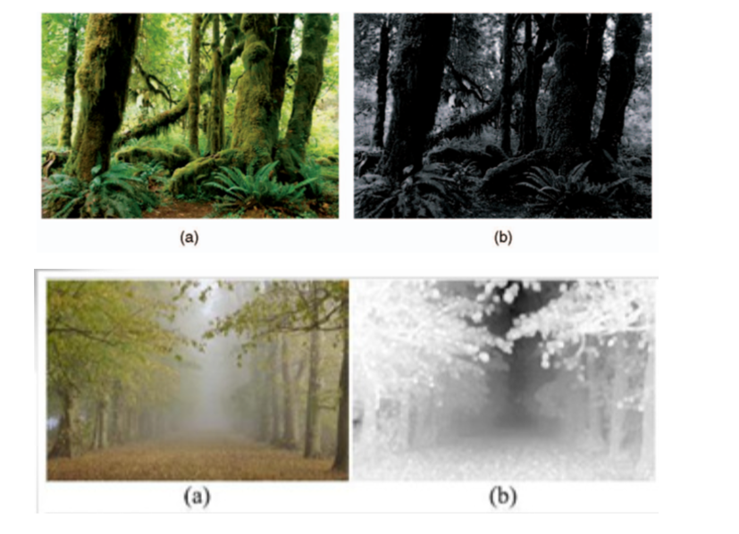
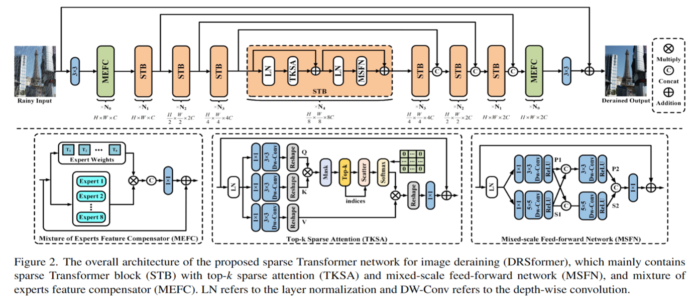

### 壹  频域处理

#### 述：
#####
#####

###### · 频域处理基础：
· 处理 AI 问题时**映射**无处不在：

                            （图一：“无处不在”映射空间的）
· *频域处理的核心问题*：利用图像变换方法将图像由原始图像空间变换到其他空间，利用其他空间的特有性质方便地对图像进行处理，然后再变换回原来的图像空间
· *为什么要做频域处理图像？*
1) 可以利用频率成分和图像之间的对应关系：
	· 一些在空间域表述困难的增强任务，在频率域中变得非常普通
2) 滤波在频率域更为直观，它可以解释空间域滤波的某些性质
3) 可以在频率域指定滤波器，做反变换，然后在空间域使用结果滤波器作为空间域滤波器的指导

（图二：频域处理的变换和反变换）

· 频域增强方法实现图像频率的通过或抑制：$g^{'}(u,v)=E(g(u,v))=g(u,v)h(u,v)$
式中 $g(u,v)$ 为频域原始图像，$g^{'}(x,y)$ 为频域增强图像，$E()$ 为增强函数，$h(u,v)$ 是增强操作，在线性系统理论中称为转移函数（transfer function）
· 传递函数的设计是频域增强的关键
· 频域反应了图像在空域灰度变化剧烈程度，也就是图像灰度的变化速度，也就是图像的梯度大小
· 对图像而言，图像的边缘部分是突变部分，变化较快，因此反应在频域上是高频分量
· 图像的噪声大部分情况下是高频部分；图像平缓变化部分则为低频分量

· *相关术语*：
· 时域：时域是描述数学函数或物理信号对时间的关系，例如⼀个信号的时域波形可以表达信号随着时间的变化
· 频域：自变量是频率，即横轴是频率，纵轴是该频率信号的幅度，也就是通常说的频谱图，频谱图描述了信号的频率结构及频率与该频率信号幅度的关系
· 空间域：空间域又称图像空间（image space），由图像像元组成的空间，在图像空间坐标为自变量直接对像元值进行处理称为空间域处理
· 傅里叶变换可以将时域下的函数，转换为对应频域的函数，函数中所包括的各频率分量，在频域下会变成不同频率下的峰值

###### · 傅里叶级数：

                               （图三：傅里叶生平介绍）
· *正弦曲线保真度*：一个正弦曲线信号输入后，输出的仍是正弦曲线，只有幅度和相位可能发生变换，但是频率和波的形状仍是一样的
· 拉格朗日认为傅里叶的方法无法表示带有棱角的信号，如在方波中出现非连续变化斜率
· 但是傅里叶的方法可以用正弦曲线无限逼近方波

                           （图四：傅里叶级数逐渐逼近方波）
· *傅里叶级数*：傅立叶级数就是通过三角函数和常数项来叠加逼近周期为 $T$ 的函数 $f(x)$：

                           （图五：傅里叶变换的目标和基向量）

                   （图六：以 $T=2\pi$ 的方波为例，用基向量表示傅里叶函数）

· 不管时域、频域其实反映的都是同一个曲线，只是一个是用函数的观点，一个是用向量的观点
· 频域图，可以理解成傅立叶级数的展开

· *欧拉公式*：$$e^{ix}=cos(x)+i\cdot sin(x)$$
当 $i=\pi$ 时 $e^{i\pi}+1=0$，由是：$$cosx=\frac{e^{ix}+e^{-ix}}{2}$$$$sinx=\frac{e^{ix}-e^{-ix}}{2i}=-\frac{i}{2}(e^{ix}-e^{-ix})$$
· 从初等几何的欧拉线，多面体的欧拉定理，立体解析几何的欧拉变换公式，四次方程的欧拉解法到数论中的欧拉函数，变分法的欧拉方程，级数论的欧拉常数，复变函数的欧拉公式，图论中的欧拉图等等，欧拉的贡献卓越

               （图七：通过欧拉公式将周期为 $T$ 的 $f(x)$ 的傅里叶级数写成复数形式）

                       （图八：傅里叶级数化成复数形式时虚部全部消掉）

1. **一维连续傅里叶变换**：
· 非周期函数可以看作周期为无穷大的函数，下面我们考虑傅里叶级数周期增大：

                           （图九：周期函数的傅里叶级数展开）

                         （图十：傅里叶变换将求和写成积分形式）
· *傅里叶变换 Fourier transform*：$$F(w)=\frac{1}{2\pi}\int_{-\infty}^{\infty}f(t)e^{-iwt}\mathrm{d}t$$
· 口诀：“负我爱他比 $2\pi$”
· *逆傅里叶变换 inverse Fourier transform*：$$f(x)=\int_{-\infty}^{\infty}F(w)e^{iwx}\mathrm{d}w$$
· 口诀：“爱死我”

· 连续函数的傅里叶变换：
	· *狄利克雷条件*：
		· 令 $f(x)$ 为实变量 $x$ 的一维连续函数，狄利克雷条件为 $f(x)$ 具有有限个间断点，具有有限个极值点，绝对可积
		· 在实际应用中，这些条件基本上都是可以满足的
	· 存在性定理：当 $f(x)$ 满足狄利克雷条件时，则对应的傅里叶变换一定存在

· $f(x)$ 和 $F(w)$ 称为*傅里叶对*
· 时域分析的函数的参数是时间 $x$，即 $y=f(x)$，频域分析时，参数是频率 $w$，即 $y=F(w)$，两者之间可以互相转化；时域函数通过傅里叶或者拉普拉斯变换就变成了频域函数

· 公式中自变量 $\omega$ 是角频率，使用频率也可以，只不过公式会稍微有一点常数上的差异，如下所示：

                          （图十一：傅里叶变换下参数的变换）

                         （图十二：一维连续傅里叶变换的核心）
· 函数 $f(t)$ 的傅里叶变换一般是一个复数量，可表示为如下的代数形式或三角形式或指数形式：$$F(\omega)=R(\omega)+jI(\omega)$$$$F(\omega)=\lvert F(\omega)\rvert(cos(\Phi(\omega))+jsin(\Phi(\omega)))$$$$F(\omega)=\lvert F(\omega)\rvert e^{j\Phi(\omega)}$$
· $\lvert F(\omega)\rvert$ 和 $\Phi(\omega)$ 分别称为幅度谱和相位谱，分别定义为：$$\lvert F(\omega)\rvert=\sqrt{R^2(\omega)+I^2(\omega)}$$$$\Phi(\omega)=\arctan{\frac{I(\omega)}{R(\omega)}}$$

· *傅里叶级数和傅里叶变换的关系*：
· 如图十三：（a）和 （b）是针对周期信号，它通过傅里叶级数的方式将图像变换到频域；（c）信号是非周期的，针对于非周期信号的处理方式需要使用傅里叶变换

                        （图十三：傅里叶级数和傅里叶变换的关系）

                       （图十四：离散傅里叶级数和离散傅里叶变换）

2. **一维离散傅里叶变换**：

                            （图十五：一维离散傅里叶变换）

                           （图十六：离散傅里叶变换的计算）

3. **二维连续傅里叶变换**：
· 二维连续傅里叶变换，函数 $f(x,y)$ 满足 Dirichlet 条件：
1) 具有有限个第一类间断点（跳跃间断点）
2) 具有有限个极值点
3) 绝对可积
· 如果二维函数满足狄利克雷条件，则其傅里叶变换对为：$$\mathcal{F}[f(x,y)]=F(u,v)=\int_{-\infty}^{\infty}\int_{-\infty}^{\infty}f(x,y)e^{-j2\pi(ux+vy)}\mathrm{d}x\mathrm{d}y$$$$\mathcal{F}^{-1}[f(u,v)]=f(x,y)=\int_{-\infty}^{\infty}\int_{-\infty}^{\infty}F(u,v)e^{j2\pi(ux+vy)}\mathrm{d}u\mathrm{d}v$$式中 $x$ 与 $y$ 为时域变量，$u$ 和 $v$ 为频域变量
· 口诀：“去变负，来变正，交合 $2\pi$ 有虚数”
· 二维连续函数的傅里叶变换对的符号表示为：$$f(x,y)\Leftrightarrow F(u,v)$$

· 函数 $f(x,y)$ 的傅里叶变换一般是一个复数量，可表示为三角形式或指数形式
· 若 $F(u,v)$ 的实部为 $R(u,v)$，虚部为 $I(u,v)$，则：
1) 复数形式：$F(u,v)=R(u,v)+jI(u,v)$
2) 指数形式：$F(u,v)=\lvert F(u,v)\rvert\ e^{j\theta(u,v)}$
3) 相角：$\theta(u)=\arctan{[\frac{I(u,v)}{R(u,v)}]}$
4) 振幅：$\lvert F(u,v)\rvert=\sqrt{R^2(u,v)+I^2(u,v)}$
5) 振幅谱的平方称为 $f(x,y)$ 的能量谱：$E(u,v)=\lvert F(u,v)\rvert^2=R^2(u,v)+I^2(u,v)$

                        （图十七：二维连续函数傅里叶谱求解示例）

4. **二维离散傅里叶变换**：
· 连续傅里叶变换在计算机上无法直接使用，因为计算机只能处理离散数值
· 为了在计算机上实现傅里叶变换计算，必须*把连续函数离散化*，即将连续傅里叶变换转化为离散傅里叶变换（Discrete Fourier Transform，DFT）

                           （图十八：二维离散傅里叶变换对）
· 二维离散傅里叶变换公式：$$F(u,v)=\Sigma_{x=0}^{N-1}\Sigma_{y=0}^{N-1}\ [f(x,y)\cdot e^{-j2\pi\frac{ux+vy}{N}}]$$$$f(x,y)=\frac{1}{N^2}\Sigma_{u=0}^{N-1}\Sigma_{v=0}^{N-1}\ [F(u,v)\cdot e^{j2\pi\frac{ux+vy}{N}}]$$
· 口诀：“去负来正，交合来 N 方”

                       （图十九：二维离散傅里叶变换原理示意图）

· *从信号分解的角度理解傅里叶变换*：

                      （图二十：从信号分解的角度理解傅里叶变换 Ⅰ）
· 在图二十中，如果 $u=0$，$v=10$，则条纹方向是纵向的：

                     （图二十一：从信号分解的角度理解傅里叶变换 Ⅱ）

                     （图二十二：从信号分解的角度理解傅里叶变换 Ⅲ）

                     （图二十三：从信号分解的角度理解傅里叶变换 Ⅳ）

                     （图二十四：从信号分解的角度理解傅里叶变换 Ⅴ）

5. **傅里叶变换性质**：
1) *线性*：傅立叶变换是一种线性算子：$$F\{af_1(x,y)+bf_2(x,y)\}=aF_1(x,y)+bF_2(x,y)$$
设二维离散函数为 $f_1(x,y)$ 和 $f_2(x,y)$，它们所对应的傅里叶变换分别为 $F_1(u,v)$ 和 $F_2(u,v)$
· 线性性质：$af_1(x,y)+bf_2(x,y)\Leftrightarrow aF_1(u,v)+bF_2(u,v)$，式中 $a$、$b$ 为常数
· 此性质可以节约求傅里叶变换的时间，若得到了 $f_1(x,y)$、$f_2(x,y)$、$F_1(u,v)$ 和 $F_2(u,v)$ 的值，则 $af_1(x,y)+bf_2(x,y)$ 的傅里叶变换只要求得 $aF_1(u,v)+bF_2(u,v)$ 就可以了

2) *可分离性*：$$F(u,v)=\frac{1}{MN}=\Sigma_{x=0}^{M-1}[\Sigma_{y=0}^{N-1}f(x,y)e^{-j2\pi vy/N}]e^{-j2\pi vx/M}$$$$f(x,y)=\frac{1}{N^2}\Sigma_{u=0}^{M-1}[\Sigma_{v=0}^{N-1}F(u,v)e^{j2\pi vy/N}]e^{j2\pi vx/M}$$
· 利用这个性质，一个二维离散傅里叶变换（或逆变换）可通过进行两次一维离散傅里叶变换（或逆变换）来完成
· 例如，以正变换为例：
先对 $f(x,y)$ 沿 $y$ 轴进行傅里叶变换得到 $F(x,v)$：$$F(x,v)=\frac{1}{N}\Sigma_{y=0}^{N-1}f(x,y)e^{-j2\pi vy/N}$$再沿着 $x$ 轴对 $F(x,v)$ 进行一维离散傅里叶变换，得到 $F(u,v)$：$$F(u,v)=\frac{1}{M}\Sigma_{x=0}^{M-1}F(x,v)e^{-j2\pi vx/M}$$显然对 $f(x,y)$ 先沿 $x$ 轴进行离散傅里叶变换，再沿 $y$ 轴进行离散傅里叶变换结果一样；逆变换也是如此

                           （图二十五：傅里叶变换的可分离性）

3) *加法定理*：时域或空域内的相加对应于频域内的相加：先变换再求和，与先求和再变换，结果是一致的

                        （图二十六：傅里叶变换的加法定理）

4) *位移定理*：函数位移不改变傅立叶变换的幅值
· 频率位移及空间位移
频率位移：$$f(x,y)e^{j2\pi(u_0x/M+v_0y/N)}\Leftrightarrow F(u-u_0,v-v_0)$$空间位移：$$f(x-x_0,y-y_0)\Leftrightarrow F(u,v)e^{-j2\pi(u_0x/M+v_0y/N)}$$
· 这一性质表明，当用 $e^{j2\pi(u_0x/M+v_0y/N)}$ 乘以 $f(x,y)$，求乘积的傅里叶变换，可以使空间频域 $u,v$ 平面坐标系的原点从 $(0,0)$ 平移到 $(u_0,v_0)$ 的位置；同样，当用 $e^{-j2\pi(u_0x/M+v_0y/N)}$ 乘以 $F(u,v)$，并求此乘积的傅里叶反变换，可以使空间 $x,y$ 坐标系原点从 $(0,0)$ 平移到 $(x_0,y_0)$ 的位置

                          （图二十七：傅里叶变换的位移定理）

5) *相似性定理*：描述函数自变量尺度变化对其傅立叶变换的作用（分量系数成比例变化）
$$F(f(at))=\int_{-\infty}^{\infty}f(at)e^{-j2\pi ut}\mathrm{d}t$$$$=\frac{1}{a}\int_{-\infty}^{\infty}f(at)e^{-j2\pi ut}a\mathrm{d}t=\frac{1}{a}\int_{-\infty}^{\infty}f(r)e^{-j2\pi ur/a}\mathrm{d}r$$$$=\frac{1}{a}F(\frac{u}{a})$$
· 对于两个标量 $a$ 和 $b$，有：$$f(ax,by)\Leftrightarrow\frac{1}{\lvert ab\rvert}F(\frac{u}{a},\frac{v}{b})$$
· 上式说明了在空间比例尺度的展宽，相应于频域比例尺度的压缩，其幅值也减少为原来的 $\frac{1}{\lvert ab\rvert}$
	· 如图二十八所示：

                        （图二十八：比例尺度展宽前后的频谱比较）

6) *周期性*：
· 若离散的傅里叶变换和它的逆变换周期为 $N$，则：$$F(u,v)=F(u+aN,v+bN)$$$$f(x,y)=f(x+aN,y+bN)$$其中：$a,b=0,\pm1,\pm2,\cdots$
· 周期性说明 $F(u,v)$ 和 $f(x,y)$ 都是具有周期为 $N$ 的周期性重复离散函数，即当 $u$ 和 $v$ 取无限组整数值时，$F(u,v)$ 将出现周期重复性，因此由 $F(u,v)$ 反变换求 $f(x,y)$，只需 $F(u,v)$ 中的一个完整周期即可；空域中，对 $f(x,y)$ 也有类似的性质

7) *卷积定理*：
· 时域（或空域）中的卷积等价于频域的乘积：
$$F(f(t)\otimes g(t))=\int_{-\infty}^{\infty}\int_{-\infty}^{\infty}f(x)g(t-x)\mathrm{d}xe^{-j2\pi ut}\mathrm{d}t$$$$=\int_{-\infty}^{\infty}f(x)\int_{-\infty}^{\infty}g(t-x)e^{-j2\pi ut}\mathrm{d}t\mathrm{d}x$$$$\int_{-\infty}^{\infty}f(x)e^{-j2\pi ux}G(u)\mathrm{d}x=F(u)G(u)$$

8) *其他性质*：
	1) 周期性和共轭对称性
	2) 旋转不变性

                       （图二十九：傅里叶变换的周期性和共轭对称性）

                           （图三十：傅里叶变换的旋转不变性）

                       （图三十一：傅里叶变换的旋转不变性具象示例）

6. **傅里叶变换的应用**：
· *频率域中滤波步骤*：
1) 用 $(-1)^{x+y}$ 乘以输入图像来进行中心变化：$$\mathscr{F}[f(x,y)(-1)^{x+y}]=F(u-\frac{M}{2},v-\frac{N}{2})$$
2) 由上一步计算图像的 DFT，即 $F(u,v)$
3) 用滤波函数 $H(u,v)$ 乘以 $F(u,v)$：$$G(x,y)=H(u,v)F(u,v)$$
4) 计算上一步中结果的反 DFT
5) 得到上一步结果的实部
6) 用 $(-1)^{x+y}$ 乘以上一步的结果
· 口诀：“乘-移-滤-回-乘”
· $H(u,v)$ 称为滤波器：抑制某些频率，其他频率不受影响

                            （图三十二：傅里叶变换的应用）
· *幅频图的含义*：
1) 它到中点的距离描述的是频率
2) 中点到它的方向，是平面波的方向
3) 点的灰度值描述的是点的幅值

7. **傅里叶变换的频谱分布**：
· 傅里叶变换的频率空间特征和图像空间特征之间的关系讨论：由于频率与变化率直接相关，直观上也可以将傅里叶变换的频率和图像空间特征联系起来
1) 变化最慢的频率成分（$u=v=0$）对应图像的平均灰度级
2) 当从变换的原点移开时，低频对应图像的慢变化分量：例如对于一幅房间的图像，墙和地板可能对应平滑的灰度分量
3) 高频对应图像中变化越来越快的灰度级：例如，对于一幅房间的图像，物体的边缘和灰度级的突发改变（如噪声）可能对应突变的灰度分量
· 可以从数字图像傅里叶变换的频谱分布理解

· 数字图像的二维离散傅里叶变换所得结果的频率成分如图三十三所示：

                        （图三十三：二维傅里叶变换的频谱分布）
左上角为直流成分，变换结果的四个角的周围对应于低频成分，中央部位对应于高频成分
· 为了便于观察谱的分布，使直流成分出现在窗口的中央，可采用图示的换位方法，根据傅里叶频率位移的性质，只需要用 $f(x,y)$ 乘上 $(-1)^{x+y}$ 因子进行傅里叶变换即可实现，变换后的坐标原点移动到了窗口中心，围绕坐标中心的是低频，向外是高频

· 图三十四给出了二维离散傅里叶变换的频率位移特性：

                    （图三十四：二维离散傅里叶变换的频率位移特性示例）
· 围绕坐标中心的是低频，向外是高频，频谱由中心向外放射，而且各行各列的频谱对中心点是共轭对称的
· 利用这个特性，如果在数据存储和传输时，仅存储和传输它们中的一部分，进行逆变换复原图像前，按照对称性补充另一部分数据，就可达到*数据压缩*的目的

· 傅里叶变换后的零频分量 $F(0,0)$，也称作直流分量，根据公式：$$F(0,0)=\frac{1}{MN}\Sigma_{x=0}^{M-1}\Sigma_{y=0}^{N-1}f(x,y)$$它反映了原始图像的平均亮度
· 图像灰度变化缓慢的区域，对应它变换后的低频分量部分；图像灰度呈阶跃变化的区域，对应变换后的高频分量部分
· 除颗粒噪音外，图像细节的边缘、轮廓处都是灰度变化突变区域，它们都具有变换后的高频分量特征

· 频率域的基本性质：
每个 $F(u,v)$ 项包含了被指数项修正的 $f(x,y)$ 所有值：$$F(u,v)=\frac{1}{MN}\Sigma_{x=0}^{M-1}\Sigma_{y=0}^{N-1}f(x,y)e^{-j2\pi(ux/M+vy/N)}$$
· 直观上将傅里叶变换和图像中的亮度变化联系起来并不困难：
	· 直流分量 $F(0,0)$ 对应一幅图像的平均灰度
	· 低频部分对应图像缓慢变化的分量
	· 高频部分对应图像边缘和灰度级突变的部分

###### · 离散余弦变换：
· **离散余弦变换**（DCT-Discrete Cosine Transform）是一种可分离的、正交的、对称的变换，近年来在诸多领域，特别是在图像压缩领域得到了广泛地应用
· 离散余弦变换的显著特点是将信号能量的绝大部分集中于频率域的较小区域，便于对频率数据进行精细量化、粗糙量化等操作，在保证图像质量的同时实现了图像数据的有效压缩和存储

1. **一维离散余弦变换**：
· 一维离散余弦变换的正变换定义为：$$F(u)=a(u)\Sigma_{x=0}^{N-1}f(x)\cos{\frac{(2x+1)u\pi}{2N}},\ \ u=0,1,\ldots,N-1$$
	· $f(x)$ 为时域 $N$ 点序列，$x=0,1,\ldots,N-1$
	· $F(u)$ 为频域变换序列，$u$ 为广义频率变量，$u=0,1,\ldots,N-1$
	· $a(u)$ 称为归一化加权系数，定义为：$$a(u)=\begin{cases}\sqrt{\frac{1}{N}},\ \ u=0\\ \sqrt{\frac{2}{N}},\ \ u=1,2,\ldots,N-1\end{cases}$$

                            （图三十五：一维离散余弦变换）

                      （图三十六：一维离散余弦变换原理示意图）

2. **二维离散余弦变换**：
· 二维离散余弦变换的正变换定义为：$$F(u,v)=a(u)a(v)\Sigma_{x=0}^{N-1}\Sigma_{y=0}^{N-1}f(x,y)\cos{\frac{(2x+1)u\pi}{2N}}\cos{\frac{(2y+1)v\pi}{2N}},\ \ u,v=0,1,\ldots,N-1$$
	· $f(x,y)$ 为空间域二维矩阵，$x,y=0,1,\ldots,N-1$
	· $F(u,v)$ 为频域变换矩阵，$u,v$ 为广义频率变量，$u,v=0,1,\ldots,N-1$
	· $F(u,v)$ 也称为 $f(x,y)$ 的 DCT 系数，可以看作是应用于每一个函数的权值
	· $a(u)$ 称为归一化加权系数，定义：$$a(u)=\begin{cases}\sqrt{\frac{1}{N}},\ \ u=0\\ \sqrt{\frac{2}{N}},\ \ u=1,2,\ldots,N-1\end{cases}$$

                     （图三十七：二维离散余弦变换的正变换的矩阵形式）

                        （图三十八：二维离散余弦变换原理示意图）

###### · 频域图像增强：
· *图像增强技术的分类*：
1) 空域增强技术：基于图像平面本身，对图像的像素直接进行处理
2) 频域增强技术：频域空间即傅里叶变换空间
· *频域增强的两个关键*：
1) 将图像从图像空间转换到频域空间所需的变换（即正变换）$T$ 以及将图像从频域空间转换回图像空间所需的变换（即反变换）$T^{-1}$
2) 在频域空间对图像进行增强加工的操作 $E_H$
· *频域增强的三个步骤*：
1) 将图像从图像空间转换到频域空间
2) 在频域空间对图像进行增强
3) 将增强后的图像再从频域空间转换回图像空间
因此，整个增强过程可表示为：$$g(x,y)=T^{-1}\{E_H[T[f(x,y)]]\}$$

· 以傅里叶变换为基础的频域增强可表示为：$$g(x,y=T^{-1}[T[f(x,y)]H(u,v)]=T^{-1}[F(u,v)H(u,v)]=T^{-1}[G(u,v)]$$
1) $F(u,v)$ 是原始图像 $f(x,y)$ 的傅里叶变换
2) $H(u,v)$ 是增强操作，在线性系统理论中称为转移函数
3) $T^{-1}$ 表示傅里叶反变换

· 卷积理论是领域技术的关键——$g(x,y)=h(x,y)\otimes f (x,y)$ 即是卷积积分 $G(u,v)=H(u,v)F(u,v)$ 在频域的对应形式
1) $G(u,v)$、$H(u,v)$、$F(u,v)$ 分别是 $g(x,y)$、$h(x,y)$、$f(x,y)$ 的傅里叶变换
2) $H(u,v)$ 和 $F(u,v)$ 的乘积定义在逐元素的基础上，即 $H$ 的第一个元素乘以 $F$ 的第一个元素，$H$ 的第二个元素乘以 $F$ 的第二个元素，以此类推
3) $F(u,v)$ 的元素一般为复数，若 $H(u,v)$ 的元素为实数，则 $H(u,v)$ 的每一个分量将乘以 $F(u,v)$ 中相应部分的实部和虚部，这种滤波器称为“零相位”滤波器，即不改变变换的相位

· 增强加工的操作即转移函数的设计是关键步骤之一，其基本思路是：允许一定频率通过（保留某些频率分量），限制或消减另外一些频率（消除某些频率分量）
· 转移函数的优劣是滤波器优劣的关键
· 频域增强方法根据滤波特点，特别是消除或保留的频率分量可以分为：
	· 低通滤波
	· 高通滤波
	· 带通 & 带阻滤波

1. **低通滤波器**：
· 低通滤波的基本原理：保留图像中的低频分量而除去高频分量
· 低通滤波的作⽤：除去或消弱噪声影响并模糊边缘轮廓，属于图像平滑处理技术，因为图像中的边缘和噪声对应图像傅里叶频谱中的高频部分
· 本章讨论的滤波器均是零相位滤波器，包括：
	· 理想低通滤波器（ILPF）
	· 巴特沃斯低通滤波器（BLPF）
	· 指数低通滤波器（ELPF）
	· 梯形低通滤波器（TLPF）
	· 高斯低通滤波器（GLPF）

· *理想低通滤波器*（ILPF-Ideal Low Pass Filter）是一个在傅里叶平面上半径为 $D_0$ 的圆形滤波器，其传递函数为：$$H(u,v)=\begin{cases}1,\ \ D(u,v)\leq D_0\\ 0,\ \ D(u,v)\textgreater D_0\end{cases}$$
· $D_0$ 是一个非负整数，称为截止频率，指小于 $D_0$ 的频率可以完全不受影响地通过滤波器，而大于 $D_0$ 的频率则完全通不过
· $D(u,v)=(u^2+v^2)^{\frac{1}{2}}$，是点 $(u,v)$ 到傅里叶频率平面原点的距离
· 理想低通滤波器传递函数的透视图及其剖面图：

                   （图三十九：理想低通滤波器传递函数的透视图及剖面图）
· *理想低通滤波器的优点*：简单易行
· *理想低通滤波器的缺点*：
1) 是“非物理”的滤波器，虽然在数学上定义严格，在计算机模拟中也可以实现，但在截止频率处直上直下的理想低通滤波器是不能用实际的电子器件来实现的
2) 若滤除的高频分量中含有大量的边缘信息，则输出图像会变得模糊和有“振铃”现象/效应出现

· 一维理想低通滤波器振铃现象机理：
· 如图四十：
	· 图 (a)：一维理想低通滤波器的传递函数H(u)
	· 图 (b)：$H(u)$ 经傅里叶变换的的空域形式 $h(x)$
	· 图 (c)：只有一个亮像素的傅里叶反变换得到简单图像 $f(x)$，可看作一个脉冲的近似
	· 图 (d)：卷积得到的增强图像 $g(x)=h(x)*f(x)$，实际上是把 $h(x)$ 复制到 $f(x)$ 中亮点的位置；可见：卷积使原来清晰的点被模糊函数模糊了

                      （图四十：一维理想低通滤波器振铃现象机理）
· 对于更复杂的一维原始图像，可把每个灰度值不为 $0$ 的点都看作是一个其值正比于该点灰度值的一个亮点，这样，上面的结论仍可成立

· *巴特沃斯低通滤波器*（BLPF-Butterworth Low Pass Filter）也称最大平坦滤波器，其传递函数为：$$H(u,v)=\frac{1}{1+[D(u,v)/D_0]^{2n}}$$
$n$ 称为阶数，$D(u,v)=(u^2+v^2)^{\frac{1}{2}}$ 是点 $(u,v)$ 到傅里叶频率平面原点的距离
· 上式中，把 $H(u,v)$ 下降到原来值的 $\frac{1}{2}$ 时的 $D(u,v)$ 定为截止频率点 $D_0$
· 通常，也可把 $H(u,v)$ 下降到原来值的 $\frac{1}{2}^{\frac{1}{2}}$ 时 $D(u,v)$ 定为截止频率点 $D_0$，该点也称为半功率点，此时，上式可修改如下：$$H(u,v)=\frac{1}{1+(\sqrt{2}-1)[\frac{D(u,v)}{D_0}]^{2n}}$$

                 （图四十一：巴特沃斯低通滤波器传递函数的透视图及其剖面图）

                         （图四十二：巴特沃斯低通滤波器示例）
· 巴特沃斯低通滤波器的优点：
1) 函数曲线呈连续性衰减，不象 ILPF 曲线那样有陡峭的截止区，滤波图像的边缘模糊程度会大大减轻
2) 由于通带和阻带之间的平滑过渡，故不会产生明显的振铃现象
3) 具体地说，一阶 BLPF 不会产生振铃和负值，二阶 BLPF 显示了轻微的振铃和较小的负值，但远没有 ILPF 明显；阶数越高，振铃现象越明显，越接近 ILPF 的特性
4) 总之，二阶 BLPF 是在有效的低通滤波器和可接受的振铃特性之间的折中（PIC1.m、PIC1x.m）
· 巴特沃斯低通滤波器的缺点：BLPF 的平滑效果常不如 ILPF，所以在实际应用中，要根据平滑效果和振铃现象的折中要求确定 BLPF 的阶数

                     （图四十三：巴特沃斯低通滤波器振铃现象的原理）
· 图四十三反映的低通滤波器的特性：
· 频域中阶数为 $1$、截止频率为 $5$ 的传递函数 $h1(u,v)$ 如图 (a) 所示，对其进行傅里叶反变换，得到空域中的传递函数 $h_1(x,y)$ 如图 (b) 所示，空域传递函数 $h1(x,y)$ 在 $x$ 轴上的投影如图 (c) 所示，从结果可以看出，一阶 BLPF 没有振铃现象
· 频域中阶数为 $2$、截止频率为 $5$ 的传递函数 $h_2(u,v)$ 如图 (d) 所示，对其进行傅里叶反变换，得到空域中的传递函数 $h_2(x,y)$ 如图 (e) 所示， 空域传递函数 $h_2(x,y)$ 在 $x$ 轴上的投影如图 (f) 所示，从结果可以看出，二阶 BLPF 存在轻微的振铃现象，但远没有 ILPF 明显
· 频域中阶数为 $20$、截止频率为 $5$ 的传递函数 $h_3(u,v)$ 如图 (g) 所示，对其进行傅里叶反变换，得到空域中的传递函数 $h_3(x,y)$ 如图 (h) 所示， 空域传递函数 $h_3(x,y)$ 在 $x$ 轴上的投影如图 (i) 所示，从结果可以看出，阶数越高，振铃现象越明显，越接近 ILPF 的特性

                （图四十四：理想低通滤波器和巴特沃斯低通滤波器的滤波效果比较）

· *指数低通滤波器*（ELPF-Exponential Low Pass Filter）的传递函数为：$$H(u,v)=e^{-[\frac{D(u,v)}{D_0}]^n}$$$n$ 称为阶数，决定衰减率；$(u,v)=(u^2+v^2)^{\frac{1}{2}}$，是点 $(u,v)$ 到傅里叶频率平面原点的距离；上式中，把 $H(u,v)$ 下降到原来值的 $\frac{1}{e}$ 时的 $D(u,v)$ 定为截止频率点 $D_0$

· 通常，也可把 $H(u,v)$ 下降到原来值的 $\frac{1}{2}$ 时的 $D(u,v)$ 定为截止频率点 $D_0$，该点也称为半功率点，此时，上式可修改如下：$$H(u,v)=e^{[\ln{\frac{1}{\sqrt{2}}}]\cdot[\frac{D(u,v)}{D_0}]^n}=e^{-0.347\cdot[\frac{D(u,v)}{D_0}]^n}$$

                 （图四十五：指数低通滤波器传递函数的透视图及其剖面图）

                        （图四十六：指数低通滤波器的滤波示例图）
· *指数低通滤波器*的分析：
1) 与理想低通滤波器相比： 
	1) 指数低通滤波器在高低频间有比较光滑的过渡，所以振铃现象比较弱
2) 与巴特沃斯低通滤波器相比： 
	1) 指数低通滤波器随频率增加在开始阶段一般衰减得比较快，对高频分量的滤除能力较强，对图像造成的模糊较大
	2) 指数低通滤波器产生的振铃现象一般较弱
	3) 指数低通滤波器的尾部拖得较长，所以对噪声的衰减能力较大
	4) 指数低通滤波器的平滑效果一般较弱

· *梯形低通滤波器*（TLPF-Trapezoidal LowPass Filter）的形状介于理想低通滤波器和具有平滑过渡带的低通滤波器之间，其传递函数为：$$H(u,v)=\begin{cases}\ \ \ \ \ \ 1,\ \ \ \ \ \ \ \ \ \ \ \ \ \ D(u,v)\textless D_0\\ \frac{D(u,v)-D_1}{D_0-D_1},\ \ \ \ D_0\leq D(u,v)\leq D_1\\ \ \ \ \ \ \ 0,\ \ \ \ \ \ \ \ \ \ \ \ \ \ D(u,v)\textgreater D_1\end{cases}$$$D(u,v)=(u^2+v^2)^{\frac{1}{2}}$，是点 $(u,v)$ 到傅里叶频率平面原点的距离
· 通常，把 $H(u,v)$ 的第一个转折点 $D_0$ 定义为截止频率，它可以是任意的非负整数；第二个转折点 $D_1$ 可以是任意的非负整数，但要求 $D_1\textgreater D_0$

                   （图四十七：梯形低通滤波器传递函数的透视图及其剖面图）

                           （图四十八：梯形低通滤波器示例）
· *梯形低通滤波器*的分析：
1) 与理想低通滤波器相比：梯形低通滤波器在高低频间有一个过渡，所以振铃现象比较弱
2) 与巴特沃斯低通滤波器相比：梯形低通滤波器在高低频间的过渡不够光滑，所以振铃现象要强一些
3) 由于梯形低通滤波器的形状介于理想低通滤波器和具有平滑过渡带的低通滤波器之间，所以其处理效果也介于这两者之间

· *⾼斯低通滤波器*（GLPF-Gauss LowPass Filter）的传递函数为：$$H(u,v)=e^{-\frac{D^2(u,v)}{2D_0^2}}$$$D(u,v)=(u^2+v^2)^{\frac{1}{2}}$ 是点 $(u,v)$ 到傅里叶频率平面原点的距离
· 上式中，把 $H(u,v)$ 下降到原来值的 $e^{-\frac{1}{2}}$ 时的 $D(u,v)$ 定为截止频率点 $D_0$
· 通常，也可以把 $h(u,v)$ 下降到原来值的 $\frac{1}{2}$ 时的 $D(u,v)$ 值定义为截止频率点 $D_0$，此时该点称为半功率点，如下式所示：$$h(u,v)=e^{\ln{\frac{1}{\sqrt{2}}}(\frac{D(u,v)}{D_0})^2}=e^{-0.347(\frac{D(u,v)}{D_0})^2}$$
· *高斯低通滤波器*的分析：由于高斯低通滤波器的傅里叶反变换也是高斯的，因此空间中的高斯低通滤波器没有振铃现象

                  （图四十九：高斯低通滤波器传递函数的透视图及其剖面图）

                            （图五十：高斯低通滤波器示例）

2. **高通滤波器**：
· ⾼通滤波的基本原理：保留图像中的高频分量而除去低频分量
· ⾼通滤波的作⽤：突出物体边缘轮廓，属于图像锐化处理技术
	· 因为：图像中的边缘对应图像傅里叶频谱中的高频部分
· ⾼通滤波的效果：锐化物体边缘，但光滑区域灰度减弱、变暗甚至接近黑色
	· 因为：图像中大部分能量集中在低频分量里，高通滤波将会滤除大部分低频分量

· 若高通滤波的传递函数可由下式得到，则这样的高通滤波器是对应低通滤波器的精确反操作，即被低通滤波器衰减的频率都能通过对应的高通滤波器：$$H_{hp}(u,v)=1-H_{lp}(u,v)$$$H_{hp}$ 是高通滤波的传递函数，$H_{lp}(u,v)$ 是对应低通滤波的传递函数
· 本章讨论的滤波器均是零相位滤波器，包括：
	· 理想高通滤波器（IHPF）
	· 巴特沃斯高通滤波器（BHPF）
	· 指数高通滤波器（EHPF）
	· 梯形高通滤波器（THPF） 
	· 高斯高通滤波器（GHPF）
	· 高频增强滤波器
	· 高频提升滤波器

· *理想⾼通滤波器*（IHPF-Ideal HighPass Filter）是一个在傅里叶平面上半径为 $D_0$ 的圆形滤波器，其传递函数为：$$H(u,v)=1-H_{lp}(u,v)=\begin{cases}0,\ \ D(u,v)\leq D_0\\ 1,\ \ D(u,v)\textgreater D_0\end{cases}$$$D_0$ 是一个非负整数，称为截止频率，指大于 $D_0$ 的频率可以完全不受影响地通过滤波器，而小于 $D_0$ 的频率则完全通不过；$D(u,v)=(u^2+v^2)^{\frac{1}{2}}$，是点 $(u,v)$ 到傅里叶频率平面原点的距离

                  （图五十一：理想高通滤波器传递函数的剖面图及其透视图）

                          （图五十二：理想高通滤波器示例）
· 从结果可以看出，理想高通滤波器能突出图像的边缘和轮廓，使光滑区域灰度减弱、变暗甚至接近黑色，实现图像锐化；截止频率越小，滤除的高频分量越少，图像锐化效果越差；截止频率越大，滤除的高频分量越多，图像锐化效果越好

· *巴特沃斯⾼通滤波器*（BHPF-Butterworth HighPass Filter）的传递函数为：$$H(u,v)=1-H_{lp}(u,v)=\frac{1}{1+[\frac{D_0}{D(u,v)}]^{2n}}$$$n$ 称为阶数，$D(u,v)=(u^2+v^2)^{\frac{1}{2}}$ 是点 $(u,v)$ 到傅里叶频率平面原点的距离
· 上式中，把 $H(u,v)$ 下降到原来值的 $e^{-\frac{1}{2}}$ 时的 $D(u,v)$ 定为截止频率点 $D_0$
· 通常，也可把 $H(u,v)$ 下降到原来值的 $\frac{1}{2}$ 时的 $D(u,v)$ 定为截止频率点 $D_0$，该点也称为半功率点，此时上式可修改如下：$$H(u,v)=\frac{1}{1+(\sqrt{2}-1)[\frac{D_0}{D(u,v)}]^{2n}}$$

                 （图五十三：特沃斯高通滤波器传递函数的透视图及其剖面图）

                         （图五十四：巴特沃斯高通滤波器示例）
· 从结果可以看出，巴特沃斯高通滤波器能突出图像的边缘和轮廓，使光滑区域灰度减弱、变暗甚至接近黑色，实现图像锐化；截止频率越小，滤除的高频分量越少，图像锐化效果越差；截止频率越大，滤除的高频分量越多，图像锐化效果越好

· *指数⾼通滤波器*（EHPF-Exponential HighPass Filter）的传递函数为：$$H(u,v)=e^{-[\frac{D_0}{D(u,v)}]^n}$$$$H(u,v)=1-H_{lp}(u,v)=1-e^{-[\frac{D(u,v)}{D_0}]^n}$$$n$ 称为阶数，决定增长率，$D(u,v)=(u^2+v^2)^{\frac{1}{2}}$ 是点 $(u,v)$ 到傅里叶频率平面原点的距离
· 上式中，把 $H(u,v)$ 下降到原来值的 $e^{-\frac{1}{2}}$ 时的 $D(u,v)$ 定为截止频率点 $D_0$
· 通常，也可把 $H(u,v)$ 下降到原来值的 $\frac{1}{2}$ 时的 $D(u,v)$ 定为截止频率点 $D_0$，该点也称为半功率点，此时，上式可修改如下：$$H(u,v)=e^{[\ln{\frac{1}{\sqrt{2}}}]\cdot[\frac{D_0}{D(u,v)}]^n}=e^{-0.347\cdot[\frac{D_0}{D(u,v)}]^n}$$

                   （图五十五：指数高通滤波器传递函数的透视图及其剖面图）

                           （图五十六：指数高通滤波器示例）
· 从结果可以看出，指数高通滤波器能突出图像的边缘和轮廓，使光滑区域灰度减弱、变暗甚至接近黑色，实现图像锐化；截止频率越小，滤除的高频分量越少，图像锐化效果越差；截止频率越大，滤除的高频分量越多，图像锐化效果越好

· *梯形⾼通滤波器*（THPF-Trapezoidal HighPass Filter）的形状介于理想高通滤波器和具有平滑过渡带的高通滤波器之间，其传递函数为：$$H(u,v)=1-H_{lp}(u,v)=\begin{cases}\ \ \ \ \ \ 0,\ \ \ \ \ \ \ \ \ \ \ \ \ \ D(u,v)\textless D_1\\ \frac{D(u,v)-D_1}{D_0-D_1},\ \ \ \ D_0\leq D(u,v)\leq D_1\\ \ \ \ \ \ \ 1,\ \ \ \ \ \ \ \ \ \ \ \ \ \ D(u,v)\textgreater D_0\end{cases}$$$D(u,v)=(u^2+v^2)^{\frac{1}{2}}$，是点 $(u,v)$ 到傅里叶频率平面原点的距离
· 通常，把 $H(u,v)$ 的第二个转折点 $D0$ 定义为截止频率，它可以是任意的非负整数；第一个转折点 $D_1$ 可以是任意的非负整数，但要求 $D_1\textless D_0$

                  （图五十七：梯形高通滤波器传递函数的透视图及其剖面图）

                           （图五十八：梯形高通滤波器示例）
· 从结果可以看出，梯形高通滤波器能突出图像的边缘和轮廓，使光滑区域灰度减弱、变暗甚至接近黑色，实现图像锐化；截止频率越小，滤除的高频分量越少，图像锐化效果越差；截止频率越大，滤除的高频分量越多，图像锐化效果越好

· *⾼斯⾼通滤波器*（GHPF-Gauss HighPass Filter）的传递函数为：$$H(u,v)=1-H_{lp}=1-e^{-\frac{D^2(u,v)}{2D_0^2}}$$$D(u,v)=(u^2+v^2)^{\frac{1}{2}}$，是点 $(u,v)$ 到傅里叶频率平面原点的距离
· 上式中，把 $H(u,v)$ 下降到原来值的 $e^{-\frac{1}{2}}$ 时的 $D(u,v)$ 定为截止频率点 $D_0$

· 把 $h(u,v)$ 下降到原来值的时的 $D(u,v)$ 值定义为截止频率点 $D_0$
· 通常，也可以把 $h(u,v)$ 下降到原来值的 $\frac{1}{2}$ 时的 $D(u,v)$ 值定义为截止频率点 $D_0$，此时该点称为半功率点，如下式所示：$$h(u,v)=1-h_{lp}(u,v)=1-e^{\ln{\frac{1}{\sqrt{2}}}(\frac{D(u,v)}{D_0})^2}=1-e^{-0.347(\frac{D(u,v)}{D_0})^2}$$
· 分析：由于高斯高通滤波器的傅里叶反变换也是高斯的，因此空间中的高斯高通滤波器没有振铃现象

                   （图五十九：斯高通滤波器传递函数的透视图及其剖面图）

                            （图六十：高斯高通滤波器示例）
· 从结果可以看出，高斯高通滤波器能突出图像的边缘和轮廓，使光滑区域灰度减弱、变暗甚至接近黑色，实现图像锐化；截止频率越小，滤除的高频分量越少，图像锐化效果越差；截止频率越大，滤除的高频分量越多，图像锐化效果越好

· 高通滤波在锐化物体边缘的同时，将使光滑区域灰度减弱、变暗甚至接近黑色

· ⾼频增强滤波器的概念：对高通滤波器的转移函数加一个常数以将一些低频分量加回去，获得既保持光滑区域灰度又改善边缘区域对比度的效果
· 推导：
1) 设：原始图像 $f(x,y)$ 的傅里叶变换为 $F(u,v)$，高通滤波器的转移函数为 $H(u,v)$
2) 则：输出图像的傅里叶变换为：$G_H(u,v)=H_H(u,v)F(u,v)$
3) 现：将高通滤波器的转移函数 $H(u,v)$ 作如下改进：$H_e(u,v)=H_H(u,v)+c,\ \ c\in[0,1]$
4) 则：输出图像的傅里叶变换改进为：$$G_e(u,v)=H_e(u,v)F(u,v)=H_H(u,v)F(u,v)+c\times F(u,v)$$$$=G_H(u,v)+c\times F(u,v)$$
5) 再：将输出图像的傅里叶变换进行反变换：$g_e(x,y)=g_H(x,y)+c\times f(x,y)$
	1) 可见：增强图像中，既包含了高通滤波的结果，也包含了一部分原始的图像，即在原始图像的基础上叠加了一些高频成分，导致原始图像中高频分量更多，物体边缘的锐化效果更显著
6) 实际中，常将高通滤波器的转移函数 $H_H(u,v)$ 乘以一个常数 $k$ 以进一步加强高频成分：$$H_e(u,v)=kH_H(u,v)+c,\ \ \ \ k\geq1,c\in[0,1]$$
7) 此时：输出图像的傅里叶变换及其反变换为：$$G_e(u,v)=H_e(u,v)F(u,v)=k\cdot H_H(u,v)F(u,v)+c\times F(u,v)$$$$=k\cdot G_H(u,v)+c\times F(u,v)\Leftrightarrow g_e(x,y)=k\times g_H(x,y)+c\times f(x,y)$$

                           （图六十一：高频增强滤波器示例）
· 从结果可以看出，高频增强滤波器能突出图像的边缘和轮廓，同时保持光滑区域的灰度；通过调节参数可以控制低频分量的加入量，从而控制图像的效果

· **空域 / 频域图像增强小结**：
· 图像滤波增强处理实质上就是运用滤波技术来增强图像的某些空间频率特征，以改善地物目标与领域或背景之间的灰度反差
· *空域滤波增强*使用空域卷积模板进行的图像处理，模板本身被称为空域滤波器

· 线性滤波器：是线性系统和频域滤波概念在空域的自然延伸
	· 低通滤波器（低频的通过）：平滑图像，去除噪音
	· 高通滤波器：边缘增强，边缘提取
	· 带通滤波器：删除特定频率

· 非线性滤波器：使用模板进行结果像素值的计算时，结果值直接取决于像素领域的值，而不使用加权和的计算方式
	· 中值滤波：平滑图像，去除噪音
	· 最大值滤波：寻找最亮点
	· 最小值滤波：寻找最暗点

· 平滑滤波器：降低噪音，对大图像处理前，删去无用的细小细节，平滑处理，恢复过分锐化的图像
	· 均值滤波器：待处理像素点的值，等于其一定大小的领域内全体像素的平均值
	· 加权平均滤波器：待处理像素点的输出值，等于其周围相邻像素的全体像素的加权平均值
	· 中值滤波器：用模板区域内像素的中值，作为结果值；消除孤立的亮点（暗点），抑制噪声，可以比较好地保留边缘轮廓信息和图像的细节

· 锐化滤波器：增强图像中景物的边缘和轮廓，印刷中的细微层次强调，军事目标识别、定位等
	· 基本高通滤波器：在增强了边缘的同时，丢失了图像的层次和背景亮度；能够增强图像中的小尺度地物特征
	· 高增益滤波器：在增强图像的边缘和细节的同时，保持了原图像的低频成分；即增强了边缘又保留了层次，但在增强了边缘的同时也增强了噪音
	· 微分滤波器：直接使用，与高通类似

· *频域滤波增强*是将图像从空间或时间域转换到频率域，再利用变换系数反映某些图像特征的性质进行图像滤波的方法；傅立叶变换是一种常用的变换
	· 低通滤波器
	· 高通滤波器
	· 选择适当的传递函数 $H(u,v)$，对频率域滤波关系重大；常用的传递函数有梯形函数、指数函数、巴特沃斯函数等
	· 频域常用的几种低通 / 高通滤波器为理想低通 / 高通滤波器（Ideal circular Iow-passfilter）、巴特沃斯（Butterworth）低通 / 高通滤波器、指数低通 / 高通滤波器及梯形低通 / 高通滤波器

- 不同术语的关系：
	- 高通滤波：边缘提取与增强；边缘区域的灰度变换加大，也就是频率较高；所以对于高通滤波，边缘部分将被保留，非边缘部分将被过滤
	- 低通滤波：边缘平滑，边缘区域将被平滑过渡
	- 图像卷积：一种实现手段，不管是滤波还是别的什么，可以说是数学在图像处理的一种延伸
	- 图像滤波：一种图像处理方法，来实现不同目的
	- 图像平滑 / 锐化：图像处理的目的

### 贰  图像复原

#### 述：
#####
#####

###### · 图像退化：
· *图像的退化*是指图像在形成、传输和记录过程中，由于成像系统、传输介质和设备的不完善，使图像的质量变坏
· *图像复原*就是要尽可能恢复退化图像的本来面目，它是沿图像退化的逆过程进行处理
· 典型的图像复原是根据图像退化的先验知识建立一个退化模型，以此模型为基础，采用各种逆退化处理方法进行恢复，得到质量改善的图像
· 图像复原过程如下：找退化原因→建立退化模型→反向推演→恢复图像
· 可见，图像复原主要取决于对图像退化过程的先验知识所掌握的精确程度，体现在建立的退化模型是否合适

                            （图六十二：几种图像退化的示例）
· *大气湍流*：大气中一种不规则的随机运动，湍流每一点上的压强、速度、温度等物理特性等随机涨落；对光波、声波和电磁波在大气中的传播产生一定的干扰作用

                            （图六十三：图像退化及复原模型）
· *线性不变空间假设*：图像的退化过程可以表示为一个线性算子对图像的作用，并且这种作用不依赖于图像的空间位置
· 系统 $H$ 满足如下性质：
1) 线性：若令 $k_1$、$k_2$ 为常数，$f_1(x,y)$ 和 $f_2(x,y)$ 为两幅输入图像，则有：$$H[k_1f_1(x,y)+k_2f_2(x,y)]=k_1H[f_1(x,y)]+k_2H[f_2(x,y)]$$
2) 空间不变性：对任意的 $f(x,y)$ 以及常数 $a$ 和 $b$ 有：$$H[f(x-a,y-b)]=g(x-a,y-b)$$
· *空域退化模型*：$g(x,y)=h(x,y)\otimes f(x,y)+n(x,y)$
· *频域退化模型*：$G(u,v)=H(u,v)F(u,v)+N(u,v)$

###### · 噪声模型：
· *噪声*是图像中不希望存在（或不需要）的部分，是最常见的退化因素之一
· 从信号的角度来说，噪声是一种外部干扰（噪声本身也是一种信号，包含了噪声源的信息）
· 噪声通常是随机的，其灰度值的统计特性可以用概率密度函数（PDF）或累计分布函数（CDF）进行表征
· 退化图像中的噪声可以用多种不同的统计量模型进行表示：
高斯噪声  瑞利噪声  伽马噪声  指数噪声  均匀噪声  脉冲（椒盐）噪声...

                               （图六十四：概率密度函数）

                               （图六十五：噪声图可视化）

                               （图六十六：模型参数估计）
· 根据概率密度函数求期望和方差：
$$EX=\int xf(x)\ dx$$$$DX=E(X^2)-(EX)^2$$$$E(X^2)=\int x^2f(x)\ dx$$

###### · 退化函数估计：

                           （图六十七：退化函数估计的观察法）

                           （图六十八：退化函数估计的实验法）

                        （图六十九：根据先验知识建模——运动模糊）

                            （图七十：运动模糊建模的推导）

###### · 无约束复原：

                                  （图七十一：逆滤波）
· 逆滤波的问题：由于 $H(u,v)$ 出现在分母的位置，当 $H(u,v)$ 较小甚至为 $0$ 时，估计图像和原始图像存在显著差异

                       （图七十二：针对逆滤波分母过小问题的改进方案）
· 图七十二中的改进一：低频平滑时，$\frac{N(u,v)}{H(u,v)}$ 影响比较小，逆滤波处理；高频时候影响比较大，不处理
· 图七十二中的改进二：如果 $H(u,v)$ 过小，寻找一个常数代替 $H(u,v)$ 成为分母

                            （图七十三：无约束复原的效果）
· 图七十三的左上为完全逆滤波结果，其他三张依次以 $G(u,v)/H(u,v)$ 的比值 $40$，$70$，$85$ 进行截断；截断应用了巴特沃斯低通滤波（平滑低通滤波）；太低图像模糊，太高会导致噪音占据图像的主要内容

· *维纳滤波*：

                           （图七十四：维纳滤波及其推导过程 Ⅰ）
· 复数模的性质 Ⅰ：$$\lvert(a+bi)(c+di)\rvert^2=\lvert(ac-bd)+(ad+bc)i\rvert^2$$$$a^2c^2+b^2d^2+a^2d^2+b^2c^2=(a^2+b^2)(c^2+d^2)$$$$=\lvert a+bi\rvert^2\cdot\lvert c+di\rvert^2$$$$\Rightarrow\lvert AB\rvert=\lvert A\rvert\lvert B\rvert$$
· 复数模的性质 Ⅱ：$$\lvert A+B\lvert^2=\lvert(a+bi)+(c+di)\lvert^2=(a+c)^2+(b+d)^2$$$$=a^2+b^2+c^2+d^2+2ac+2bd=\lvert A\rvert^2+\lvert B\rvert^2+A^*B+AB^*$$
· 共轭复数的性质 Ⅰ：$$(a+bi)(c+di)=(ac-bd)+(ad+bc)i$$$$(a-bi)(c-di)=(ac-bd)+(-ac-bc)i$$$$\Rightarrow(AB)^*=A^*B^*$$
· 共轭复数的性质 Ⅱ：$$(a+bi)(c-di)=(ac+bd)+(bc-ad)i$$$$(a-bi)(c+di)=(ac+bd)+(ad-bc)i$$
· 共轭复数的性质 Ⅲ：$$(AB+CD)(A^*B^*+C^*D^*)=AA^*BB^*+CC^*DD^*+ABC^*D^*+A^*B^*CD$$$$=\vert AB\rvert^2+\lvert CD\rvert^2+(AB)(CD)^*+(AB)^*(CD)$$$$设\ S=AB,\ T=CD,\ 则原式=\lvert S\rvert^2+\lvert T\rvert^2+ST^*+S^*T=\lvert S+T\rvert^2$$$$\Rightarrow\lvert AB+CD\rvert=(AB+CD)(A^*B^*+C^*D^*)$$

                           （图七十五：维纳滤波及其推导过程 Ⅱ）
· *功率谱和信噪比（SNR）*：
· 功率谱是描述的是信号在各个频率上的功率分布，它反映了信号的能量或功率如何分布在频域上
· 对于一个信号的傅里叶变换 $X(f)$，其功率 $P(f)$ 定义为傅里叶变换的模平方：$$P(f)=\lvert X(f)\rvert^2$$
· 信噪比通常表示为信号的功率除以噪声的功率：$$SNR=\frac{P_{signal}}{P_{noise}}$$
· 在数字图像处理中，信噪比可以对图像质量进行量化比较，高信噪比意味着较高的图像质量，细节更加清晰

                       （图七十六：不同信噪比下的维纳滤波效果图）

###### · 有约束复原：
· 有约束图像复原指在图像复原的过程中要求估值图像满足其他额外的约束，比如平滑度；这样做的目的依然是降低噪声对图像复原的影响
· 有约束最小二乘滤波：定义准则矩阵 $C$ 并在约束条件下求解一下函数最小值：（二阶梯度最小）$$目标：C=\Sigma_{x=0}^{M-1}\Sigma_{y=0}^{N-1}[\nabla^2f(x,y)]^2$$$$约束：G(u,v)=H(u,v)F(u,v)+N(u,v)$$$$\Rightarrow\Vert g-H\hat{f}\Vert^2=\Vert n\Vert^2$$$$求解：\hat{F}(u,v)=[\frac{H^*(u,v)}{\vert H(u,v)\vert^2+\gamma\vert P(u,v)\vert^2}]\ G(u,v)$$其中 $P(u,v)$ 代表拉普拉斯算子的傅里叶变换：$$p(x,y)=\begin{bmatrix}0&-1&0\\ -1&4&-1\\ 0&-1&0\end{bmatrix}$$即：$$求解：\hat{F}(u,v)=[\frac{1}{H(u,v)}\frac{\vert H(u,v)\vert^2}{\vert H(u,v)\vert^2+\gamma\vert P(u,v)\vert^2}]\ G(u,v)$$$\gamma\vert P(u,v)\vert^2$ 代替了维纳滤波的噪声功率谱

###### · 几何失真校正：
· *几何失真*指图像在获取或显示过程中产生的畸变，也称几何畸变
· 例如，使用长焦镜头或使用变焦镜头的长焦端时容易产生枕形失真（Pincushion Distortion），使用广角镜头或使用变焦镜头的广角端时容易产生桶形失真（Barrel Distortion），使用广角镜头还容易产生透视失真（Perspective Distortion）等

                            （图七十七：几种几何失真示例）
· 几何失真校正是指将存在几何失真的畸变图像校正成为无几何失真的原始图像，通常以一幅基准图像或一组基准点为基准去矫正畸变图像；基准图像通常由没有畸变或畸变较小的摄像系统获得，畸变图像通常由畸变较大的摄像系统获得
· 几何失真校正的校正方法包括直接法和间接法；校正步骤包括空间变换和灰度插值

· **几何失真的矫正方法**：
1) 直接矫正法也称为向前映射法，它首先由空间变换函数 $h_1(x,y)$、$h_2(x,y)$ 推导出反变换函数 $h_1^{'}(x^{'},y^{'})$、$h_2^{'}(x^{'},y^{'})$，然后依次计算出每一个畸变图像像素坐标 $(x^{'},y^{'})$ 对应的校正坐标 $(x,y)$；但 $(x,y)$ 一般不为整数，无法直接将畸变坐标 $(x^{'},y^{'})$ 处的灰度值赋值给校正坐标 $(x,y)$，而是将 $(x^{'},y^{'})$ 处的灰度值分配给校正坐标 $(x,y)$ 周围的四个像素，据此获得校正图像

                             （图七十八：直接矫正法原理）
2) 间接矫正法也称为向后映射法，它假设经过校正的图像像素坐标在基准坐标系统中为等距网格的交叉点，从网格交叉点的坐标 $(x,y)$ 出发计算出畸变图像上的对应坐标 $(x^{'},y^{'})$；但 $(x^{'},y^{'})$ 一般不为整数，无法直接将畸变坐标 $(x^{'},y^{'})$ 处的灰度值赋值给校正坐标 $(x,y)$，而是将 $(x^{'},y^{'})$ 周围像素的灰度值进行插值以得到校正坐标 $(x,y)$ 处的灰度值，据此获得校正图像

                             （图七十九：间接矫正法原理）

· **空间变换**：
· 空间变换是指对畸变图像像素坐标位置进行重新排列以恢复原始图像像素坐标位置的空间关系
· 设图像 $f(x,y)$ 受几何形变影响变成失真图像 $g(x^{'},y^{'})$，则失真变换的数学描述为：$$x^{'}=h_1(x,y),\ \ \ \ y^{'}=h_2(x,y)$$
· 对于线性失真：$$h_1(x,y)=a_1x+a_2y+a_3$$$$h_2(x,y)=b_1x+b_2y+b_3$$
· 对于非线性失真如二次失真：$$h_1(x,y)=a_1+a_2x+a_3y+a_4x^2+a_5xy+a_6y^2$$$$h_2(x,y)=b_1+b_2x+b_3y+b_4x^2+b_5xy+b_6y^2$$

                           （图八十：线性失真和非线性失真）
· *空间变换模型一般式*：$$\begin{cases}x^{'}=h_1(x,y)=\Sigma_{i=0}^N\Sigma_{j=0}^{N-i}\ a_{ij}\ x^i\ y^j\\ y^{'}=h_2(x,y)=\Sigma_{i=0}^N\Sigma_{j=0}^{N-i}\ b_{ij}\ x^i\ y^j\end{cases}$$式中：$(x,y)$ 为无失真坐标系中像素的坐标；$(x^{'},y^{'})$ 为失真坐标系中像素的坐标；$h_1(x,y)$、$h_2(x,y)$ 为无失真坐标系向失真坐标系变换的空间变换函数；$a_{ij}$、$b_{ij}$ 为拟合多项式的各项待定系数；$N$ 为拟合多项式的次数
· 当 $N\textgreater3$ 时，空间变换函数为高阶拟合；一般地，二次或高阶拟合被用来补偿由实际图像系统造成的空间失真

· **几何失真校正**：

                        （图八十一：几何失真校正的两个步骤）
1) 空间变换是指对畸变图像像素坐标位置进行重新排列以恢复原始图像像素坐标位置的空间关系

                   （图八十二：失真图像和校正图像四边形区域对应点示意图）
2) 灰度插值是指对图像映射位置及其周围像素的灰度值进行插值操作以复原原始图像像素的灰度值
· 基于间接矫正法复原原始图像时，对原始图像中的每一个像素点 $(x,y)$，计算出畸变图像上的对应坐标 $(x^{'},y^{'})$，基于 $(x^{'},y^{'})$ 处的灰度值确定原始图像中像素点 $(x,y)$ 的灰度值
· 如果计算出畸变图像上的对应坐标 $(x^{'},y^{'})$ 为整数，则原始图像对应像素点 $(x,y)$ 的灰度值与其保持一致
· 如果不为整数，则需要进行灰度插值操作
· 常用的灰度插值方法包括最近邻插值法和双线性插值法等

· 最近邻插值法（Nearest Neighbor Interpolation）也称为零阶插值，是指将距离映射位置最近的像素点的灰度值作为插值结果的方法

                           （图八十三：最近邻插值法原理图）
· 设原始图像 $f(x,y)$ 中某像素点 $(x,y)$ 经过变换后在畸变图像 $g(x^{'},y^{'})$ 上的映射位置为 $(x^{'},y^{'})$，则最近邻插值法如下式所示：$$f(x,y)=g(x^{'},y^{'})=g(u^{'},v^{'})$$式中：像素点 $(u^{'},v^{'})$ 为距离映射位置 $(x^{'},y^{'})$ 最近的像素点，即 $u^{'}$、$v^{'}$ 满足下式条件：$$\begin{cases}x^{'}-1/2\ \textless\ u^{'}\ \textless\ x^{'}+1/2\\ y^{'}-1/2\ \textless\ v^{'}\ \textless\ y^{'}+1/2\end{cases}$$

· 双线性插值法（Bilinear Interpolation）是指将映射位置周围四个像素点的灰度值在水平和垂直两个方向上进行插值以获取插值结果的方法，其原理图如下图所示

                           （图八十四：双线性插值法原理图）

                            （图八十五：双线性插值法计算）

                    （图八十六：几何失真校正的应用案例——图像配准 Ⅰ）

                    （图八十七：几何失真校正的应用案例——图像配准 Ⅱ）

                    （图八十八：几何失真校正的应用案例——图像配准 Ⅲ）

                    （图八十九：几何失真校正的应用案例——图像配准 Ⅳ）

                     （图九十：几何失真校正的应用案例——图像配准 Ⅴ）

                    （图九十一：几何失真校正的应用案例——图像配准 Ⅵ）

###### · 盲图像去模糊：

                         （图九十二：盲图像去模糊的算法流程图）

                          （图九十三：盲图像去模糊的可视化结果）

###### · 图像去雨去雾：

                              （图九十四：图像去雾的研究）

· *大气物理散射模型*：$$I(x)=J(x)t(x)+A(1-t(x))$$其中 $I(x)$ 是有雾图像，$J(x)$ 是源图像，$A$ 为大气光，$t(x)$ 为透射率：$$t(x)=e^{-\beta\ d(x)}$$$\beta$ 为散射系数，$d(x)$ 为图像深度

· *先验知识（暗通道先验）*：在清晰的无雾图像中，局部图像块至少有一个颜色通道的值非常低，甚至接近于 $0$：$$J^{dark}(x)=\min_{c\in\{r,g,b\}}{(\min_{y\in\Omega(x)}{J^c(y)})},\ \ \ \ J^{dark}\to0$$

                              （图九十五：暗通道先验示例）
· 模型求解：
· $A$：首先在暗通道图中按亮度选取前 $0.1\%$ 的像素，然后在原有雾图像对应的位置上选择亮度最大的点，作为 $A$ 值
· $t(x)$：首先将大气散射模型两边同时除以 $A$：$$\frac{I^c(x)}{A^c}=t(x)\frac{J^c(x)}{A^c}+1-t(x)$$之后进行两次最小值运算：$$\min_c{(\min_{t\in\Omega(x)}{\frac{I^c(x)}{A^c}})}=\widetilde{t}(x)\min_c{(\min_{t\in\Omega(x)}{\frac{J^c(x)}{A^c}})}+(1-\widetilde{t}(x))=0+(1-\widetilde{t}(x))$$$$\Rightarrow\widetilde{t}(x)=1-\min_c{(\min_{t\in\Omega(x)}{\frac{I^c(x)}{A^c}})}$$

· 图像去雨：

                         （图九十六：2012 年图像去雨算法模型）

                              （图九十七：图像去雨的效果）
· 图九十七中：a—低通分量，b—高通分量，c—高通分两种的雨分量，d—高通分量中几何分量

                        （图九十八：2023 年基于深度学习的去雨）

                     （图九十九：基于深度学习的去雨模型整体架构）
 
###### · 小结：
- 图像退化综述
- 噪声模型
- 滤波复原
	- 逆滤波
	- 维纳滤波
	- 有约束最小二乘滤波
- 几何失真校正
- 盲图像去模糊
- 图像去雨去雾

