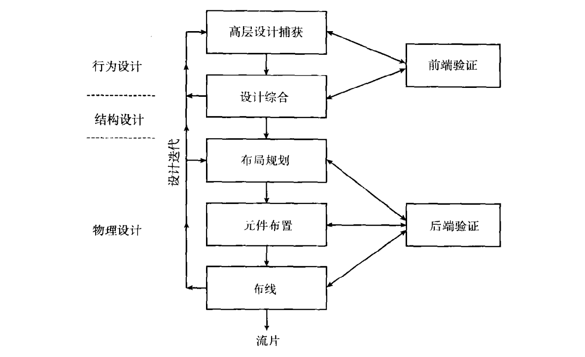
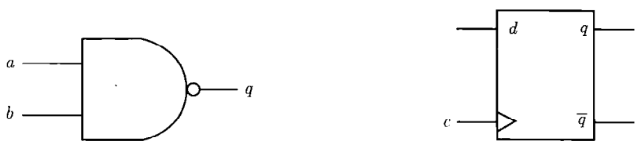

### 壹  组成部件

#### 述：
##### 回眸日月落，脚踏莽荒平。
##### 息动三江滚，弹指九山崩。
##### 星轨绕腕下，寰宇运腹中。
##### 净身立天地，悠悠万古空。

###### · 密码设备的组成部件：
· 本质上，密码设备的组成部件可以分为两大类：
1. 第一类部件完成密码操作，如实现密码操作的数字电路
2. 第二类不见则储存密码操作的数据，如储存加密密钥的非易失性储存器

· **专用密码硬件**：该类部件包括所有专用于完成密码操作的硬件，如实现 AES 的专用密码电路
· **通用硬件**：该类部件包括所有用于完成密码操作的通用硬件，如通过编程控制完成 AES 加密的微控制器
· **密码软件**：该类部件包括用于实现密码操作的任意软件，如实现 AES 的软件
· **储存器**：该类部件储存密码操作的数据，如 AES 加密密钥
· **接口**：该类部件处理密码设备发送和接受的数据，密码应用对接口有特殊的要求，例如非常关键的一点是接口要阻止从设备外部对诸如密钥这样的敏感数据进行非授权的访问

· 密码设备的各组成部件既可以在多个不同芯片上实现，也可以在单芯片上实现
· 如果在多个不同芯片上实现各部件，就需要将这些芯片安装在一块印刷电路板（printed circuit board，PCB）上
· 除了多芯片密码设备之外，同样还有许多仅由单芯片构成的密码设备，如智能卡等

### 贰  设计与实现

#### 述：
##### 蚁巢筑兮，构之先兮；
##### 美人画兮，思之全兮；
##### 嘉政行兮，虑之远兮；
##### 大道通兮，验之千兮。

###### · 单芯片上实现数字电路：
1. 将数字电路实现为一个专用集成电路（ASIC）
2. 使用现成的可编程门阵列（FPGA），将一个配置文件加载到 FPGA 中

###### · 设计数字电路的传统步骤：
1. *规范制定*：致电给一个数字电路功能高层描述（可以通过编写一份规范文档或使用一种高级编程语言实现）
2. *行为设计*：创建一个称为寄存器传输层（RTL）的数字电路描述，精确定义操作序列以及各种信号的位宽，作出许多重要的设计决策
3. *结构设计*：将行为描述转换为一个网表（netlist，电路上所有元件或晶体管以及这些元件之间连接关系的列表），该网表由 FPGA 提供的元件构成，在 ASIC 或者 FPGA 上实现数字电路功能的元件称为“逻辑元件”；在结构设计的过程中，为了满足数字电路的特定约束，还必须要作更细粒度的设计决策
4. *物理设计*：
	1. 在 ASIC 中，将对网表中的各元件或晶体管进行布置，这意味着芯片上各元素的物理位置是固定的，这一过程称为布局（placement）；此外还要创建个元素之间的连接，为芯片上各元素之间的连接创建线路的过程称为布线（routing）；在 ASIC 中，物理设计的产物称为布局图（layout）
	2. 在 FPGA 中，要首先创建网表中元件与 FPGA 上的元件之间对应关系，即确定网表中的元件与 FPGA 上的哪一个物理元件相对应；此后对于网表上列出的各连接关系确定使用 FPGA 上的哪一个物理连接；对于 FPGA，物理设计的产物是一个用于对 FPGA 进行配置的配置文件

###### · 半制定化设计：
· 特征刻画：使用一个预先定义的基本元件（组合元件、时序元件、I/O 元件等）的有限集合构造数字电路
· 在半定制化设计流程中，数字电路的规范映射为标准元件库中的逻辑元件或者 FPGA 上的逻辑元件，基于对所使用的逻辑元件的特定约束吗，很多设计步骤可以自动完成，现有大量的所谓的电子设计自动化（EDA）工具即用于这一目的
· 半制定化设计流程中，大多数从行为级到结构级的设计转换工作，乃至进一步到物理级的设计转换工作都是自动完成的，这一转换过程称为“综合”

· 一个典型的 ASIC 的半制定化设计流程：

                        （图一：使用标准元件的半制定化设计流程）

1. *高层设计捕获*：把数字电路的描述输入到设计系统中，该项工作可以在不同的抽象层完成（SystemC，SystemVerilog‘ System VHDL，Verilog，VHDL 等行为/硬件 描述语言）
2. *设计综合*：依赖于设计捕获中所使用的抽象层次的不同，需要采用不同类型的设计综合，行为综合支持各种各样的高层次体系结构决策过程，在逻辑综合中数字电路 RTL 描述将被映射为标准元件库中已有的实际元件
3. *布局规划*：将基于电路中元件的数量和大小来定义芯片的整体布局（高度、宽度、高宽比等）、核心逻辑（实现数字电路实际功能的逻辑元件）区域、I/O 元件以及电源元件，此外还要对芯片电源栅极的布局进行定义
4. *元件布置*：完成数字电路中各个元件的精确布置，元件布置收到元件之间连接的影响，一项重要的子任务就是时钟树（clock tree）的生成
5. *布线*：建立起各元件之间的实际连接，依据网表中刻画的联系以及各元件的实际布置来完成；为了解决诸如“不可达布线”之类的布线冲突问题，现代布线工具可以在一定程度上改变元件布置
6. *前端验证*：对行为设计和结构设计的功能进行验证，主要通过功能仿真和逻辑仿真来完成，在进行性能校验时，还要对数字电路进行一次所谓的“静态时序分析”
7. *后端验证*：进行许多不同的检验，以便验证数字电路布局的功能，这主要依赖于该阶段可以对电路的寄生效应进行精确估计；组要工作就是设计规则检验、电路提取，以及布局对照验证
8. *流片*：当所有的设计约束均得到满足时，就可以生成一个包含电路布局信息的文件，并将其发送给半导体车间；该文件中包含了芯片制造过程中必需的所有信息

### 叁  逻辑元件

#### 述：
##### 大同小异数逻辑，高有低无分两义。
##### 上颠下倒看重组，先来后去析时序。

###### · 数字电路的逻辑元件：
· 数字电路（ASIC 或 FPGA）总是基于逻辑元件来构建，，这一点与是否采用全定制化或半定制化设计流程没有任何关系，逻辑元件是构造电路模块的最小单元，他们通常有一个或多个输入，按照逻辑功能将这些输入映射为输出的各种逻辑值；在芯片中，逻辑元件即物理对象
· 逻辑元件的电源电压通常记为 $V_{DD}$，其接地电压则通常记为 GND，大多数字电路中，这些电压通常都代表线路所表示的逻辑值，这样的电路称为电压模逻辑（VML）电路
· 此外也有使用 $V_{DD}$ 和 GND 之间的电压来表示逻辑值的其他类型的电路，在这类电路中，使用流经原件的电流来定义元件的实际输出值，以这种方式实现的电路称为电流模逻辑（CML）电路

· 数字电路使用两种类型的逻辑元件：
1. 第一种逻辑元件实现诸如反向、NAND、XNOR 以及复用功能的基本逻辑函数（布尔函数），因为其输出值为输入值的一种逻辑组合，这类元件称为**组合元件**
2. 第二种逻辑元件是**时序元件**，如锁存器、触发器和寄存器等，时序元件的输出值不仅依赖于当前的输入值，还依赖于先前的输入值或初始状态

        （图二：组合逻辑（左）：二输入 NAND 元件和时序逻辑（右）：边缘触发的 D 型触发器）

· 数字电路的元件使用晶体管来实现，本质上讲，晶体管是通过将所谓的 P 型和 N 型半导体结构进行特殊组合而实现的电子开关，晶体管的常用类型为金属氧化物半导体（MOS）晶体管和双极晶体管
· p 通道的 MOS 晶体管称作 “PMOS”，n 通道的 MOS 晶体管称作 “NMOS”，有一种工艺技术仅支持上述两种晶体管，称为 “CMOS”，即互补型金属氧化物半导体

· 用于实现逻辑元件的技术称为**逻辑结构（logic style）**
· 互补型 CMOS 是基于 PMOS 和 NMOS 晶体管构建逻辑元件的最流行逻辑结构，在互补型 CMOS 中，所有组合逻辑元件和时序逻辑元件都使用相应的上拉网格和下拉网格来实现，上拉网格和下拉网格具有互补行为——静态操作期间，$V_{DD}$ 线和 GND 线之间几乎没有电流，元件的静态操作意味着其输入为固定值，因此互补型 CMOS 元件几乎没有静态能量消耗
· 互补型 CMOS 元件的另一个重要特点就是其输出始终被驱动，这意味着其输出通常会通过一个低阻通路与 $V_{DD}$ 或者 GND 连接
· 输出不总和 $V_{DD}$ 或 GND 连接的 CMOS 元件则称为动态 CMOS 元件，在动态 CMOS 元件中，输出节点在短时间内处于悬浮状态
· 互补型 CMOS 元件形成了大多数数字电路的基本构成模块，这些元件相互连接，形成了具有更多功能和更高复杂度的模块
· 到目前为止，当采用 CMOS 工艺技术时，互补型 CMOS 依旧是最常用的逻辑结构，因此，谈到互补型 CMOS 元件和电路时，通常会省略定语“互补型”