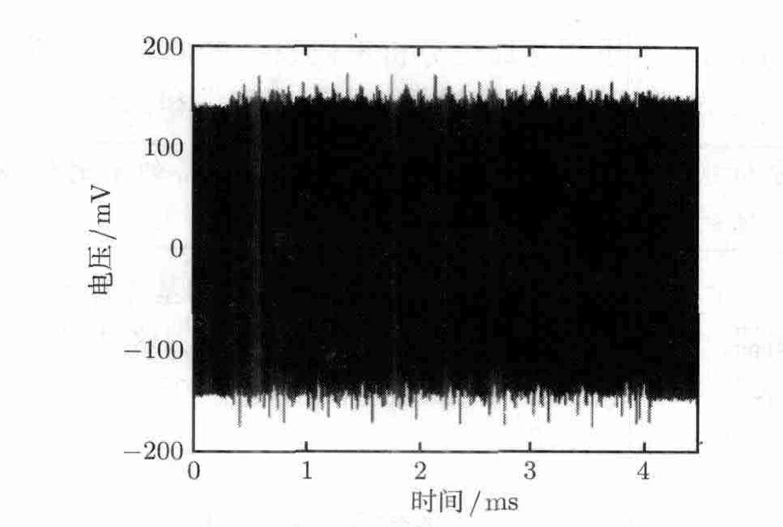
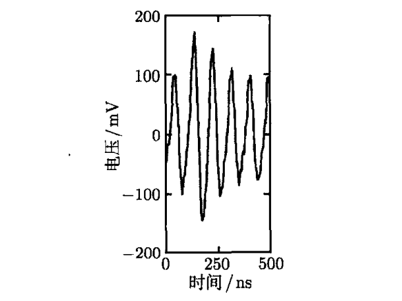
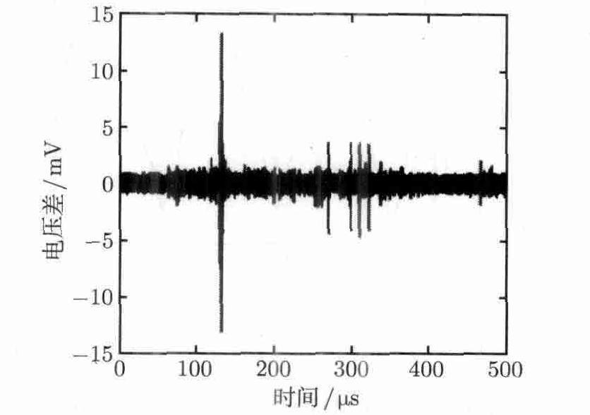
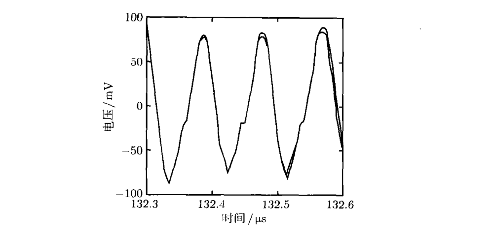
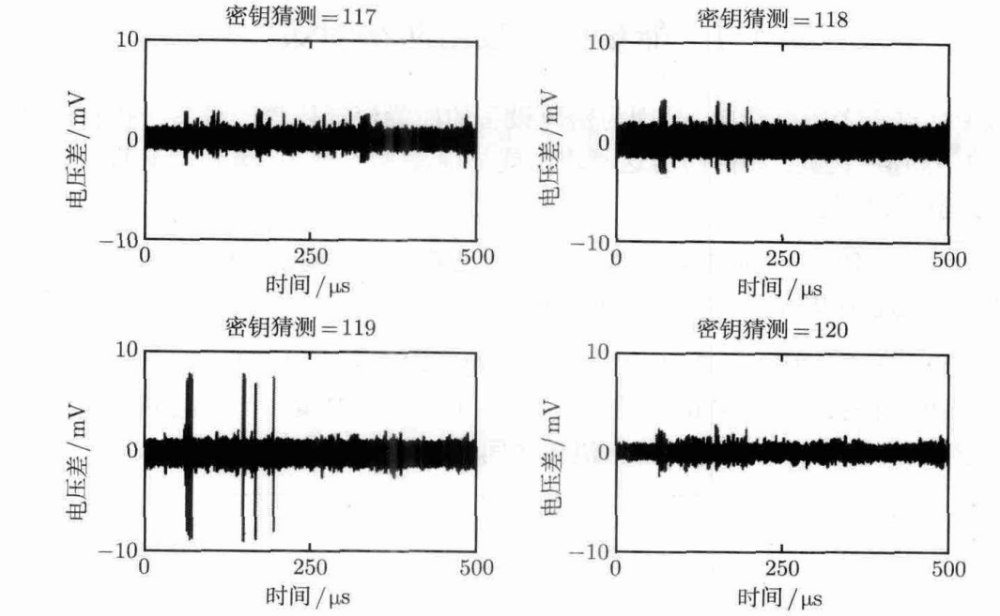
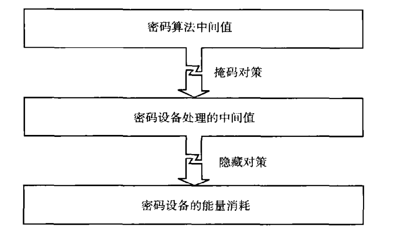

### 壹  密码学与密码设备

#### 述：
##### 思一谈二口出三，参差表里为那般？
##### 无心欺伪行恶事，只为乱局得保全。

###### · 密码学基础：
· 密码算法是数学函数，输入参数通常有两个：消息（明文）和密钥
· 明文：明文是指没有加密的文字（或者字符串），在通信系统中它可能是比特流，如文本、位图、数字化的语音或者数字化的视频图像等，一般人都可以看懂、
· 密钥：密钥是一种参数，它是在明文转换为密文或将密文转换为明文的算法中输入的参数，密钥分为对称密钥与非对称密钥
· 密文：密文是加了密的的文字，是对明文施加某种伪装或变换后的输出，也可理解为不可直接理解的字符或比特集，但可通过算法还原被打乱的消息
· 加密：将输入参数映射为一个“密文”的输出
· 现代密码学中，通常假设密码算法本身已知，这意味着关于密码算法的所有信息都可以公开获得，唯独密钥必须保密（原理源自 19 世纪荷兰密码学家 Auguste Kerckhoffs）
· 对称密码学中，通信实体之间共享一个秘密的密钥，如 高级加密标准（AES）
· 非对称密码学中，每个用户都拥有一个密钥对（由一个称为“公钥”的公开参数和一个称为“私钥”的秘密参数组成），如 RSA 算法

###### · 密码的破译：
· 破译某个密码算法通常意味着可以基于一些公开信息获得密钥（例如这些公开信息可以是一些明密文对）
· 在拥有合理计算能力的情况下，如果没有某种已知的攻击方法能够在合理的计算时间内破译某个密码算法，则认为改密码在现实中是安全的；如果破译某个密码算法所需要的计算能力在现实中并不存在，则认为该算法是计算安全的
· 许多算法都被设计成有这样的特性：破译密码算法的难度随着密钥比特数的增加而呈指数增长 —> 密钥长度是衡量密码安全性的一个重要因素
· 当今流行的密码算法都是计算安全的
· 获悉了某人的密钥就意味着可以冒充此人

###### · 密码设备：
· 密码设备是能够实现密码算法并储存密钥的电子设备
· 密码设备能够使用存储在其中的密钥完成密码操作，并能够把密码操作的结果传送到设备之外
· 破译某个密码设备意味着获得了该设备中的密钥
· 任何一个试图通过未授权的方式获取密码设备中密钥的个体都可以称为“攻击者”
· 企图通过未授权的方式来获取密钥的任何尝试都可以称为“攻击”
· 密码设备的安全性不应依赖于实现的密保性

### 贰  密码设备攻击

#### 述：
##### 远立听曲识其谱，近观见手琴上舞。
##### 但有五感能通一，满城仙乐尽知数。

###### · 密码设备攻击的分类：
· **准则一**：攻击为主动抑或被动
1. 被动攻击：密码设备在大多数情况下都会按照其规范运行，甚至可能会完全按照规范运行，此时通过观测密码设备的物理特性（如执行时间、能量消耗），攻击者就可以获得密钥
2. 主动攻击：为了使密码设备的运行行为出现异常，攻击者常会对密码设备、输入或运行环境进行巧妙的控制（或恶意篡改），此时通过分析设备的异常行为，攻击者就可以获得密钥
· 术语 *防篡改（tamper resistance）* 通常讨论的包括对密码设备的主动攻击和被动攻击

· **准则二**：攻击本身所利用的“接口”（密码设备通常具有多个物理接口和逻辑接口）
1. 入侵式攻击：能够对密码设备实施的最强大的一类攻击，攻击者能够对密码设备所进行的处理基本上没有限制；需要对密码设备进行拆解；攻击能力异常强大，实施这种攻击所需要的设备通常也十分昂贵
2. 半入侵式攻击：同样需要对密码设备进行拆解，但和芯片表面没有任何直接的电子接触，保持芯片表面钝化膜的完好无损；被动型半入侵式攻击的目标通常是在无需利用或者探测储存单元的数据读取电路的情况下，读取出储存元件中的内容；主动型半入侵式攻击的目标是诱发设备产生故障（通过 X 射线、电磁场或光学手段来完成）；不需非常昂贵的设备，但实施成本依旧高昂
3. 非入侵式攻击：被攻击的密码设备本质上和其他正常工作时的状态没有任何区别，这种攻击仅利用设备上可被直接访问的接口，实施成本低，对密码设备的安全性造成了严重的实际威胁；被动型非入侵式攻击通常也称为 *测信道攻击（side-channel attacks，SCA）*，其中最重要的测信道攻击有三类：计时攻击、*能量分析攻击*，以及电磁攻击；主动型非入侵式攻击的目标是在无需拆解设备的情况下诱发设备产生故障

### 叁  能量分析攻击

#### 述：
##### 溽暑渐却霜叶沉，
##### 秋窗外，一夜骤雨，小园乱纷纷。
##### 常事何必叹纷纷？
##### 看离合，叶落一别，难有归根。
##### 怎知叶去无归根？
##### 风扫过，君见留痕，长痕出园门。

###### · 能量分析攻击的思想：
· 能量分析攻击的基本思想：通过分析密码设备的能量消耗获得其密钥
· 本质上，能量分析攻击利用了两类能量消耗依赖性：数据依赖性和操作依赖性
· 能量分析攻击利用了这样一个事实：密码设备的瞬时能量消耗依赖于设备所处理的数据和设备所执行的操作

###### · 约定一个标准试验平台—— 8051 兼容微控制器：
· 执行 AES 算法的一种软件实现，小巧、简易，非常适用于对能量分析攻击及其对策的介绍
· 被攻击的微控制器的基本特点：

| 处理器类型 | 8051 兼容微控制器 |
| ----- | ----------- |
| 总线宽度  | 8 位         |
| 内部存储器 | 256 字节      |
| 供电电压  | 5 伏特        |
| 通信接口  | RS-232      |
| 时钟频率  | 11 兆赫兹      |

· 该示例的微控制器可以被编程控制，其执行的 AES 加密操作也可以被定制
· 微控制器通过一个 RS-232 接口接收来自 PC 的明文数据，而后加密该明文，并将结果返回给 PC
· 设备加密时，需要测量微控制器的能量消耗（可以串联 1 Ω 电阻）

                       （图一：微控制器进行 AES 加密操作时的电压降）
· 分析：
1. 前 0.35 ms 内能量迹非常均匀，微控制器等待明文的输入
2. 接收到一个明文输入后，微控制器执行 9 轮完整的 AES 加密操作，每一轮都会产生一个长约 0.4 ms 的模式，该模式的 9 次重复导致了 9 各 *负尖峰（negative peaks）*，清晰可见
3. 9 轮完整的 AES 加密操作结束后，微控制器执行最后一轮 AES 操作，最后一次操作没有执行 MixColumns 操作（混合列变换），这一轮产生的模式相对较短，大约从 4.1 ms 开始，能量迹重新变得均匀，此时加密操作已经完成，微控制器等待新的明文输入
4. 对一条能量迹放大观测：

                          （图二：采样获得的能量迹的放大视图）
这是一个长约 6 个时钟的短周期内的能量消耗，在这条能量迹中，每一个可见的尖峰都对应着微控制器在一个时钟周期内的能量消耗；能量分析攻击之所以奏效，是因为对于不同的操作和不同的数据，各尖峰形状不同；直接利用这一特性的攻击被称为 *简单能量分析（simple power analysis，SPA）* 攻击，仅基于一条能量迹就可以实施 SPA 攻击

###### · 能量分析：
· 在前面给出的实例中使用更多的能量迹：
1. 首先分析一次  AES 加密操作的能量消耗与明文第一个字节 MSB（最高加权位） 之间的依赖关系，记该比特为 d；为了确定 d 对能量消耗的影响，测量微控制器加密 1000 个随机明文时的能量消耗，这样可以获得约 500 条当 d=0 时加密操作的能量迹，以及约 500 条当 d=1 时加密操作的能量迹
2. 确定 d 对能量消耗影响的一个简单方法就是计算平均值之差，即分别计算所有 d=0 的能量迹的平均值和 d=1 的平均值，以获得一条 d=1 的平均能量迹和一条 d=0 的平均能量迹
3. d=1 与 d=0 平均能量迹作差，几乎这段时间内的所有时刻，这一差异都接近于 0，但在差分迹中同样也有几个特别突出的尖峰，这些尖峰表明了微控制器能量消耗依赖于 d 的那些时刻：在这些特定的时刻，微控制器所执行的指令要么直接对 d 进行处理，要么所处理的某些数据依赖于 d

                      （图三：d=1 时平均能量迹与 d=0 时平均能量迹作差）
4. 由图可见，最大尖峰大概位于 132 μs，检查一下微控制器所执行的汇编程序代码，就可以证实在这一时刻设备加载了明文的第一个字节，值 d 是该字节的 MSB，因此加载操作的能量消耗对 d 有很强的依赖性

                       （图四：d=0 和 d=1 时平均能量迹的放大视图）

· 在执行一次 AES 加密之前，微控制器首先加载明文，然后将明文与密钥进行异或，并执行 10 轮加密操作，每一轮操作中执行的第一个操作均为 SubBytes（字节替换）操作
· SubBytes 是一个字节操作，这意味着 SubBytes 对 AES 中间状态的每一个字节应用一个函数 $S()$，因此第一轮加密操作中 SubBytes 操作的每一个输出字节都可以通过明文的第一个字节和密钥的第一个字节来获得：将明文的第一个字节记为 p，将密钥的第一个字节记为 k
· 第一轮中 SubBytes 操作对应的输出字节可以记为 $S(p\oplus k)$
· 在所给出的攻击示例中，都利用了如下事实：微控制器在某个时刻的能量消耗依赖于这一输出字节的最高有效位 $v$，其中 $v=MSB(S(p\oplus k))$
· 进行这样一个攻击与之前已经完成的对 d 的分析过程非常相似：————————（Ⅰ）
1. 加密 1000 个随机明文，记录相应能量消耗
2. 划分 v=1 和 v=0 能量迹
	· 与分析明文 d 不同点：此时的中间值 v 依赖于密钥字节值 k
· 攻击者并不知道 k 的值，k 有 256 个可能的值，从 0 逐一试验上述分析过程（Ⅰ），绘制两条平均能量迹之间的差异曲线，总共得到 256 个差异图（每个密钥的猜测对应一个）

                    （图五：猜测密钥为 117，118，119，120 时的差异图）
· 对比发现，作出 k=119 的猜测时，能够正确计算出 v
· 该密钥猜测对应的差异图说明了微控制器能量消耗对 v 的依赖性，由于这种依赖性的存在，对应的差异图中就会有明显的尖峰
· 注意：微控制器的能量消耗依赖于它所处理的所有数据，包括 d，包括 v

· 使用这种策略的攻击称为 *差分能量分析（differential power analysis，DPA）* 攻击
· 这种攻击利用了这样一个事实：密码设备的能量消耗依赖于算法执行过程中所处理的中间值
· 同样，攻击者可以基于其他的中间值来实施攻击，特别地，攻击者可以利用依赖于其他密钥字节的中间值来实施攻击，这样就可以很容易地恢复出完整的 AES 密钥
· 事实上，同样的能量迹也完全可以用于分析所有其他的密钥字节，也就是说，无需记录新的能量迹

### 肆  能量分析攻击防御对策

#### 述：
##### 岭上重云横，岭外气雾蒙。
##### 一轮晨阳起，巍巍楼阁明。

###### · 抗 DPA 攻击：
· DPA 攻击中密码设备的能量消耗依赖于设备所执行的密码算法的中间值，防御措施的目标就是消除这种依赖性
· 抗 DPA 攻击的各种对策的目标就是要使得密码设备的能量消耗独立于设备所执行的密码算法的中间值
· 目前公开发表的抗 DPA 攻击的各种对策，本质上可分为两大类：*隐藏技术（hiding）* 和 *掩码技术（masking）*

                          （图六：隐藏对策和掩码对策的基本概念）
· *隐藏技术*的基本思想是消除能量消耗的数据依赖性，这意味着，要么算法的执行过程被随机化，要么设备的能量消耗特征被改变，从而使得攻击者难以轻松地利用能量消耗中的数据依赖性
· 改变设备的能量消耗：
1. 采用使得每一个操作几乎都消耗相同能量的方式
2. 采用使得设备的能量消耗或多或少更随机的方式来制造设备
这两种方式都会显著地降低能量消耗的数据依赖性
· 实际上，数据依赖性不可能被完全消除，总会残存一部分
· 注意：使用隐藏对策保护的密码实现所处理的中间值与无保护的密码实现所处理的中间值完全相同，对能量分析攻击的抵抗能力仅仅通过改变密码设备的能量消耗特征来实现

· *掩码技术*的基本思想是随机化密码设备所处理的中间值，这种方法的动机是处理被随机化后的中间值所需要的能量消耗与处理实际中间值所需要的能量消耗之间相互独立
· 掩码技术的一大优点是无需改变设备的能量消耗特征
· 设备的能量消耗依然具有数据依赖性，但是设备仅仅处理随机化后的中间值

###### · 会话密钥：
· 一个有助于防御 SPA 和 DPA 攻击的一般性原则：应尽可能频繁地更新密码设备所使用的密钥
· 对于一个固定的密钥而言，攻击者所获得的能量消耗测量数据越少，获得该密钥的难度就越大

· 仅用于少量密码操作的密钥称为 *“会话密钥”*，使用会话密钥可以使得能量分析攻击更加困难，在条件允许的情况下应尽可能多地使用会话密钥
· 在现实中，隐藏技术和掩码技术通常只是保护密码设备的第一道防线

