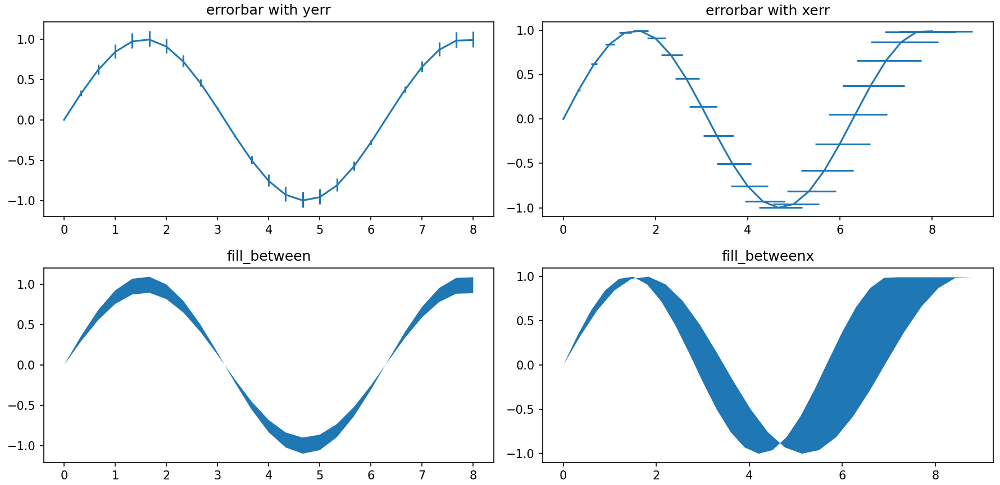

### 壹  基本图

| 绘图函数        | 坐标参数    | 图形类别  |
| :---------- | :------ | :---- |
| $plot$      | $x$，$y$ | 曲线图   |
| $stackplot$ | $x$，$y$ | 堆叠图   |
| $stem$      | $x$，$y$ | 茎叶图   |
| $scatter$   | $x$，$y$ | 散点图   |
| $polar$     | $x$，$y$ | 极坐标图  |
| $step$      | $x$，$y$ | 步阶图   |
| $bar$       | $x$，$y$ | 条形图   |
| $bath$      | $x$，$y$ | 横向条形图 |

###### · 基本图的绘图程序：
```Python
import matplotlib.pyplot as plt
import numpy as np

# 生成 x 值范围
x = np.arange(25) / 3
# 根据 x 生成对应的正弦值作为 y 值
y = np.sin(x)

# 定义一个字典，将字符串键与 Matplotlib 绘图函数对应起来
fDct = {
    "plot": plt.plot,       # 绘制普通线图
    "stackplot": plt.stackplot,  # 绘制堆叠面积图
    "stem": plt.stem,       # 绘制离散数据的垂直线形图
    "scatter": plt.scatter, # 绘制散点图
    "polar": plt.polar,     # 绘制极坐标图
    "step": plt.step,       # 绘制阶梯图
    "bar": plt.bar,         # 绘制垂直条形图
    "barh": plt.barh,       # 绘制水平条形图
}

# 创建一个新的 Figure 对象，并设置尺寸
fig = plt.figure(figsize=(14, 6))

# 遍历绘图字典中的键值对，并在每个子图中绘制相应类型的图形
for i, key in enumerate(fDct, 1):
    # 如果绘图类型是极坐标图，则设置 projection 参数为 'polar'，否则为 None
    p = "polar" if key == "polar" else None
    # 添加一个子图到 Figure 中
    ax = fig.add_subplot(2, 4, i, projection=p)
    # 调用对应的 Matplotlib 绘图函数绘制图形
    fDct[key](x, y)
    # 设置子图标题为绘图类型的键名
    plt.title(key)

# 调整子图布局，使得子图之间的间距合适
plt.tight_layout()
# 显示图形
plt.show()
```
· *绘制结果*：

（图一：曲线图、堆叠图、茎叶图、散点图、极坐标图、步阶图、条形图、横向条形图画正弦函数示例）


### 贰  误差图

| 绘图函数             | 坐标参数                  | 图形类别  |
| :--------------- | :-------------------- | :---- |
| $errorbar$       | $x$，$y$，$xerr$，$yerr$ | 误差线   |
| $fill\_between$  | $x$，$y1$，$y2$         | 纵向区间图 |
| $fill\_betweenx$ | $y$，$x1$，$x2$         | 横向区间图 |

###### · 误差图的绘图程序：
```Python
import matplotlib.pyplot as plt  
import numpy as np  
  
# 生成 x 值范围  
x = np.arange(25) / 3  
# 根据 x 生成对应的正弦值作为 y 值  
y = np.sin(x)  
  
# 生成 y 的上下界，分别是原始 y 值的0.9倍和1.1倍  
y1, y2 = 0.9 * y, 1.1 * y  
# 生成 x 的上下界，分别是原始 x 值的0.9倍和1.1倍  
x1, x2 = 0.9 * x, 1.1 * x  
# 计算 x 方向的误差，即上下界与原始值的差的绝对值除以10  
xerr = np.abs([x1, x2]) / 10  
# 计算 y 方向的误差，即上下界与原始值的差的绝对值除以10  
yerr = np.abs([y1, y2]) / 10  
  
# 创建一个新的 Figure 对象，并设置尺寸  
fig = plt.figure(figsize=(12, 6))  
  
# 添加子图并绘制 errorbar 图形，y 方向带有误差线  
ax = fig.add_subplot(221)  
ax.errorbar(x, y, yerr=yerr)  
plt.title("errorbar with yerr")  
  
# 添加子图并绘制 errorbar 图形，x 方向带有误差线  
ax = fig.add_subplot(222)  
ax.errorbar(x, y, xerr=xerr)  
plt.title("errorbar with xerr")  
  
# 添加子图并填充 y1 和 y2 之间的区域  
ax = fig.add_subplot(223)  
ax.fill_between(x, y1, y2)  
plt.title("fill_between")  
  
# 添加子图并填充 x1 和 x2 之间的区域  
ax = fig.add_subplot(224)  
ax.fill_betweenx(y, x1, x2)  
plt.title("fill_betweenx")  
  
# 调整子图布局，使得子图之间的间距合适  
plt.tight_layout()  
# 显示图形  
plt.show()
```
· *绘制结果*：

（图二：横纵误差线图、纵向误差图、横向误差图画正弦函数示例（误差区间在 0.9 倍 ~ 1.1 倍））


### 叁  三维图

| 绘图函数              | 坐标参数        | 图形类型  | 坐标说明              |
| :---------------- | :---------- | :---- | ----------------- |
| $plot$            | $x$，$y$，$z$ | 三维曲线图 | 无                 |
| $scatter$         | $x$，$y$，$z$ | 三维散点图 | 无                 |
| $plot\_surface$   | $x$，$y$，$z$ | 三维曲面图 | $x$，$y$ 必须是网格     |
| $plot\_wireframe$ | $x$，$y$，$z$ | 三维网格图 | $x$，$y$ 必须是网格     |
| $plot\_trisurf$   | $x$，$y$，$z$ | 三角曲面图 | $x$，$y$，$z$ 是一维数组 |

###### · 三维曲线图和三维散点图的绘制程序：
```Python
import matplotlib.pyplot as plt  
import numpy as np  
  
# 生成 x 值范围  
x = np.arange(100) / 10  
# 根据 x 生成对应的正弦值和余弦值作为 y 和 z 值  
y, z = np.sin(x), np.cos(x)  
  
# 创建一个新的 Figure 对象，并设置尺寸  
fig = plt.figure(figsize=(8, 4))  
  
# 添加子图并设置为 3D 投影  
ax = fig.add_subplot(121, projection='3d')  
# 绘制 3D 线图  
ax.plot(x, y, z)  
plt.title("plot")  
  
# 添加子图并设置为 3D 投影  
ax = fig.add_subplot(122, projection='3d')  
# 绘制 3D 散点图  
ax.scatter(x, y, z)  
plt.title("scatter")  
  
# 调整子图布局，使得子图之间的间距合适  
plt.tight_layout()  
# 显示图形  
plt.show()
```
· *程序示例中的函数关系*：
$$\begin{cases}y=sin(x)\\ z=cos(x)\end{cases}\ \ (x\ 从\ 0\ 取到\ 9.9，步长为\ 0.1)$$
· *绘制结果*：

                       （图三：三维曲线图和三维散点图的画图示例）

###### · 三维曲面图、三维网格图和三角曲面图的绘制程序：
```Python
import matplotlib.pyplot as plt
import numpy as np

# 生成一个二维数组，其形状为 [30, 30]，元素值为坐标值除以3再减去5，表示在 x-y 平面上生成一个网格
X, Y = np.indices([30, 30]) / 3 - 5
# 根据 X 和 Y 计算 Z 值，采用 sin(np.sqrt(X**2 + Y**2)) 函数作为高度值，产生一个类似山脉的曲面
Z = np.sin(np.sqrt(X**2 + Y**2))

# 创建一个新的 Figure 对象，并设置尺寸
fig = plt.figure(figsize=(12, 5))

# 添加子图并设置为 3D 投影，绘制三维曲面图
ax = fig.add_subplot(131, projection='3d')
ax.plot_surface(X, Y, Z)
plt.title("plot_surface")

# 添加子图并设置为 3D 投影，绘制三维线框图
ax = fig.add_subplot(132, projection='3d')
ax.plot_wireframe(X, Y, Z)
plt.title("plot_wireframe")

# 添加子图并设置为 3D 投影，绘制三维三角曲面图
ax = fig.add_subplot(133, projection='3d')
ax.plot_trisurf(X.reshape(-1), Y.reshape(-1), Z.reshape(-1))
plt.title("plot_trisurf")

# 调整子图布局，使得子图之间的间距合适
plt.tight_layout()
# 显示图形
plt.show()
```
· *程序示例中的函数关系*：
$$z=sin(\sqrt{x^2+y^2}),\ \ 取值范围是\ x^2+y^2\leq25$$
· *绘制结果*：

（图四：三维曲面图、三维网格图和三角曲面图的画图示例）


### 肆  等高线图

| 绘图函数         | 坐标参数        | 绘图说明  |
| :----------- | :---------- | :---- |
| $contour$    | $x$，$y$，$z$ | 等高线   |
| $contourf$   | $x$，$y$，$z$ | 填充等高线 |
| $pcolormesh$ | $x$，$y$，$z$ | 伪彩图   |
| $imshow$     | $z$         | 显示图像  |

###### · 等高线图的绘图程序：
```Python
import matplotlib.pyplot as plt  
import numpy as np  
  
# 生成一个二维数组，其形状为 [100, 100]，元素值为坐标值除以30再减去1.5，表示在 x-y 平面上生成一个网格  
X, Y = np.indices([100, 100]) / 30 - 1.5  
# 计算高度值 Z，采用给定的函数表达式  
Z = (1 - X / 2 + X ** 5 + Y ** 3) * np.exp(-X ** 2 - Y ** 2)  
  
# 定义一个包含不同绘图函数的字典  
fDct = {  
    "contour": plt.contour,  # 绘制轮廓线图  
    "contourf": plt.contourf,  # 绘制填充轮廓线图  
    "pcolormesh": plt.pcolormesh,  # 绘制伪彩色图  
    "imshow": plt.imshow  # 绘制图像  
}  
  
# 创建一个新的 Figure 对象，并设置尺寸  
fig = plt.figure(figsize=(9, 6))  
  
# 遍历绘图函数字典中的键值对，并在每个子图中绘制相应类型的图形  
for i, key in enumerate(fDct, 1):  
    ax = fig.add_subplot(2, 2, i)  
    # 调用相应的绘图函数绘制图形  
    fDct[key](Z)  
    plt.title(key)  # 设置子图标题为绘图函数的键名  
  
    # 如果当前图形是 pcolormesh 或者 imshow，则手动添加图例  
    if key in ["pcolormesh", "imshow"]:  
        plt.colorbar(label='Intensity', ax=ax)  # 添加颜色条作为图例  
  
# 调整子图布局，使得子图之间的间距合适  
plt.tight_layout()  
# 显示图形  
plt.show()
```
· *程序示例中的函数关系*：
$$z=(1-\frac{x}{2}+x^5+y^3)\cdot e^{-(x^2+y^2)}$$
· *绘制结果*：

（图五：等高线图、填充等高线图、伪彩图（带图例）的画图示例）


### 伍  场图

| 绘图函数         | 坐标参数            | 绘图说明 |
| :----------- | :-------------- | :--- |
| quiver       | $x$，$y$，$u$，$v$ | 向量场图 |
| $streamplot$ | $x$，$y$，$u$，$v$ | 流场图  |
| $barbs$      | $x$，$y$，$u$，$v$ | 风场图  |

###### · 场图的绘图程序：
```Python
import matplotlib.pyplot as plt
import numpy as np

# 生成一个形状为 [6, 6] 的二维数组，表示在 x-y 平面上生成一个网格，然后除以 0.75 并减去 4，得到 X 和 Y 的取值范围
Y, X = np.indices([6, 6]) / 0.75 - 4
# 计算速度场的水平分量 U，即 X 方向上的速度分量
U = X + Y
# 计算速度场的垂直分量 V，即 Y 方向上的速度分量
V = Y - X

# 定义一个包含不同绘图函数的字典
dct = {
    "quiver": plt.quiver,     # 绘制矢量场
    "streamplot": plt.streamplot,  # 绘制流线图
    "barbs": plt.barbs         # 绘制风羽图
}

# 创建一个新的 Figure 对象，并设置尺寸
fig = plt.figure(figsize=(12, 4))

# 遍历绘图函数字典中的键值对，并在每个子图中绘制相应类型的图形
for i, key in enumerate(dct, 1):
    ax = fig.add_subplot(1, 3, i)
    # 调用相应的绘图函数绘制图形
    dct[key](X, Y, U, V)
    plt.title(key)  # 设置子图标题为绘图函数的键名

# 调整子图布局，使得子图之间的间距合适
plt.tight_layout()
# 显示图形
plt.show()
```
· *程序示例中的函数关系*：
$$\begin{cases}u=x+y\\ v=y-x\end{cases}$$
· *绘制结果*：

（图六：向量场图、流场图、风羽图的画图示例）
· *说明*：
· 在这个例子中，通过定义了一个二维的速度场，其中每个点的速度由水平分量 u 和垂直分量 v 来表示
· 这个速度场可能代表了某种流体在 x - y 平面上的运动状态，其中 x 和 y 表示平面上的坐标，而 u 和 v 分别表示每个点处的水平和垂直方向上的速度


### 陆  统计图

| 绘图函数         | 坐标参数    | 绘图说明   |
| :----------- | :------ | :----- |
| $hist$       | $x$     | 数据直方图  |
| $boxplot$    | $x$     | 箱线图    |
| $violinplot$ | $x$     | 小提琴图   |
| $enventplot$ | $x$     | 平行线疏密图 |
| $hist2d$     | $x$，$y$ | 二维直方图  |
| $hexbin$     | $x$，$y$ | 钻石图    |
| $pie$        | $x$     | 饼图     |

###### · 数据直方图、箱线图、小提琴图、平行线疏密图绘图程序：
```Python
import matplotlib.pyplot as plt  
import numpy as np  
  
# 生成一个包含1000个元素的随机标准正态分布的数据  
x = np.random.standard_normal(size=1000)  
  
# 定义一个包含不同绘图函数的字典  
dct = {  
    "hist": plt.hist,             # 绘制直方图  
    "violinplot": plt.violinplot, # 绘制小提琴图  
    "boxplot": plt.boxplot        # 绘制箱线图  
}  
  
# 创建一个新的 Figure 对象，并设置尺寸  
fig = plt.figure(figsize=(10, 6))  
  
# 遍历绘图函数字典中的键值对，并在每个子图中绘制相应类型的图形  
for i, key in enumerate(dct, 1):  
    ax = fig.add_subplot(2, 2, i)  
    # 调用相应的绘图函数绘制图形  
    dct[key](x)  
    plt.title(key)  # 设置子图标题为绘图函数的键名  
  
# 在第四个子图中绘制事件图  
ax = fig.add_subplot(224)  
ax.eventplot(x)  
plt.title("eventplot")  
  
# 调整子图布局，使得子图之间的间距合适  
plt.tight_layout()  
# 显示图形  
plt.show()
```
· *绘制结果*：

（图七：数据直方图、箱线图、小提琴图、平行线疏密图，依正态分布概率随机生成 1000 个数绘图示例）

###### · 二维直方图和钻石图的绘图程序：
```Python
import matplotlib.pyplot as plt
import numpy as np

# 生成5000个服从标准正态分布的随机数作为 x 值
x = np.random.randn(5000)
# 根据线性关系 y = 1.2 * x + 噪声，生成对应的 y 值
y = 1.2 * x + np.random.randn(5000) / 3

# 创建一个新的 Figure 对象，并设置尺寸
fig = plt.figure(figsize=(10, 5))

# 在 Figure 对象中添加子图，2行1列，第一个子图
ax = fig.add_subplot(121)
# 绘制二维直方图，将数据 x 和 y 绘制为二维直方图，bins参数指定直方图的箱体范围
ax.hist2d(x, y, bins=[np.arange(-3, 3, 0.1)] * 2)
plt.title("hist2d")  # 设置子图标题为 "hist2d"

# 在 Figure 对象中添加子图，2行1列，第二个子图
ax = fig.add_subplot(122)
# 绘制六边形图，将数据 x 和 y 绘制为六边形图，gridsize参数指定六边形的大小
ax.hexbin(x, y, gridsize=20)
plt.title("hexbin")  # 设置子图标题为 "hexbin"

# 调整子图布局，使得子图之间的间距合适
plt.tight_layout()
# 显示图形
plt.show()
```
· *绘制结果*：

               （图八：二维直方图和钻石图对 y = 1.2 x 上下随机浮动的绘图示例）

###### · 饼状图的绘图程序：
```Python
import matplotlib.pyplot as plt  
import numpy as np  
  
plt.pie([1,2,3,4,5])  # 要求坐标数据必须都是大于零的
plt.tight_layout()  
plt.show()
```
· *绘制结果*：

                               （图九：饼状图的绘图示例）


### 柒  非结构坐标图

| 绘图函数          | 坐标参数        | 绘图说明      |
| :------------ | :---------- | :-------- |
| $tricontour$  | $x$，$y$，$z$ | 非结构等高线    |
| $tricontourf$ | $x$，$y$，$z$ | 非结构化填充等高线 |
| $tricolor$    | $x$，$y$，$z$ | 非结构化伪彩图   |
| $triplot$     | $x$，$y$     | 三角连线图     |

###### · 非结构坐标图的绘图代码：
```Python
import matplotlib.pyplot as plt
import numpy as np

# 生成 x、y 数据，分别从均匀分布中随机采样得到
x = np.random.uniform(-4, 4, 256)
y = np.random.uniform(-2, 2, 256)

# 计算高度值 z，根据给定的函数表达式计算得到
z = (1 - x/2 + x**5 + y**3) * np.exp(-x**2 - y**2)

# 生成一组等高线的级别，用于绘制等高线图和填充等高线图
levels = np.linspace(z.min(), z.max(), 7)

# 创建一个新的 Figure 对象，并设置尺寸
fig = plt.figure(figsize=(12, 6))

# 在 Figure 对象中添加子图，2行2列，第一个子图
ax = fig.add_subplot(221)
# 绘制原始数据点，然后在数据点之间插值绘制等高线
ax.plot(x, y, 'o', markersize=1, color='lightgrey', alpha=0.5)
ax.tricontour(x, y, z, levels=levels)
plt.title("tricontour")  # 设置子图标题为 "tricontour"

# 在 Figure 对象中添加子图，2行2列，第二个子图
ax = fig.add_subplot(222)
# 绘制原始数据点，然后在数据点之间插值填充等高线图
ax.plot(x, y, 'o', markersize=1, color='lightgrey', alpha=0.5)
ax.tricontourf(x, y, z, levels=levels)
plt.title("tricontourf")  # 设置子图标题为 "tricontourf"

# 在 Figure 对象中添加子图，2行2列，第三个子图
ax = fig.add_subplot(223)
# 绘制三角剖分后的三角彩色图
ax.plot(x, y, 'o', markersize=1, color='lightgrey', alpha=0.5)
ax.tripcolor(x, y, z)
plt.title("tripcolor")  # 设置子图标题为 "tripcolor"

# 在 Figure 对象中添加子图，2行2列，第四个子图
ax = fig.add_subplot(224)
# 绘制三角剖分图
ax.triplot(x, y)
plt.title("triplot")  # 设置子图标题为 "triplot"

# 调整子图布局，使得子图之间的间距合适
plt.tight_layout()
# 显示图形
plt.show()
```
· *程序示例中的函数关系*：
$$z=(1-\frac{x}{2}+x^5+y^3)\cdot e^{-(x^2-y^2)}$$
· *绘制结果*：

（图十：非结构等高线图、非结构化填充等高线图、非结构化伪彩图、三角连线图的绘图示例）


~~~
内容整理自：“CSDN”【微小冷】《 python 35 种绘图函数总结，3D、统计、流场，实用性拉满》
网站：https://tinycool.blog.csdn.net/article/details/132256470?spm=1001.2101.3001.6650.5&utm_medium=distribute.pc_relevant.none-task-blog-2%7Edefault%7ECTRLIST%7ERate-5-132256470-blog-128342221.235%5Ev43%5Epc_blog_bottom_relevance_base3&depth_1-utm_source=distribute.pc_relevant.none-task-blog-2%7Edefault%7ECTRLIST%7ERate-5-132256470-blog-128342221.235%5Ev43%5Epc_blog_bottom_relevance_base3&utm_relevant_index=10
~~~