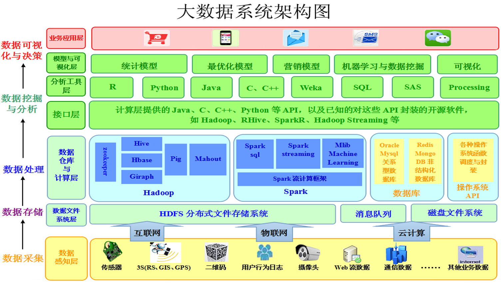
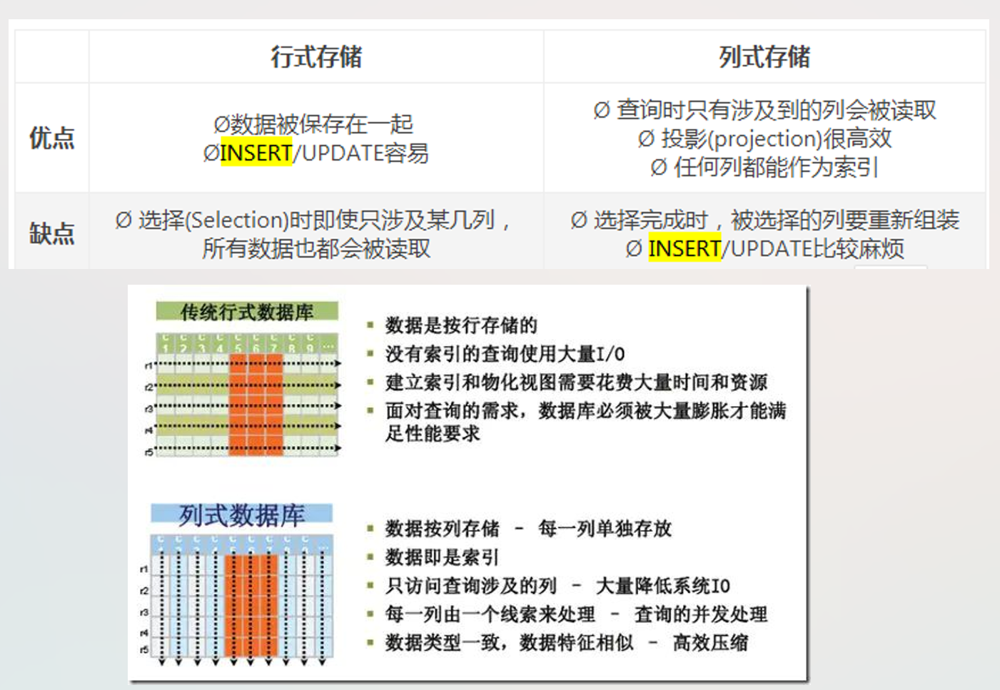

### 壹  大数据系统概论

#### 述：
#####
#####

###### · 大数据的时代背景：
· **“大数据”的诞生**：
· 半个世纪以来，随着计算机技术全面融入社会生活，信息爆炸已经积累到了一个开始引发变革的程度
· 它不仅使世界充斥着比以往更多得信息，而且其增长速度也在加快，创造出了“大数据”这个概念
· 21 世纪就是数据信息大发展的时代，移动互联、社交网络、电子商务等极大拓展了互联网得边界与应用范围，各种数据正在迅速膨胀并变大
· 互联网（社交、搜索、电商）、移动互联网（微博）、物联网（传感器，智慧地球）、车联网、GPS、医学影像、安全监控、金融（银行、股市、保险）、电信（通话、短信）都在疯狂产生着数据

· **大数据名词由来**：
· 2011 年 5 月，在“云计算相遇大数据” 为主题的 EMC World 2011 会议中，EMC 抛出 Big Data 概念
· 20 世纪 90 年代，数据仓库之父得 Bill Inmon 就经常提及 Big Data

· **大数据时代**：
· 新时代，人们从信息的被动接受者变成了主动创造者:
	· 全球每秒钟发送 9 百万封电子邮件
	· 每天会有 88 万个小时得视频上传到 Youtube
	· 推特上每天发布 5 千万条消息
	· 每天亚马逊上将产生 3 百万笔订单…
	· 每个月网民在 Facebook 上要花费 7 千亿分钟,被移动互联网使用者发送与接收得数据高达 3EB…
	· Google 上每天需要处理 24PB 的数据…

· 数据量增加：
根据 IDC 监测，人类产生的数据量正在呈指数级增长，大约每两年翻一番，这个速度在 2020 年之前会继续保持下去——这意味着人类在最近两年产生的数据量相当于之前产生的全部数据量：TB->PB->EB->ZB
· 口诀：“投屏一张”（T,P,E,Z）

· 数据结构日趋复杂：
大量新数据源得出现则导致了非结构化、半结构化数据爆发式得增长

· 这些由我们创造的信息背后产生的这些数据早已经远远超越了目前人力所能处理的范畴
· 大数据时代正在来临…

###### · 大数据 4V 特征：

1. 体量 **Volume**：
· *非结构化数据*的超大规模和增长
· 占总数据量的 80~90%
· 比结构化数据增长快 10 倍到 50 倍
· 是传统数据仓库的 10 倍到 50 倍

2. 多样性 **Variety**：
· 大数据的异构和多样性
· 很多不同形式（文本、图像、视频、机器数据）
· 无模式或者模式不明显
· 不连贯的语法或句义

3. 价值密度 **Value**：
· 大量的不相关信息（价值密度低）
· 对未来趋势与模式的可预测分析
· 深度复杂分析（机器学习、人工智能 Vs 传统商务智能（咨询、报告等））

4. 速度 **Velocity**：
· *实时分析*而非批量式分析
· 数据输入、处理与丢弃
· 立竿见影而非事后见效

· **大数据要解决的问题**：

                              （图一：大数据要解决的问题）

###### · 关系数据库：

                               （图二：关系数据模型概述）

###### · 大数据技术：

1. 分析技术：
· 数据处理：自然语言处理技术
· 统计与分析：A/B test；top N 排行榜；地域占比；文本情感分析
· 数据挖掘：关联规则分析，分类，聚类
· 模型预测：预测模型，机器学习，建模仿真

2. 存储：
· 结构化数据：
	· 海量数据的查询、统计、更新等操作效率低
· 非结构化数据：
	· 图片、视频、word、pdf、ppt 等文件存储
	· 不利于检索、查询与存储
· 半结构化数据：
	· 转换为结构化存储
	· 按照非结构化存储

3. 大数据技术：
· 数据采集：ETL 工具
· 数据存取：关系数据库；NoSQL；SQL 等
· 基础架构支持：云存储；分布式文件系统等
· 计算结果展现：云计算；标签云；关系图等

4. 解决方案:
· Hadoop（MapReduce 技术）
· 流计算（twitter 的 storm 与 yahoo！S4）

###### · 大数据系统的架构：

· 大数据系统架构图：

                               （图三：大数据系统架构图）

###### · 大数据与云计算：
· 大数据是云计算的两大核心内容之一

                             （图四：大数据与云计算的关系）

###### · Hadoop 介绍：
· Hadoop 是一个能够对大量数据进行分布式处理的软件框架（软件平台）
· Hadoop 是一个能够让用户轻松构建和使用的分布式计算平台，用户可以轻松地在 Hadoop 上开发和运行处理海量数据的应用程序

· **Hadoop 基本组成**：
1. Common - common 及核心公共模块， 为软件开发提供了所需的 API
2. HDFS - 分页式文件系统
3. MapReduce - 计算
4. YARN - Hadoop 集群的资源管理系统

· **Hadoop 起源**：
· Hadoop 起源于 Apache Nutch 项目，始于 2002 年，是 Apache Lucene 的子项目之一
· 2004 年，*Google* 在“操作系统设计与实现”（Operating System Design and Implementation，OSDI）会议上公开发表了题为 MapReduce：Simplified Data Processing on Large Clusters 的论文之后，受到启发的 Doug Cutting 等人开始尝试实现 MapReduce 计算框架，并将它与 NDFS（Nutch Distributed File System）结合，用以支持 Nutch 引擎的主要算法
· 由于 NDFS 和 MapReduce 在 Nutch 引擎中有着良好的应用，所以它们于 2006 年 2 月被分离出来，成为一套完整而独立的软件，并被命名为 Hadoop
· 到了 2008 年年初，Hadoop 已成为 Apache 的顶级项目，包含众多子项目，被应用到很多互联网公司

· **Hadoop 大数据处理的优势**：
· Hadoop 得以在大数据处理应用中广泛应用得益于其自身在数据提取、变形和加载（ETL）方面上的天然优势
· Hadoop 的分布式架构，将大数据处理引擎尽可能的靠近存储，对例如像 ETL 这样的批处理操作相对合适，因为类似这样操作的批处理结果可以直接走向存储
· Hadoop 的 MapReduce 功能实现了将单个任务打碎，并将碎片任务（Map）发送到多个节点上，之后再以单个数据集的形式加载（Reduce）到数据仓库里

· **Hadoop 2.0**：
· 2.0 版本中，在 HDFS 之上，增加了YARN（资源管理框架）层
· 它是一个资源管理模块，为各类应用程序提供资源管理和调度

                              （图五：Hadoop 2.0 模式图）

· **Hadoop 生态系统 2.0**：

                             （图六：Hadoop 生态系统 2.0）

· **Hadoop 的优点**：
· *开源*：源代码开源
· *优秀的生态圈*
· *高扩展性*：Hadoop 是在可用的计算机集簇间分配数据并完成计算任务，这些集簇可以方便地扩展到数以千计的节点中
· *高效性*：Hadoop 能够在节点之间动态地移动数据，并保证各个节点的动态平衡，因此处理速度非常快
· *高可靠性*：Hadoop 能够自动保存数据的多个副本，并且能够自动将失败的任务重新分配
· *低成本*：可以通过廉价的机器组成服务器集群来分发处理数据，成本比较低；Hadoop 是开源的，项目的软件成本低

· **Hadoop 的发展现状**：
· Hadoop 设计之初的目标就定位于高可靠性、高可拓展性、高容错性和高效性，正是这些设计上与生俱来的优点，才使得 Hadoop 一出现就受到众多大公司的青睐，同时也引起了研究界的普遍关注。
· Hadoop 技术在互联网领域已经得到了广泛的运用，例如，Yahoo 使用 4000 个节点的 Hadoop 集群来支持广告系统和 Web 搜索的研究；Facebook 使用 1000 个节点的集群运行 Hadoop，存储日志数据，支持其上的数据分析和机器学习；百度用 Hadoop 处理每周 200TB 的数据，从而进行搜索日志分析和网页数据挖掘工作
· 一些提供 Hadoop 解决方案的商业型公司也纷纷跟进，利用自身技术对Hadoop 进行优化、改进、二次开发等，然后以公司自有产品形式对外提供 Hadoop 的商业服务

###### · HDFS 介绍：
· HDFS 是一种分布式文件系统，用于处理在商业硬件上运行的大型数据集
· 它用于将单个 Apache Hadoop 集群扩展到数百甚至数千个节点
· HDFS 是 Apache Hadoop 的主要组件之一，其他组件包括 MapReduce 和 YARN
· HDFS 是用 Java 编写的，任何支持 Java 的机器都可以部署 HDFS

                                （图七：HDFS 示例）

· HDFS 的目标（要解决的问题）：
1. 硬件故障：
· 硬件故障是常态，而不是异常；整个 HDFS 系统将由数百或数千个存储着文件数据片段的服务器组成；实际上它里面有非常巨大的组成部分，每一个组成部分都很可能出现故障，这就意味着 HDFS 里的总是有一些部件是失效的，因此故障的检测和自动快速恢复是 HDFS 一个很核心的设计目标
2. 流式数据访问：
· 运行在 HDFS 之上的应用程序必须流式地访问数据集，这些不是运行在普通文件系统之上的普通应用；HDFS 被设计成适合批量处理的，而不是用户交互式的；重点是在数据吞吐量，而不是数据访问的反应时间，POSIX（可移植操作系统接口）的很多硬性需求对于 HDFS 应用都是非必须的，去掉 POSIX 一小部分关键语义可以获得更好的数据吞吐率
3. 大数据集：
· 运行在 HDFS 之上的程序有大规模的数据集；典型的 HDFS 文件大小是 GB 到 TB 的级别；所以 HDFS 被调整成支持大文件；它应该提供很高的聚合数据带宽，一个集群中支持数百个节点，一个集群中还应该支持千万级别的文件
4. 简单一致性模型：
· 大部分的 HDFS 程序对文件操作需要的是一次写多次读的操作模式；一个文件一旦创建、写入、关闭之后就不需要修改了；这个假定简单化了数据一致的问题，并使高吞吐量的数据访问变得可能；一个 Map-Reduce 程序或者网络爬虫程序都可以完美地适合这个模型
5. 移动计算比移动数据更经济*：
· 在靠近计算数据所存储的位置进行计算是最理想的状态，尤其是在大数据集；它会消除网络拥堵，提高系统的整体吞吐量
· HDFS 提供了接口，来让程序将自己移动到离数据存储更近的位置
6. 异构软硬件平台间的可移植性：
· HDFS 被设计成可以简便地实现平台间的迁移，这将推动需要大数据集的应用更广泛地采用 HDFS 作为平台

                               （图八：HDFS 体系结构）

                    （图九：分布式文件系统 HDFS 名称节点与数据节点）

· **HDFS 数据组织—数据块**：
· HDFS 的设计是用于支持大文件的；运行在 HDFS 上的程序也是用于处理大数据集的
· 这些程序一次写多次读数据，并且这些读操作要求满足流式传输速度
· HDFS 中典型的块大小是 128MB，一个 HDFS 文件可以被切分成多个 128MB 大小的块（chunk），如果需要，每一个块可以分布在不同的数据节点上

· *块副本*：
· 每一个文件可以配置块副本数量，默认是 3
· 副本的作用是防止因 DataNode 故障而导致数据丢失，除此之外块副本还可以增加块可读取的节点 
· 每个文件可以在写入时指定这个文件块的副本数量，也可以在未来修改某个文件的块副本数量，文件块的副本数量配置作为块元数据的一部分保存在 NameNode 中

· *元数据*：
· 元数据（Metadata）：维护 HDFS 文件系统中文件和目录的信息，分为*内存元数据*和*元数据文件*两种
· NameNode 维护整个元数据

                              （图十：HDFS 文件的组织）

· 块副本（Replication）示例：

                                （图十一：块副本示例）

· **数据复制流程**：
1. 副本位置：第一小步
· 块副本存放位置的选择严重影响 HDFS 的可靠性和性能；机架敏感的副本存放策略是为了提高数据的可靠性，可用性和网络带宽的利用率
· 默认的 HDFS block 放置策略在最小化写开销和最大化数据可靠性、可用性以及总体读取带宽之间进行了一些折中；一般情况下复制因子为 3，HDFS 的副本放置策略是将第一个副本放在本地节点，将第二个副本放到本地机架上的另外一个节点而将第三个副本放到不同机架上的节点
2. 副本的选择
· 为了尽量减小全局的带宽消耗读延迟，HDFS 尝试返回一个读操作离它最近的副本；假如在读节点的同一个机架上就有这个副本，就直接读这个，如果 HDFS 集群是跨越多个数据中心，那么本地数据中心的副本优先于远程的副本
3. 安全模式
· 在启动的时候，名字节点进入一个叫做安全模式的特殊状态；安全模式中不允许发生块复制；名字节点接受来自数据节点的心跳和块报告；一个块报告包含数据节点所拥有的数据块的列表
· 每个块有一个特定的最小复制数；当名字节点检查这个块已经大于最小的复制数就被认为是安全地复制了，当达到配置的块安全复制比例时（加上额外的 30 秒），名字节点就退出安全模式；它将检测数据块的列表，将小于特定复制数的块复制到其他的数据节点

· **文件系统的元数据的持久化**：
· HDFS 的命名空间是由名字节点来存储的；名字节点使用叫做 EditLog 的事务日志来持久记录每一个对文件系统元数据的改变，如在 HDFS 中创建一个新的文件；名字节点在本地文件系统中用一个文件来存储这个 EditLog
· 整个文件系统命名空间，包括文件块的映射表和文件系统的配置都存在一个叫 FsImage 的文件中，FsImage 也存放在名字节点的本地文件系统中
· 名字节点在内存中保留一个完整的文件系统命名空间和文件块的映射表的镜像
· 名字节点启动时，它将从磁盘中读取 FsImage 和 EditLog，将 EditLog 中的所有事务应用到 FsImage 的仿内存空间，然后将新的 FsImage 刷新到本地磁盘中，因为事务已经被处理并已经持久化的 FsImage 中，然后就可以截去旧的 EditLog；这个过程叫做检查点；当前实现中，检查点仅在名字节点启动的时候发生，正在支持周期性的检查点
· 数据节点将 HDFS 数据存储到本地的文件系统中；数据节点并不知道 HDFS 文件的详细信息，不同的数据块会存储在本地文件系统多个文件中
· 当数据节点启动的时候，它将扫描它的本地文件系统，根据本地的文件产生一个所有 HDFS 数据块的列表并报告给名字节点，这个报告称作块报告

· **通信协议**：
· 所有的通信协议都是在 TCP/IP 协议之上构建的
· 一个客户端和指定 TCP 配置端口的名字节点建立连接之后，它和名字节点之间通信的协议是 Client Protocol
· 数据节点和名字节点之间通过 Datanode Protocol 通信
· RPC（Remote Procedure Call）抽象地封装了 Client Protocol 和 DataNode Protocol 协议；按照设计，名字节点不会主动发起一个 RPC，它只是被动地对数据节点和客户端发起的 RPC 作出反馈

· **可靠性**：
· HDFS 的主要目标就是在存在故障的情况下也能可靠地存储数据；三个最常见的故障是 *名字节点故障*，*数据节点故障* 和 *网络断开*
· 一个数据节点周期性发送一个心跳包到名字节点；网络断开会造成一组数据节点子集和名字节点失去联系；名字节点根据缺失的心跳信息判断故障情况；名字节点将这些数据节点标记为死亡状态，不再将新的 IO 请求转发到这些数据节点上，这些数据节点上的数据将对 HDFS 不再可用，可能会导致一些块的复制因子降低到指定的值
· 名字节点检查所有的需要复制的块，并开始复制他们到其他的数据节点上；重新复制在有些情况下是不可或缺的，例如：数据节点失效，副本损坏，数据节点磁盘损坏或者文件的复制因子增大

· **负载重平衡（Cluster Rebalancing）**：
· 该方案会在数据节点的可用空间处于阈值以下时自动将数据转移到其它数据节点
· 当一个文件遇到突发的高存取需求时，它可以动态创建数据副本以重新平衡集群中的负载
· 目前，数据负载的重平衡方案还没有实现

· **数据完整性**：
· 从数据节点上取一个文件块有可能是坏块，坏块的出现可能是存储设备错误，网络错误或者软件的漏洞
· HDFS 客户端实现了 HDFS 文件内容的校验；当一个客户端创建一个 HDFS 文件时，它会为每一个文件块计算一个校验码并将校验码存储在同一个 HDFS 命名空间下一个单独的隐藏文件中
· 当客户端访问这个文件时，它根据对应的校验文件来验证从数据节点接收到的数据；如果校验失败，客户端可以选择从其他拥有该块副本的数据节点获取这个块

· **元数据失效**：
· FsImage 和 Editlog 是 HDFS 的核心数据结构；这些文件的损坏会导致整个集群的失效；因此名字节点可以配置成支持多个 FsImage 和 EditLog 的副本；任何 FsImage 和 EditLog 的更新都会同步到每一份副本中
· 同步更新多个 EditLog 副本会降低名字节点的命名空间事务交易速率；但是这种降低是可以接受的，因为 HDFS 程序中产生大量的数据请求，而不是元数据请求；名字节点重新启动时，选择最新一致的 FsImage 和 EditLog
· 名字节点对于一个 HDFS 集群是单点失效的；假如名字节点失效，就需要人工的干预；还不支持自动重启和到其它名字节点的切换

· **快照**：
· 快照支持在一个特定时间存储一个数据拷贝，快照可以将失效的集群回滚到之前一个正常的时间点上；HDFS 已经支持元数据快照

· **数据组织—阶段状态（staging）**：
· 一个客户端创建一个文件的请求并不会立即转发到名字节点
· 实际上，一开始 HDFS 客户端将文件数据缓存在本地的临时文件中；应用程序的写操作被透明地重定向到这个临时本地文件；当本地文件堆积到一个 HDFS 块大小的时候，客户端才会通知名字节点
· 名字节点将文件名插入到文件系统层次中，然后为它分配一个数据块；名字节点构造包括数据节点 ID（可能是多个，副本数据块存放的节点也有）和目标数据块标识的报文，用它回复客户端的请求
· 客户端收到后将本地的临时文件刷新到指定的数据节点数据块中
· 当文件关闭时，本地临时文件中未上传的残留数据就会被转送到数据节点；然后客户端就可以通知名字节点文件已经关闭；此时名字节点将文件的创建操作添加到持久化存储中；假如名字节点在文件关闭之前发生故障，文件就丢掉了
· 上述流程是在认真考虑了运行在 HDFS 上的目标程序之后被采用，这些应用程序需要流式地写文件；如果客户端对远程文件系统进行直接写入而没有任何本地的缓存，这就会对网速和网络吞吐量产生很大的影响；这方面早有前车之鉴，早期的分布式文件系统如 AFS，也用客户端缓冲来提高性能，POSIX 接口的限制也被放宽以达到更高的数据上传速率

· **数据组织—流式复制（Replication Pipelining）**：
· 当客户端写数据到 HDFS 文件中时，如上所述，数据首先被写入本地文件中，假设 HDFS 文件的复制因子是 3，当本地文件堆积到一块大小的数据，客户端从名字节点获得一个数据节点的列表；这个列表也包含存放数据块副本的数据节点
· 当客户端刷新数据块到第一个数据节点；第一个数据节点开始以 4kb 为单元接收数据，将每一小块都写到本地库中，同时将每一小块都传送到列表中的第二个数据节点；同理，第二个数据节点将小块数据写入本地库中同时传给第三个数据节点，第三个数据节点直接写到本地库中
· 一个数据节点在接收前一个节点数据的同时，还可以将数据流水式传递给下一个节点，因此数据是流水式地从一个数据节点传递到下一个

· **HDFS 的读写**：

                           （图十二：HDFS 的写流程图示）

                           （图十三：HDFS 的读流程图示）

· **访问方式（Accessibility）**：
· DFSShell：HDFS 允许用户数据组织成文件和文件夹的方式，它提供一个叫 DFSShell 的接口，使用户可以和 HDFS 中的数据交互，命令集的语法跟 bash，csh 类似
· DFSAdmin 命令集是用于管理 dfs 集群的，这些命令只由 HDFS 管理员使用
· 浏览器接口：典型的 HDFS 初始化配置了一个 web 服务，通过一个可配的 TCP 端口可以访问 HDFS 的命名空间；这就使得用户可以通过 web 浏览器去查看 HDFS 命名空间的内容
· Java api

· DFSShell 示例：

| Action                     | Command                                          |
| :------------------------- | :----------------------------------------------- |
| 创建目录 / foodir              | hdfs dfs -mkdir / foodir                         |
| 查看文件 / foodir / myfile.txt | hadoop dfs -cat / foodir / myfile.txt            |
| 删除文件 / foodir / myfile.txt | hadoop dfs -rm / foodir / myfile.txt             |
| 将集群设置成安全模式                 | bin / hadoop dfsadmin -safemode enter         |
| 产生一个数据节点的列表                | bin / hadoop dfsadmin -report                 |
| 去掉一个数据节点                   | bin / hadoop dfsadmin -decommission datanodename |

· **HDFS 的文件读取解析**：

                        （图十四：HDFS 的文件读取解析代码）

###### · Hadoop Mapreduce：
· Hadoop MapReduce 是一个**软件框架**，基于该框架能够容易地编写应用程序，这些应用程序能够运行在由上千个商用机器组成的大集群上，并以一种可靠的，具有**容错**能力的方式**并行地处理**上 **TB 级别的海量数据集**

· **Mapreduce 的词频统计分析**：

                    （图十五：Mapreduce 的词频统计分析图示）

· **Mapreduce 的处理流程**：

                        （图十六：Mapreduce 的处理流程图示）

· Mapreduce 的处理过程：
· 什么是 MapReduce？统合来看，MapReduce 就是你有很多各种各样的蔬菜水果面包（Input），有很多厨师，不同的厨师分到了不同的蔬菜水果面包，自己主动去拿过来（Split），拿到手上以后切碎（Map），切碎以后给到不同的烤箱里，冷藏机里（Shuffle），冷藏机往往需要主动去拿，拿到这些东西存放好以后会根据不同的顾客需求拿不同的素材拼装成最终的结果，这就是 Reduce，产生结果以后会放到顾客那边等待付费（Ticket），这个过程是 Finalize
· 所以 Mapreduce 是**六大过程**：Input，Split，Map，Shuffle，Reduce，Finalize
· input—输入；split—分离；map—管理；shuffle—洗牌；reduce—还原；finalize—结束

· **MapReduce 的架构和工作原理**：

                           （图十七：MapReduce 架构示意图）

                           （图十八：MapReduce 的工作原理）

· **MapReduce 的输入输出**：
· MapReduce 框架运转在 <key, value> 键值对上，也就是说，框架把作业的输入看成是一组 <key, value> 键值对，同样也产生一组 <key, value> 键值对作为作业的输出，这两组键值对有可能是不同的
· 一个 MapReduce 作业的输入和输出类型如下图所示：可以看出在整个流程中，会有三组 <key, value> 键值对类型的存在

（图十九：MapReduce 的输入输出流程）

· **MapReduce 分区**：

                            （图二十：MapReduce 分区）

· 分区实现及自定义分区：
· Partitioner 决定 Map 节点的输出将被分区到哪个 Reduce 节点；默认的 Partitioner 是 HashPartitioner
· 用户可以定制并使用自己的 Partitioner

                      （图二十一：MapReduce 自定义分区的实现）

###### · HBase：
· HBase 是一个面向列式存储的分布式数据库，其设计思想来源于 Google 的 BigTable 论文
· HBase 底层存储基于 HDFS 实现，集群的管理基于 ZooKeeper 实现
· HBase 良好的分布式架构设计为海量数据的快速存储、随机访问提供了可能，基于数据副本机制和分区机制可以轻松实现在线扩容、缩容和数据容灾
· HBase 是大数据领域中 Key-Value 数据结构存储最常用的数据库方案

· **HBase 的特点**：
1. 易扩展：
	1. Hbase 的扩展性主要体现在两个方面，一个是基于运算能力（RegionServer） 的扩展，通过增加 RegionServer 节点的数量，提升 Hbase 上层的处理能力
	2. 另一个是基于存储能力的扩展（HDFS），通过增加 DataNode 节点数量对存储层的进行扩容，提升 HBase 的数据存储能力
2. 海量存储：
	1. HBase 作为一个开源的分布式 Key-Value 数据库，其主要作用是面向 PB 级别数据的实时入库和快速随机访问；这主要源于上述易扩展的特点，使得 HBase 通过扩展来存储海量的数据
3. 高可靠性：
	1. WAL 机制保证了数据写入时不会因集群异常而导致写入数据丢失，Replication 机制保证了在集群出现严重的问题时，数据不会发生丢失或损坏；而且 Hbase 底层使用 HDFS，HDFS 本身也有备份
4. 稀疏性：
	1. 在 HBase 的列族中，可以指定任意多的列，为空的列不占用存储空间，表可以设计得非常稀疏

· **HBase 的体系结构**：

                         （图二十二：HBase 的体系结构图示）

· **HMaster**：
· 负责管理 RegionServer，实现其负载均衡
· 管理和分配 Region，比如在 Region split 时分配新的 Region，在 RegionServer 退出时迁移其内的 Region 到其他 RegionServer 上
· 管理 namespace 和 table 的元数据（实际存储在 HDFS 上）
· 权限控制（ACL）

· **RegionServer**：
· 存放和管理本地 Region
· 读写 HDFS，管理 Table 中的数据
· Client 从 HMaster 中获取元数据，找到 RowKey 所在的 RegionServer 进行读写数据

· **ZooKeeper**：
· 存放整个 HBase *集群的元数据*以及*集群的状态信息*
· 实现 *HMaster 主从节点* 的 *failover（故障转移）*

· **HBase 数据模型**：
· HBase 表中，一条数据拥有一个全局唯一的键（RowKey）和任意数量的列（Column），一列或多列组成一个列族，HBase 会将表按主键划分为多个 Region 存储在不同 RegionServer 上，以完成数据的分布式存储和读取

1. Column Family 即列族，HBase 基于列划分数据的物理存储，一个列族可以包含包意多列；
一般同一类的列会放在一个列族中，每个列族都有一组存储属性：
是否应该缓存在内存中；
数据如何被压缩或行键如何编码等

HBase 在创建表的时候就必须指定列族
HBase 的列族不是越多越好，官方推荐一个表的列族数量最好小于或者等于 3
过多的列族不利于 HBase 数据的管理和索引

2. RowKey 的概念与关系型数据库中的主键相似，HBase 使用 RowKey 来唯一标识行数据；
访问 HBase 数据的方式有三种:
基于 RowKey 的单行查询；
基于 RowKey 的范围查询；
全表扫描查询

3. Region：HBase 将表中的数据基于 RowKey 的不同范围划分到不同 Region 上，每个 Region 负责一定范围的数据存储和访问
表开始只有一个 Region，随着数据增加，Region 不断增大，当增大到一个阈值的时候，Region 就会等分成两个新的 Region

Region 是 HBase 中分布式存储和负载均衡的最小单元，不同的 Region 可以分布在不同的 HRegionServer 上，但同一个 Region 不会拆分到多个 HRegionServer 上；
由于数据被划分到不同的 Region 上，每个 Region 都可以独立地进行写入和查询

4. TimeStamp 是实现 HBase 多版本的关键；在 HBase 中，使用不同 TimeStamp 来标识相同 RowKey 对应的不同版本的数据
相同 RowKey 的数据按照 TimeStamp 倒序排列，默认查询的是最新的版本，当然用户也可以指定 TimeStamp 的值来读取指定版本的数据

· 行式存储和列式存储：

                           （图二十三：行式存储和列式存储）

                         （图二十四：行式存储和列式存储示例）

                        （图二十五：行式存储与列式存储对比）

                            （图二十六：存储中的数据压缩）

                           （图二十七：列式存储查询性能示例）

· **HBase 的读和写**：

                             （图二十八：HBase 的写流程）

· 预写日志 WAL（Write—Ahead—Log）：

                            （图二十九：WAL 的工作原理）
· WAL 最重要的作用是灾难恢复
· 和关系数据库的日志类似，它记录所有的数据改动
· 通过重做 log 中所记录的改动，可以恢复崩溃之前的数据
· 如果写入WAL 失败，整个操作将认为失败

· HBase 读流程：

（图三十：HBase 的读流程图示）

· HBase 创建表：
~~~
hbase:006:0> create 't1','c1'
Created table t1
Took 1.2816 seconds                                                                                                                                                        
=> Hbase::Table - t1
~~~

###### · Apache Spark：
· 通用的分布式数据处理引擎
· 大数据计算框架 MapReduce 的继承者

                              （图三十一：Spark 的结构）

                           （图三十二：计算机不同资源的性能）

                              （图三十三：Spark 的优点）

                      （图三十四：Spark 比 MapReduce 快）

                             （图三十五：Spark 生态圈）

                        （图三十六：Spark 与 Hadoop 的比较）

· **Spark 基本概念**：
· RDD：是弹性分布式数据集（Resilient Distributed Dataset）的简称，是分布式内存的一个抽象概念，提供了一种高度受限的共享内存模型
· DAG：是Directed Acyclic Graph（有向无环图）的简称，反映 RDD 之间的依赖关系
· Driver Program：控制程序，负责为 Application 构建 DAG 图
· Cluster Manager：集群资源管理中心，负责分配计算资源
· Worker Node：工作节点，负责完成具体计算
· Executor：是运行在工作节点（Worker Node）上的一个进程，负责运行 Task，并为应用程序存储数据
· Application：用户编写的 Spark 应用程序，一个 Application 包含多个 Job
· Job：作业，一个 Job 包含多个 RDD 及作用于相应 RDD 上的各种操作
· Stage：阶段，是作业的基本调度单位，一个作业会分为多组任务，每组任务被称为“阶段”
· Task：任务，运行在 Executor 上的工作单元，是 Executor 中的一个线程
· 总结：Application 由多个 Job 组成，Job 由多个 Stage 组成，Stage 由多个 Task 组成；Stage 是作业调度的基本单位

                             （图三十七：Spark 运行流程）

                               （图三十八：Spark 的部署）

###### · Flink：
· 数据流上的状态计算引擎

· Apache Flink 是一个框架和分布式处理引擎，用于无界和有界数据流的有状态计算
· Flink 被设计成可以在所有常见的集群环境中运行，以内存中的速度和任何规模执行计算

                  （图三十九：大数据处理和实时数据分析的流处理架构）

· **Flink 的数据处理思想**：
· *无界流（Unbounded Stream）*：流有开始，没有结束；无界流的数据必须持续处理；不能等到所有数据都到达再处理，因为输入是无限的，在任何时候输入都不会完成；处理无界数据通常要求以特定顺序提取事件，以便能够推断结果的完整性
· *有界流（Bounded Stream）*：有定义流的开始，也有定义流的结束；有界流可以在提取所有数据后再进行计算；有界流所有数据可以被排序，所以并不需要有序提取；有界流处理通常被称为批处理

                           （图四十：有界流和无界流的对比）

· **多场景的部署方式**：
· Flink 集成了所有常见的集群资源管理器，例如 Hadoop YARN、 Apache Mesos 和 Kubernetes，但同时也可以作为独立集群运行
· Flink 被设计为能够很好地工作在上述每个资源管理器中，这是通过资源管理器特定（resource-manager-specific）的部署模式实现的
· 部署 Flink 应用程序时，Flink 会根据应用程序配置的并行性自动标识所需的资源，并从资源管理器请求这些资源。在发生故障的情况下，Flink 通过请求新资源来替换发生故障的容器；提交或控制应用程序的所有通信都是通过 REST 调用进行的，这可以简化 Flink 与各种环境中的集成

· **数据的多种规模应用**：
· Flink 旨在任意规模上运行有状态流式应用；因此应用程序被并行化为可能数千个任务，这些任务分布在集群中并发执行
· 而且 Flink 很容易维护非常大的应用程序状态；其异步和增量的检查点算法对处理延迟产生最小的影响，同时保证精确一次状态的一致性
· Flink 可以做到每天处理数万亿事件；可以维护几 TB 大小的状态；可以部署上千个节点的集群复制代码

· **充分利用内存的性能**：
· 有状态的 Flink 程序针对本地状态访问进行了优化；任务的状态始终保留在内存中，如果状态大小超过可用内存，则会保存在能高效访问的磁盘数据结构中；任务通过访问本地（通常在内存中）状态来进行所有的计算，从而产生非常低的处理延迟；Flink 通过定期和异步地对本地状态进行持久化存储来保证故障场景下精确一次的状态一致性

（图四十一：流处理系统依赖于内存来实现高效的数据处理和状态管理）

###### · Flink 在快手实时多维分析场景的应用：
· 作为短视频分享跟直播的平台，快手有诸多业务场景应用了 Flink，包括短视频、直播的质量监控、用户增长分析、实时数据处理、直播 CDN 调度等

                           （图四十二：Flink 在快手应用场景）

                        （图四十三：Flink 在快手中各项业务占比）

                        （图四十四：Flink 在快手应用的角度）

                             （图四十五：Flink 集群规模）

                     （图四十六：Flink 在快手实时多维分析场景的应用）

                              （图四十七：方案选型分析）

               （图四十八：方案选型借鉴 kylin 思路：预计算、结果存储 HBase）

                            （图四十九：方案设计分析）

###### · Apache Storm 和 Kafka：
· Storm 是一个免费并开源的分布式实时计算系统
· 利用 Storm 可以很容易做到可靠地处理无限的数据流，像 Hadoop 批量处理大数据一样，Storm 可以实时处理数据
· 简单易用，可以使用多种编程语言
· Storm 应用场景：
	· 实时数据分析
	· 联机学习
	· 持续计算
	· 分布式 RPC
· Apache Kafka 是一个开源的分布式事件流平台，被数千家公司用于高性能数据管道、流分析、数据集成和关键任务应用

                            （图五十：Kafka 集群结构）

