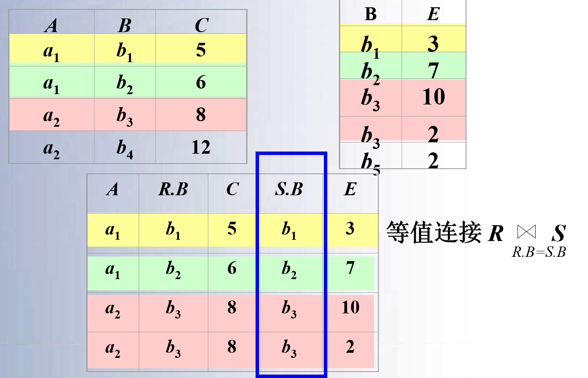

### 壹  关系模型

####
#####
#####

###### · 关系的定义：
· 关系理论是以集合代数理论为基础的，因此可以用集合代数给出二维表的“关系”定义
· 先引入*域*和*笛卡尔积*的概念

· **域（Domain）**：
· 域是一组具有相同数据类型的值的集合，如自然数、整数、{ 男，女 }、{ 0，1 }
· 关系中用域表示属性的取值范围，例如：
	D1 = { 张三，李四，王二麻子 }
	D2 = { 男，女 }
	D3 = { 47，28，30 }
	· 其中 D1，D2，D3 为域名，分别表示教师关系中姓名、性别、年龄的集合

· **笛卡尔积（Cartesian product）**：
· 给定一组集合 D1，D2，…，Dn，它们可以是相同的，D1，D2，…，Dn 的笛卡尔积为：$$D_1×D_2×…×D_n=\{(d_1,d_2,…,d_n)|d_i∈D_i,i=1,2,…,n\}$$
· 这是所有域的所有值的一个组合，不能重复

· 笛卡尔积-例：给出域：
D1 = SUPERVISOR = { 张，刘 }
D2 = SPECIALITY = { 计算机，信息 }
D3 = POSTGRADUATE = { 李，陈，王 }
则：D1 × D2 × D3 =
{（ 张，计算机，李 ），（ 张，计算机，陈 ），（ 张，计算机，王 ），
（ 张，信息，李 ），（ 张，信息，陈 ），（ 张，信息，王 ），
（ 刘，计算机，李 ），（ 刘，计算机，陈 ），（ 刘，计算机，王 ），
（ 刘，信息，李 ），（ 刘，信息，陈 ），（ 刘，信息，王 ）}

· **元组（Tuple）**：
· 笛卡尔积中的每一个元素（d1，d2，…，dn）叫做一个 *n 元组（n-tuple）* 或简称元组
· 例如：（ 张，计算机，李 ）、（ 张、计算机、陈 ）是元组

· **分量（Component）**：
· 笛卡尔积元素（d1，d2，…，dn）中的每一个值 $d_i$ 叫做一个分量
· 例如：张、计算机、李、陈 都是分量

· **关系**：
· 定义：D1 × D2 ×…× Dn 的任一个子集称为 D1，D2，…，Dn 上的一个关系
· “n” 叫做关系的*目*或*度（degree）*

· **元组和属性**：
· 关系中的每一行对应一个元组，通常用 *t* 表示
· 每一列对应一个域，关系中的列称为属性，每一列用属性名表示
· $t[A_i]$ 表示元组 t 在属性 $A_i$ 上的值

· **一元关系和二元关系**：
· 当 n=1 时，该关系称为*一元关系（Unary relation）*
· 当 n=2 时，该关系称为*二元关系（Binary relation）*
· 例如在上述例子的笛卡尔积中取出有实际意义的元组来构造关系：$$SAP(SUPERVISOR，SPECIALITY，POSTGRADUATE)$$
· 假设导师与专业：1:1（即一个导师只能对一个专业），研究生与导师：1:n（一个研究生只能遵从一个导师）
· 于是，SAP 关系可以包含三个元组：

| SUPERVISOR | SPECIALITY | POSTGRADUATE |
| ---------- | ---------- | ------------ |
| 张          | 信息         | 李            |
| 张          | 信息         | 陈            |
| 刘          | 信息         | 王            |

· 几点说明：
1. 按照定义，关系可以是一个无限集合
2. 由于笛卡尔积不满足交换律，所以：$$(d_1,…,d_i,d_j,…,d_n)≠(d1,…,d_j,d_i,…,d_n)$$
3. 严格地说，关系是一种规范化了的二维表中行的集合
4. 当关系作为关系代数数据模型的数据结构时，需要作出补充和限定：
	1. 无限关系在数据库中是无意义的，因此限定关系代数数据模型中的关系必须是有限集合
	2. 通过为关系的每列增加一个属性名的方法取消元组的有序性$$(d_1,…,d_i,d_j,…,d_n)≠(d1,…,d_j,d_i,…,d_n)，(i,j=1,2,…,n)$$

· *规范化的关系的性质*：
1. 列是同质的（Homogeneous）：
	· 每一列中的分量是统一类型的数据，来自同一个域
2. 不同的列可出自同一个域：
	· 其中的每一个列称为一个属性，不同的属性要给予不同的属性名
3. 列的顺序无所谓：
	1. 列的次序可以任意交换
	2. 遵循这一性质的数据库产品（如 ORACLE ），增加新的属性时，永远是插至最后一列
	3. 但也有许多关系数据库产品没有遵循这一性质，例如 FoxPro 仍然区分了属性顺序
	4. 各个元组是不同的，即关系中不允许出现重复元组：
		· 有些数据库允许关系表中存在两个完全相同的元组
	5. 行的顺序无所谓，即行的次序可以任意交换：
		· 遵循这一性质的数据库产品（如 ORACLE ），插入一个元组时，永远插至最后一行
		· 但也有许多关系数据库产品没有遵循这一性质，例如 FoxPro 仍然取反的元组的顺序
	6. 分量必须取原子值：
		· 每一个分量都必须是不可分的数据项
		· 这是规范条件中最基本的一条
		· 下面这个图是*错误*的示例：
![[数据库原理与设计图/数据库原理与设计图3-1.png]]
                    （图一：分量没有取原子值的错误关系模型示例）

· **关系模式（Relation Schema）**：
· 关系模式是对关系的描述，该描述包括关系名、属性名、属性的类型和长度，以及属性间固有的数据关联关系，一般简记为关系名和属性名的集合 $R(A_1,A_2,…,A_n)$ 或仅用关系名 R 表示
· 例如：图书关系模式可描述为：图书（书号，书名，作者，单价，出版社）
· 关系的值是元组的集合，称为关系：
	· 关系是对现实世界中事物在某一时刻状态的反映，关系的值是随时间在不断变化的
· 关系模式和关系统称为“*关系*”，通过上下文加以区别

· **关系数据库（Relational Data Base）**：
· 关系模式的集合称为*关系数据库模式*，是对数据库中所有数据逻辑结构的描述，表示为：$$R=\{R_1,R_2,\ldots,R_p\}$$
· 关系数据库模式中的每个关系模式上的关系的集合称为关系数据库

###### · 键（key）：
· 为了区分不同元组，用其中一个或多个属性值标识，能够唯一标识元组的属性或属性组称为关系的键（超键，super key），又称为“码”
· 不含多余属性的超键称为*候选键（candidate key）*：
	1. 在一个关系中，如果有多个候选键，选其中的一个键作为*主键（primary key）*
	2. 若关系的键由多个属性组成，称为*联合键*
	3. 关系的所有属性构成该关系的键，称为*全键*

###### · 关系模型的完整性约束：
· 关系模型的完整性规则是对关系的某种约束条件
· 为了维护数据库中数据与现实世界的一致性，对关系数据库的插入、删除和修改操作必须有一定的约束条件，这就是关系模型的**三类完整性**：
1. 实体完整性：通常由关系系统自动支持
2. 参照完整性：通常由关系系统自动支持
//关系的两个*不变性*，应该由关系系统自动支持
3. 用户定义的完整性：
	· 反映应用领域需要遵循的约束条件，体现了具体领域中的语义约束；
	· 用户定义后由系统支持

· **实体完整性约束（Entity Integrity Constraint）**：
· 实体完整性是指*主键的值不能为空或部分为空*
· 实体完整性规则：若属性（指一个或一组属性）A 是基本关系 R 的主属性，则属性 A 不能取空值
· 如果一个元组的键为空值，或部分为空，该元组将不可标识，不能表示任何实体，因而无意义

· 关系模型必须遵守实体完整性规则的原因：
1. 实体完整性规则是针对基本关系而言的：一个基本表通常对应现实世界的一个实体集或多对多联系
2. 现实世界中的实体和实体是可区分的，即它们具有某种唯一性标识
3. 相应地，关系模型中以主键作为唯一性标识
4. 主键中的属性即主属性不能取空值，主属性取空值，说明存在某个不可标识的实体，即存在不可区分的实体，这与 (2) 相矛盾
——因此这个规则称为实体完整性

· **参照完整性约束（Reference Integrity Constraint）**：
· 参照完整性约束是对关系中作为外键的值的约束，规定：如果关系 $R_1$ 中属性 A 是另一个关系 $R_2$ 中的主键，则对于关系 $R_1$ 中的任一个元组在属性 A 上的值或者为空值，或者为另一个关系 $R_2$ 中某个元组的主键的值
· 设 F 是基本关系 R 的一个或一组属性，但不是关系 R 的键（码），如果 F 与基本关系 S 的主键 $K_s$ 相对应，则称 F 是基本关系 R 的*外码（外键）*：（“我之非建，彼之主键”）
	· 基本关系 R 称为*参照关系（Referencing Relation）*，基本关系 S 称为*被参照关系（Referenced Relation）或目标关系*
	· 说明：关系 R 和 S 不一定是不同的关系：S 的主键 $K_s$ 和 R 的外键 F 必须定义在同一个域或组域上，外键并不一定要与相应的主键同名

· 用关系来描述实体及实体间的联系，因此关系模型中存在着关系与关系间的引用
· 学生关系中每个元组的“专业号” 只取下面两类值：
	1. 空值，表示尚未给该学生分配专业
	2. 非空值，该值必须是专业关系中某个元组的“专业号”值，表示该学生不可能被分配到不存在的专业中，即学生关系中的某个属性的取值需要参照专业关系中的属性取值
![[数据库原理与设计图/数据库原理与设计图3-2.png|550]]
                            （图二：参照关系和被参照关系）

· 选修（学号，课程号，成绩）：
	· “学号”和“课程号”是选修关系中的主属性
	· 按照实体完整性和参照完整性规则，它们只能取相应被参照关系中已经存在的主键值
	
· 例如下面这个图中，右下角的表存在两个外键：学号（相对于左边），课程号（相对于上边）：
![[数据库原理与设计图/数据库原理与设计图3-3.png|500]]
                              （图三：课程选修的几个关系）

· 例：例 学生实体及其内部的领导联系（一对多）：同一个关系下的外键
学生（学号，姓名，性别，专业号，年龄，班长）
![[数据库原理与设计图/数据库原理与设计图3-4.png|450]]
                           （图四：同一个关系下的外键举例）
· “班长”属性值可以取两类值：
	1. 空值，表示该学生所在班级尚未选出班长，或该学生本人即是班长
	2. 非空值，这时该值必须是本关系中某个元组的学号值

· **用户定义完整性（User-defined Integrity）**：
· 不同的关系数据库系统由于应用环境的不同，往往还需要一些特殊的约束条件，这就是用户定义完整性
· 用户定义的完整性是针对某一具体关系数据库的约束条件，反映某一具体应用所涉及的数据必须满足的语义要求；例如，属性值根据实际需要，要具备一些约束条件：如选课关系中成绩不能为负数，如某些数据的输入格式要有一些限制等
· 关系模型应该提供定义和检验这类完整性的机制，以便用统一的、系统的方法处理它们，而不要由应用程序承担这一功能

### 贰  关系代数

####
#####
#####

###### · 关系代数概述：
· 关系代数：一种抽象的查询语言，用对关系的运算来表达查询
· 关系代数运算的三个要素：
	1. 运算对象：关系
	2. 运算结果：关系
	3. 运算符

· 按运算符的不同，关系代数运算的分类：
1. 传统的集合运算：
	· 并、差、交、广义笛卡尔积
	· 把关系看成元组的集合，以元组作为集合中元素来进行运算，其运算是从关系的“水平”方向即行的角度进行的
2. 专门的关系运算：
	· 选择、投影、连接、除
	· 不仅涉及行运算，也涉及列运算，这种运算是为数据库的应用而引进的特殊运算

###### · 传统的集合运算：
1. **并（Union）**：
· R 和 S 具有相同的目 n（即两个关系都有 n 个属性），相应的属性取自同一个域
· R∪S 仍为 n 目关系，由属于 R 或属于 S 的元组组成：R∪S = { t | t∈R ∨ t∈S }
![[数据库原理与设计图/数据库原理与设计图3-5.png|500]]
                                （图五：关系的并运算）

2. **差（Difference）**：
· R 和 S 具有相同的目 n，相应的属性取自同一个域
· R-S 仍为 n 目关系，由属于 R 而不属于 S 的所有元组组成：R-S = { t | t∈R ∧ t∉S }
![[数据库原理与设计图/数据库原理与设计图3-6.png|500]]
                                （图六：关系的差运算）

3. **交（Intersection）**：
· R 和 S 具有相同的目 n，相应的属性取自同一个域
· R∩S 仍为 n 目关系，由既属于 R 又属于 S 的元组组成：R∩S = { t | t∈R ∧ t∈S } = R -(R -S)
![[数据库原理与设计图/数据库原理与设计图3-7.png|500]]
                                （图七：关系的交运算）

4. **笛卡尔积**：
· 关系R 和 S 的笛卡尔积为 R 中所有元组和 S 中所有元组的拼接
· R：n 目关系，$k_1$ 个元组；S：m 目关系，$k_2$ 个元组
· R×S：
	1. 列：（n+m）列的元组的集合，元组的前 n 列是关系 R 的一个元组，后 m 列是关系 S 的一个元组
	2. 行：$k_1$×$k_2$ 个元组
![[数据库原理与设计图/数据库原理与设计图3-8.png|300]]
                           （图八：关系的笛卡尔积运算集合表示）
![[数据库原理与设计图/数据库原理与设计图3-9.png|450]]
                         （图九：关系的笛卡尔积运算关系图表示）

###### · 专门的关系运算：
· 为了叙述上的方便，首先引入几个记号：
· 设关系模式为R（A1,A2,…,An），它的一个关系设为 *R*
· *t∈R* 表示 t 是 R 的一个元组
· *$t[A_i]$* 则表示元组 t 中相应于属性 $A_i$ 的一个分量
· 若 A = { Ai1，Ai2，…，Aik }，其中 Ai1，Ai2，…，Aik 是 A1，A2，…，An 中的一部分，则 A 称为*属性列*或*域列*
· $t[A]=(t[A_{i1}]，t[A_{i2}]，…，t[A_{ik}])$ 表示元组 t 在属性列 A 上诸分量的集合
· $\overline{A}$ 则表示 { $A1，A2，…，An$ } 中去掉 { $A_{i1},A_{i2},…,A_{ik}$ } 后剩余的属性组

· 元组的连接：R 为 n 目关系，S 为 m 目关系，$t_r\in R$，$t_s\in S$，$t_r$ 与 $t_s$ 的连接是一个 n+m 列的元组，前 n 个分量是 R 中的一个 n 元组，后 m 个分量是 S 中的一个 m 元组
· 元组连接符号表示：
![[数据库原理与设计图/数据库原理与设计图3-10.png|80]]
                                （图十：元组连接符号）

1. **选择（Selection）**：
· 选择运算是关系上的一元运算，是从关系中选择满足一定条件的元组子集：$$\sigma_F(R)=\{t|t\in R\ \wedge\ t(F)\}$$
· F 是限定条件的布尔表达式，由逻辑算符（$\wedge$、$\vee$、$\neg$）连接比较表达式组成
· *上式表示在关系 R 中选择使 t(F) 为真的所有元组*
· 选择运算是从行的角度进行的运算
![[数据库原理与设计图/数据库原理与设计图3-11.png|450]]
                               （图十一：选择运算的原理）

· 例：查询信息系（IS系）全体学生：
![[数据库原理与设计图/数据库原理与设计图3-12.png|400]]
                               （图十二：选择运算的示例-1）
· 例：查询年龄小于 20 岁的学生：
![[数据库原理与设计图/数据库原理与设计图3-13.png|400]]
                              （图十三：选择运算的示例-2）

2. **投影（Projection）**：（“取列消行”）
· 在模式 R 上的投影运算表示为：$$\prod x(R)=\{ t[X]\ |\ t\in R \}$$
· 其中，$\prod$ 是投影算符，X 是模式 R 属性的子集，$t[X]$ 表示 R 中元组在属性集 X 上的值，或为元组 t 在 X 上的投影
· 从 R 中选择出若干属性列组成新的关系，投影操作主要是从列的角度进行运算
· 注意：投影之后不仅取消了原关系中的某些列，而且还可能取消某些元组（避免重复行）
![[数据库原理与设计图/数据库原理与设计图3-14.png|400]]
                               （图十四：投影运算的原理）

· 例：查询学生的姓名和所在系，即求 Student 关系上学生姓名和所在系两个属性上的投影
![[数据库原理与设计图/数据库原理与设计图3-15.png|450]]
                               （图十五：投影运算的示例）

3. **连接（Join）**：
· 连接运算是把二个关系中的元组按条件连接起来，形成一个新关系
· 连接分为*条件连接*和*自然连接*：

1. 条件连接也称 $\theta$ 连接，是将二个关系中满足 $\theta$ 条件的元组拼接起来形成新元组的集合，设属性 A 和 B 分别是关系 R 和 S 上的属性，且定义在同一个域上，R 和 S 的连接记为：
![[数据库原理与设计图/数据库原理与设计图3-16.png]]
（图十六：R 和 S 的连接的集合表示式）
· 其中 **⋈** 是连接符，$A\theta B$ 为连接条件，$\theta$ 是比较符
· *简言之，这个条件连接就是 R 和 S 的笛卡尔积中满足条件 $A\theta B$ 的*
![[数据库原理与设计图/数据库原理与设计图3-17.png|450]]
                            （图十七：条件连接运算的原理）
![[数据库原理与设计图/数据库原理与设计图3-18.png|350]]
                              （图十八：条件连接转化等式）
· 最常用的连接是二个属性值的相等比较：$\theta$ 为 “$=$” 的连接运算称为等值连接

                               （图十九：等值连接示例）

2. 自然连接（Natural join）：
· 自然连接是一种特殊的等值连接
· 它要求两个关系中进行比较的分量必须是相同的属性组，并且在结果中*把重复的属性列去掉*

（图二十：自然连接的表达式）

                             （图二十一：自然连接的示例）

· 一般的连接操作是从行的角度运算：

                              （图二十二：连接运算的原理）
注：自然连接还需要取消重复列，所以是同时从行和列的角度进行运算

**4. 除法（Divition）**：（“消列取行”）
· 除法运算是一个二元运算，用“÷”符号表示
· 若 R÷S，要求 R 和 S 有定义在同一域上的属性或属性组
· *R÷S 的结果生成一个新关系 R'，R' 的属性是 R 的属性中去掉与 S 具有公共属性域的其他属性*
· 设 $R(X,Y)$，$S(Y)$，$R^{'}(X)$，则 R÷S 记为：$$R÷S=R^{'}=\{t\ |\ t\in R^{'}\ \wedge\ t_r\in R\ \wedge t_s\in S\ \wedge\ t_r[R^{'}]=t\ \wedge\ t与s的自然连接\subset R\}$$
· 结果集是 R 的属性中去掉与 S 具有公共域属性的其它属性

                         （图二十三：举例说明除法运算的含义）

· 除操作是同时从行和列角度进行运算

                            （图二十四：除运算的表示式）

                            （图二十五：除法运算的原理）

                             （图二十六：除法运算的举例）

· *象集（images set） $Z_x$*：给定一个关系 $R(X,Z)$，X 和 Z 为属性组，当 $t[X]=x$ 时，x 在 R 中的象集为：$$Z_x=\{t[Z]\ |\ t\in R,\ t[X]=x$$它表示 R 中属性组 X 上值为 x 的诸元组在 Z 上分量的集合

                               （图二十七：象集的举例）

· 给定关系R（X，Y）和 S（Y，Z），其中 X，Y，Z 为属性组；R 中的 Y 与 S 中的 Y 可以有不同的属性名，但必须出自相同的域集；R 与 S 的除运算得到一个新的关系 P(X)，P 是 R 中满足下列条件的元组在 X 属性列上的投影：*元组在 X 上分量值 x 的象集 $Y_x$ 包含 S 在 Y 上投影的集合*：$$R÷S=\{t_r[x]\ |\ t_r\in R \wedge\ \Pi_Y(S)\subset Y_x\}$$$$Y_x：x 在 R 中的象集，x=t_r[X]$$

（图二十八：除运算的象集解释）

                            （图二十九：除运算的应用实例）

###### · 扩充的关系运算：
1. **属性重命名**：
· 设 $r$ 是模式 $R$ 上的一个关系，$A$ 是 $R$ 中的一个属性，$B$ 为属性名，$B$ 不是 $R$ 中的属性，$B$ 和 $A$ 具有相同的域
· 设 $R^{'}=(R-A)\cup B$，则属性 $A$ 被重命名为 $B$ 后，得到的关系 $r^{'}$ 记为：$r^{'}(R^{'})=\delta_{A\to B}(r)$
· 重命名后的关系 $r^{'}$ 可表示如下：$$r^{'}(R^{'})=\{t^{'}\vert\ t^{'}\in r\ \wedge\ t\in r\ \wedge\ t^{'}[R-A]=t[R-A]\ \wedge\ t^{'}[B]=t[A] \}$$
· 例：把学生关系中的学号和姓名 $Sno$ 和 $Sname$ 重命名为 $Sno^{'}$ 和 $Sname^{'}$$$\delta_{Sno,\ Sname\to Sno^{'},\ Sname^{'}\ (Student)}$$

· 重命名运算可以同时对一组属性操作，通过属性重命名运算，可以：
	1. 在同一个关系上做自然连接运算
	2. 做同一个关系的笛卡尔积
	3. 将两个关系的等值连接方便地表示为自然连接

2. **外连接**：
· 连接运算是把二个关系中的元组按条件连接起来，结果为满足条件的元组集合，这样的连接称为内连接（inter join），还有一种连接称为外连接
· 外连接（outer join）是对自然连接运算的扩展，外连接结果中除了满足连接条件的元组外还包含没有被连接的元组
· *左外连接*：左外连接的连接结果中包含了关系 $R$（左边关系）中不满足连接条件的元组，在这些元组对应关系 $S$ 属性上的值为空值，记为：$R\Join_L S$
· *右外连接*：右外连接的连接结果中包含了关系 $S$（右边关系）中不满足连接条件的元组，在这些元组对应关系 $R$ 属性上的值为空值，记为：$R\Join_R S$
· *完全外连接*：完全外连接的连接结果中包含了关系 $R$ 中不满足连接条件的元组，同时也包含了关系 $S$ 中不满足连接条件的元组；即连接结果是左外连接和右外连接结果的并，记为：$R\Join_F S$

                              （图三十：左外连接的示例）

###### · 关系运算示例：

                            （图三十一：关系运算示例一）

                            （图三十二：关系运算示例二）

                            （图三十三：关系运算示例三）

                           （图三十四：关系运算示例三——续）

                            （图三十五：关系运算示例四）

                             （图三十六：关系运算示例五）

                          （图三十七：关系运算示例五——续壹）

                         （图三十八：关系运算示例五——续贰）

                            （图三十九：关系运算示例六）

                           （图四十：关系运算示例六——续壹）

                          （图四十一：关系运算示例六——续贰）

                            （图四十二：关系运算示例七）

                            （图四十三：关系运算示例八）

                            （图四十四：关系运算示例九）

                            （图四十五：关系运算示例十）

                         （图四十六：关系运算示例十——续壹）

                       （图四十七：关系代数运算和关系操作的功能）

                          （图四十八：基本关系代数运算的表出）

###### · 关系代数总结：
1. 关系代数运算：
	1. 关系代数运算：并、差、交、笛卡尔积、投影、选择、连接、除
	2. 基本运算：并、差、笛卡尔积、投影、选择
	3. 交、连接、除法可以用 $5$ 种基本运算来表达（引进它们并不增加语言的能力，但可以简化表达）
2. 关系代数表达式：关系代数运算经有限次符合后形成的式子

###### · 小结：
1. 关系数据结构：关系、关系模式、关系数据库（关系模型三要素）
2. 关系操作：
	1. 关系代数：关系代数是关系数据库系统中实现关系操作的一种语言
	2. 关系演算
3. 关系的完整性：实体完整性、参照完整性、用户定义的完整性

### 叁  关系演算

#### 述：
#####
#####

###### · 关系数据语言的分类：
1. 关系代数语言：用对关系的运算来表达查询要求，典型代表为：ISBL
2. 关系演算语言：用谓词来表达查询要求：
	· 按谓词边缘的基本对象的不同分：
	1. 元组关系演算语言：谓词变元的基本对象是*元组变量*，典型代表为：APLHA、QUEL
	2. 域关系演算语言：谓词变元的基本对象是*域变量*，典型代表为：QBE

###### · 元组关系演算：
· 元组关系演算用元组演算表达式表示查询，表达式中的变量是元组变量：$\{t:\varphi(t)\}$（由原子公式和运算符组成的公式）
1. 原子公式：$$R(t),\ t\ 是关系\ R\ 中的元组$$$$t[i]\ \theta\  s[j],\ \theta\ 是算术比较符$$$$t[i]\ \theta\ C,\ C\ 是常量$$
2. 谓词公式中的运算符：
	1. 比较算符：$=,\textgreater,\textless,\geq,\leq,\neq$（优先级最高）
	2. 量词：$\exists,\forall$
	3. 逻辑算符：$\wedge,\vee,\neg$（优先级最低）

                        （图四十九：谓词公式的递归定义和应用）

###### · 元组关系演算语言 ALPHA：
· 由 E.F.Codd 提出：INGRES 所用的 QUEL 语言是参照 ALPHA 语言研制的，这一语言并没有实际实现
· ALPHA 语言的基本格式为：

                          （图五十：ALPHA 语言的基本格式）

1. 查询语句 $GET$：

                        （图五十一：ALPHA 的查询语句 $GET$）

2. 更新语句：

                           （图五十二：ALPHA 的更新语句）

3. 修改操作：

                           （图五十三：ALPHA 的修改操作）

4. 插入操作：

                           （图五十四：ALPHA 的插入操作）

                        （图五十五：ALHPA 的插入操作示例）

5. 删除操作：

                           （图五十六：ALHPA 的删除操作）

###### · 域关系演算：

                            （图五十七：域关系演算概况）

###### · 域关系演算语言 QBE：
· 一种典型的域关系演算语言：
1. 由 M.M.Zloof 提出
2. 1978 年在 IBM370 上得以实现
3. QBE 也指此关系数据库管理系统

· QBE：Query By Example：
1. 基于屏幕表格的查询语言
2. 查询要求：以填写表格的方式构造查询
3. 用示例元素（域变量）来表示查询结构可能的情况
4. 查询结果：以表格形式表示

· QBE 操作框架：

                              （图五十八：QBE 操作框架）

1. 检索操作：

                            （图五十九：QBE 的查询操作）

2. 修改操作：

                            （图六十：QBE 的修改操作）

3. 删除操作：

                            （图六十一：QBE 的删除操作）

###### · 关系数据语言的分类：

                           （图六十二：关系数据语言的分类）

· 具有关系代数和关系演算双重特点的语言：
	· 典型代表：SQL（Structurel Query Language）
	· 它是集 Query、DDL、DML、DCL 于一体的关系数据语言，充分体现了关系数据语言的特点和优点，是关系数据库的标准语言

· 关系数据语言的特点：
1. 是一种高度非过程化的语言
2. 存取路径的选择由 DBMS 的优化机制来完成
3. 用户不必用循环结构就可以完成数据操作
4. 能够嵌入高级语言中使用
5. 关系代数、元组关系演算和域关系演算三种语言在表达能力上完全等价

###### · 关系运算的安全限制和三种关系运算的等价性：
1. 关系运算的安全限制：
	1. 关系是集合论中的概念，在集合论中，关系可以是无限的
	2. 但在关系数据库中，关系被限定为是有限的
	3. 不产生无限关系的关系表达式称为安全运算表达式，所采取的措施称为安全限制
		1. 关系代数运算是安全的，只要参与运算的关系是优先的，关系运算的结果关系也是有限的；关系运算的有限次符合不会出现无限关系
		2. 关系演算不一定是安全的，需要加以限制
2. 三种关系运算的等价性：可以证明，在加以安全限制后，这三种关系运算在表达关系的功能上是等价的

