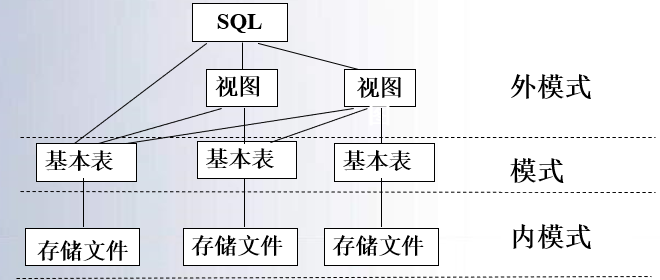

### 壹  SQL 的系统结构

#### 述：
#####
#####

###### · SQL 语言简介：
· 结构化查询语言 SQL（Structured Query Language）是一种介于关系代数和关系演算之间的语言，是一个通用的、功能极强的关系数据库语言，是关系数据库的标准语言
· SQL 语言的版本包括：SQL-89，SQL-92，SQL-99（SQL3）增加了面向对象的概念，SQL2003（SQL4）
· SQL 语言集数据查询、数据操纵、数据定义和数据控制功能于一体，充分体现了关系数据语言的特点和优点

###### · SQL 的特点：
1. *综合统一*：集数据定义语言 DDL、数据操纵语言 DML、数据控制语言 DCL 的功能于一体，可以完成数据库生命周期中的全部活动；关系模型中实体和实体间的联系都用关系来表示，使得操作符单一，每种操作只使用一个操作符
2. *高度非过程化*：使用 SQL 语言，只需要提出“做什么”，而无需指明“怎么做”，无需了解存取路径，提高了数据的独立性
3. *面向集合的操作方式*：SQL 语言采用集合操作方式，查询、插入、删除、修改操作的对象都是集合
4. *以同一种语法结构提供多种使用方式*：
	1. 作为独立的语言：提供联机交互工具，在终端键盘上直接键入 SQL 命令对数据库进行操作，由 DBMS 来进行解释
	2. 作为嵌入式语言：SQL 语句能嵌入到高级语言程序中，使应用程序充分利用 SQL 访问数据库的能力
	· 不同方式下，SQL 的语法结构基本上是一致的，提供了极大的灵活性和方便性

###### · SQL 的系统结构：
· SQL 语言支持数据库的三级模式结构：
1. 在 SQL 中，关系模式称为基本表（Base Table），基本表的集合形成数据库模式，对应三级结构中的模式
2. 基本表在物理上与存储文件相对应，所有存储文件的集合为物理数据库
3. 外模式由视图（View）组成（也包含了部分基本表）

                        （图一：SQL 语言支持数据库的三级模式结构）


### 贰  数据定义

#### 述：
#####
#####

###### 0. SQL 的数据定义：
· SQL 的数据定义功能主要包括定义表、定义视图和定义索引，SQL2 中还增加了对 SQL 数据库模式的定义

                            （图二：SQL 的数据定义语句）

###### 1. 模式的定义和删除：
· 在 SQL 中，一个 SQL 模式（SQL Schema）由*模式名*、*权限标识符*和*模式中元素的描述符*组成
1. 权限标识符指明拥有该模式的用户和账号
2. 模式元素包含一个数据库应用的表、视图和索引等
3. 属于同一应用的表、视图和索引等可以定义在同一模式中

· 在定义模式时可先给出模式名和权限标识符，以后再定义其中的元素，语法格式：
```SQL
CREATE SCHEMA <模式名> AUTHORIZATION <用户名>;
```
如果没有指定模式名，则隐含为 <用户名>

· 例 1：定义学生数据库模式 SST，用户为 SDBA
```SQL
CREATE SCHEMA SST AUTHORIZATION SDBA;
```
· 例 2：当不指定“模式名”时
```SQL
CREATE SCHEMA AUTHORIZATION WANG;
```
模式名隐含为用户“$WANG$”

· *关于模式*：
· Oracle 中：用户账号拥有的对象集称为用户的模式
· SQL Server 中：在 SQL Server2000 中，在某一个数据库中创建了用户 $Bosco$，后台默认地创建了 Schema【$Bosco$】；表的名称体现在数据库、用户和表明三方面的信息：$database\_name$，$owner$，$table\_name$；在 SQL Server2005 中，用 $Create\ User$ 创建数据库用户时，可以为该用户指定一个已经存在的 Schema 作为默认 Schema，如果不指定，则该用户所默认的 Schema 即为 dbo Schema，dbo Schema 好比一个大的公共房间

· *SQL Server2005 之后版本中的模式*：
· 在 SQL Server2005 中创建一个数据库的时候，会有一些 Schema 包括进去，被包括进去的 Schema 有：dbo、guest、sys、INFORMATION_SCHEMA，还有一些角色 Schema 等等
· 当 create table A 时，如果没有指定特定的 Schema，则 A 表创建在：
1. 如果当前操作数据库的用户有默认的 Schema（在创建用户的时候指定了），那么表 A 被创建在了默认的 Schema 上
2. 如果当前操作数据库的用户没有默认的 Schema（即在创建 User 的时候默认为空），创建在 dbo Schema 上
3. 如果在创建表 A 的时候指定了特定的 Schema 做前缀，则表 A 被创建在了指定的 Schema 上
· 例：现在如果登录的用户为 Sue，该用户有一个默认 Schema 也为 Sue，那么如果现在有一条查询语句为 Select * from mytable，那么搜寻每个房间（Schema）的顺序是怎样的呢？
1. 首先搜寻 sys.mytable（Sys Schema）
2. 然后搜寻 Sue.mytable（Default Schema）
3. 最后搜寻 dbo.mytable（Dbo Schema）
· 每个数据库在创建后，有 4 个 Schema 是必须的（删不掉），这四个 Schema 为：dbo、guest、sys、INFORMATION_SCHEMA

· 定义模式后，实际上定义了一个*命名空间*，可以进一步定义该模式包含的数据库对象，如表、视图和索引等；可以在创建模式的同时在模式定义中进一步创建基本表、视图、定义授权等
```SQL
CREATE SCHEMA <模式名> AUTHORIZATION <用户名> [<表定义子句> | <视图定义子句> | <授权定义子句>]
```

· 例：创建相互依赖的 FOREIGN KEY 约束
```SQL
CREATE SCHEMA AUTHORIZATION ross
	CREATE TABLE t1 (c1 INT PRIMARY KEY,
					c2 INT REFERENCES t2(c1))
	CREATE TABLE t2 (c1 INT PRIMARY KEY,
					c2 INT REFERENCES t1(c1))
```
（用其他方法完成需要执行多个步骤）

· 删除模式语句：
```SQL
DROP SCHEMA <模式名> [CASCADE|RESTRICT]
```
1. CASCADE（级联式）方式：标识在删除模式的同时把该模式中所有的数据库对象全部一起删除
2. RESTRICT（限制式）方式：表示如果该模式中已经定义了下述的数据库对象，则拒绝该删除语句的执行

###### 2. 表的定义、删除与修改：
1. 定义基本表：
```SQL
CREATE TABLE <表名>
	(<列名><数据类型>[<列级完整性约束>]
	[,<列名><数据类型>[<列级完整性约束条件>]]...
	[,<表级完整性约束条件>]);
```

```SQL
<表名>：索要定义的基本表的名字
<列名>：组成该表的各个属性（列）
<列级完整性约束条件>：涉及相应属性列的完整性约束条件
<表级完整性约束条件>：设计一个或多个属性列的完整性约束条件
```

· 例：建立学生表 Student，表中属性有：学号 Sno、姓名 Sname、年龄 Sage、性别 Ssex、学生所在系 Sdept
```SQL
CREATE TABLE Student
( Sno CHAR(6) NOT NULL UNIQUE,
  Sname CHAR(8),
  Sage INT,
  Ssex CHAR(2),
  Sdept CHAR(12),
  CONSTRAINT C1 CHECK (Ssex IN('男','女')),
  CONSTRAINT S_PK PRIMARY KEY(Sno));
```
CONSTRAINT 子句定义列级或表级约束，其格式为：
```SQL
CONSTRAINT <约束名> <约束>
```

· 在 SQL2 中增加了定义域的语句，可以用域名代替指定列的数据类型；如果有一个或多个表的属性的域是相同的，通过对域的修改可以很容易地改变属性的数据类型
· 域定义语句的格式为：
```SQL
CREATE DOMAIN <域名> <数据类型>
```
· 例：
```SQL
CREATE DOMAIN Sdept_TYPE CHAR(12);
```
域 Sdept_TYPE 创建后，定义学生表时，对列 Sdept 的类型定义可以用域名代替：Sdept Sdept_TYPE