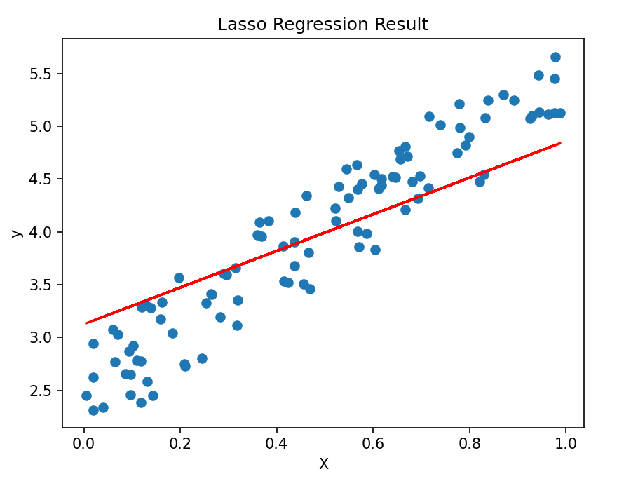

### 壹  前馈神经网络的结构

###### · 前馈神经网络分类：
1. 单隐层前馈神经网络：只包含一个隐层的多层前馈神经网络
	1. 单层感知机：
		1. 概述：最简单的前馈神经网络，由一个输入层和一个输出层组成
		2. 用途：适用于线性可分问题，如逻辑门电路
2. 多隐层前馈神经网络：包含多个隐层的多层前馈神经网络，可以更好地学习复杂的非线性模式
	1. 多层感知机（MLP）：
		1. 概述：由多个神经元组成的多层网络结构，包括输入层、隐藏层和输出层
		2. 用途：
			1. 分类问题：通过非线性激活函数，处理复杂的非线性分类问题
			2. 回归问题：通过调整输出层激活函数和损失函数，适用于连续输出问题
	2. 全连接神经网络（Fully Connected Neural Network，FCNN）：每个神经元都与上一层的所有神经元相连接
	3. 卷积神经网络（Convolutional Neural Network，CNN）：通过使用卷积层和池化层来对输入数据进行处理，以实现对数据中局部特征的提取
	4. 循环神经网络（Recurrent Neural Network，RNN）：在网络中存在反馈连接，使得网络可以处理具有时序关系的数据
	5. 深度信念网络（Deep Belief Network，DBN）：由多个受限玻尔兹曼机（Restricted Boltzmann Machine）堆叠而成的网络

· 前馈神经网络，一般分为单层和多层，单层顾名思义为**单层感知机**，而多层一般又分为**全连接神经网络**、**BP 神经网络**、**卷积神经网络**、**卷积神经网络**、**循环神经网络**、**深度信念网络**等
· 前馈神经网络还可划分出**线性神经网络**，诸如 **Madaline 神经网络**

###### · 多层感知机（MLP）：
· 多层感知机（Multilayer Perceptron，MLP）是一种前馈神经网络模型，由一个或多个隐藏层和输出层构成
· 每个层由多个神经元（或称为节点）组成，并将前一层的输出作为输入传递给后一层
· 其中网络中的信息是朝一个方向传播，没有反馈，即一个有向无环图

· 一个多层前馈神经网络的结构示例图：

                        （图一：一个多层前馈神经网络的结构示意图）

1. 输入层（Input Layer）：第 0 层即为输入层，即信息进入层，负责接收原始输入数据，每个输入节点对应输入数据的一个特征（如果是要做图像分类，每个输入节点可能对应图像的一个像素）
2. 隐藏层（Hidden Layers）：位于输入层和输出层之间，每个隐藏层由多个神经元（节点）组成，每个神经元与上一层和下一层的所有神经元相连接，隐藏层的数量和每个隐藏层中神经元的数量是神经网络结构的关键超参数，它们的选择通常基于具体的问题和数据
3. 输出层（Output Layer）：网络的最后一层，负责产生网络的输出，输出层的神经元数量通常取决于问题的性质（比如对于二分类问题，可以使用一个神经元，表示两个类别中的一个；对于多分类问题，输出层的神经元数量等于类别的数量）

· 前馈神经网络中，信息从输入层流向输出层，每个神经元接收上一层的输出，并将它们加权求和，再通过激活函数得到最终的输出，这个过程称为**前向传播**
· 其中网络的训练通常使用**反向传播算法**，通过计算预测值与真实值之间的误差，并利用这个误差来更新网络的权重，以使网络逐渐优化预测能力
· MLP 模型的关键问题在于如何训练其中各层间的连接权值，最熟知的就是**反向传播 BP 算法**

###### · 前馈神经网络的优缺点：
1. 优点：
	· 易于理解和实现：FNN 的结构相对简单，易于理解和实现，他的层次结构和信息单向传播的特性使得它在许多问题上具有直观性
	· 适用于各种问题：FNN 在处理任何类型的任务上表现良好，包括分类、回归等，它可以应用于不同领域，如图像处理、自然语言处理、金融预测等
	· 并行化处理：FNN 中各个神经元之间没有直接的连接，这使得它们的计算可以高度并行化，这在某些硬件（如 GPU ）上实现加速计算时非常有力
	· 非线性建模能力：由于引入激活函数，FNN 具有良好的非线性建模能力，可以处理复杂的非线性关系

2. 缺点：
	· 过拟合：当网络变得较大或数据较少时，FNN 容易过拟合，即在训练数据上表现良好，但在未见过的数据上表现较差（这通常需要通过正则化、dropout 等方法来缓解）
	· 局部极小值：在训练过程中，FNN 优化算法可能陷入局部最小值，而无法达到全局最优解，这可能会影响模型的性能和收敛速度
	· 需要大量数据和计算资源：对于大型 FNN，需要大量的数据来训练，并且计算过程需要大量的计算资源和时间，这在一些资源受限的条件下可能成为一项挑战
	· 特征工程依赖：FNN 对特征的表达高度依赖于数据的特征工程，在某些情况下，需要对输入数据进行适当的预处理和特征提取，以提高模型的性能


### 贰  前馈神经网络的运行

###### · 前馈神经网络的算法流程：
1. 准备数据集：准备用于训练神经网络的数据集
	· 数据集通常包括输入数据（如图像、文本等）和相应的输出数据（如类别标签、目标值等）
2. 构建神经网络：根据问题需求，确定神经网络的结构和参数
	· 通常情况下，神经网络由输入层、隐藏层和输出层组成
	· 在构建神经网络时，需要确定每个层的神经元数量、激活函数等参数
3. 初始化权重和偏置：对权重和偏置进行初始化
	· 通常采用随机初始化方法，以减少训练过程中的梯度消失现象
4. 定义损失函数：损失函数衡量神经网络预测值与实际值之间的差距
	· 常见的损失函数：
		· 均方误差（Mean Squared Error，MSE）
		· 交叉熵损失（Cross Entropy Loss）
		…………
5. 定义优化器：优化器负责在每次迭代中更新权重和偏置，以减小损失函数
	· 常见的优化器：
		· 随机梯度下降（SGD）
		· Adam
		· Adagrad
		· …………
6. 训练神经网络：将数据集划分为训练集和验证集，然后在每个批次中对神经网络进行训练
	1. 在每个批次中，将输入数据传入输入层，通过隐藏层传递到输出层，计算预测值
	2. 之后计算损失函数并使用优化器更新权重和偏置
	3. 重复这个过程，直到训练达到预定的迭代次数或损失函数收敛
7. 评估模型：定期评估模型在验证集上的表现，以监控模型是否过拟合
	· 常见的评估指标：准确率、精确率、召回率等
8. 应用模型：训练完成后，将神经网络应用于实际问题，对输入数据进行预测，得到输出结果

###### · 优化改进方法：

· **1. 激活函数的选择**：
· 激活函数是神经网络中的一个关键组件，通过引入非线性特性，使得神经网络能够学习和表示复杂的非线性关系
· 在选择激活函数时，需要考虑不同的因素，包括梯度消失、计算复杂度、收敛速度等

· **2. 正则化技术**：
· 正则化技术是一种用于*防止机器学习模型过拟合*的技术，其目的是使模型更泛化，适用于未见过的数据
· 在深度学习中，正则化技术通常包括 *L1 正则化*、*L2 正则化*、以及 *Dropout*

1. <font color="#ffc000">L1 正则化</font>：
· L1 正则化通过在损失函数中添加权重参数的绝对值之和，强制模型的权重趋向于稀疏
· 这意味着一些权重会趋向于零，从而减少对应特征的影响，使模型更加简单
· L1 正则化有助于特征选择，可以减少模型的复杂性，提高泛化性能

· L1 正则化的表达式是使用权重向量的 L1 范数作为惩罚项：
$$L1\ 正则化项=\lambda\cdot \Sigma^p_{j=1}|\theta_j|$$
其中，$\lambda$ 是正则化参数，控制正则化的强度；$p$ 是特征的数量；$\theta_j$ 是模型的权重参数
通过添加 L1 正则化项，损失函数变为：
$$J(\theta)=原始损失函数+\lambda\cdot\Sigma^p_{j=1}|\theta_j|$$
· L1 正则化的效果是使权重参数 $\theta_j$ 趋向于零，因为较大的权重会导致正则化项的惩罚较大
这有助于模型的稀疏性，即使只有少数的特征权重是非零的，从而可以实现特征选择的效果

· 在线性回归中，通过最小化带有 L1 正则化项的损失函数，可以得到一种称为 Lasso 回归的模型
· Lasso 回归对于具有大量特征的数据集可以实现特征选择，因为它倾向于使部分特征的系数变为零，从而消除了对应的特征

· 一个简单的 L1 正则化 Python 实例：
```Python
import numpy as np  
import matplotlib.pyplot as plt  
from sklearn.linear_model import Lasso  
  
# 创建一个简单的数据集  
np.random.seed(0)  
X = np.random.rand(100, 1)  
y = 2 + 3 * X + np.random.rand(100, 1)  
  
# 创建一个Lasso对象  
lasso = Lasso(alpha=0.1)  
  
# 训练模型  
lasso.fit(X, y)  
  
# 查看模型拟合的结果  
print("Lasso系数:", lasso.coef_)  
print("Lasso截距:", lasso.intercept_)  
  
# 绘制结果  
plt.scatter(X, y)  
plt.plot(X, lasso.predict(X), color='red')  
plt.xlabel('X')  
plt.ylabel('y')  
plt.title('Lasso Regression Result')  
plt.show()

# 输出：
# Lasso系数: [1.73343956]
# Lasso截距: [3.12690373]
```

                        （图二：L1 正则化后 Lasso 回归结果示例）

2. <font color="#ffc000">L2 正则化</font>：
· L2 正则化通过在损失函数中添加权重参数的平方和，惩罚较大的权重，使其趋向于较小的值
· 这有助于防止模型对训练数据的噪声过于敏感
· L2 正则化有助于平滑模型的权重，防止过拟合，提高模型的泛化性能
· L2 正则化也称为岭回归

· L2 正则化的表达式是使用权重向量的 L2 范数作为惩罚项：
$$L2\ 正则化项=\lambda\cdot\Sigma^p_{j=1}\theta_j^2$$
其中，$\lambda$ 是正则化参数，控制正则化的强度；$p$ 是特征的数量；$\theta_j$ 是模型的权重参数
通过添加 L2 正则化项，损失函数变为：
$$J(\theta)=原始损失函数+\lambda\cdot\Sigma^p_{j=1}\theta_j^2$$· L2 正则化的效果是使权重参数 $\theta_j$​ 趋向于较小的值，因为较大的权重会导致正则化项的惩罚较大
· 这有助于防止模型过度拟合训练数据，并提高模型的泛化能力
· 概括而言，L2 正则化有助于解决模型过拟合的问题，同时保持模型的拟合能力

· 一个简单的 L2 正则化 Python 实例：
```Python
import numpy as np  
import matplotlib.pyplot as plt  
from sklearn.linear_model import LinearRegression  
from sklearn.preprocessing import PolynomialFeatures  
from sklearn.metrics import mean_squared_error  
  
# 生成数据集  
np.random.seed(0)  
X = np.random.rand(100, 1)  
y = 5 + 10 * X + np.random.rand(100, 1)  
  
# 添加多项式特征  
poly = PolynomialFeatures(degree=2, interaction_only=False)  
X_poly = poly.fit_transform(X)  
  
# 训练线性回归模型  
model = LinearRegression()  
model.fit(X_poly, y)  
  
# 预测  
y_pred = model.predict(X_poly)  
  
# 计算MSE  
mse = mean_squared_error(y, y_pred)  
print("MSE:", mse)  
  
# 绘制结果  
plt.scatter(X, y)  
plt.plot(X, y_pred, color='red')  
plt.title('L2 Regression Result')  
plt.show()

# 输出：
# MSE: 0.07419335674514312
#【MSE 表示均方误差（Mean Squared Error，MSE）】
```

                           （图三：L2 正则化后回归结果示例）

3. <font color="#ffc000">Dropout</font>：
· Dropout 是一种在训练过程中随机将神经网络中的一些神经元置零（一般概率为 0.5）的技术
· 这样可以阻止神经元过于依赖特定的相邻神经元，强制网络学习更鲁棒的特征
· Dropout 在一定程度上模拟了集成学习的效果，减少了模型对特定样本的依赖，防止过拟合

· Dropout 是一种在神经网络中随机丢弃神经元的正则化技术，其表达式如下：
$$r_i\sim Bernoulli(p)$$$$\hat{y_i}=r_i\cdot y_i$$
其中，$𝑟_𝑖$​ 是一个服从 Bernoulli 分布的随机变量，取值为 1 或 0，表示是否保留神经元的输出；$y_i$​ 是原始的神经元输出，$\hat{y_i}$ 是经过 Dropout 处理后的输出
· 在测试阶段，为了保持模型的期望行为，通常需要对 Dropout 进行缩放，即将每个神经元的输出乘以系数 $(1-p)$：$$\hat{y_i}=(1-p)\cdot y_i$$

· Dropout 在神经网络中的工作原理：
	· 在训练过程中，随机丢弃一部分神经元的输出，以减少神经元之间的依赖关系，增强模型的泛化能力
	· 在测试时，通过对 Dropout 进行缩放，保持了模型的期望行为

· 一个简单的 Dropout 正则化 Python 实例：
```Python
import numpy as np  
import matplotlib.pyplot as plt  
import tensorflow as tf  
  
# 生成一些样本数据  
np.random.seed(42)  
n_samples = 100  
X = np.linspace(-3, 3, n_samples)  
y = 0.35 * X + np.random.normal(scale=0.5, size=n_samples)  
  
# 构建神经网络模型  
model = tf.keras.models.Sequential([  
    tf.keras.layers.Dense(16, activation='relu', input_shape=(1,)),  
    tf.keras.layers.Dropout(0.5),  
    tf.keras.layers.Dense(1)  
])  
  
# 编译和拟合模型  
model.compile(optimizer='adam', loss='mean_squared_error')  
model.fit(X, y, epochs=50, batch_size=16, verbose=0)  
  
# 绘制原始数据和拟合曲线  
plt.scatter(X, y, color='g')  
plt.plot(X, model.predict(X), color='r', linewidth=1)  
plt.xlabel('X')  
plt.ylabel('y')  
plt.legend()  
plt.title('Dropout Regularization')  
plt.show()
```

                            （图四：Dropout 规范化的示例）

· 正则化技术的选择通常依赖于具体的问题和数据
· 有时结合使用不同的正则化技术可以取得更好的效果
· 在使用正则化时，需要小心调整正则化参数，以避免过度正则化或欠拟合的问题
· 通常，正则化技术是深度学习模型中提高性能和泛化能力的重要手段之一

· **3. 优化算法**：
· 优化算法用于最小化或最大化损失函数，以调整模型参数以提高模型的性能

1. 梯度下降法（Gradient Descent）：
· 梯度下降是一种基于负梯度方向的迭代优化算法，通过反复迭代减小损失函数，使模型参数逐步接近最优值

                                （图五：梯度下降示意图）
· 常用梯度下降算法变体：
	· 批量梯度下降（Batch Gradient Descent）
	· 随机梯度下降（Stochastic Gradient Descent）
	· 小批量梯度下降（Mini-batch Gradient Descent）

· 一个简单的梯度下降算法来训练逻辑回归模型的示例：
```Python
import numpy as np  
  
  
def sigmoid(x):  
    return 1 / (1 + np.exp(-x))  
  
  
def sigmoid_derivative(x):  
    return x * (1 - x)  
  
  
def train(X, y, learning_rate, epochs):  
    m = len(y)  
    theta = np.zeros(X.shape[1])  
    for epoch in range(epochs):  
        for i in range(m):  
            z = np.dot(X[i], theta)  
            y_pred = sigmoid(z)  
            error = y[i] - y_pred  
            gradient = X[i] * error * sigmoid_derivative(y_pred)  
            theta = theta + learning_rate * gradient  
    return theta  
  
  
# 示例数据  
X = np.array([[1, 2, 3], [4, 5, 6], [7, 8, 9]])  
y = np.array([0, 1, 0])  
  
# 训练模型  
theta = train(X, y, learning_rate=0.1, epochs=1000)  
  
# 预测  
z = np.dot(X[0], theta)  
y_pred = sigmoid(z)  
print(y_pred)  
  
# 输出：
# Result:0.2787269718980957
```

2. 随机梯度下降（SGD）：
· 随机梯度下降是梯度下降的变体，每次迭代只使用一个样本来更新参数
· 这样做可以加速训练过程，但也引入了更多的随机性
· Mini-batch SGD 是介于批量梯度下降和随机梯度下降之间，它使用一小批量样本来更新参数

3. 动量法（Momentum）：
· 动量法通过引入动量项来加速收敛，减缓在垂直方向上的更新，从而在参数空间中更快地走过平坦的区域
· 动量有助于克服梯度下降中的震荡问题，提高收敛速度

· **4. 网络结构的改进**：
· 前馈神经网络（Feedforward Neural Networks，FNN）是一种基本的神经网络结构，实践中人们不断尝试改进网络结构以提高性能、减少过拟合等，提出了一些前馈神经网络结构的改进方法，比如：*深度神经网络*、*卷积神经网络*、*循环神经网络*、*残差网络*、*自注意力机制*、*稀疏注意力* 等


### 叁  反向传播算法

###### · 反向传播算法：
· 反向传播算法由 Hinton（辛顿） 于 1986 年在 Nature 的论文中提出
· 反向传播算法，核心思想是**将输出误差以某种形式通过隐藏层向输入层逐层反转**，其在不同领域中的作用十分显著：
1. 在机器学习中的核心作用：
	1. 优化神经网络的权重
	2. 提高模型的准确性和效率
	3. 解决复杂的非线性问题
2. 对深度学习的推动：
	1. 实现深层神经网络的训练
	2. 加速模型收敛速度
	3. 改善网络的泛化能力
	4. 打破传统模型的性能瓶颈
3. 未来发展方向：
	1. 多模态学习
	2. 强化学习的结合
	3. 对抗式学习的应用
	4. 面向大规模数据的优化
	5. 模型的可解释性和鲁棒性

· **关于反向传播算法**：
1. 用于更新神经网络中的参数，使得网络能够更好地拟合输入数据
2. 反向传播算法步骤：
	1. 初始化权重和偏差：
		· 通过随机初始化的方式，给神经网络的权重赋初值，并设定偏差
	2. 向前传播：
		· 通过输入层将数据传播到输出层，计算得出输出结果
	3. 计算误差：
		· 通过比较网络输出结果和实际结果，计算误差值
3. 核心思想：<font color="#ffff00">通过梯度下降不断调整参数，使得误差变小</font>
4. 反向传播算法计算损失函数对模型参数的梯度，并使用梯度下降的方法更新模型参数
5. 反向传播算法通常作为训练神经网络的一部分，并且是深度学习模型优化的关键步骤之一
6. 在深度学习中，反向传播算法用于调整模型中的权重和偏差，使模型能够更好地拟合训练数据

· 一个只实现前向传播和反向传播部分的 Python 实例：
```Python
# 只实现前向传播和反向传播部分  
import numpy as np  
import matplotlib.pyplot as plt  
  
  
# 定义sigmoid激活函数及其导数。sigmoid函数用于计算输入值的概率，导数用于计算梯度  
def sigmoid(x):  
    return 1 / (1 + np.exp(-x))  
  
  
def sigmoid_derivative(x):  
    return x * (1 - x)  
  
  
# 输入数据  
inputs = np.array([[0, 0],  
                   [0, 1],  
                   [1, 0],  
                   [1, 1]])  
  
# 目标输出  
target_output = np.array([[0], [1], [1], [0]])  
  
# 初始化权重和偏置  
input_size = 2  
hidden_size = 2  
output_size = 1  
  
weights_input_hidden = np.random.uniform(size=(input_size, hidden_size))  
weights_hidden_output = np.random.uniform(size=(hidden_size, output_size))  
  
bias_hidden = np.zeros((1, hidden_size))  
bias_output = np.zeros((1, output_size))  
  
# 设置超参数，学习率为0.1，迭代次数为10000  
learning_rate = 0.1  
epochs = 10000  
  
# 初始化损失记录列表  
losses = []  
  
# 训练模型  
for epoch in range(epochs):  
    # 前向传播（计算隐藏层的输入和输出，然后计算输出层的输出）  
    hidden_input = np.dot(inputs, weights_input_hidden) + bias_hidden  
    hidden_output = sigmoid(hidden_input)  
  
    final_input = np.dot(hidden_output, weights_hidden_output) + bias_output  
    final_output = sigmoid(final_input)  
  
    # 计算损失（计算输出层输出的误差，然后计算隐藏层输出的误差）  
    loss = 0.5 * np.sum((final_output - target_output) ** 2)  
  
    # 反向传播（根据误差计算输出层和隐藏层的权重和偏置的更新值）  
    error = target_output - final_output  
    d_final_output = error * sigmoid_derivative(final_output)  
  
    error_hidden = d_final_output.dot(weights_hidden_output.T)  
    d_hidden_output = error_hidden * sigmoid_derivative(hidden_output)  
  
    # 更新权重和偏置  
    weights_hidden_output += hidden_output.T.dot(d_final_output) * learning_rate  
    weights_input_hidden += inputs.T.dot(d_hidden_output) * learning_rate  
  
    bias_output += np.sum(d_final_output, axis=0, keepdims=True) * learning_rate  
    bias_hidden += np.sum(d_hidden_output, axis=0, keepdims=True) * learning_rate  
  
    if epoch % 1000 == 0:  
        print(f'Epoch: {epoch}, Loss: {loss}')  
  
    # 记录损失值  
    losses.append(loss)  
  
    if epoch % 1000 == 0:  
        print(f'Epoch: {epoch}, Loss: {loss}')  
  
# 测试模型（使用测试输入数据计算隐藏层和输出层的输出）  
test_input = np.array([[0, 0], [0, 1], [1, 0], [1, 1]])  
hidden_layer_activation = sigmoid(np.dot(test_input, weights_input_hidden) + bias_hidden)  
final_output_test = sigmoid(np.dot(hidden_layer_activation, weights_hidden_output) + bias_output)  
  
print("\nFinal Output:")  
print(final_output_test)  
# 绘制损失变化图  
plt.plot(range(epochs), losses)  
plt.xlabel('Epochs')  
plt.ylabel('Loss')  
plt.title('Training Loss over Epochs')  
plt.show()

# 输出：
# [[0.05798168]
# [0.94658917]
# [0.94667239]
# [0.05752562]]
```
九次迭代结果：
~~~
Epoch: 0, Loss: 0.5661764965435157
Epoch: 0, Loss: 0.5661764965435157
Epoch: 1000, Loss: 0.4977774784559189
Epoch: 1000, Loss: 0.4977774784559189
Epoch: 2000, Loss: 0.47977624152003084
Epoch: 2000, Loss: 0.47977624152003084
Epoch: 3000, Loss: 0.3943116981003515
Epoch: 3000, Loss: 0.3943116981003515
Epoch: 4000, Loss: 0.2487839841879172
Epoch: 4000, Loss: 0.2487839841879172
Epoch: 5000, Loss: 0.06302501186005144
Epoch: 5000, Loss: 0.06302501186005144
Epoch: 6000, Loss: 0.025550760700559023
Epoch: 6000, Loss: 0.025550760700559023
Epoch: 7000, Loss: 0.014921315146309136
Epoch: 7000, Loss: 0.014921315146309136
Epoch: 8000, Loss: 0.01028251073235836
Epoch: 8000, Loss: 0.01028251073235836
Epoch: 9000, Loss: 0.007754105298179967
Epoch: 9000, Loss: 0.007754105298179967
~~~

                       （图六：反向传播算法，各个时期的训练损失示例）

· 反向传播算法的结构

                           （图七：反向传播算法的结构示意图）

###### · 基于反向传播算法的简单前馈神经网络的实现示例：
```Python
import torch  
import torch.nn as nn  
import torch.optim as optim  
import matplotlib.pyplot as plt  
from torchsummary import summary  
from graphviz import Digraph  
from torchviz import make_dot  
  
  
# 定义神经网络结构  
class SimpleNN(nn.Module):  
    def __init__(self, input_size, hidden_size, output_size):  
        super(SimpleNN, self).__init__()  
        self.fc1 = nn.Linear(input_size, hidden_size)  
        self.relu = nn.ReLU()  
        self.fc2 = nn.Linear(hidden_size, output_size)  
  
    def forward(self, x):  
        x = self.fc1(x)  
        x = self.relu(x)  
        x = self.fc2(x)  
        return x  
  
  
# 数据准备  
# 假设有一些输入数据X和对应的标签y  
# 这里的数据仅作示例，实际情况中你需要准备自己的数据  
X = torch.randn(100, 10)  # 100个样本，每个样本有10个特征  
y = torch.randint(0, 2, (100,))  # 二分类问题，标签为0或1  
  
# 神经网络参数  
input_size = 10  
hidden_size = 5  
output_size = 1  
  
# 初始化神经网络、损失函数和优化器  
model = SimpleNN(input_size, hidden_size, output_size)  
criterion = nn.BCEWithLogitsLoss()  
optimizer = optim.SGD(model.parameters(), lr=0.01)  
  
# 训练过程  
epochs = 1000  
losses = []  
  
for epoch in range(epochs):  
    # 前向传播  
    outputs = model(X)  
    loss = criterion(outputs.squeeze(), y.float())  
  
    # 反向传播  
    optimizer.zero_grad()  
    loss.backward()  
    optimizer.step()  
  
    # 记录损失值  
    losses.append(loss.item())  
  
    if epoch % 100 == 0:  
        print(f'Epoch: {epoch}, Loss: {loss.item()}')  
  
# 绘制损失变化图  
plt.plot(range(epochs), losses)  
plt.xlabel('Epochs')  
plt.ylabel('Loss')  
plt.title('Training Loss over Epochs')  
plt.show()  
  
# 初始化神经网络、损失函数和优化器  
model = SimpleNN(input_size, hidden_size, output_size)  
  
# 打印神经网络结构摘要  
summary(model, (input_size,))  
  
  
# 可视化神经网络结构  
def make_dot_graph(model, inputs):  
    # 使用torchviz的make_dot函数创建图  
    y = model(inputs)  
    return make_dot(y, params=dict(model.named_parameters()))  
  
  
# 输入数据维度  
input_tensor = torch.randn(1, input_size)  
  
# 创建图  
graph = make_dot_graph(model, input_tensor)  
  
# 保存图像  
graph.render("network_structure_graphviz", format="png", cleanup=True)  
  
# 显示图像  
graph.view("network_structure_graphviz")
```
迭代结果：
~~~
Epoch: 0, Loss: 0.7066084146499634
Epoch: 100, Loss: 0.6942797303199768
Epoch: 200, Loss: 0.6867159008979797
Epoch: 300, Loss: 0.6809811592102051
Epoch: 400, Loss: 0.6763904094696045
Epoch: 500, Loss: 0.672098696231842
Epoch: 600, Loss: 0.6677910685539246
Epoch: 700, Loss: 0.6632314324378967
Epoch: 800, Loss: 0.6584467887878418
Epoch: 900, Loss: 0.6534824967384338
~~~
模型摘要信息：
~~~
----------------------------------------------------------------
        Layer (type)               Output Shape         Param #
================================================================
            Linear-1                    [-1, 5]              55
              ReLU-2                    [-1, 5]               0
            Linear-3                    [-1, 1]               6
================================================================
Total params: 61
Trainable params: 61
Non-trainable params: 0
----------------------------------------------------------------
Input size (MB): 0.00
Forward/backward pass size (MB): 0.00
Params size (MB): 0.00
Estimated Total Size (MB): 0.00
----------------------------------------------------------------
~~~

           （图八：基于反向传播算法的简单前馈神经网络的实现，各个时期的训练损失示例）

· **神经网络模型的摘要怎么看？**
1. *Layer (type)*：表示模型的层类型，例如 `Linear` 表示全连接层，`ReLU` 表示激活函数层
2. *Output Shape*：表示每一层输出的形状，通常使用 `[-1, x]` 表示批量大小未知，输出维度为 x
3. *Param #*：表示每一层的参数数量
4. *Total params*：表示整个模型的总参数数量
5. *Trainable params*：表示可训练的参数数量，即需要在训练过程中更新的参数数量
6. *Non-trainable params*：表示不可训练的参数数量，通常是指在模型中固定的参数，例如 Batch Normalization 层中的均值和方差
7. *Input size (MB)*：表示模型的输入大小，以 MB 为单位
8. *Forward / backward pass size (MB)*：表示前向传播和反向传播过程中的内存消耗，以 MB 为单位
9. *Params size (MB)*：表示模型的参数大小，以 MB 为单位
10. *Estimated Total Size (MB)*：表示整个模型的估计内存消耗，以 MB 为单位


~~~
内容整理自：
1. 宁毅-“机器学习与基础教学”（微信公众号）：《神经网络(2)|前馈神经网络》. 2023.11.26
~~~