### 壹  卷积

###### · 卷积神经网络（Convolutional Neural Network，CNN）：
· 卷积神经网络用于处理具有类似网格结构数据的深度学习模型，常处理诸如图像、语音信号等
· 有 Yann LeCun 等人于上世纪 90 年代首次提出，采用局部连接和权值共享方式，减少权值的数量使得网络易于优化；降低模型复杂度，减小过拟合风险；尤其是处理图像上
· CNN 从最初的 2012 年 AlexNet 到 2014 年 VGG 到 2015 年 ResNet，在计算机视觉、语音识别、自然语言处理等领域取得了显著的成果

###### · 卷积：
· 卷积是通过两个函数生成第三个函数的一种数学算子，表征函数 $f$ 与 $g$ 经过反转和平移的重叠部分函数数值乘积对重叠长度的积分；对图像进行特提取，通常使用一维或二维卷积
· 卷积神经网络的提出：图像具有不可变特征：平移不变性、旋转不变性、缩放不变性、明暗不变性，全连接层不能很好地提取特征，因此受生物学上“感受野”的启发提出了卷积神经网络
· 卷积的符号用 “$\ast$” 表示：$f\ast g$

###### · 一维卷积：
· 一维卷积中，核沿一维滑动，一般情况下滤波器长度远小于信号序列长度，卷积相当于信号序列的简单移动平均
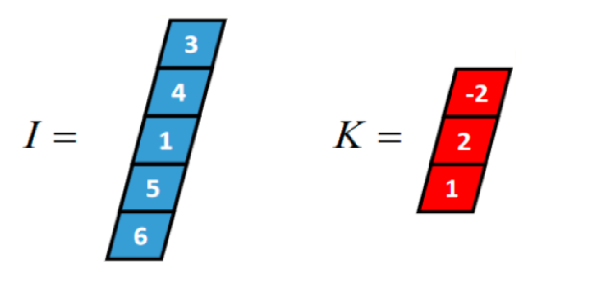
              （图一：一个长度为 5 的一维张量 I 和长度为 3 的一维张量 K（卷积核））

1. 一维 full 卷积：
· K 沿着 I 顺序移动，每移动到一个固定位置，对应位置的值相乘再求和
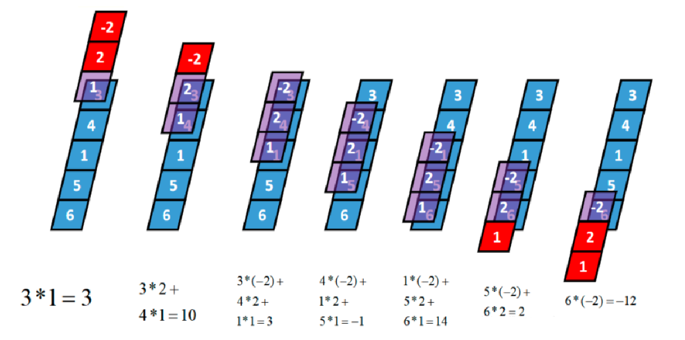
                         （图二：一维 full 卷积 K 沿着 I 的移动）

· 得到两个张量的一维 full 卷积：$C_{full}=I\ast K=[3,10,3,-1,14,2,-12]$

2. 一维 same 卷积：
· 卷积核 K 都有一个锚点，将锚点顺序移动到张量 I 的每一个位置处，对应位置相乘再求和
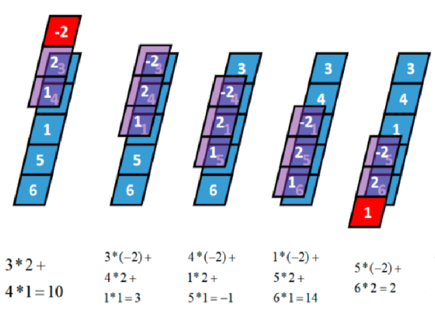
                        （图三：一维 same 卷积 K 沿着 I 的移动）
（在上面这个例子中，K 的锚点选在了 $[-2,2,1]$ 的中间 “$2$” 的位置）

· 得到两个张量的一维 same 卷积：$C_{same}=I\ast K=[10,3,-1,14,2]$

3. 一维 valid 卷积：
· valid 卷积只考虑 I 能完全覆盖 K 的情况，即 K 在 I 的内部移动的情况
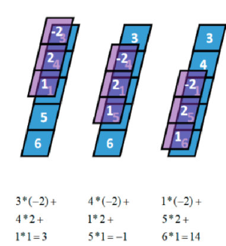
                           （图四：一维 valid 卷积 K 沿着 I 的移动）

· 得到两个张量的一维 valid 卷积：$C_{valid}=I\ast K=[3,-1,14]$

4. 具备深度的一维卷积：
· x 是一个长度为 l，深度为 d 的张量，其 same 卷积过程如下：卷积核 K 的锚点在张量 x 范围内依次移动，输入张量的深度和卷积核的深度是相等的
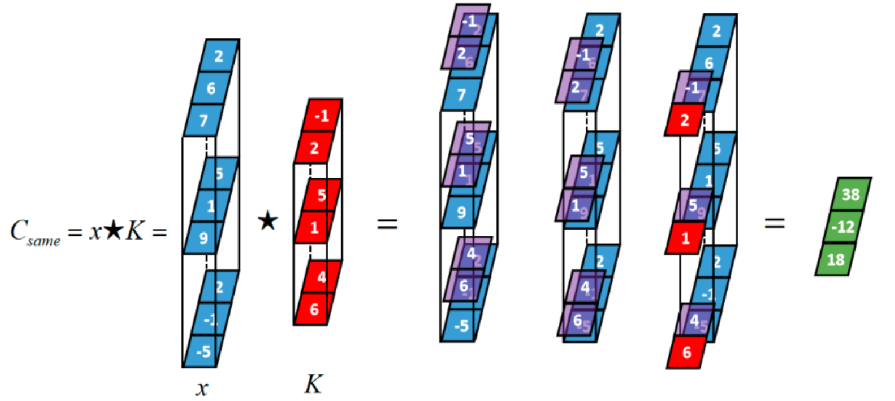
                    （图五：具有深度的一位 same 卷积 K 沿着 I 的移动）

· 得到两个张量的一维度 same 卷积：$C_{same,depth=3}=x\ast K=[38,-12,18]$

5. 具备深度的张量与多个卷积核的卷积：
· 同一个张量与多个卷积核的卷积本质上是该张量分别与每一个卷积核卷积，然后将每一个卷积结果在深度方向上连接起来
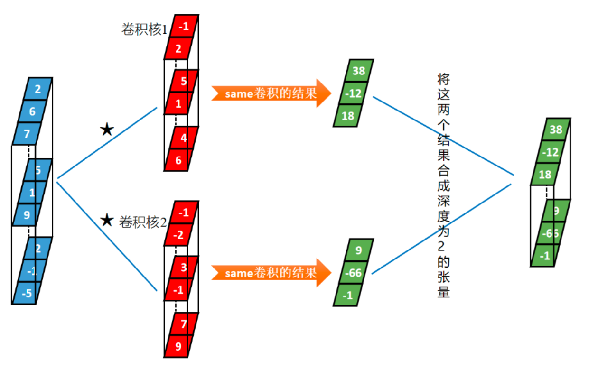
                        （图六：具有深度的张量与多个卷积和的卷积）

· 得到张量的“双核”卷积结果：一个深度为 2 的张量

· 离散卷积公式（有限长度）：
$$(f\ast g)[n]=\sum_{k=0}^{N-1}f[k]\ g[n-k]$$
在无限长度下，离散卷积公式变为：
$$(f\ast g)[n]=\sum_{k=-\infty}^{+\infty}f[k]\ g[n-k]$$

· 连续卷积公式：
$$(f\ast g)[n]=\int_{-\infty}^{+\infty}f(\tau)\ g(t-\tau)\ d\tau $$

###### · 二维卷积：
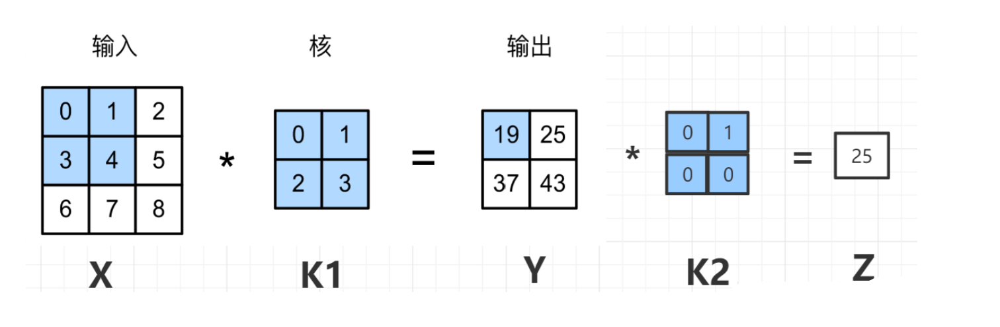
（图七：二维卷积的原理）

· 图像处理中均值滤波就是一种二维卷积，提取图像的特征常用到卷积操作，其得到结果称为特征映射

###### · 卷积核：
· 卷积核的主要作用是对输入数据进行特定的滤波操作，从而提取出有用的特征
· 例如在图像处理中，卷积核可以用来进行边缘检测、模糊处理、锐化等操作

· 常见二维卷积核：
1. 边缘检测（Sobel 算子）：
	1. 水平边缘检测核：$$\begin{bmatrix}-1&0&1\\ -2&0&2\\ -1&0&1\end{bmatrix}$$
	2. 垂直边缘检测核：$$\begin{bmatrix}-1&-2&-1\\ 0&0&0\\ 1&2&1\end{bmatrix}$$
2. 模糊（均值滤波器）：$$\begin{bmatrix}\frac{1}{9}&\frac{1}{9}&\frac{1}{9}\\ \frac{1}{9}&\frac{1}{9}&\frac{1}{9}\\ \frac{1}{9}&\frac{1}{9}&\frac{1}{9}\end{bmatrix}$$
3. 锐化：$$\begin{bmatrix}0&-1&0\\ -1&5&-1\\ 0&-1&0\end{bmatrix}$$

###### · 互相关：
· 离散的互相关公式：
$$r_{xy}(l)=\sum_{n=-\infty}^\infty x(n)\ y(n-l)$$

· 又称不翻转卷积，用于衡量两个序列相关性的函数
· 卷积是为了特征提取，当卷积核是可学习参数时，二者可以等价代替，因此深度学习中卷积皆是互相关操作

例：*雷达回波分析*：
1. 第一个子图表示雷达声纳发射了一个探测信号
2. 经过一段时间之后，收到了第二个子图所示的回波（带有一定的噪声）；此时我们关注的是如何确定回波中从何时开始是对探测信号的响应，以便计算目标距雷达的距离，这就需要用到线性互相关
3. 在第三个子图中的 “Valid” 曲线即是有效互相关数据，其中清晰地呈现出两处与探测信号相似的回波的位置
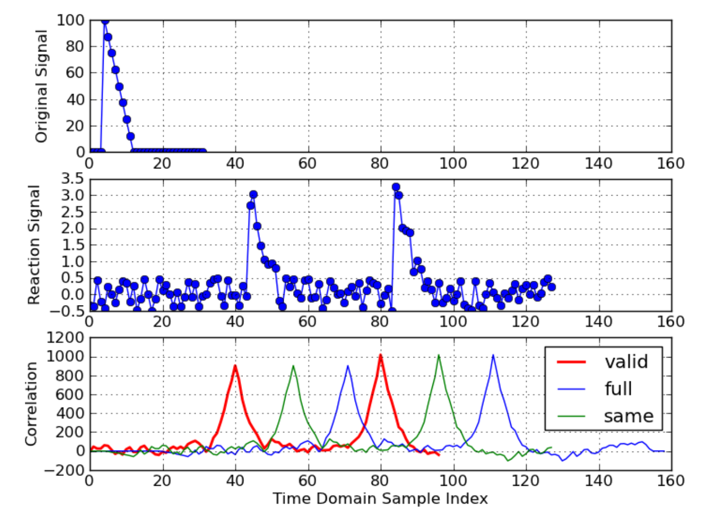
                              （图八：雷达回波分析示例图）


### 贰  卷积神经网络

###### · 卷积神经网络的结构：
· 卷积神经网络是一种前馈神经网络，它的人工神经元可以响应周围单元的局部区域，从而能够识别视觉空间的部分结构特征
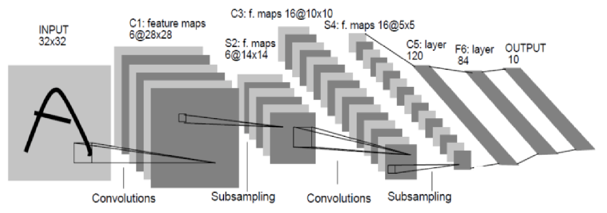
                        （图九：Lenet 5 卷积神经网络示意图—1 ）
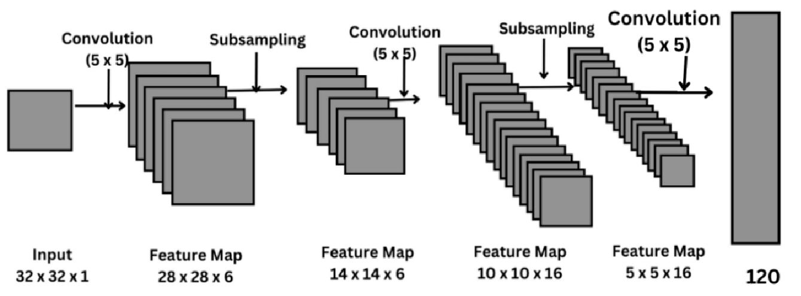
                        （图十：Lenet 5 卷积神经网络示意图—2 ）
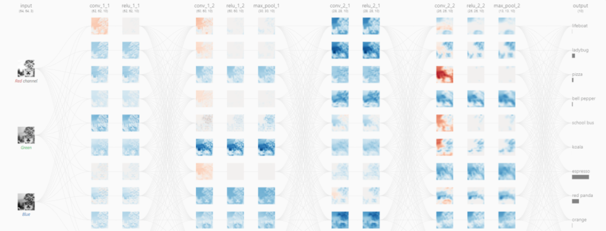
                        （图十一：卷积神经网络图像识别网络层 ）

· 卷积神经网络分为如下结构层：卷积层、池化层、全连接层、输出层
· 卷积神经网络结构：
1. 卷积层：对输入数据进行卷积操作，提取特征
2. 池化层：减少数据维度，保留关键信息，加快运算速度
3. 全连接层：将特征图展平成一维向量，进行分类或回归等任务
4. 输出层：根据任务需要，输出相应的结果
5. 损失函数：衡量模型输出与真实值之间的差异，用于优化模型参数
6. 优化器：根据损失函数计算梯度，更新模型参数达到优化目标

###### · 卷积层（Convolutional Layers）：
· 通过卷积操作检测图像的局部特征是计算中的核心
· 卷积层计算滤波器值和图像像素值之间的点积，通过在图像上滑动滤波器形成的矩阵称为卷积特征、激活图或特征图；卷积层的输出大小由几个因素决定，包括输入大小、内核大小、步幅和填充
· 卷积运算后，CNN 对特征图使用激活函数，将模型变为非线性
· 浅显而言，卷积层就是对输入数据进行卷积操作，提取特征：
1. 卷积操作：卷积核的作用与设计
2. 特征提取：边缘检测、文本提取、物体识别，归一化
3. 输入数据：数据预处理，不同类型的输入数据：图像、文本、语音，输入数据的尺寸
4. 应用：计算机视觉：图像分类、目标检测，自然语言处理：文本分类、情感分析，声音处理：语音识别、声音情感分析
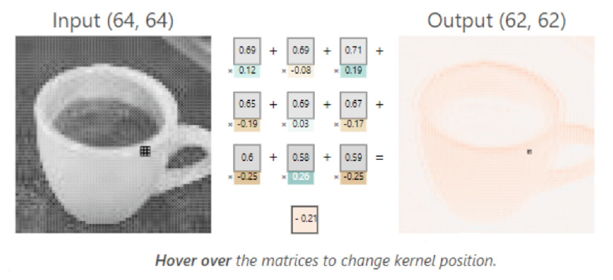
                              （图十二：卷积层操作举例）

###### · 池化层（Pooling Layers）：
· 减少特征维度，增加模型的鲁棒性
· 类似卷积层，池化操作涉及在输入上遍历过滤器，池化滤波器不具有权重
· 池化层的作用在于：减少数据维度，保留关键信息，加快运算速度
1. 减少数据维度：
	1. 提高计算效率
	2. 缩减数据量
	3. 减低模型复杂度
2. 保留关键信息：
	1. 最大池化（Max Pooling）
	2. 平均池化（Average Pooling）
	3. 特征图提取
3. 加快运算速度：
	1. 并行计算
	2. 减少计算量
	3. 提高模型的训练速度

· 最大池化：
1. 基本概念：
	1. 用于减少卷积神经网络（CNN）中的特征图尺寸
	2. 将每个特征图划分为不重叠的区域，选择每个区域中的最大值作为输出
2. 作用：
	1. 减少计算量和参数数量
	2. 增强模型对平移或旋转的不变性
3. 实际应用：
	1. 图像识别领域中广泛应用
	2. 用于文本分类中的特征提取与降维
4. 优点：减少过拟合风险，保留最显著的特征
5. 缺点：可能导致信息损失，参数的 stride（步长）大小要合理选择
6. 经典算法：LeNet，AlexNet，VGG
7. 风险：
	1. 过度采样可能导致信息缺失
	2. 参数的选择需谨慎，不宜过大或过小
8. 结论：最大池化是卷积神经网络中重要的尺寸缩减与特征提取方法，但要注意选择合适的参数和结合其他改进方法
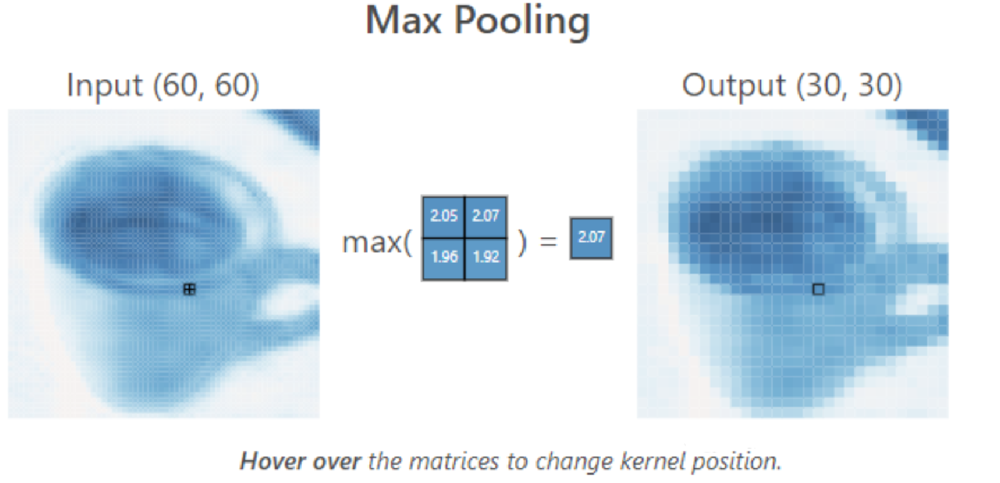
                            （图十三：最大池化操作的示例）

· 平均池化：
1. 定义：
	1. 一种用于卷积神经网络中的特征映射降维的操作
	2. 将特征映射划分为不重叠的区域，然后取每个区域的平均值作为输出
2. 优势：
	1. 缩小特征映射的尺寸，减少参数数量，降低计算成本
	2. 使模型对位置的变化更具有鲁棒性
3. 应用：
	1. 图像识别：在卷积层后的特征映射中应用平均池化，以提取图像的一般特征
	2. 自然语言处理：在文本分类任务中，将文本分类任务中，将文本转换成词嵌入的矩阵后应用平均池化，以获取整个句子的语义信息
4. 改进：
	1. 考虑局部关联性：在应用平均池化时，结合空间上相邻像素之间的关联性，以提高特征提取的效果
	2. 自适应平均池化：根据特征图的不同部分自适应地选择池化窗口大小，以更好捕捉特征细节信息

###### · 全连接层（Fully-Connected Layers）：
· 在处理空间特征后，全连接层用于进行分类或回归
· 全连接层将每个神经元连接到前一层和后续层中的每个神经元

· 全连接层：
1. 特征图展平成一维向量
	1. 转换特征图
		1. 提取特征
		2. 数据处理
	2. 展平步骤
		1. 压缩数据
		2. 准备输入
2. 进行分类或回归等任务
	1. 分类任务
		1. 多类别分类
		2. 二分类
	2. 回归任务
		1. 预测数值
		2. 连续数值预测
3. 应用领域：
	1. 计算机视觉
	2. 自然语言处理
	3. 医疗诊断

###### · 输出层（Output Layers）：
· 输出层就是根据任务需要，输出相应的结果
1. 任务需要：
	1. 明确任务目标
	2. 确定任务范围
	3. 分析任务要求
2. 结果输出：
	1. 输出目标设定
	2. 输出成果评估报告
	3. 输出改进建议
3. 注意事项：
	1. 确保输出符合任务要求
	2. 确保输出具有可操作性

###### · 损失函数：
· 损失函数本质上就是计算预测值和真实值的差距的一类型函数
· 常用损失函数：
1. L1 Loss 函数：
$$L_1(y,\hat{y})=\frac{1}{m}\sum_{i=1}^m\ \lvert\ y_{(i)}-\hat{y}_{(i)}\ \rvert$$
2. MES Loss 函数：
$$MES(y,\hat{y})=\frac{1}{m}\sum_{i=1}^m\ (y_{(i)}-\hat{y}_{(i)})^2$$
3. Cross Entropy Loss 函数（交叉熵损失函数）：
· 二分类交叉熵损失函数：
$$Cross\ Entropy\ (y,\hat{y})=-\frac{1}{m}\sum_{i=1}^m\ (y_{(i)}\ log(\hat{y}_{(i)})+(1-y_{(i)})\ log(1-\hat{y}_{(i)}))$$
· 多分类交叉熵损失函数：
$$Cross\ Entropy\ (y,\hat{y})=-\frac{1}{m}\sum_{i=1}^m\sum_{c=1}^C\ y_{(ic)}\ log(\hat{y}_{(ic)})$$其中 $m$ 是样本的总数量，$C$ 是类别的总数量

###### · 优化器：
· 优化器：
1. 优化器：根据损失函数计算梯度
	1. 损失函数：定义损失函数，计算损失
	2. 计算梯度：针对模型参数计算梯度，根据梯度更新模型参数（学习率的选择，参数更新的方式）
	3. 更新模型参数：模型参数的更新
2. 达到优化目标：
	1. 优化目标：确定优化目标，优化目标的衡量指标（精度、损失值）
	2. 训练过程：不断迭代优化过程，监控模型性能，调整优化器参数
	3. 优化结果：达到预期的优化目标，模型性能达到要求
3. 实际应用：
	1. 机器学习模型训练：深度学习模型优化
	2. 自动化参数调整
	3. 实时优化器选择


### 叁  示例实现

###### · 卷积神经网络线性回归 Python 示例：
· 使用神经网络来拟合一组给定的输入输出数据对，找到输入和输出之间的关系
· 通过训练神经网络，模型可以从输入数据预测输出值

· <font color="#ffc000">代码实现</font>：
```Python
# 导入必要的第三方库
import torch
import torch.nn as nn
import numpy as np
import time
import matplotlib.pyplot as plt
from torch.utils.data import Dataset, DataLoader
from torch.optim import SGD
from torchsummary import summary

# 导入数据
x = [[1, 2], [3, 4], [5, 6], [7, 8], [9, 10], [11, 12]]  # 输入数据
y = [[3], [7], [11], [15], [18], [20]]  # 输出数据

# 将输入列表转换为张量对象
X = torch.tensor(x).float()
Y = torch.tensor(y).float()

# 将输入和输出数据注册到 device 中
device = 'cuda' if torch.cuda.is_available() else 'cpu'  # 检查是否有可用的GPU
X = X.to(device)
Y = Y.to(device)

# 创建数据集类
class MyDataset(Dataset):
    def __init__(self, x, y):
        self.x = torch.tensor(x).float().to(device)
        self.y = torch.tensor(y).float().to(device)

    def __getitem__(self, ix):
        return self.x[ix], self.y[ix]

    def __len__(self):
        return len(self.x)

# 创建数据集和数据加载器
ds = MyDataset(x, y)
dl = DataLoader(ds, batch_size=2, shuffle=True)  # batch_size=2, 打乱数据顺序

# 打印加载的数据
for x, y in dl:
    print(x, y)

# 定义神经网络
class MyNeuralNet(nn.Module):
    def __init__(self):
        super().__init__()
        self.input_to_hidden_layer = nn.Linear(2, 8)  # 输入层到隐藏层，2个输入特征，8个隐藏层神经元
        self.hidden_layer_activation = nn.ReLU()  # 隐藏层激活函数
        self.hidden_to_output_layer = nn.Linear(8, 1)  # 隐藏层到输出层，8个隐藏层神经元，1个输出

    def forward(self, x):
        x = self.input_to_hidden_layer(x)
        x = self.hidden_layer_activation(x)
        x = self.hidden_to_output_layer(x)
        return x

# 实例化并打印网络结构
mynet = MyNeuralNet().to(device)
print(summary(mynet, (2,)))  # 打印网络结构

# 打印神经网络的所有初始化参数
for param in mynet.parameters():
    print(param)

# 定义模型对象 (mynet)、损失函数 (loss_func) 和优化器 (opt)
loss_func = nn.MSELoss()  # 使用均方误差损失函数
opt = SGD(mynet.parameters(), lr=0.001)  # 使用随机梯度下降优化器

# 循环遍历批数据以最小化损失值
loss_history = []  # 记录每次迭代的损失值
start = time.time()  # 记录开始时间
for _ in range(50):  # 训练50个epoch
    for data in dl:
        x, y = data
        opt.zero_grad()  # 清空梯度
        loss_value = loss_func(mynet(x), y)  # 计算损失
        loss_value.backward()  # 反向传播
        opt.step()  # 更新参数
        loss_history.append(loss_value.item())  # 记录损失值
end = time.time()  # 记录结束时间
print(end - start)  # 打印训练所用时间

# 绘制损失随 epoch 的变化情况
plt.plot(loss_history)
plt.title('Loss variation over increasing epochs')
plt.xlabel('epochs')
plt.ylabel('loss value')
plt.show()

# 模型预测
val_x = [[16, 18]]  # 新的输入数据
val_x = torch.tensor(val_x).float().to(device)
print(mynet(val_x))  # 输出预测值

# 模型的保存和加载
print(mynet.state_dict())  # 打印模型参数

# 保存模型
save_path = './mymodel.pth'
torch.save(mynet.state_dict(), save_path)

# 定义用于加载模型的类和方法
class MyNeuralNet(nn.Module):
    def __init__(self):
        super().__init__()
        self.input_to_hidden_layer = nn.Linear(2, 8)
        self.hidden_layer_activation = nn.ReLU()
        self.hidden_to_output_layer = nn.Linear(8, 1)

    def forward(self, x):
        x = self.input_to_hidden_layer(x)
        x = self.hidden_layer_activation(x)
        x = self.hidden_to_output_layer(x)
        return x

# 加载模型（实际代码未执行）
# loaded_model = MyNeuralNet().to(device)
# loaded_model.load_state_dict(torch.load(save_path))
```

· <font color="#00ffb0">运行结果</font>：
```
tensor([[5., 6.], [1., 2.]])
tensor([[11.], [ 3.]])
# 这是第一个批次的输入和输出数据
tensor([[11., 12.], [ 9., 10.]])
tensor([[20.], [18.]])
# 这是第二个批次的输入和输出数据
tensor([[3., 4.], [7., 8.]])
tensor([[ 7.], [15.]])
# 这是第三个批次的输入和输出数据

Linear(in_features=2, out_features=8, bias=True)
# 定义的线性层，表示输入特征维度为2，输出特征维度为8，并且包含偏置项

---------------------------------------------------------------- 
        Layer (type)          Output          Shape Param # ================================================================
         Linear-1             [-1, 8]              24
# 第一层：线性层，输入特征2，输出特征8，共24个参数（2*8 + 8）
          ReLU-2              [-1, 8]               0
# 第二层：ReLU激活函数，无参数
         Linear-3             [-1, 1]               9
# 第三层：线性层，输入特征8，输出特征1，共9个参数（8*1 + 1） ================================================================
Total params: 33
# 总参数数量为33
Trainable params: 33
# 可训练参数数量为33
Non-trainable params: 0
# 不可训练参数数量为0
----------------------------------------------------------------
Input size (MB): 0.00
# 输入大小（MB）
Forward/backward pass size (MB): 0.00
# 前向/反向传递大小（MB）
Params size (MB): 0.00
# 参数大小（MB）
Estimated Total Size (MB): 0.00
# 估计总大小（MB）
----------------------------------------------------------------
None

Parameter containing:
tensor([[-0.3368,  0.4530],
        [ 0.4343, -0.0683],
        [ 0.1739, -0.1800],
        [-0.2190, -0.0460],
        [-0.4881,  0.5964],
        [-0.4496, -0.1309],
        [ 0.1438, -0.0490],
        [ 0.1881,  0.0799]], requires_grad=True)
# 第一层（Linear-1）的权重矩阵，大小为 [2, 8]
Parameter containing:
tensor([ 0.6913, 0.2074, 0.0310, -0.0083, -0.1421, -0.3050, 0.0357, -0.6436],                 requires_grad=True)
# 第一层（Linear-1）的偏置向量，大小为 [8]
Parameter containing:
tensor([[-0.2478, 0.2292, -0.2730, -0.2042, -0.0900, 0.1869, 0.2692, -0.3498]],               requires_grad=True)
# 第二层（Linear-3）的权重矩阵，大小为 [8, 1]
Parameter containing:
tensor([0.1626], requires_grad=True)
# 第二层（Linear-3）的偏置向量，大小为 [1]

0.0884861946105957
# 训练50个epoch所花费的时间（秒），表示整个训练过程的执行时间
```
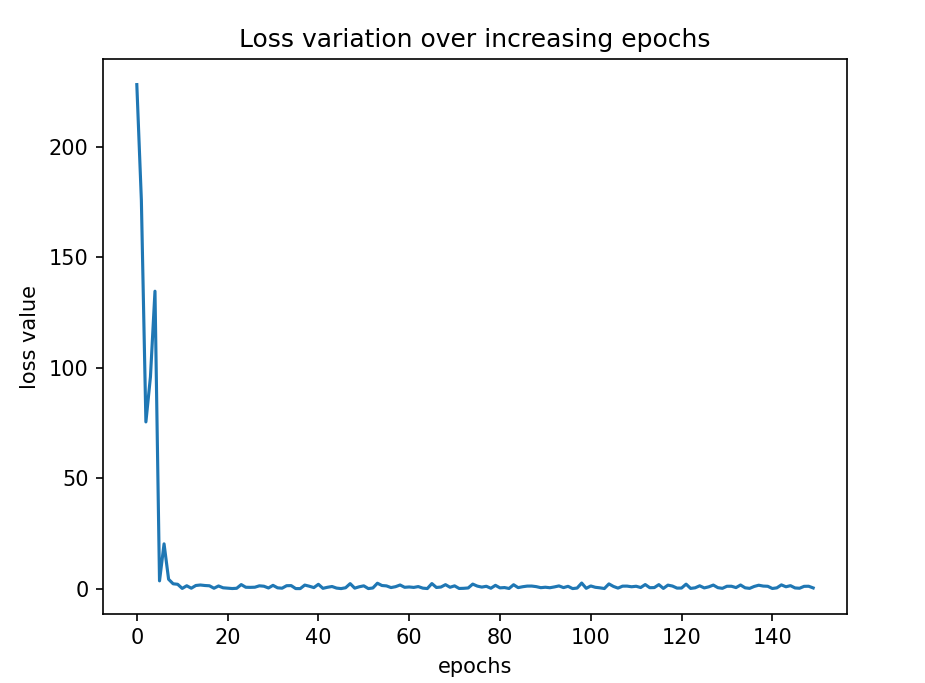
                       （图十四：损失函数随迭代次数的变化而变化）

###### · 手写数字（MNIST）图片识别的 Python 实现：
· 创建并训练一个卷积神经网络来识别手写数字，使用 TensorFlow 和 Keras 进行深度学习

· <font color="#ffc000">代码实现</font>：
```Python
import tensorflow as tf  
print("TensorFlow version:", tf.__version__)  
  
# 设置 GPUgpus = tf.config.list_physical_devices("GPU")  
if gpus:  
    try:  
        tf.config.experimental.set_memory_growth(gpus[0], True)  
        tf.config.set_visible_devices(gpus[0], 'GPU')  
    except RuntimeError as e:  
        print(e)  
  
# 导入数据集及其他必要的库  
from tensorflow.keras import datasets, layers, models  
import matplotlib.pyplot as plt  
  
# 加载 MNIST 数据集  
(train_images, train_labels), (test_images, test_labels) = datasets.mnist.load_data()  
print("Training shape:", train_images.shape)  
print("Testing shape:", test_images.shape)  
  
# 数据归一化，将像素值从 [0, 255] 缩放到 [0, 1]train_images, test_images = train_images / 255.0, test_images / 255.0  
  
# 数据可视化  
plt.figure(figsize=(20, 10))  
for i in range(20):  
    plt.subplot(5, 10, i + 1)  
    plt.xticks([])  
    plt.yticks([])  
    plt.grid(False)  
    plt.imshow(train_images[i], cmap=plt.cm.binary)  
    plt.xlabel(train_labels[i])  
plt.show()  
  
# 调整图片格式为 (28, 28, 1)，以符合卷积神经网络的输入要求  
train_images = train_images.reshape((60000, 28, 28, 1))  
test_images = test_images.reshape((10000, 28, 28, 1))  
  
# 构建卷积神经网络模型  
model = models.Sequential([  
    layers.Conv2D(32, (3, 3), activation='relu', input_shape=(28, 28, 1)),  
    layers.MaxPool2D((2, 2)),  
    layers.Conv2D(64, (3, 3), activation='relu'),  
    layers.MaxPooling2D((2, 2)),  
    layers.Flatten(),  
    layers.Dense(64, activation='relu'),  
    layers.Dense(10)  
])  
model.summary()  
  
# 编译模型  
model.compile(optimizer='adam',  
              loss=tf.keras.losses.SparseCategoricalCrossentropy(from_logits=True),  
              metrics=['accuracy'])  
  
# 训练模型  
history = model.fit(train_images, train_labels, epochs=10,  
                    validation_data=(test_images, test_labels))
```

· <font color="#00ffb0">运行结果</font>：
```
TensorFlow version: 2.16.1
Training shape: (60000, 28, 28)
Testing shape: (10000, 28, 28)

# TensorFlow 版本为 2.16.1
# 训练数据集的形状为 (60000, 28, 28)，即包含 60,000 张 28x28 像素的训练图片
# 测试数据集的形状为 (10000, 28, 28)，即包含 10,000 张 28x28 像素的测试图片

Model: "sequential"
┌─────────────────────────────────┬────────────────────────┬───────────────┐
│ Layer (type)                    │ Output Shape           │       Param # │
├─────────────────────────────────┼────────────────────────┼───────────────┤
│ conv2d (Conv2D)                 │ (None, 26, 26, 32)     │           320 │
├─────────────────────────────────┼────────────────────────┼───────────────┤
│ max_pooling2d (MaxPooling2D)    │ (None, 13, 13, 32)     │             0 │
├─────────────────────────────────┼────────────────────────┼───────────────┤
│ conv2d_1 (Conv2D)               │ (None, 11, 11, 64)     │        18,496 │
├─────────────────────────────────┼────────────────────────┼───────────────┤
│ max_pooling2d_1 (MaxPooling2D)  │ (None, 5, 5, 64)       │             0 │
├─────────────────────────────────┼────────────────────────┼───────────────┤
│ flatten (Flatten)               │ (None, 1600)           │             0 │
├─────────────────────────────────┼────────────────────────┼───────────────┤
│ dense (Dense)                   │ (None, 64)             │       102,464 │
├─────────────────────────────────┼────────────────────────┼───────────────┤
│ dense_1 (Dense)                 │ (None, 10)             │           650 │
└─────────────────────────────────┴────────────────────────┴───────────────┘
Total params: 121,930 (476.29 KB)
Trainable params: 121,930 (476.29 KB)
Non-trainable params: 0 (0.00 B)


# 模型包含以下层次：
    # 第一卷积层（Conv2D）：32 个过滤器，输出形状为 (None, 26, 26, 32)
    # 第一池化层（MaxPooling2D）：输出形状为 (None, 13, 13, 32)
    # 第二卷积层（Conv2D）：64 个过滤器，输出形状为 (None, 11, 11, 64)
    # 第二池化层（MaxPooling2D）：输出形状为 (None, 5, 5, 64)
    # 平展层（Flatten）：将多维特征图转换为一维向量，输出形状为 (None, 1600)
    # 全连接层（Dense）：64 个神经元，输出形状为 (None, 64)
    # 输出层（Dense）：10 个神经元，输出形状为 (None, 10)
# 总参数量为 121,930，其中 121,930 个参数是可训练的，0 个参数是不可训练的

Epoch 1/10
1875/1875 ━━━━━━━━━━━━━━━━━━━━ 9s 4ms/step - accuracy: 0.9002 - loss: 0.3250 - val_accuracy: 0.9832 - val_loss: 0.0542
Epoch 2/10
1875/1875 ━━━━━━━━━━━━━━━━━━━━ 6s 3ms/step - accuracy: 0.9843 - loss: 0.0507 - val_accuracy: 0.9877 - val_loss: 0.0382
Epoch 3/10
1875/1875 ━━━━━━━━━━━━━━━━━━━━ 6s 3ms/step - accuracy: 0.9896 - loss: 0.0341 - val_accuracy: 0.9893 - val_loss: 0.0322
Epoch 4/10
1875/1875 ━━━━━━━━━━━━━━━━━━━━ 7s 4ms/step - accuracy: 0.9924 - loss: 0.0237 - val_accuracy: 0.9906 - val_loss: 0.0348
Epoch 5/10
1875/1875 ━━━━━━━━━━━━━━━━━━━━ 6s 3ms/step - accuracy: 0.9942 - loss: 0.0187 - val_accuracy: 0.9901 - val_loss: 0.0328
Epoch 6/10
1875/1875 ━━━━━━━━━━━━━━━━━━━━ 6s 3ms/step - accuracy: 0.9961 - loss: 0.0132 - val_accuracy: 0.9880 - val_loss: 0.0403
Epoch 7/10
1875/1875 ━━━━━━━━━━━━━━━━━━━━ 6s 3ms/step - accuracy: 0.9963 - loss: 0.0118 - val_accuracy: 0.9893 - val_loss: 0.0381
Epoch 8/10
1875/1875 ━━━━━━━━━━━━━━━━━━━━ 6s 3ms/step - accuracy: 0.9973 - loss: 0.0083 - val_accuracy: 0.9909 - val_loss: 0.0377
Epoch 9/10
1875/1875 ━━━━━━━━━━━━━━━━━━━━ 7s 4ms/step - accuracy: 0.9974 - loss: 0.0073 - val_accuracy: 0.9901 - val_loss: 0.0389
Epoch 10/10
1875/1875 ━━━━━━━━━━━━━━━━━━━━ 9s 5ms/step - accuracy: 0.9986 - loss: 0.0045 - val_accuracy: 0.9893 - val_loss: 0.0398

# 训练了 10 个周期（epochs），每个周期都显示了训练集和验证集的准确性（accuracy）和损失（loss）
# 以下是每个周期的详细结果:
```

| Epoch | Training Accuracy | Training Loss | Validation Accuracy | Validation Loss |
| :---- | :---------------- | :------------ | :------------------ | :-------------- |
| 1     | 0.9002            | 0.3250        | 0.9832              | 0.0542          |
| 2     | 0.9843            | 0.0507        | 0.9877              | 0.0382          |
| 3     | 0.9896            | 0.0341        | 0.9893              | 0.0322          |
| 4     | 0.9924            | 0.0237        | 0.9906              | 0.0348          |
| 5     | 0.9942            | 0.0187        | 0.9901              | 0.0328          |
| 6     | 0.9961            | 0.0132        | 0.9880              | 0.0403          |
| 7     | 0.9963            | 0.0118        | 0.9893              | 0.0381          |
| 8     | 0.9973            | 0.0083        | 0.9909              | 0.0377          |
| 9     | 0.9974            | 0.0073        | 0.9901              | 0.0389          |
| 10    | 0.9986            | 0.0045        | 0.9893              | 0.0398          |

· <font color="#e50ad4">模型分析</font>：
1. 模型性能：
    - 训练准确率逐渐提高，从第一个周期的 90.02% 增加到第十个周期的 99.86%
    - 验证准确率也逐渐提高，最终在第十个周期达到了 98.93%
2. 损失变化：
    - 训练损失显著下降，从第一个周期的 0.3250 降到第十个周期的 0.0045
    - 验证损失也下降，但在后几个周期略有波动，最终在第十个周期为 0.0398
3. 模型表现良好：
    - 训练和验证的准确率都很高，说明模型在识别手写数字上表现良好
    - 验证损失和准确率略有波动，可能是由于训练过程中存在轻微的过拟合
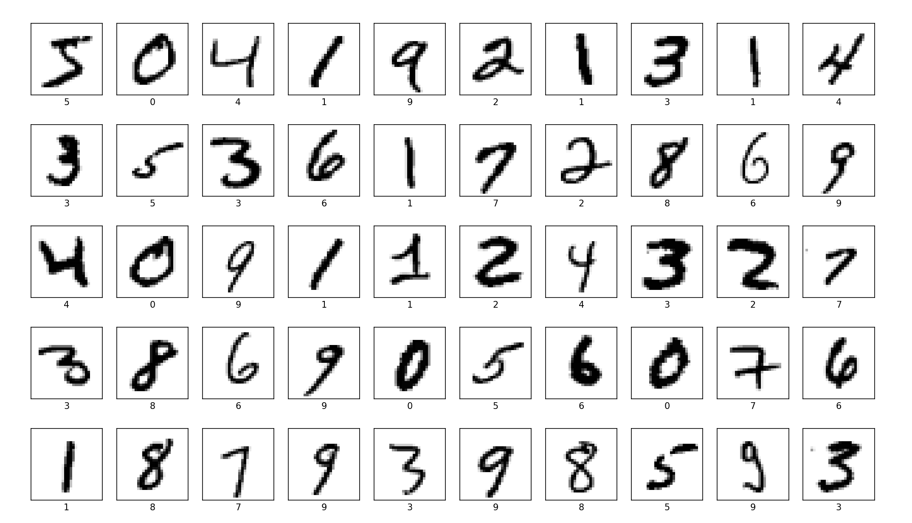
                   （图十五：MNIST 训练库数据集中前五十个数据点展示）

###### · 鸢尾花数据集识别的 Python 示例：
· 使用一个简单的神经网络模型对鸢尾花数据集（Iris dataset）进行分类任务
· 鸢尾花数据集是一个经典的机器学习数据集，包含150条记录，每条记录有四个特征和一个目标类别
· 鸢尾花数据集的特征：
1. 花萼长度（Sepal Length）
2. 花萼宽度（Sepal Width）
3. 花瓣长度（Petal Length）
4. 花瓣宽度（Petal Width）
· 目标类别有三类，每类代表一种鸢尾花：
1. Setosa
2. Versicolour
3. Virginica

· <font color="#ffc000">代码实现</font>：
```Python
import numpy as np  
import tensorflow as tf  
import sklearn.datasets as dataset  
from matplotlib import pyplot as plt  
from sklearn.model_selection import train_test_split  
  
# 读取鸢尾花数据集  
x_data = dataset.load_iris().data  # 特征数据  
y_data = dataset.load_iris().target  # 标签数据  
  
# 设置随机种子并打乱数据  
np.random.seed(2022)  
np.random.shuffle(x_data)  # 打乱特征数据  
np.random.seed(2022)  
np.random.shuffle(y_data)  # 打乱标签数据  
tf.random.set_seed(2022)  
  
# 分隔数据集为训练集和测试集  
x_train, x_test, y_train, y_test = train_test_split(x_data, y_data, test_size=0.2, random_state=2022)  
# 转换数据类型为tf.float32  
x_train = tf.cast(x_train, tf.float32)  
x_test = tf.cast(x_test, tf.float32)  
  
# 将训练集和测试集转换为TensorFlow数据集，并按批次进行处理  
train_db = tf.data.Dataset.from_tensor_slices((x_train, y_train)).batch(32)  
test_db = tf.data.Dataset.from_tensor_slices((x_test, y_test)).batch(32)  
  
# 构建神经网络的权重和偏置  
w1 = tf.Variable(tf.random.truncated_normal([4, 3], stddev=0.1, seed=1))  # 初始化权重  
b1 = tf.Variable(tf.random.truncated_normal([3], stddev=0.1, seed=1))  # 初始化偏置  
  
# 定义超参数  
lr = 0.1  # 学习率  
train_loss_result = []  # 记录每轮的损失  
test_acc = []  # 记录每轮的准确率  
epoch = 600  # 训练的轮数  
loss_all = 0  # 初始化总损失  
  
# 训练神经网络  
for epoch in range(epoch):  
    for step, (x_train, y_train) in enumerate(train_db):  
        with tf.GradientTape() as tape:  # 记录梯度信息  
            y = tf.matmul(x_train, w1) + b1  # 神经网络的前向计算  
            y = tf.nn.softmax(y)  # 计算输出的概率分布  
            y_ = tf.one_hot(y_train, depth=3)  # 将标签转换为one-hot编码  
            loss = tf.reduce_mean(tf.square(y_ - y))  # 计算均方误差  
            loss_all += loss.numpy()  # 累加损失  
        grads = tape.gradient(loss, [w1, b1])  # 计算梯度  
        w1.assign_sub(lr * grads[0])  # 更新权重  
        b1.assign_sub(lr * grads[1])  # 更新偏置  
    print("Epoch {}, loss: {}".format(epoch, loss_all / 4))  
    train_loss_result.append(loss_all / 4)  # 记录每轮的平均损失  
    loss_all = 0  # 重置总损失  
  
    # 测试神经网络  
    total_correct, total_number = 0, 0  
    for x_test, y_test in test_db:  
        y = tf.matmul(x_test, w1) + b1  # 前向计算  
        y = tf.nn.softmax(y)  # 计算输出的概率分布  
        pred = tf.argmax(y, axis=1)  # 获取预测结果  
        pred = tf.cast(pred, dtype=y_test.dtype)  # 将预测结果转换为与标签相同的类型  
        correct = tf.cast(tf.equal(pred, y_test), dtype=tf.int32)  # 计算预测正确的样本数  
        correct = tf.reduce_sum(correct)  # 汇总预测正确的样本数  
        total_correct += int(correct)  # 累加预测正确的样本数  
        total_number += x_test.shape[0]  # 累加测试集的样本总数  
    acc = total_correct / total_number  # 计算测试集上的准确率  
    test_acc.append(acc)  # 记录每轮的准确率  
    print("Test_acc:", acc)  
  
# 绘制训练损失曲线  
plt.title('Loss Function Curve')  
plt.xlabel('Epoch')  
plt.ylabel('Loss')  
plt.plot(train_loss_result, label="Loss", color='red')  
plt.legend()  
plt.show()  
  
# 绘制测试准确率曲线  
plt.title("Accuracy Curve")  
plt.xlabel('Epoch')  
plt.ylabel('Accuracy')  
plt.plot(test_acc, label="Accuracy", color='red')  
plt.legend()  
plt.show()
```

· <font color="#00ffb0">运行结果</font>：
```
Epoch 0, loss: 0.2543354779481888
Test_acc: 0.36666666666666664
Epoch 1, loss: 0.23704340308904648
Test_acc: 0.36666666666666664
……………………
Epoch 598, loss: 0.02214517304673791
Test_acc: 0.9333333333333333
Epoch 599, loss: 0.02212412841618061
Test_acc: 0.9333333333333333

# 经过 600 轮迭代，损失损失减小为 0.02212412841618061，测试精确度为 0.9333333333333333
```
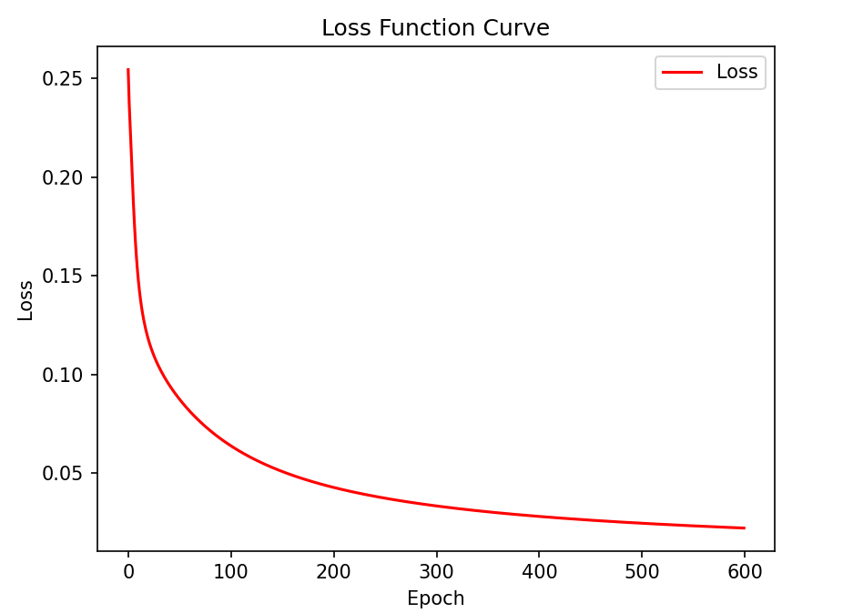
                         （图十六：鸢尾花数据识别损失函数曲线）
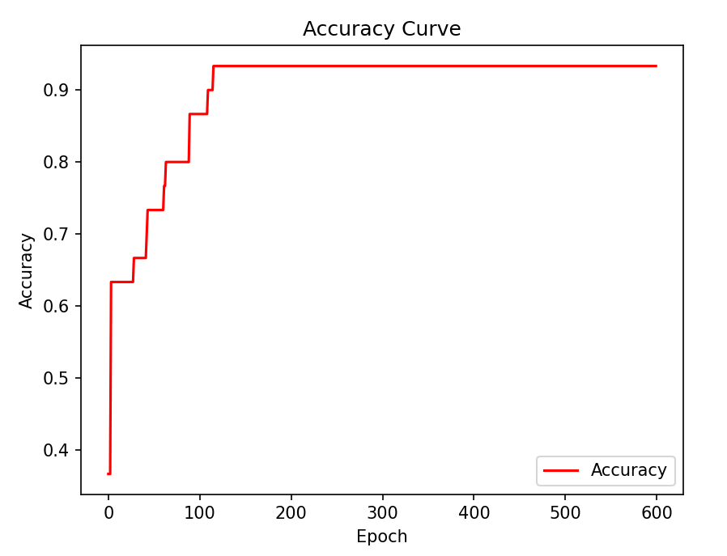
                        （图十七：鸢尾花数据识别训练精确度曲线）
```
分类结果（测试集）：
样本 1: 真实标签: 1, 预测标签: 1    √
样本 2: 真实标签: 1, 预测标签: 1    √
样本 3: 真实标签: 0, 预测标签: 0    √
样本 4: 真实标签: 1, 预测标签: 1    √
样本 5: 真实标签: 2, 预测标签: 2    √
样本 6: 真实标签: 0, 预测标签: 0    √
样本 7: 真实标签: 2, 预测标签: 2    √
样本 8: 真实标签: 1, 预测标签: 2    ×    # 这个预测分类与实际分类相比是错的
样本 9: 真实标签: 2, 预测标签: 2    √
样本 10: 真实标签: 1, 预测标签: 1    √
样本 11: 真实标签: 2, 预测标签: 2    √
样本 12: 真实标签: 2, 预测标签: 2    √
样本 13: 真实标签: 1, 预测标签: 1    √
样本 14: 真实标签: 2, 预测标签: 2    √
样本 15: 真实标签: 2, 预测标签: 2    √
样本 16: 真实标签: 0, 预测标签: 0    √
样本 17: 真实标签: 1, 预测标签: 1    √
样本 18: 真实标签: 1, 预测标签: 1    √
样本 19: 真实标签: 2, 预测标签: 2    √
样本 20: 真实标签: 2, 预测标签: 2    √
样本 21: 真实标签: 0, 预测标签: 0    √
样本 22: 真实标签: 2, 预测标签: 2    √
样本 23: 真实标签: 1, 预测标签: 1    √
样本 24: 真实标签: 1, 预测标签: 1    √
样本 25: 真实标签: 0, 预测标签: 0    √
样本 26: 真实标签: 0, 预测标签: 0    √
样本 27: 真实标签: 1, 预测标签: 2    ×    # 这个预测分类与实际分类相比是错的
样本 28: 真实标签: 0, 预测标签: 0    √
样本 29: 真实标签: 2, 预测标签: 2    √
样本 30: 真实标签: 0, 预测标签: 0    √
```


~~~
内容主要整理自：
1. 宁毅-“机器学习与基础教学”（微信公众号）：《神经网络(3)|卷积神经网络初识》. 2023.12.04

次参考：
2. 爱晒太阳的胖子《一维卷积》
（CSDN：https://blog.csdn.net/qq_42018521/article/details/128777853?ops_request_misc=&request_id=&biz_id=102&utm_term=%E4%B8%80%E7%BB%B4%E5%8D%B7%E7%A7%AF&utm_medium=distribute.pc_search_result.none-task-blog-2~all~sobaiduweb~default-0-128777853.nonecase&spm=1018.2226.3001.4187）
3. ⊙月《CS131专题-1：卷积、互相关》
（CSDN：https://blog.csdn.net/weixin_42118657/article/details/121132214?ops_request_misc=&request_id=&biz_id=102&utm_term=%E4%BA%92%E7%9B%B8%E5%85%B3&utm_medium=distribute.pc_search_result.none-task-blog-2~all~sobaiduweb~default-1-121132214.142^v100^control&spm=1018.2226.3001.4187）
4. 小林学编程《损失函数（lossfunction）的全面介绍（简单易懂版）》
（CSDN：https://blog.csdn.net/weixin_57643648/article/details/122704657?ops_request_misc=%257B%2522request%255Fid%2522%253A%2522171749967616800225590580%2522%252C%2522scm%2522%253A%252220140713.130102334..%2522%257D&request_id=171749967616800225590580&biz_id=0&utm_medium=distribute.pc_search_result.none-task-blog-2~all~top_positive~default-1-122704657-null-null.142^v100^control&utm_term=%E6%8D%9F%E5%A4%B1%E5%87%BD%E6%95%B0&spm=1018.2226.3001.4187）
~~~