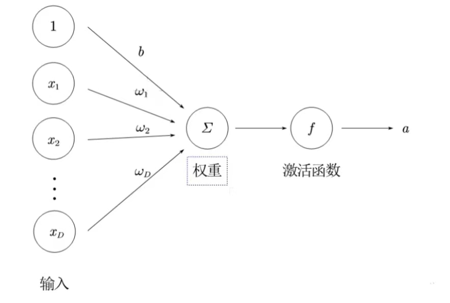
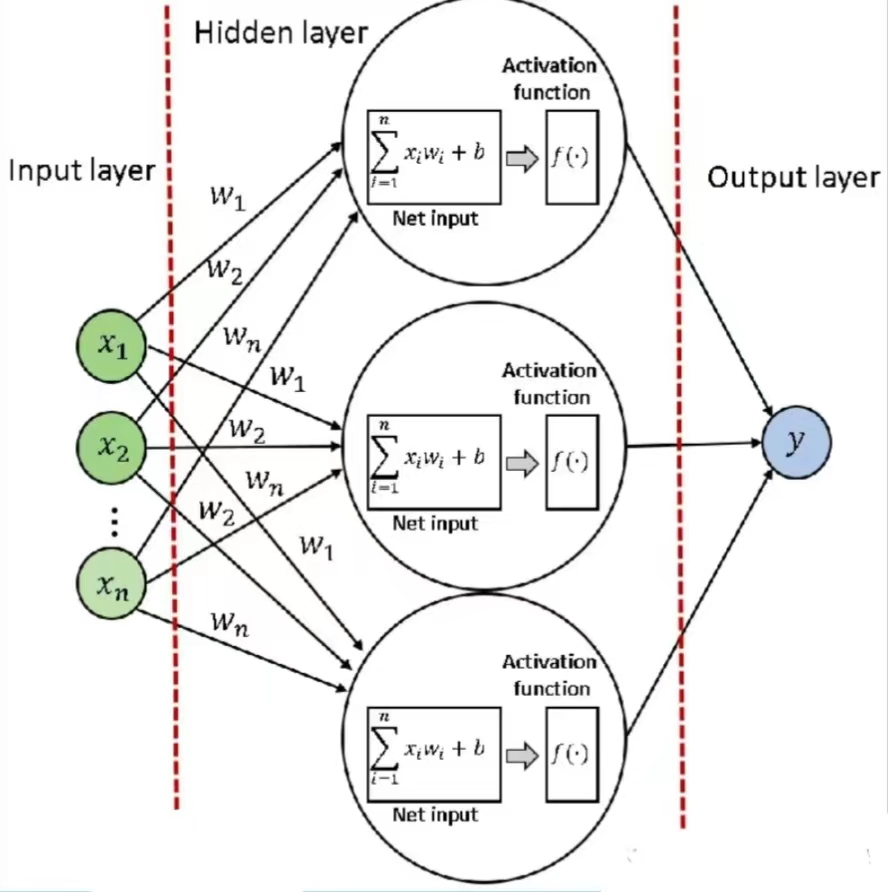
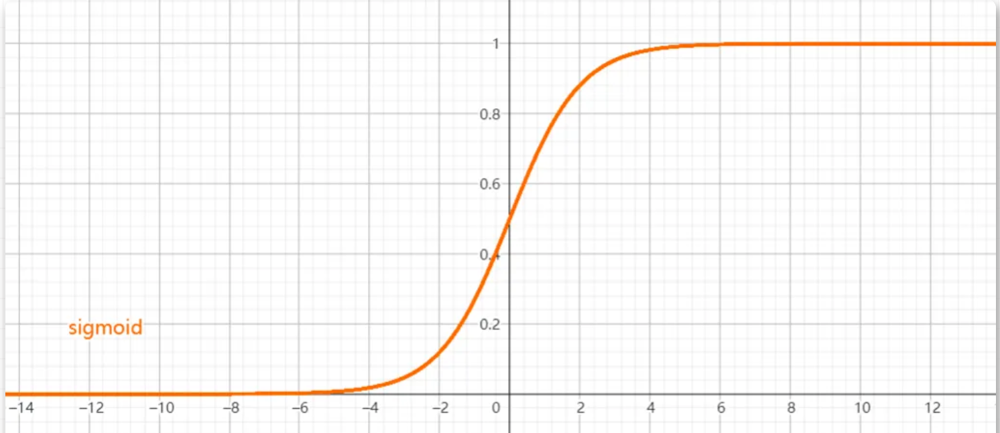
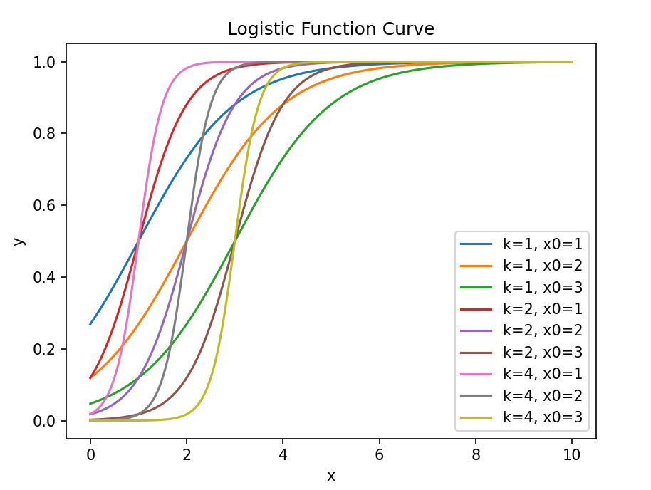
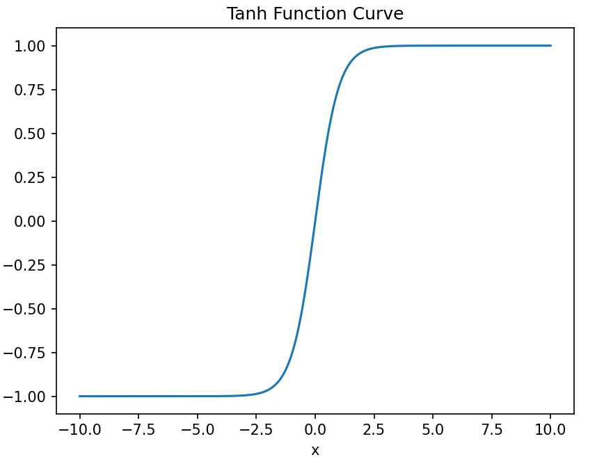
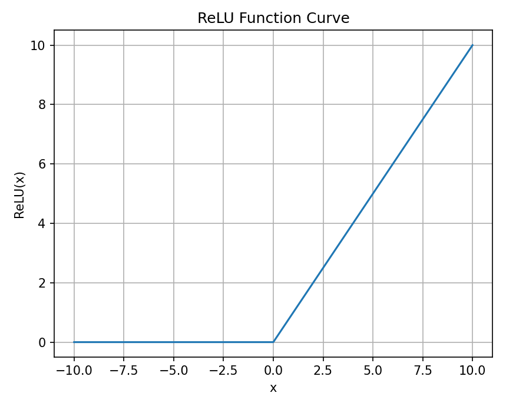
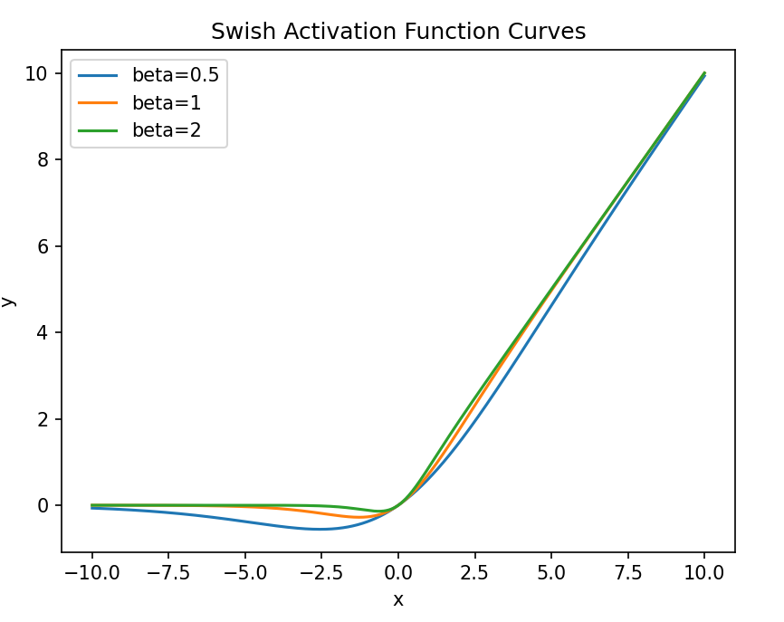
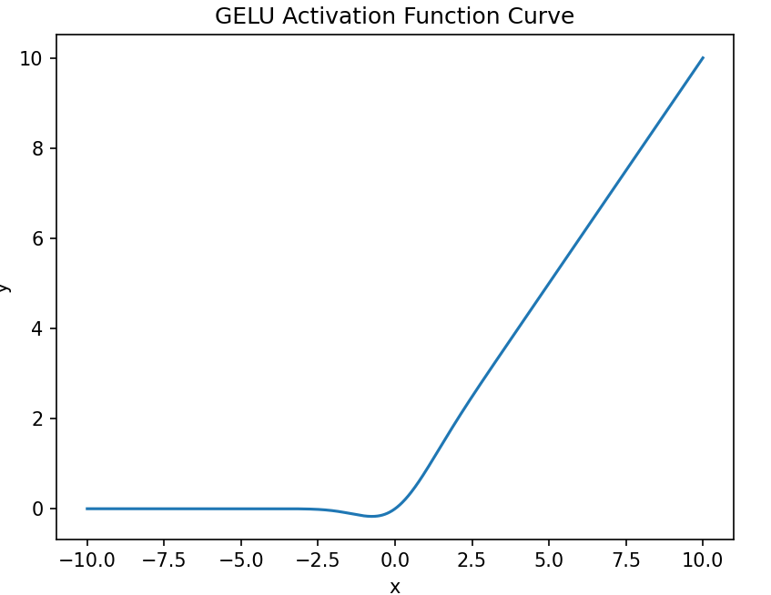

### 壹  神经网络结构组成

###### · 神经网络简介：
· 神经网络是一种基于神经元之间相互连接和信息传递的机器学习方法，模拟人脑中神经元之间的交互过程，并按照一定拓扑结构来建立人工神经元之间的连接，通过学习输入数据来进行预测或分类任务，来模拟生物神经系统
· 人工神经网络也常常简称为 **神经网络（Neural Network，NN）** 或 **神经模型（Neural Model）**

###### · 神经网络结构组成：
1. 神经元（Neuron）：
	1. 接收输入数据并进行加权求和和激活函数处理
	2. 输出结果作为下一层神经元的输入
2. 权重（Weight）：
	1. 用于调节神经元之间的连接强度
	2. 在训练过程中不断更新以优化模型表现
3. 偏置（Bias）：
	1. 用于调整神经元的激活阈值
	2. 可提高模型的灵活性和适应性
4. 激活函数（Activation Function）：
	1. 对神经元的输出进行非线性转换
	2. 帮助模型学习非线性关系和复杂模式

· 神经元通过一定的连接方式或信息传递方式进行协作构成神经网络
· 神经元之间的不同连接方式会构成不同结构形式和作用的神经网络，常分为以下三种：
	1. 前馈神经网络
	2. 记忆神经网络
	3. 图神经网络


### 贰  神经元

###### · 神经元的组成：
· 神经元是构成神经网络的基本单元，主要模拟生物神经元的结构和特性，接受一组输入信号比你高产生输出，通过线性函数和非线性函数的恰当组合使其能够来逼近任何一个函数

· 单个神经元的组成：
1. 权重：用于调节神经元之间的连接强度，在训练过程中不断更新以优化模型表现
2. 偏置：用于调整神经元的激活阈值，可提高模型的灵活性和适应性
3. 激活函数：对神经元的输出进行非线性转换，帮助模型学习非线性关系和复杂模型

                         （图一：神经元的组成及各组成部分间的关系）

· 详细构成：
1. 输入层：接收一组输入信号或数据信息
2. 隐藏层：在输入层和输出层之间，有一个或多个隐藏层，对输入数据执行一系列非线性变换（这些隐藏层的目的是从输入数据中提取对当前任务更有意义的高级特征）
	· 隐藏层中的每个神经元都从前一层的所有神经元接收输入，并在将结果通过非线性激活函数之前，对这些输入应用一组权重和偏差
	· 这个过程在隐藏层中的所有神经元上重复，直到达到输出层
3. 输出层：输出最终函数及其相应结果

                             （图二：神经元构成的三个层次）

###### · 激活函数的性质：
· 激活函数的性质：
1. 连续并可导的非线性函数，可导的激活函数，可以直接利用数值优化的方法来学习网络参数
2. 激活函数及其导函数要尽可能的简单，有利于提高网络计算效率
3. 激活函数的导函数的值域要在一个合适的区间内，不能太大也不能太小，否则会影响训练的效率和稳定性

###### · Sigmoid 函数：
· Sigmoid 是一类 S 型曲线函数，两端饱和（ x→+∞、-∞ 时函数一阶导为 0 ）
· 常用的 S 函数有 Logistic 函数和 Tanh 函数

· **Logistic 函数**：
$$Logistic=\frac{1}{1+e^{-x}}$$
· Logistic 函数的图像：

（图三：Logistic 曲线的标准型图像）
· 相比于阶跃函数，Logistic 函数连续可导，其性质更好：一般我们将其看作一个*软性门*，用以控制其他神经元输出信息的数量

· <font color="#ffc000">不同 Logistic 曲线图代码</font>（ $Logistic=\frac{1}{e^{k\cdot(x-x_0)}}$ 型）：
```Python
import numpy as np  
import matplotlib.pyplot as plt  
  
def logistic_function(x, k, x0):  
    return 1 / (1 + np.exp(-k * (x - x0)))  
  
x = np.linspace(0, 10, 1000)  
k_values = [1, 2, 4]  
x0_values = [1, 2, 3]  
  
for i, k in enumerate(k_values):  
    for j, x0 in enumerate(x0_values):  
        plt.plot(x, logistic_function(x, k, x0), label=f'k={k}, x0={x0}')  
  
plt.title('Logistic Function Curve')  
plt.xlabel('x')  
plt.ylabel('y')  
plt.legend()  
plt.show()
```

                    （图四：不同的 k 与 x<sub>0</sub> 参数的 Logisitc 函数图像比较）

· **Tanh 函数**：
	$$Tanh(x)=\frac{e^x-e^{-x}}{e^x+x^{-x}}$$
· 实质上 Tanh 函数为放大平移后的 Logistic 函数，值域变为 $(-1,1)$ ，Logistic 函数的输出具有*恒正性* 而 Tanh 函数输出是 *零中心化* 的
· 这里需要注意，非零中心化的输出会使得其后一层的神经元的输入发生偏置偏移，从而会使得梯度下降的收敛速度变慢

· <font color="#ffc000">Tanh 曲线图代码</font>：
```Python
import numpy as np  
import matplotlib.pyplot as plt  
  
def tanh(x):  
    return np.tanh(x)  
  
x = np.linspace(-10, 10, 1000)  
  
plt.plot(x, tanh(x))  
plt.title('Tanh Function Curve')  
plt.xlabel('x')  
plt.ylabel('y')  
plt.show()
```

                              （图五：Tanh 函数图像示意）

###### · ReLU 函数：
· ReLU 是一个线性整流函数，机器学习中常用的激活函数，实质上它是一个斜坡函数
$$ReLU=\begin{cases}x,\enspace x\geq0\\ 0,\enspace x\leq 0\end{cases}=max(0,x)$$
· ReLU 函数被认为具有生物学合理性，其原因是利用 ReLU 函数的神经元只需要进行加、乘、比较的运算操作，运算简单高效，其兴奋程度有时可以非常高
· Sigmoid 型函数的稀疏性很低，相对应的神经网络的激活状态较低，而 ReLU 函数则可以使神经元一半达到激活状态；并且在 x 取正时其导数恒为 1，一定程度上缓解了梯度消失问题，加速梯度下降的收敛速度
· ReLU 是非零中心化的，易导致后一层神经网络偏置偏移，进而影响梯度下降的效率
· *死亡 ReLU 问题*：训练时如果参数在一次不恰当的更新后，第一个隐藏层中的某个 ReLU 神经元在所有的训练数据上都不能被激活，那么这个神经元自身参数的梯度永远都会是0，在以后的训练过程中永远不能被激活

· <font color="#ffc000">ReLU 函数图像代码</font>：
```Python
import numpy as np  
import matplotlib.pyplot as plt  
  
  
def relu(x):  
    return max(0, x)  
  
  
x = np.linspace(-10, 10, 1000)  
y = [relu(i) for i in x]  
  
plt.plot(x, y)  
plt.xlabel('x')  
plt.ylabel('ReLU(x)')  
plt.title('ReLU Function Curve')  
plt.grid()  
plt.show()
```

                              （图六：ReLU 函数图像示意）

###### · Swish 函数：
$$Swish(x)=x\cdot \sigma(\beta x)$$
【其中 $\sigma()$ 为 Logistic 函数，$\beta$ 为固定超参数（可学习）】
· Swish 函数是一种自门控激活函数，当 $\sigma(\beta x)$ 趋近于 1 时，门开，函数输出值趋近于 $x$；反之趋近于 0 时，门关，函数输出值趋近于 0

· <font color="#ffc000">Swish 函数图像代码</font>：
```Python
import numpy as np  
import matplotlib.pyplot as plt  
  
  
def swish(x, beta):  
    return x * sigmoid(beta * x)  
  
  
def sigmoid(x):  
    return 1 / (1 + np.exp(-x))  
  
  
x = np.linspace(-10, 10, 1000)  
  
betas = [0.5, 1, 2]  
  
for beta in betas:  
    y = swish(x, beta)  
    plt.plot(x, y, label=f'beta={beta}')  
  
plt.xlabel('x')  
plt.ylabel('y')  
plt.legend()  
plt.title('Swish Activation Function Curves')  
plt.show()
```

                               （图七：Swish 函数图像示意）

###### · GELU 函数：
· GELU 函数,即高斯误差线性单元，亦为一种门控制激活函数
$$GELU(x)=x\cdot P(X\leq x)$$$$GELU(x)\approx 0.5x\cdot(\ 1+tanh\ (\sqrt{\frac{2}{\pi}}\ (x+0.044715x^3)\ )\ )$$
其中 $P(X\leq x)$ 是正态分布的分布函数，和 Swish 激活函数比较类似

· <font color="#ffc000">GELU 函数图像代码</font>：
```Python
import numpy as np  
import matplotlib.pyplot as plt  
  
  
def gelu(x):  
    return 0.5 * x * (1 + np.tanh(np.sqrt(2 / np.pi) * (x + 0.044715 * x ** 3)))  
  
  
x = np.linspace(-10, 10, 1000)  
y = gelu(x)  
  
plt.plot(x, y)  
plt.xlabel('x')  
plt.ylabel('y')  
plt.title('GELU Activation Function Curve')  
plt.show()
```

                              （图八：GELU 函数图像示意）


### 叁  网络结构

###### · 神经网络：
· 一个单独的神经元是远远不足以完成复杂功能，我们需要许多神经元一起协同工作
· 这些协作的神经元通过特定的连接方式和信息传递方式形成一个网络，即我们常说的神经网络

###### · 前馈网络：
· 前馈神经网络，又叫多层感知机，通过简单非线性函数的多次复合，实现输入空间到输出空间的复杂映射
· 每一层中的神经元接收前一层神经元的输出，并输出到下一层神经元
· 前馈神经网络包括*全连接前馈网络*和*卷积神经网络*
· 没有反向传播，只是在整个网络中朝一个方向传播
· 简单易于实现

###### · 记忆网络：
· 神经网络加上反馈机制称为反馈神经网络，其中的神经元不但可以接受其它神经元信号，也可接受自己的历史信息，即神经元具有记忆性，该传播可单向亦可双向，故可以用有向循环图或无向图来表示
· 记忆神经网络一般包含*循环神经网络*、*玻尔兹曼机*、*Hopfield 网络*等
· 记忆能力更强、计算能力更强

###### · 图网络：
· 定义在图结构数据上的神经网络称之为图网络（图神经网络）
· 每个节点由一个或一组神经元组成，其连接可有向也可无向
· 包括：*图卷积神经网络*、*图注意力网络*、*消息传递神经网络*等


~~~
内容整理自：
1. 宁毅-“机器学习与基础教学”（微信公众号）：《神经网络(1)|神经元&网络结构》. 2023.11.5
~~~