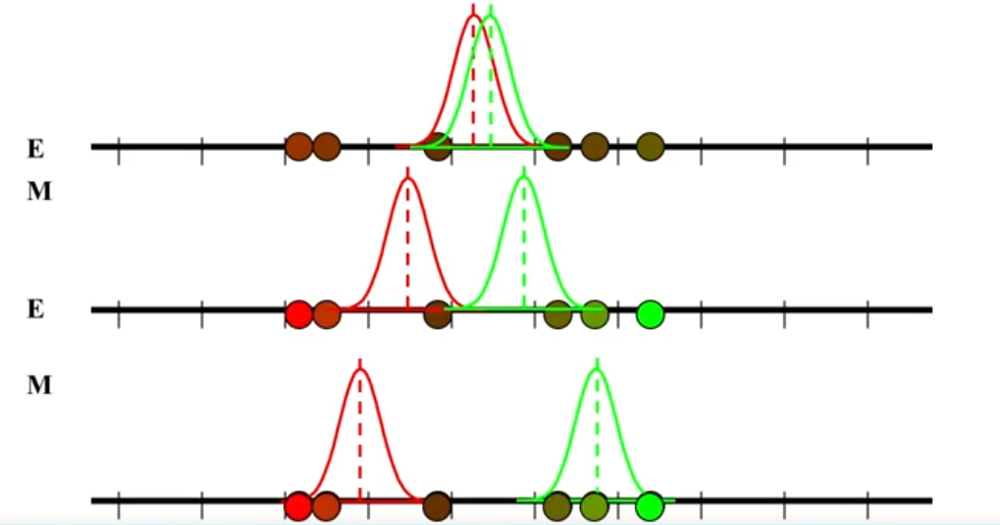

### 壹  机器学习简介

###### 1. 机器学习定义：

- 维基百科：机器学习是一门系统的学科，它关注设计和开发算法，使得机器的行为随着经验数据的积累而进化，经验数据通常是传感器数据或数据库记录

- Dictionary.com：机器学习是人工智能的一个分支，即机器基于输入的原始数据生成规则

- Tom M. Mitchell：一个计算机程序能够从经验 $E$ 中学习（学习任务是 $T$，学习的表现用 $P$ 衡量），这个程序在任务 $T$ 与表现衡量 $P$ 下，可以通过经验 $E$ 得到改进

- Jason Brownlee：一个机器学习就是从数据中训练出一个模型，该模型有不低于某种评估指标的泛化能力

- 中科院自动化所王珏研究员：根据样本集合建立一个模型，并期望这个模型对问题空间中所有样本预测的正确率大于一个给定的常数，模型可以理解为对问题空间的一种统计描述：
	- 1. 一致性假设
	- 2. 划分
	- 3. 泛化能力

###### 2. 机器学习发展历程：

- 人工智能发展的三个时期：

| 发展时期 | 时间段              | 主流技术                         |
| :--- | :--------------- | :--------------------------- |
| 推理期  | 1956 年 - 1970s 初 | 基于符号和知识表示的演绎推理技术             |
| 知识期  | 1970s 中期 - 1980s | 基于符号和知识表示，通过获取和利用领域知识来建立专家系统 |
| 学习期  | 1980s - 至今       | 符号主义学习、基于神经网络的连接主义学习         |

| 时间段           | 机器学习理论                             | 代表性成果                                                                                                                          |
| :------------ | :--------------------------------- | :----------------------------------------------------------------------------------------------------------------------------- |
| 1950s 初期      | 人工智能研究处于推理期                        | A. Newell 和 H. Simon 的“逻辑理论家”（Logic Theorist）程序证明了数学原理，以及“通用问题求解”（General Problem Solving）程序                                   |
|               | 出现机器学习的相关研究                        | 1952 年，阿瑟 · 萨缪尔（Arthur Samuel）在 IBM 公司研制了一个西洋跳棋程序，这是人工智能下棋问题的由来                                                                |
| 1950s 中后期     | 出现基于神经网络的“连接主义”学习                  | F. Rosenblatt 提出感知机（Perceptron），处理线性分类问题，处理不了“异或”逻辑；B. Widrow 提出 Adaline                                                       |
| 1960s - 1970s | 基于逻辑表示的“符号主义”（Symbolism）学习         | Patrick H. Winston 的结构化概念学习系统，R. S. Michalski 的基于逻辑的归纳学习系统，E. B. Hunt 的概念学习系统                                                  |
|               | 以决策理论为基础的学习技术 强化学习基数            | 知识工程                                                                                                                           |
|               | N. J. Nilson 的“学习机器”               | 专家系统                                                                                                                           |
|               | 统计学习理论的一些奠基性成果                     | 支持向量，VC 维，结构风险最小化原则                                                                                                            |
| 1980s - 1990s | 从样例中学习： （1）符号主义学习 （2）基于逻辑的学习 | 决策树（decision tree），覆盖分类和回归两个领域 归纳逻辑程序设计（Inductive Logic Programming，ILP）具有很强的知识表示能力，但会导致学习过程面临的假设空间太大，复杂度高，因此问题规模稍大就难以有效地学习 |
|               | 从样例中学习：基于神经网络的连接主义学习               | 1983 年，J.J.Hopfield 利用神经网络求解“流动推销员问题”这个 NP 难题 1986 年，D.E.Rumelhart 等人重新发明了 BP（反向传播）算法                                       |
| 1990s 中期      | 统计学习                               | 支持向量机，基于核的学习方法 统计学习（Statistical Learning Theory），也称 VC 理论（Vapnik Chervonenkis Theory）                                       |
| 21 世纪初 ---    | 深度学习                               | 深度卷积神经网络、循环神经网络、生成对抗网络、Seq2seq、Transformer                                                                                     |

- 人工智能之父：

| 人物                | 贡献                                                                                                                                                    |
| :---------------- | :---------------------------------------------------------------------------------------------------------------------------------------------------- |
| Marniv Lee Minsky | 1951 年提出思维如何萌发并形成的基本理论 1956 年达特茅斯会议的发起人之一，并提出“人工智能”的概念 1958 年在 MIT 创建世界上第一个 AI 实验室 1969 年首位图灵奖获得者 1975 年首创框架理论                            |
| John McCarthy     | 1956 年达特茅斯会议的发起人之一，并提出“人工智能”的概念 1858 年与明斯基一起创建世界上第一个人工智能实验室 发明 $\alpha-\beta$ 剪枝算法 1959 年开发 LISP 语言 开创逻辑程序研究，用于程序验证和自动程序设计 1971 年获得图灵奖 |

- 机器学习之父 Arthur Samuel 于 1952 年在 IBM 公司研制了一个西洋跳棋程序，这是人工智能下棋问题的由来：不需要确定性编程就可以赋予机器某项技能的研究领域

###### 3. 机器学习的分类与性能度量：

- 数据集的相关定义：
	- 训练集（training set）：用来训练模型算法，通过设置分类器参数，训练分类模型
	- 验证集（validation set）：训练集训练出的多个模型对验证集数据进行预测，并记录模型准确率；选出效果最佳的模型所对应的参数，即用来调整模型参数
	- 测试集（test set）：用来测试模型的性能和分类能力
	- （注意：当模型无需人为设定超参数，所有参数都通过学习得到，则不需要验证集；验证机适用多个不通的超参数训练多个模型，通过验证集，选择最好的模型及其相应的超参数）

- 机器学习的分类：
	- 第一类：监督学习（Supervised Learning），也称有导师学习：
		- 定义：从给定的训练数据集中学习出一个函数（模型参数），当输入新数据时，可以根据这个函数预测结果
		- 两类最常见的监督学习：
			- 分类（classification）：输出是离散型变量（如 +1, -1），是一种定性输出（预测明天天气是阴、晴还是雨）
			- 回归（regression）：输出是连续性变量，是一种定量输出（预测明天的温度是多少度）
	- 第二类：无监督学习（Unsupervised Learning），也称无导师学习：
		- 定义：输入数据没有标签，样本数据类别未知，需要根据样本间的相似性对样本集进行划分使类内差距最小化，类间差距最大化
		- 无监督学习的核心是聚类和维度约简
		- 两类最常见的无监督学习：
			- 基于概率密度函数估计的直接方法
			- 基于样本间相似性度量的聚类方法
	- 第三类：强化学习（Reinforcement Learning），又称再励学习、评价学习和增强学习：
		- 定义：用于描述和解决智能体（agent）在与环境的交互过程中通过学习策略以达成回报最大化或实现特定目标的问题
		- 强化学习是机器学习的范式和方法论之一
		- 不同于监督学习和无监督学习，强化学习不要求预先给定任何数据，而是通过接收环境对动作的奖励（反馈）获得学习信息并更新模型参数

- 误差的概念：
	- 定义：误差（error）指的是模型输出与真值（labels）的偏离程度，通常定义一个损失函数（loss function）来衡量误差的大小
	- 在训练集上的产生误差称为经验误差（empirical error）或者训练误差，经验误差的大小反映了模型在训练数据上拟合效果的好坏
	- 模型在未知样本上的误差称为泛化误差（generalization error），通常将测试误差作为泛化误差的近似值，泛化误差用于衡量训练好的模型对位置数据的预测能力

- 过拟合与欠拟合：
	- 过拟合（overfitting）：模型在训练样本中表现得过于优越，导致在验证数据集以及测试数据集中表现不佳（训练误差降低，但是泛化误差升高）
	- 欠拟合（under-fitting）：指模型在训练和预测时表现得都不好

- 机器学习的常见评估方法：
	- 留出法（hold-out）：
		- 将已知的数据集分为训练集 $S$ 和测试集 $T$ 两个互斥的部分
		- 整个数据集当中的分布要保持一致
		- 测试集比例一般维持在 $\frac{1}{3}$ 到 $\frac{1}{5}$ 之间
	- 交叉验证法（cross validation）：
		- 将数据集拆分成互斥的 $k$ 份 $N_1,\ N_2,\cdots,N_k$，保持数据分布的一致
		- 每次在这里随机拿出一个集合作为它的测试集，经过 $m$ 次处理
		- 最后把它们的误差求一个平均值
		- 当 $k=m$ 时则称为“留一法”
	- 自助法（bootsrap）：
		- 数据集 $D$ 中包含 $m$ 个样本，对数据集 $D$ 进行 $m$ 次又放回采样，采样到的数据构成数据集 $D^{'}$，将 $D^{'}$ 作为训练集，未出现在 $D^{'}$ 中的数据作为测试集
		- 样本不出现在 $D^{'}$ 中的概率为：$p=(1-\frac{1}{m})^m$，对 $m$ 取极限得到：$\lim_{m\to\infty}(1-\frac{1}{m})^m=\frac{1}{2}\approx0.368$，即数据集 $D$ 中大约有 $0.368$ 的数据不会出现在 $D^{'}$ 中
		- 缺点：适用于小数据集；不会减小训练集规模；改变了数据分布，易引起估计误差

- 性能度量：
	-  以二分类（正，负）为例：TP 为真正（模型预测为正的正样本），FP 为假正（模型预测为正的负样本），FN 为假负（模型预测为负的正样本），TN 为真负（模型预测为负的负样本）
	- 混淆矩阵（confusion matrix），误差矩阵
		- 功能：主要用于比较分类结果和实例的真实信息
	- 准确率（accuracy）：正确预测的正反例数/总数：$Accuracy=\frac{TP+TN}{TP+FN+FP+TN}$
	- 精确率（precision）：正确预测的正例数/预测正例总数：$Precision=\frac{TP}{TP+FP}$
	- 召回率：正确预测的正例数/实际正例总数：$Recall=\frac{TP}{TP+FN}$
	- F - score：precision 和 recall 的调和值：$F-Score=(1+\beta^2)\frac{Precision\times Recall}{\beta^2\times Precision+Recall}$
		- $\beta=1$ 时，称为 F1 - score 或 F1 - Measure，精确率和召回率都很重要，权重相同
		- $\beta\textless1$ 时，精确率更重要
		- $\beta\textgreater1$ 时，召回率更重要
		- 由此，$F1-score=2\cdot\frac{Precision\times Recall}{Precision+Recall}$，precision 和 recall 的调和平均评估指标
	- ROC 曲线（receiver operating characteristic curve）：横坐标为假正率（$FPR=FP/(FP+TN)$），纵坐标为真正率（$TPR=TP/(TP+FN)$），根据分类结果计算得到 ROC 空间中相应的点，连接这些点形成 ROC 曲线；靠近左上角的 ROC 曲线所代表的分类器准确性最高
	- AUC（area under curve）：ROC 曲线下的面积（ROC 的积分）：
		- $AUC=1$：百分之百完美识别正负类，不管阈值怎么设定都能得出完美预测
		- $0.5\textless AUC\textless1$：优于随即猜测，这个分类器（模型）妥善指定预制的话，可能有预测价值
		- $AUC=0.5$：跟随机猜测一样，模型无预测价值
		- $AUC\textless0.5$：比随机还差，不存在 $AUC\textless0.5$ 的情况
	- PR 曲线（precision recall curve）：precision 对 recall 的曲线
		- 在同一测试集，上面的曲线要比下面的曲线好
		- 光滑曲线要比不光滑曲线好
		- PR 曲线与 ROC 曲线：相同点为采用 TPR（Recall），用 AUC 来衡量分类器效果；不同点为 ROC 曲线使用了 FPR，PR 曲线使用了 precision
	- 经常用到回归模型中的性能度量：
		- $y_i$ 是真实值，$\hat{y_i}$ 是预测值
		- 平均绝对误差（mean absolute error，MAE）：L1 范数损失（L1-norm loss）：$$MAE(y,\hat{y})=\frac{1}{n_{samples}}\Sigma_{i=1}^{n_{samples}}\vert y_i-\hat{y_i}\vert$$
		- 平均平方误差（mean squared error，MSE）：L2 范数损失（L2-norm loss）：$$MSE(y,\hat{y})=\frac{1}{n_{samples}}\Sigma_{i=1}^{n_{samples}}(y_i-\hat{y_i})^2$$
		- 均方根误差（RMSE）：$$RMSE=\sqrt{\frac{1}{n_{samples}}\Sigma_{i=1}^{n_{samples}}(y_i-\hat{y_i})^2}$$
	- 解释变异（explained variation）：给定数据中的变异能被数学模型所解释的部分，通常用方差来量化变异：$$explainedvariance(y,\hat{y})=1-\frac{Var(y-\hat{y})}{Var\ y}$$
	- 决定系数（coefficient of determination）：回归关系已经解释的 $y$ 值变异在总变异中所占的比率：$$R^2(y,\hat{y})=1-\frac{\Sigma_{i=1}^{n_{samples}}(y_i-\hat{y_i})^2}{\Sigma_{i=1}^{n_{samples}}(y_i-\overline{y_i})^2}$$其中：$\overline{y}=\frac{1}{n_{samples}}\Sigma_{n=1}^{n_{samples}}y_i$
	- 聚类常用性能指标：
		- 兰德系数（rand index）：给定实际类别 $C$，假设 $K$ 是聚类结果，$a$ 表示在 $C$ 与 $K$ 中都是同类别的元素对数，$b$ 表示在 $C$ 与 $K$ 中都是不通类别的元素对数：$$RI=\frac{a+b}{C_2^{n_{samples}}}$$$RI$ 取值范围为 $[0,1]$
		- 调整兰德指数（adjusted rand index）：$$ARI=\frac{RI-E(RI)}{\max{(RI)}-E(RI)}$$$ARI$ 取值范围为 $[-1,1]$
		- 互信息（mutual information，MI）：用来衡量两个数据分布的吻合程度——假设 $U$ 与 $V$ 是对 $N$ 个样本标签的分布情况，$$MI(U,V)=\Sigma_{i=1}^{\vert U\vert}\Sigma_{j=1}^{\vert V\vert}\ P(i,j)\log{(\frac{P(i,j)}{P(i)P^{'}(j)})}$$其中 $P(i,j)=\vert U_i\cap V_j\vert/N$，取值范围 $[0,1]$
		-  标准化后的互信息（normalized mutual information，NMI）：$$NMI(U,V)=\frac{MI(U,V)}{\sqrt{H(U)H(V)}}$$取值范围 $[0,1]$
		- 调整互信息（adjusted mutual information，AMI）：$$AMI=\frac{MI-E[mi]}{\max{(H(U))}-E[MI]}$$取值范围 $[-1,1]$
		- 轮廓系数（silouette coefficient）：对于单个样本，设 $a$ 是与它同类别中其他样本的平均距离，$b$ 是与它距离最近不同类别中样本的平均距离：$$S=\frac{b-a}{\max{(a,b)}}$$取值范围是 $[-1,1]$，适用于实际类别信息未知的情况

### 贰  期望最大化算法

###### 1. 期望最大化算法（EM 算法）背景：

- 期望最大化算法介绍：
	- 当拥有缺失数据的时候，可以迭代地做参数估计
	- 两个关键步骤：
		- 期望步（Expectation，E）
		- 最大化步（Maximization，M）
	- 可以解决大量的实际问题
	- 上世纪 50 年代就被提出，但形式化是由 Dempster，Laird 和 Rubin 在 1977 年完成

- 启发式例子——建模具有 2 个组件的高斯混合模型 $\theta^*=argmax_\theta{\ \Pi_{n=1}^N\ p(x_i\mid\theta)}$
	- 数据：$x=(x_1,x_2,\cdots,x_N)$
	- 模型：$p(x_i\mid\theta)=\Sigma_c\ p(c\mid\theta)p(x_i\mid c,\theta)=\Sigma_c\ w(c)N(x_i\mid\mu_c,\sigma_c)$
	- 参数：$\theta=\{w,\mu,\sigma\}$，让 $w$ 和 $\sigma$ 固定，仅仅估计 $\mu$
	- 似然是参数 $\theta$ 的一个函数，概率是随机变量 $x$ 的一个函数：$l(\mu_1,\mu_2\mid x)$
	- 概率模型：想象模型去产生数据，需要对每个数据点引入标签 $z$，标签被叫做隐变量，也叫做未观察或者缺失变量
	- E - 步：用当前的参数计算一个数据点标签的分布
	- M - 步：用当前标签分布的猜测去升级参数

                                      （图一：EM 过程的直觉）

###### 2. 期望最大化算法理论：

- Jensen 不等式：
	- 定理：假设 $f$ 是一个凸函数，$X$ 是一个随机变量，那么有：$E[f(X)]\geq f(EX)$；进一步地，如果 $f$ 是严格凸函数，那么 $E[f(X)]=f(EX)$ 成立的条件是 $P(X=E[X])=1$，即 $X$ 是一个常数
	- 写成规范表达式：$$f(\Sigma_{k=1}^n\alpha_kx_k)\leq\Sigma_{k=1}^n\alpha_kf(x_k)$$
	- 证明：对 $n$ 采用归纳法：
		- 当 $n=1$ 时，$\alpha_1=1$，因此 $f(\alpha_1x_1)\leq\alpha_1f(x_1)$ 为真
		- 假设对于 $n-1$ 时有 $f(\Sigma_{k=1}^n\beta_kx_k)\leq\Sigma_{k=1}^n\beta_kf(x_k)$ 成立（$\Sigma_{k=1}^{n-1}\beta_k=1$）
		- 递归步：$$f(\Sigma_{k=1}^n\alpha_kx_k)=f(\alpha_nx_n+(1-\alpha_n)\Sigma_{k=1}^{n-1}\frac{\alpha_k}{1-\alpha_n}x_k)$$根据凸函数性质：$$上式\leq\alpha_nf(x_n)+(1-\alpha_n)f(\Sigma_{k=1}^{n-1}\frac{\alpha_k}{1-\alpha_n}x_k)$$$$\leq\alpha_nf(x_n)+(1-\alpha_n)\Sigma_{k=1}^{n-1}\frac{\alpha_k}{1-\alpha_n}f(x_k)=\Sigma_{k=1}^{n}\alpha_kf(x_k)$$即 $f(\Sigma_{k=1}^n\alpha_kx_k)\leq\Sigma_{k=1}^n\alpha_kf(x_k)$ 成立

###### 3. EM 算法的理论推导：

- 对于数据 $\{x^{(1)},x^{(2)},\cdots,x^{(m)}\}$：
	- 似然按照下式进行估计：$$\mathscr{l}(\theta)=\Sigma_{i=1}^m\log {p(x;\theta)}=\Sigma_{i=1}^m\log{p(x,z;\theta)}$$
	- 最大似然估计非常难以进行参数估计，可以尝试优化其下界（lower - bound）：$$\Sigma_i\log{p(x^{(i)};\theta)}=\Sigma_i\log{\Sigma_{z^{(i)}}\ p(x^{(i)},z^{(i)};\theta)}$$$$=\Sigma_i\log{\Sigma_{z^{(i)}}\ Q_i(z^{(i)})\frac{p(x^{(i)},z^{(i)};\theta)}{Q_i(z^{(i)})}}$$$$\geq\Sigma_i\Sigma_{z^{(i)}}Q_i(z^{(i)})\log{\frac{p(x^{(i)},z^{(i)};\theta)}{Q_i(z^{(i)})}}$$$$\frac{p(x^{(i)},z^{(i)};\theta)}{Q_i(z^{(i)})}=c,\ \ \ \ \Sigma_z Q_i(z^{(i)})=1$$$$\Rightarrow\ \ Q_i(z^{(i)})\ =\ \frac{p(x^{(i)},z^{(i)};\theta)}{\Sigma_z p(x^{(i)},z;\theta)}\ =\ Q_i(z^{(i)})=\frac{p(x^{(i)},z^{(i)};\theta)}{p(x^{(i)};\theta)}\ =\ p(z^{(i)}\mid x^{(i)};\theta)$$

- EM 算法可以总结为：

	Repear until convergence
	{
		(E-step) For each i, set $Q_i(z^{(i)}):=p(z^{(i)}\mid x^{(i)};\theta)$
		(M-step) Set $\theta:=\arg{\max_\theta{\Sigma_i\Sigma_{(z^{(i)})}Q_i(z^{(i)})\log{\frac{p(x^{(i)},z^{(i)};\theta)}{Q_i(z^{(i)})}}}}$
	}

###### 4. EM 算法的收敛性：

- 保证算法收敛的本质条件是似然值的扩大：$$\mathscr{l}(\theta^{(t)})\leq\mathscr(\theta^{(t+1)})$$
	- 证明：$$\mathscr{l(\theta^{(t)})}=\Sigma_i\Sigma_{z^{(i)}}\ Q_i^{(i)}(z^{(i)})\log{\frac{p(x^{(i)},z^{(i)};\theta^{(t)})}{Q_i^{(t)}}(z^{(i)})}$$因此：$$\mathscr{l}(\theta^{(t+1)})\geq\Sigma_i\Sigma_{z^{(i)}}{\ Q_i^{(t)}(z^{(i)})\log{\frac{p(x^{(i)},z^{(i)};\theta^{(t+1)})}{Q_i^{(t)}(z^{(i)})}}}$$$$\geq\Sigma_i\Sigma_{z^{(i)}}\ Q_i^{(i)}(z^{(i)})\log{\frac{p(x^{(i)},z^{(i)};\theta^{(t)})}{Q_i^{(t)}}(z^{(i)})}=\mathscr{l(\theta^{(t)})}$$

###### 5. EM 的实践问题：

- EM 与其他方法的结合：
	- 初始化：
		- 数据的平均值 + 随机
		- K - Means
	- 终止条件：
		- 最大迭代次数
		- log - likelihood 变化情况
		- 参数变化情况（parameter change）
	- 收敛：
		- 局部最大（Local maxima）
		- 模拟退火方法（Annealed method（DAEM））
		- 生灭过程（Birth/death process（SMEM））
	- 数值问题：
		- 在协方差矩阵中注入噪音，可以阻止崩溃
		- 单点可能给无穷似然
	- 组件的数量：
		- 开放问题
		- 贝叶斯方法

- EM 算法的局限性：
	- 1. 不能确定模型的结构，如组件的个数和图结构
	- 2. 不能保证找到全局最优解
	- 3. 不总是有好的升级形式，优化只在 E/M 步内完成（M  步求最大值也没有一个好的形式解）
	- 4. 计算期望时采样方法的计算量比较大

- EM 相比于标准优化算法的优势：
	- 1. 没有设置优化步长的问题
	- 2. 直接在参数空间中工作，因此参数的约束直接就满足
	- 3. 一般训练速度很快

