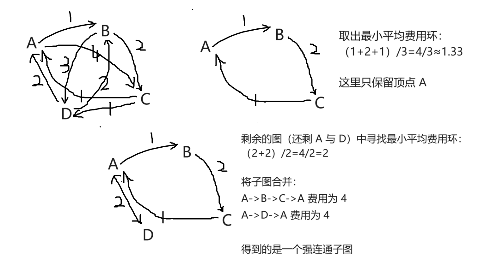

#### 1. 有向 Steiner 树问题不存在 $c\ log\lvert T\rvert$—近似算法

###### 题目描述：

· 在有向斯坦纳树（Steiner tree）问题中，输入一个有向图 $𝐺=(V,A)$，弧 $(i,j)\in A$ 的非负费用 $c_{ij}\geq0$，一个根节点 $r\in V$，以及一组终端节点 $T\subseteq V$

· 目标是找到一棵最小费用的树，使得对于每个 $i\in T$，存在从 $r$ 到 $i$ 的有向路径

· 求证：对于某个常数 $c$，除非 $P=NP$，否则不可能存在一个 $c\ log⁡\lvert T\rvert$ 近似算法来解决有向 Steiner 树问题

###### 问题求解：

· 对于集合覆盖问题：包含 $n$ 个元素的全集 $U$，一个由子集集合 $\{S_1,S_2,\cdots,Sm\}$，一个正整数 $k$ 作为可选子集个数上限

· 构建有向图 $G$：
1. 创建根节点 $r$
2. 对于 $U$ 中每个元素 $e$，创建一个对应的终端节点 $t_e$
3. 对于每个子集 $S_i$，创建一个中间节点 $v_i$
4. 从根节点 $r$ 到每个 $v_i$ 添加一条费用为 0 的有向边
5. 对于每个 $e\in S_i$，从 $v_i$ 到 $t_e$ 添加一条费用为 1 的有向边

· 终端节点集合 $T$ 包含所有对应于 $U$ 中 $e$ 的 $t_e$；目标是找到一个以 $r$ 为根的最小费用的有向 Steiner 树，覆盖 $T$

· 集合覆盖问题（Set Cover Problem）中的 $k$ 对应于 $G$ 中一个费用为 $k$ 的有向 Steiner 树

· 存在一个 $c\ log⁡\lvert T\rvert$ 近似算法来解决有向 Steiner 树问题，意味着存在一个 $c\ log(n)$ 近似算法来解决集合覆盖问题

· 除非 $P=NP$，否则集合覆盖问题不能在优于 $\Omega(log\ n)$ 的因子内进行近似

· 由此，除非 $P=NP$，否则不可能存在一个 $c\ log⁡\lvert T\rvert$ 近似算法来解决有向 Steiner 树问题

【核心：一个集合覆盖问题 —> 一个有向 Steiner 树问题的归约】

#### 2. 用最小平均费用环求强连通欧拉子图是 $2H_n$—近似算法

###### 题目描述：

· 在度量不对称旅行商问题（Metric Asymmetric Traveling Salesman Problem，ATSP）中，给定一个完全有向图 $G=(V,A)$，其中每条弧 $(i,j)\in A$ 都有一个非负费用 $c_{ij}​\geq0$，并且这些弧的费用满足三角不等式：对于 $i,j,k\in V$，有 $c_{ij}+c_{jk}\geq c_{ik}$

· 目标是找到一个费用最小的环路，即一个包含每个顶点恰好一次的有向环，使得该环中弧的总费用最小

· 一种寻找这个问题的近似算法的方法是首先找到输入图的一个最小费用强连通欧拉子图

· 对于一个有向图，如果对于任意顶点对 $i,j\in V$，都有一条从 $i$ 到 $j$ 的路径，并且有一条从 $j$ 到 $i$ 的路径，则这个有向图是强连通图；如果一个有向图中每个顶点的入度等于出度，则该图是欧拉图

· 给定问题输入的一个强连通欧拉子图，可以使用一种称为“简化”（shortcutting）的技术将其转化为一个不大于其费用的环，关键是利用三角不等式

· 一种找到强连通欧拉子图的方法如下：
1. 首先在图中找到一个最小平均费用环（Minimum Mean-Cost Cycle）（环中弧的总费用与环中弧的数量之比最小的有向环），这个最小平均费用环可以在多项式的时间之内找到
2. 任意选择环中的一个顶点保留在图中，然后移除环中的所有其他顶点，即从环中删除其他所有顶点和与它们相关的边，只保留一个顶点及其相关的边
3. 在剩余的图中继续寻找最小平均费用环，选择一个顶点并移除环中的其他顶点，只留下一个顶点及相关边，重复进行这个过程，直到剩下的图仅是一个顶点为止
4. 构建子图：这个子图是由所有找到的环中保留下的弧（边）构成的

· 例：

                      （图一：用最小平均费用环得到强连通图的示例）

【a】证明由上述算法找到的子图是输入图的一个强连通欧拉子图

【b】证明该子图的费用至多为 $2H_n\cdot OPT$，其中 $n=\lvert V\rvert$，$OPT$ 是最优环的费用（得出这个算法是一个 $2H_n$—近似算法的结论），其中 $H_n$ 是第 $n$ 个调和数，n 是 $G$ 的顶点数

###### 问题 a 求解：

· 强连通性证明：输入图 $G$ 是完全有向图，算法每次移除的顶点都是环中的一部分，而环的其余部分仍然保持连通；每次都是从一个环开始，并且保留至少一个顶点，所以强连通性得以保持；最终当只剩下一个顶点时，这个顶点通过之前所有环的边仍然与其他所有顶点连通，因此所有原图中的顶点在最终构造的子图中依然保持强连通

· 欧拉性证明：$G$ 的每一个顶点都是入度等于出度，是欧拉图；每次找到一个环时，该环中的每个顶点的入度和出度成对变化，保留一个顶点不会改变这一性质，因此最终子图保留欧拉性

###### 问题 b 求解：

· 调和数 $H_n$ 的定义为：$H_n=1+\frac{1}{2}+\frac{1}{3}+\cdot+\frac{1}{n}\approx ln(n)+\gamma$（ $\gamma$ 是欧拉-马歇罗尼常数，约等于 0.5772 ）

· 对于找到的每个环 $C_i$：
1. 环的总费用为 $cost(C_i)$
2. 环的平均费用为 $\frac{cost(C_i)}{\lvert C_i\rvert}$
3. 环的顶点数为 $\lvert C_i\rvert$

· 每次找到的环 $C_i$ 的平均费用最小，因此其平均费用小于等于 $\frac{OPT}{n'}$，即：$cost(C_i)\leq \frac{OPT\cdot\lvert C_i\rvert}{n'}$，$n'$ 是当前剩余图的顶点数

· 总费用 $C$ 为所有找到的环的费用之和：$C=\Sigma^k_{i=1}cost(C_i)\leq OPT\cdot\Sigma^k_{i=1}\frac{\lvert C_i\rvert}{n'_i}$，$k$ 是操作次数

· 考虑到每一步实际只删除了 $\lvert C_i\rvert​-1$ 个顶点，并保留一个顶点，这意味着有：$n'_{i}-n'_{i+1}=\lvert C_i\rvert​-1$，即：$\lvert C_i\rvert​=n'_{i}-n'_{i+1}+1\leq n'_i$（剩余顶点至少一个）

· 故而 $C\leq OPT\cdot\Sigma^k_{i=1}(\frac{1}{n'_i})\leq\Sigma^n_{i=1}(\frac{1}{n'_i})\cdot OPT=H_n\cdot OPT$

· 最后一步简化将强连通欧拉子图转为环，费用不会超过 $2C$，故最终得到环的费用小于等于 $2H_n\cdot OPT$

#### 3. 顶点覆盖问题的线性规划形式极点解与 $\frac{3}{2}$—近似算法

###### 题目描述：

【a】考虑顶点覆盖问题的线性规划形式：
- 目标函数：最小化 $\Sigma_{i\in V​}\ w_i​x_i$（ $w$ 表示权重，$x$ 表示选取率）​
- 约束条件：$$x_i+x_j\geq 1,\ \forall(i,j)\in E$$$$x_i\geq 0,\ \forall i\in V$$

· 证明该线性规划的任意极点解 $x$ 都具有 $x_i​\in\{0,\frac{1}{2}​,1\}$ 对于所有 $i\in V$ 成立

· 注：极点解 $x$ 是一个不可表达为 $\lambda x_1+(1-\lambda)x_2$ 的可行解，其中 $0\textless \lambda\textless 1$，且 $x_1$ 和 $x_2$，且 $x_1$ 和 $x_2$ 为不同的可行解

【b】给出一个对于平面图的顶点覆盖问题 $\frac{3}{2}$—近似算法，已知如下事实：
1. 多项式时间的 $LP$ 求解器返回极点解
2. 有一个多项式时间算法可以对任意平面图进行四染色（即算法将每个顶点分配四种颜色之一，使得对于任意边 $(i,j)\in E$，顶点 $i$ 和 $j$ 被分配不同的颜色）

###### 问题 a 求解：

· 线性规划的极点解对应于约束集合中的基本解，基本解是在约束方程组中选择 $n$ 个线性独立的约束，并求解该约束方程组

· 约束包括 $x_i+x_j\geq 1$ 和 $x_i\geq 0$；极点解中，某些 $x_i+x_j=1$ 约束将会变成等式（紧约束），而不是松弛的

· 对于每个顶点 $i$，假设 $x_i$​ 的值不是 $0$ 或 $1$，而是某个介于 $0$ 和 $1$ 之间值，那么它必须满足一些等式约束

· 由于基本解是由 $n$ 个线性独立的约束组成，而 $x_i​+x_j​=1$ 是唯一的线性独立的约束，这意味着如果某个 $x_i$​ 不是 $0$ 或 $1$，那么它必须满足 $x_i​+x_j​=1$ 且其他约束也必须满足

· 在极点解中，任何非整数的 $x_i$ 都必须是 $\frac{1}{2}$ 才能满足线性独立解和基本解的要求，因此线性规划的极点解 $x$ 的每个分量 $x_i$ 只能是 $0$、$\frac{1}{2}$、$1$

###### 问题 b 求解：

- 求解顶点覆盖问题的线性规划松弛问题，得到一个极点解 $x^*$，其中 $x_i^*\in\{0,​\frac{1}{2},1\}$
- 对输入的平面图进行四染色，根据四染色定理，这可以在多项式时间内完成
- 对每种颜色分别考虑顶点的集合$C_1$、$C_2$、$C_3$、$C_4$，对于每种颜色集合，选择 $x^*\geq\frac{1}{2}$ 的顶点，构成顶点覆盖的一部分
- 构造最终的顶点覆盖：$C=\bigcup^4_{i=1}C_i$

· 证明 $\frac{3}{2}$—近似算法：

· 设 $V_i$​ 是色类 $C_i$​ 中顶点的集合，且 $\lvert V_i\rvert​=n_i$​

· 由于“半数定理”：在极点解中，非整数值（即 $x_i^∗​=\frac{1}{2}$ ​）的个数受限，不超过约束条件数的一半

· 设 $n_{i,\frac{1}{2}}$​​ 为颜色类 $C_i$​ 中 $x_i^*​=\frac{1}{2}$​ 的顶点数量，$n_{i,1}$​ 为 $x_i^*​=1$ 顶点数量，$n_{i,0}$​ 为 $x_i^*=0$ 顶点数量，因此有：$n_i=n_{i,\frac{1}{2}}+n_{i,1}+n_{i,0}$

· 在颜色 $C_i$ 中，选择 $n_{i,\frac{1}{2}}+n_{i,1}$ 个顶点，且 $n_{i,\frac{1}{2}}\leq\frac{n_i}{2}$，$n_{i,1}\leq n_i$，故选择顶点数小于等于 $\frac{3n_i}{2}$

· 由于 $LP$ 松弛解的性质：$\sum_{i\in V}x^*_i=\frac{1}{2}\cdot n_{i,\frac{1}{2}}+1\cdot n_{i,1}\leq OPT$，故：$$\lvert C\rvert=\sum_{i=1}^4(n_{i,\frac{1}{2}}+n_{i,1})\leq\frac{3}{2}OPT$$

· 故得证上述算法为 $\frac{3}{2}$—近似算法

