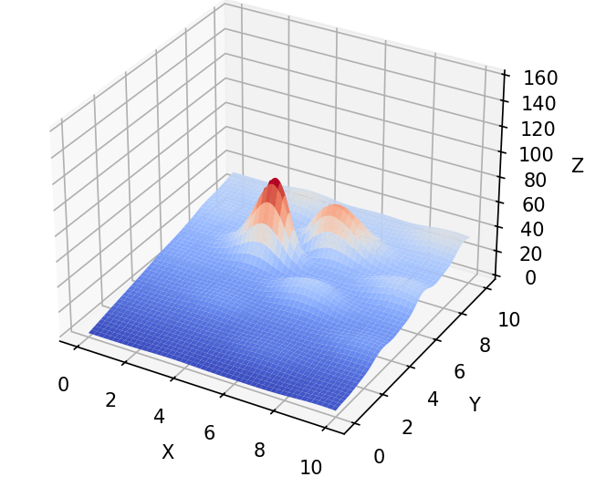
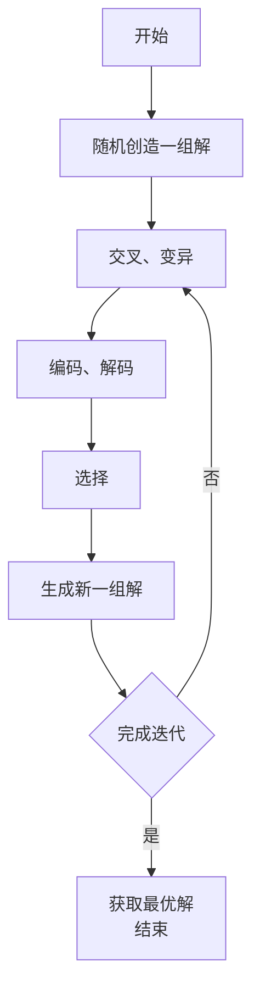
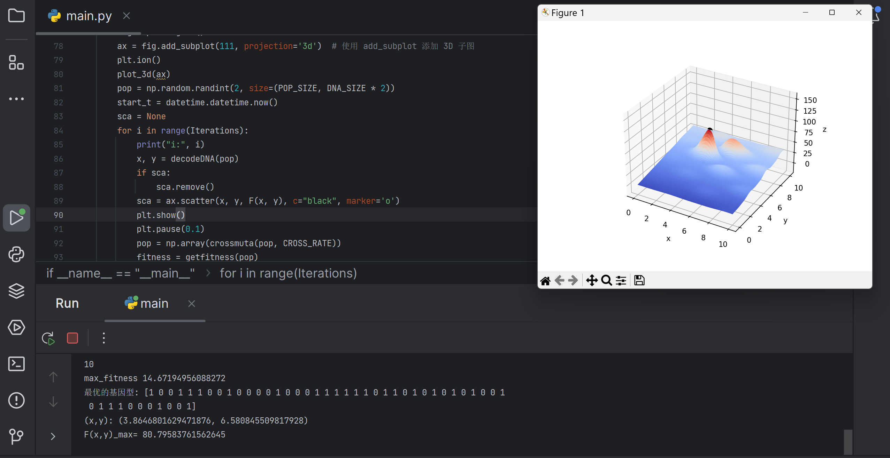

#### 遗传算法简介：

###### · 达尔文在著作《物种起源》（On The Origin of Species）中阐明了两个主要观点：
1. 物种是可变的，生物是进化的
2. 自然选择是生物进化的动力
###### · 遗传算法的思想基础是“物竞天择，适者生存”
###### · 遗传算法是通过不断迭代来寻求最优解的一种过程，将次解淘汰，优解保留并重新进行迭代，在一次次计算中，不断地趋近（而非等于）最优解的算法


#### 遗传算法基本概念：

##### 1. 目标函数——环境：
· 在一定的区域内（目标函数 x，y 的取值范围）的环境水平，如地势高低（ $F(x,y)$ 值的大小）
如下图：

                              （图一：目标函数——环境示例）
· 目标函数：$$z=6.452(x+0.25y)\cdot[(cosx-cos2y)]^2/(0.8+(x-4.2)^2+2(y-7)^2)+3.226y$$
· <font color="#ffc000">绘图 Python 代码</font>：
```Python
import matplotlib.pyplot as plt  
from mpl_toolkits.mplot3d import Axes3D  
import numpy as np  
  
# 数据生成  
x = np.linspace(0, 10, 200)  
y = np.linspace(0, 10, 200)  
x, y = np.meshgrid(x, y)  
  
# 修正后的给定函数  
z = (6.452 * (x + 0.125 * y) * (np.cos(x) - np.cos(2 * y))**2) / (0.8 + (x - 4.2)**2 + 2 * (y - 7)**2) + 3.226 * y  
  
# 绘图  
fig = plt.figure()  
ax = fig.add_subplot(111, projection='3d')  
ax.plot_surface(x, y, z, cmap='coolwarm')  
  
ax.set_xlabel('X')  
ax.set_ylabel('Y')  
ax.set_zlabel('Z')  
ax.set_zlim(0, 160)  
  
plt.show()
```

##### 2. 一组解和最优解——种群和最适宜种群：
· 在给定区域内，存在于环境中不同位置的个体数目适中、可繁衍的一个种群（一组不断迭代询求最有的解）
· 初始组随机分布在 $F(x,y)$ 上
· 初始解规模不应该太大，否则计算复杂性高；也不应该太小，否则容易陷入局部最优解

##### 3. 解和编码——个体与基因型：
· 种群中的一个个体就是一个解
· 基因型在遗传算法中通常以一个二进制编码储存

##### 4. 解码——表现型：
· 基因型映射为表现型，即将解的二进制数组转化为相应的 x，y 值

· 几个重要概念：
1. $l$ 为二进制编码长度
2. $\delta$ 为精度：将一条线段化为无数小线段，每条小线段的距离；这里引入精度的概念，是因为我们无法取到线段上的每一个点，只可以退而求次改为线段上的 $2^l$ 个点，分割出的 $2^l-1$ 个小线段的长度称为精度
3. 取值下界 $L_x$：x 或 y 的最小值（二元函数为例）
4. 取值上界 $U_x$：x 或 y 的最大值
5. $U_x-L_x$：给定的 x 或 y 的范围的长度
6. $\Sigma^l_{i=1}A_i2^{i-1}$：将一个解的二进制编码转换为十进制
7. $x$：解的 x 或 y 值
相关公式：
$$精度:\ \delta=\frac{U_x-L_x}{2^l-1}$$$$解码:\ x=L_x+\delta\ \Sigma^l_{i=1}A_i2^{i-1}$$

##### 5. 交叉和变异——繁衍中的染色体交叉互换与基因突变：
· 在产生后代时，亲代染色体交叉，繁衍中可能出现基因突变，导致子代基因型出现变化（即根据已有解创造下一组解的一部分）
· 注意：并非所有解都需要进行交叉或变异，在遗传算法中并不是将解的二进制编码折半交叉，而是随机取一段不定长部分进行交换
· 交叉是为了确保大方向朝着最优解方向，变异是为了“逃出”局部最优解

| “交换”前后两组解 |     |     | 交换  | 交换  | 交换  | 交换  |     | $A$ 突变 |     |
| :-------- | :-- | :-- | :-- | :-- | :-- | :-- | :-- | ------ | --- |
| $A$       | ……  | 1   | 1   | 1   | 0   | 1   | 0   | 0      | ……  |
| $B$       | ……  | 0   | 1   | 0   | 0   | 1   | 1   | 0      | ……  |
| $A'$      | ……  | 1   | 1   | 0   | 0   | 1   | 0   | 1      | ……  |
| $B'$      | ……  | 0   | 1   | 1   | 0   | 1   | 1   | 0      | ……  |

##### 6. 适应度——个体能力：
· 解的适应度函数值与一组解适应度函数值之和的比值表示在迭代中解被保留下来的概率
· 在这里引入适应度函数 $Fit(f(x))$，其中 $f(x)$ 为一个解（注意：适应度函数非负）
· $C_{min}$：这一组解中的最小值
· $C_{max}$：这一组解中的最大值
· 最大值问题：$$Fit(f(x))=\begin{cases}f(x)-C_{min},\ \ f(x)\textgreater C_{min}\\ 0,\ \ else\end{cases}$$
· 最小值问题：$$Fit(f(x))=\begin{cases}C_{max}-f(x),\ \ f(x)\textless C_{min}\\ 0,\ \ else\end{cases}$$
· 上述两个分段函数均表示概率所以非负，并且解的适应度函数值都是越大越容易保留（但不一定真能保留）

##### 7. 选择——优胜劣汰：
· 在产生新一代种群时，注定有亲代和子代被淘汰（根据适应度有偏向地选出下一组同样大小的一组解）


#### 遗传算法的流程图




#### 代码实现

###### · 需要的 Python 库：
```Python
import numpy as np
from numpy.ma import cos
import matplotlib.pyplot as plt
from matplotlib import cm
from mpl_toolkits.mplot3d import Axes3D # 建模，不必需
import datetime  # 统计时间，不必需
```

###### · 初始变量定义：
```Python
DNA_SIZE = 24  # 编码长度
POP_SIZE = 100  # 种群大小
CROSS_RATE = 0.5  # 交叉率
MUTA_RATE = 0.15  # 变异率
Iterations = 50  # 迭代次数
X_BOUND = [0, 10]  # X区间
Y_BOUND = [0, 10]  # Y区间
 
 
def F(x, y):  # 函数
    return (6.452*(x+0.125*y)*(cos(x)-cos(2*y))**2)/(0.8+(x-4.2)**2+2*(y-7)**2)+3.226*y
```
· 函数为：$$z=6.452(x+0.25y)\cdot[(cosx-cos2y)]^2/(0.8+(x-4.2)^2+2(y-7)^2)+3.226y$$

###### · 适应度函数、编码、解码、交叉、变异：
```Python
import numpy as np
from math import cos

# 定义目标函数 F(x, y)
def F(x, y):  # 函数
    # 返回计算值
    return (6.452 * (x + 0.125 * y) * (cos(x) - cos(2 * y)) ** 2) / (0.8 + (x - 4.2) ** 2 + 2 * (y - 7) ** 2) + 3.226 * y

# 计算适应度函数 getfitness
def getfitness(pop):  # 适应度函数
    x, y = decodeDNA(pop)  # 解码 DNA 得到 x 和 y 坐标
    temp = F(x, y)  # 计算函数值
    # 返回适应度值，适应度值越大表示个体越优
    return (temp - np.min(temp)) + 0.0001

# 将二进制 DNA 转换为对应的 x 和 y 坐标
def decodeDNA(pop):  # 二进制转坐标，解码
    x_pop = pop[:, 1::2]  # 选择 DNA 中的奇数位作为 x 的二进制编码
    y_pop = pop[:, ::2]  # 选择 DNA 中的偶数位作为 y 的二进制编码
    # .dot() 用于矩阵相乘，将二进制编码转换为十进制数，并缩放到指定范围
    x = x_pop.dot(2 ** np.arange(DNA_SIZE)[::-1]) / float(2 ** DNA_SIZE - 1) * (X_BOUND[1] - X_BOUND[0]) + X_BOUND[0]
    y = y_pop.dot(2 ** np.arange(DNA_SIZE)[::-1]) / float(2 ** DNA_SIZE - 1) * (Y_BOUND[1] - Y_BOUND[0]) + Y_BOUND[0]
    return x, y

# 选择操作，根据适应度值选择较优的个体
def select(pop, fitness):  # 选择
    # 根据适应度值随机选择个体，适应度值越大，被选择的概率越高
    temp = np.random.choice(np.arange(POP_SIZE), size=POP_SIZE, replace=True, p=fitness / (fitness.sum()))
    return pop[temp]

# 变异操作，将 DNA 中的某个基因位反转
def mutation(temp, MUTA_RATE):  # 变异
    if np.random.rand() < MUTA_RATE:  # 以一定概率发生变异
        mutate_point = np.random.randint(0, DNA_SIZE)  # 随机选择一个基因位
        temp[mutate_point] = temp[mutate_point] ^ 1  # 将该基因位反转，^ 为异或运算

# 交叉和变异操作，生成新种群
def crossmuta(pop, CROSS_RATE):  # 交叉
    new_pop = []
    for i in pop:
        temp = i
        if np.random.rand() < CROSS_RATE:  # 以一定概率进行交叉
            j = pop[np.random.randint(POP_SIZE)]  # 随机选择另一个个体
            cpoints1 = np.random.randint(0, DNA_SIZE * 2 - 1)  # 随机选择交叉起点
            cpoints2 = np.random.randint(cpoints1, DNA_SIZE * 2)  # 随机选择交叉终点
            temp[cpoints1:cpoints2] = j[cpoints1:cpoints2]  # 进行交叉操作
            mutation(temp, MUTA_RATE)  # 对交叉后的个体进行变异
        new_pop.append(temp)
    return new_pop

# 其他相关变量定义和初始化（假设这些变量在代码的其他地方定义）
DNA_SIZE = 10  # DNA 长度
POP_SIZE = 100  # 种群大小
X_BOUND = [0, 10]  # x 坐标范围
Y_BOUND = [0, 10]  # y 坐标范围
MUTA_RATE = 0.01  # 变异率
CROSS_RATE = 0.7  # 交叉率
```

###### · 建模、杂项、主函数：
```Python
if __name__ == "__main__":  # 主函数
    import matplotlib.pyplot as plt
    from mpl_toolkits.mplot3d import Axes3D
    from matplotlib import cm
    import numpy as np
    import datetime

    # 定义参数
    DNA_SIZE = 10  # 二进制编码长度
    POP_SIZE = 100  # 种群大小
    X_BOUND = [0, 10]  # x 坐标范围
    Y_BOUND = [0, 10]  # y 坐标范围
    MUTA_RATE = 0.01  # 变异率
    CROSS_RATE = 0.7  # 交叉率
    Iterations = 100  # 迭代次数

    fig = plt.figure()
    ax = Axes3D(fig)
    # 如果出现程序跑通但不显示图片问题，请使用以下两行代码，注释掉 ax=Axes3D(fig)
    # ax = Axes3D(fig, auto_add_to_figure=False)
    # fig.add_axes(ax)
    plt.ion()  # 打开交互模式
    plot_3d(ax)  # 绘制初始3D曲面图
    pop = np.random.randint(2, size=(POP_SIZE, DNA_SIZE * 2))  # 生成初始种群

    start_t = datetime.datetime.now()  # 记录开始时间
    for i in range(Iterations):  # 遗传算法迭代
        print("i:", i)
        x, y = decodeDNA(pop)  # 解码种群
        if 'sca' in locals():  # 如果 sca 存在，删除旧的散点图
            sca.remove()
        sca = ax.scatter(x, y, F(x, y), c="black", marker='o')  # 绘制新的散点图
        plt.show()
        plt.pause(0.1)
        pop = np.array(crossmuta(pop, CROSS_RATE))  # 交叉变异生成新种群
        fitness = getfitness(pop)  # 计算新种群的适应度
        pop = select(pop, fitness)  # 选择生成下一代

    end_t = datetime.datetime.now()  # 记录结束时间
    print((end_t - start_t).seconds)  # 打印算法运行时间
    print_info(pop)  # 打印最优解信息
    plt.ioff()  # 关闭交互模式
    plot_3d(ax)  # 绘制最终的3D曲面图
```

###### · 全代码：
```Python
import numpy as np  
from numpy.ma import cos  
import matplotlib.pyplot as plt  
from matplotlib import cm  
from mpl_toolkits.mplot3d import Axes3D  # 确保使用正确的 3D 工具包  
import datetime  # 用于统计时间  
  
DNA_SIZE = 24  # 编码长度  
POP_SIZE = 100  # 种群大小  
CROSS_RATE = 0.5  # 交叉率  
MUTA_RATE = 0.15  # 变异率  
Iterations = 50  # 迭代次数  
X_BOUND = [0, 10]  # X 区间  
Y_BOUND = [0, 10]  # Y 区间  
  
def F(x, y):  # 目标函数  
    return (6.452 * (x + 0.125 * y) * (cos(x) - cos(2 * y)) ** 2) / (  
        0.8 + (x - 4.2) ** 2 + 2 * (y - 7) ** 2) + 3.226 * y  
  
def getfitness(pop):  # 适应度函数  
    x, y = decodeDNA(pop)  
    temp = F(x, y)  
    return (temp - np.min(temp)) + 0.0001  
  
def decodeDNA(pop):  # 二进制转坐标，解码  
    x_pop = pop[:, 1::2]  
    y_pop = pop[:, ::2]  
    x = x_pop.dot(2 ** np.arange(DNA_SIZE)[::-1]) / float(2 ** DNA_SIZE - 1) * (X_BOUND[1] - X_BOUND[0]) + X_BOUND[0]  
    y = y_pop.dot(2 ** np.arange(DNA_SIZE)[::-1]) / float(2 ** DNA_SIZE - 1) * (Y_BOUND[1] - Y_BOUND[0]) + Y_BOUND[0]  
    return x, y  
  
def select(pop, fitness):  # 选择  
    temp = np.random.choice(np.arange(POP_SIZE), size=POP_SIZE, replace=True, p=fitness / fitness.sum())  
    return pop[temp]  
  
def mutation(temp, MUTA_RATE):  # 变异  
    if np.random.rand() < MUTA_RATE:  
        mutate_point = np.random.randint(0, DNA_SIZE)  
        temp[mutate_point] = temp[mutate_point] ^ 1  # ^ 为异或运算  
  
def crossmuta(pop, CROSS_RATE):  # 交叉  
    new_pop = []  
    for i in pop:  
        temp = i.copy()  # 确保复制个体  
        if np.random.rand() < CROSS_RATE:  
            j = pop[np.random.randint(POP_SIZE)]  
            cpoints1 = np.random.randint(0, DNA_SIZE * 2 - 1)  
            cpoints2 = np.random.randint(cpoints1, DNA_SIZE * 2)  
            temp[cpoints1:cpoints2] = j[cpoints1:cpoints2]  
        mutation(temp, MUTA_RATE)  
        new_pop.append(temp)  
    return new_pop  
  
def print_info(pop):  # 输出最优解等  
    fitness = getfitness(pop)  
    maxfitness = np.argmax(fitness)  
    print("max_fitness", fitness[maxfitness])  
    x, y = decodeDNA(pop)  
    print("最优的基因型:", pop[maxfitness])  
    print("(x,y):", (x[maxfitness], y[maxfitness]))  
    print("F(x,y)_max=", F(x[maxfitness], y[maxfitness]))  
  
def plot_3d(ax):  # 绘制3D图  
    X = np.linspace(*X_BOUND, 100)  
    Y = np.linspace(*Y_BOUND, 100)  
    X, Y = np.meshgrid(X, Y)  
    Z = F(X, Y)  
    ax.plot_surface(X, Y, Z, rstride=1, cstride=1, cmap=cm.coolwarm)  
    ax.set_zlim(-20, 160)  
    ax.set_xlabel('x')  
    ax.set_ylabel('y')  
    ax.set_zlabel('z')  
    plt.pause(0.5)  
    plt.show()  
  
if __name__ == "__main__":  # 主函数  
    fig = plt.figure()  
    ax = fig.add_subplot(111, projection='3d')  # 使用 add_subplot 添加 3D 子图  
    plt.ion()  
    plot_3d(ax)  
    pop = np.random.randint(2, size=(POP_SIZE, DNA_SIZE * 2))  
    start_t = datetime.datetime.now()  
    sca = None  
    for i in range(Iterations):  
        print("i:", i)  
        x, y = decodeDNA(pop)  
        if sca:  
            sca.remove()  
        sca = ax.scatter(x, y, F(x, y), c="black", marker='o')  
        plt.show()  
        plt.pause(0.1)  
        pop = np.array(crossmuta(pop, CROSS_RATE))  
        fitness = getfitness(pop)  
        pop = select(pop, fitness)  
    end_t = datetime.datetime.now()  
    print((end_t - start_t).seconds)  
    print_info(pop)  
    plt.ioff()  
    plot_3d(ax)
```


#### 运行结果


（图二：遗传算法运行结果示例）


```
参考：
1. RSociopath《遗传算法(Genetic Algorithm, GA)详解及其Python代码实现》
（CSDN：https://blog.csdn.net/RSociopath/article/details/124137755?ops_request_misc=&request_id=&biz_id=102&utm_term=%E9%81%97%E4%BC%A0%E7%AE%97%E6%B3%95&utm_medium=distribute.pc_search_result.none-task-blog-2~all~sobaiduweb~default-1-124137755.142^v100^control&spm=1018.2226.3001.4187）
```