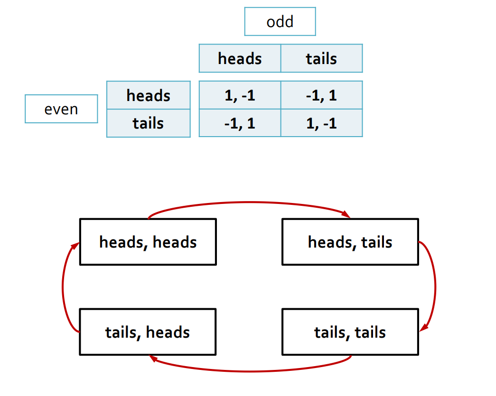

### 壹  博弈理论

#### 述：
##### 驱车扫横纵，驭马踏八方.
##### 将军帐中坐，士卫立两旁。
##### 贤相忙营外，勇卒过河梁。
##### 火炮多辗转，立威迫敌降。

###### · 博弈理论（Games Theory）：
· “我们生活在一个高度互联的世界中，多个自利主体相互作用，导致无数冲突和合作的机会。”（“We live in a highly connected world, with multiple self-interested agents interacting, leading to myriad opportunities for conflflict and cooperation.”）——《Game Theory, Alive》序言

· *博弈*（Games）是一种思想实验，帮助我们学习如何在冲突或合作的情况下预测理性行为
· *冲突或合作情境*：每个人的行为都会影响他人
· *理性行为*：玩家希望最大化自己的预期效用
· *预测*：我们想知道博弈中会发生什么，这样的预测被称为解决概念（例如，纳什均衡（Nash equilibrium：博弈论中的一个概念，指在多人博弈中，每个参与者都采取了最优策略，而且没有人可以通过改变自己的策略来获得更好的结果））

· **纳什均衡（Nash equilibrium）**：
· 非正式地说，均衡（equilibrium）是一个稳定的状态，可以通过随机性来引入“混合策略”的概念
· 考虑下表中的剪刀石头布游戏，剪刀-S，石头-R，布-P

|     | S    | P    | R    |
| :-- | :--- | :--- | :--- |
| S   | 0，0  | 1，-1 | -1，1 |
| P   | -1，1 | 0，0  | 1，-1 |
| R   | 1，-1 | -1，1 | 0，0  |

· 纳什均衡就是这样一组策略，行玩家的策略是对列玩家策略的最优对策，反之亦然

· **机制设计（Mechanism Design）**：
· 在有战略参与者的系统中，规则很重要
· 例：田忌赛马
· 所谓“机制设计”就是设计规则，使战略行为产生理想的结果

###### · 囚徒困境（Prisoner’s dilemma）：
· 两个人被警察抓住并被指控犯罪
· 他们每个人都有两个选择：
1. 承认罪行
2. 保持沉默
· 每个可能的场景（两个囚犯的行动组合）都会给他们带来一些收益/成本：
1. 如果两人都认罪，他们将各自入狱 3 年
2. 如果两人都保持沉默，他们只会入狱 1 年
3. 如果一个人认罪，另一个人保持沉默，那么前者将被释放，后者将被判入狱 5 年

· 用双矩阵（bi-matrix）来表示它们的收益：

| ----       | 承认 confess | 沉默 silent |
| :--------- | :--------- | :-------- |
| 承认 confess | -3，-3      | 0，-5      |
| 沉默 silent  | -5，0       | -1，-1     |
· 囚犯如何思考才能找到最佳行动？
· 假设“列”囚犯招供，认罪将被判 3 年监禁，保持沉默将面临 5 年监禁 —— best action = confess
· 假设“列”囚犯保持沉默，认罪可判 0 年监禁，保持沉默会被判 1 年监禁 —— best action = confess
· 在任何情况下，坦白都是最好的行为，由于对称，对于“行”囚犯也是如此
· 坦白是两个囚犯的优势策略，因为无论另一个囚犯做什么，坦白总是更好

###### · 一般的策略游戏（Strategic games）：
· 一组玩家（players）
· 每个玩家都有一套可能的策略（行动）（strategies/actiongs）
· 游戏的每个状态（由每个玩家的策略定义）都会给每个玩家带来收益（或效用）
· 给定其他参与者的策略，每个参与者的目标是选择自己的策略，以最大化其效用——最佳对策
· 由最佳对策组成的状态是稳定的，被称为**纯纳什均衡**：没有参与者愿意偏离并选择不同的策略

· 在**囚徒困境**中：
· 玩家为两个囚犯
· 策略 strategies = { 承认 confess，沉默 silent}
· 所有可能的状态：{ (confess, confess), (confess, silent), (silent, confess), (silent, silent) }
· 效用可以由双矩阵给出
· 坦白是对其他参与人任何策略的最佳对策
· （坦白，坦白）是一个纯纳什均衡的博弈

###### · 纳什动力学图（Nash dynamics graph）：
· 一个简单的图解纳什均衡的方法
· 构建一个包含每个状态一个节点的图
· 两个节点之间的有向边表示存在一个具有有利单边偏差的玩家
· 只有传入边的节点对应于平衡状态：没有玩家愿意偏离那里

· 例：一对夫妇（一男一女）想决定今晚做什么;他们要么去看体育比赛，要么呆在家里看电影；他们对这两种活动有不同的实用程序，但他们希望在一起：

| woman \ man | sports | movie |
| :---------- | :----- | :---- |
| sports      | 3，6    | 1，1   |
| movie       | 2，2    | 6，3   |

                            （图一：夫妻调和纳什动力学图）
· 故而可知：（sports，sports）和（movie，movie）都是均衡态（equilibrium）

· **不是所有的游戏都存在纯均衡（pure equilibrium）**：

                         （图二：硬币猜奇偶问题的纳什动力学图）

###### · 混合策略（Mixed strategies）：
· 前面已知：不是所有的游戏都存在纯均衡（pure equilibrium）
· 如果允许玩家随机选择策略呢？
· 设 $S_i$ = 玩家 $i$ 的一套纯策略
· 玩家 $i$ 的混合策略定义了他采取策略 $a$ 的可能性 $p_i(a)$，这里 $a\in S_i$ 且 $\Sigma_{a\in S_i}\ p_i(a)=1$
· 整个游戏产生状态 $s=(s_1,s_2,\ldots,s_n)$ 的可能性为：$$p(s)=p_1(s_1)\cdot p_2(s_2)\cdots p_n(s_n)=\Pi_i\ p_i(s_i)$$
· 那么玩家 $i$ 的期望效用（expected utility）为：$$E_p(u_i)=\Sigma_s\ p(s)\cdot u_i(s)$$

· **混合策略均衡（Mixed equilibria）**：
· 混合均衡是一种混合策略的概况，使每个参与者在给定其他参与者的策略的情况下最大化其预期效用
· 1951 年 Nash 提出定理：Every finite strategic game of $n$ players has at least one mixed equilibrium（每个有限博弈参与者至少有一个混合均衡）
· 每一个纯均衡也是一个混合均衡：每个纯策略都可以看作是所有策略的概率分布，这个纯策略的概率为 1

· 每个参与人的期望效用是对应概率的线性函数
· 为了分析玩家的行为，我们需要看到线性函数的斜率是负的还是正的：
1. 负的：函数在减少，玩家的目标是为概率设置一个小值  
2. 正的：功能在增加，玩家的目标是为概率设置一个高值
· 对于硬币奇偶问题：

| 偶 even \ 奇 odd | heads | tails |
| :------------- | :---- | :---- |
| heads          | 1，-1  | -1，1  |
| tails          | -1，1  | 1，-1  |
假设抛出的两枚硬币都是不均匀的，正面抛出的概率分别是 $x$ 与 $y$

                       （图三：硬币猜奇偶问题的两位玩家期望效用）

· 这里假设奇数玩家抛出的硬币正面概率是 $y$，偶数玩家抛出的硬币正面概率是 $x$，二者对于自己抛出的硬币的偏性概率有选择权（即 even 玩家自己选择 $x$，odd 玩家自己选择 $y$ ）
· 对于偶数玩家来说，他的期望效用以 $x$ 作为主变量，斜率是 $4y-2$，而且它取决于奇数玩家选择正面的概率 $y$
① 当 $0\textless y\textless\frac{1}{2}$ 时，斜率 $4y-2\textless 0$，因此为了最大化效用 $E_p(u_e)$，$x$ 必须取 $0$
此时对于奇数玩家来说，斜率为 $2-4x=2\textgreater 0$，故 $y$ 又越大越好，最好取 $1$
—> 产生矛盾（contradiction）
② 当 $y\textgreater 0$ 时，斜率 $4y-2\textgreater 0$，为了最大化效用 $E_p(u_e)$ ，$x$ 必须取 $1$
此时对于奇数玩家来说，斜率为 $2-4x=-2\textless 0$，故 $y$ 又越小越好，最好取 $0$
—> 产生矛盾（contradiction）
· 所以 $x$ 与 $y$ 必须同时取 $\frac{1}{2}$：此时两个斜率都等于 $0$，线性函数最大
· 因此 $pair(x,y)=(\frac{1}{2},\frac{1}{2})$ 对应的是混合均衡，这在这个博弈中是唯一的

###### · 不平衡协调（unbalanced coordination）：
· 合作问题：规则如下：
1. 两个参与人有两种可能的策略 A 和 B  
2. 如果两个玩家都选择 A，他们得 1 分  
3. 如果他们都选择 B，他们得 2 分  
4. 如果选择不同的策略，他们得 0 分

| row player \ col player | A   | B   |
| :---------------------- | :-- | :-- |
| A                       | 1，1 | 0，0 |
| B                       | 0，0 | 2，2 |

· 很容易证明（A，A）和（B，B）是纯均衡
· 设行玩家选择 A 的概率是 $x$，选择 B 的概率是 $1-x$
· 设列玩家选择 A 的概率为 $y$，选择 B 的概率为 $1-y$
· 则有：$$\begin{cases} p(A,A)=xy\\ p(A,B)=x(1-y)\\ p(B,A)=(1-x)y\\ p(B,B)=(1-x)(1-y)\end{cases}$$
· 故：$$E_p(u_r)=xy+x(1-y)\cdot 0+(1-x)y\cdot 0+2(1-x)(1-y)=x(3y-2)+2-2y$$$$E_p(u_c)=xy+x(1-y)\cdot 0+(1-x)y\cdot 0+2(1-x)(1-y)=y(3x-2)+2-2x$$
· 如果 $y\textless\frac{2}{3}$，则 $E_p(u_r)$ 的斜率是负的，此时 $x=0$ 是最优取法
故而 $E_p(u_c)$ 的斜率为 $3x-2=-2\textless 0$，则 $y=0$ 是最优取法
· 由此 $(x,y)=(0,0)$ 是一个混合均衡，同样它也对应于纯均衡 $(A,A)$
· 如果 $y\textgreater\frac{2}{3}$，则 $E_p(u_r)$ 的斜率是正的，此时 $x=1$ 是最优取法
故而 $E_p(u_c)$ 的斜率为 $3x-2=1\textgreater 0$，则 $y=1$ 是最优取法
· 由此 $(x,y)=(1,1)$ 是一个混合均衡，同样它也对应于纯均衡 $(B,B)$
· 用 $x$ 和 $\frac{2}{3}$ 的讨论同理
· 当 $x=y=\frac{2}{3}$ 时，对于这个游戏，这是一个完全混合均衡（fully mixed equilibrium）

###### · 小结（Summary）：
· 优势策略（dominant strategy）：一种永远是最佳对策的策略
· 纯均衡（pure equilibrium）：每个参与者都选择了最佳对策，并且没有偏离的动机
· 纯均衡不能保证存在
· 混合策略（mixed strategy）：策略集合上的概率分布
· 混合均衡（mixed equilibrium）：每个参与者都选择一种混合策略，这是对其他参与者混合策略的最佳回应
· 总是存在至少一个混合均衡（有限对策）
· 每一个纯均衡都是混合均衡
· 在 $2\times 2$ 游戏中计算混合均衡：定义每个玩家的参数化概率分布，计算游戏状态的概率分布，计算每个玩家的期望效用，并将其写成参数的线性函数，讨论斜率（负，正，零）

### 贰  拥塞博弈

#### 述：
#####
#####

###### · 拥塞博弈（Congestion games）：
· **拥塞博弈的基本定义**：
· 假设有 $n$ 个玩家 $N=\{1,2,\cdots,n\}$，$m$ 个资源 $E=\{1,2,\cdots,m\}$
· 每个资源 $e\in E$ 对应的延迟函数（latency function）$f_e$：$\mathbb{N}\rightarrow\mathbb{R}^+$（它将使用该资源的玩家数量 $x$ 映射到每个玩家所经历的延迟（或成本）；该函数定义在自然数集合 $\mathbb{N}$ 上，并输出非负实数 $\mathbb{R}^+$）
· 延迟函数 $f_e(x)$ 是*非递减的*，这意味着随着使用资源 $e$ 的玩家数量增加，每个玩家的延迟不会减少，可能会增加
· 每个玩家 $i$ 有一组策略：$S_i\subset 2^E$（其中 $2^E$ 表示 $E$ 的幂集，也就是所有可能的资源子集的集合，$S_i$​ 中的每个策略都是玩家可以选择使用的资源的子集）
· 状态 $s=(s_1​,s_2,\ldots,s_n​)$

· 定义：
1. 资源的负载 $n_e(s)$：资源 $e$ 在状态 $s$ 下的负载 $n_e(s)$ 等于使用该资源的玩家数量：$$n_e(s)=|\{i\in N:e\in s_i\}|$$
2. 玩家的成本 $cost_i(s)$：玩家 $i$ 在状态 $s$ 下的成本等于她使用的所有资源的总延迟：$$cost_i(s)=\Sigma_{e\in s_i}\ f_e(n_e(s))$$ 

###### · 网络拥塞博弈（Network congestion games）：
· 网络由有向图 $G$ 定义
· 玩家 $i$ 想要将数据从源节点 $z_i$ 传输到接收节点 $t_i$
· 图 $G$ 中的每一条有向边对应一个资源，并具有一个延迟函数，该函数表示选择该边的玩家数量所带来的使用成本
· 玩家 $i$ 的策略集 $S_i$ 包含从 $z_i$ 到 $t_i$ 的所有路径
· 如果所有玩家都有相同的源节点 $z$ 和汇聚节点 $t$，那么他们都有相同的可能策略集合，游戏就是对称的

                               （图四：网络拥塞博弈示例）

###### · 负载平衡游戏（Load balancing games）：
· 一组机器
· 玩家的工作需要相同的处理时间（权重）
· 每个玩家的目标是将自己的工作分配给一台机器，以最大限度地减少等待时间
· 这些机器可以并行处理分配给它们的所有作业，但处理速度不同
· 如果玩家 $x$ 选择同一台机器的速度 $v$，那么每个玩家的成本等于 $f_v(x)=x/v$

· 例：
· 两台机器，$M_1$ 的工作速度 $v_1=1$，$M_2$ 的工作速度 $v_2=2$
· 两个玩家都有需要 $1$ 小时处理的任务
· 如果他们都选择 $M_1$，则每人的 cost 为 $2$
· 如果他们都选择 $M_2$，则每人的 cost 为 $1$
· 如果他们一个选择 $M_1$，一个选择 $M_2$，则前者 cost 是 $1$，后者 cost 是 $\frac{1}{2}$
（需要等待所有人完成才结算 cost，所以如果选择 $M_1$，两人 cost 都是 $2$）

|       | $M_1$ | $M_2$ |
| :---- | :---- | :---- |
| $M_1$ | 2，2   | 1，1/2 |
| $M_2$ | 1/2，1 | 1，1   |
· 除了 $(1,1)$ 之外的所有状态都是均衡状态

· 当 $M_1$ 的速度改为 $v_1=\frac{1}{2}$，则：

|       | $M_1$ | $M_2$ |
| :---- | :---- | :---- |
| $M_1$ | 4，4   | 2，1/2 |
| $M_2$ | 1/2，2 | 1，1   |
· 对于每个玩家来说，选择 $M_2$ 是一种优势策略

###### · 势函数（Potential functions）：
· 假设 $\Phi$ 是一个函数，它将游戏状态作为输入并返回一个实值
· 势函数（潜在函数）的定义：$\Phi$ 是一个潜在函数，当且仅当对于每两个状态 $s_1$ 和 $s_2$，它们只在某个玩家 $i$ 的策略上有所不同时，以下两个量 $\Phi(s_1)-\Phi(s_2)$ 和 $\text{cost}_i(s_1)-\text{cost}_i(s_2)$ 具有相同的符号：$$(\Phi(s_1)-\Phi(s_2))(\text{cost}_i(s_1)-\text{cost}_i(s_2))\textgreater 0$$
· 在纳什动力学图中每个圆圈代表一种状态，每个箭头对应于单个玩家改变策略以降低成本的偏离
· 橙色节点是游戏的均衡状态
· 为了定义一个势函数，我们要为每个状态定义一个值，这个值要小于指向它的状态的值

                           （图五：纳什动力学图中的均衡状态）

                                （图六：势函数的赋值）

· 定理：如果一个有限博弈存在一个势函数，那么它至少有一个纯均衡
· 设 $\Phi$ 为该博弈的潜在函数：
· 由于该博弈有有限的状态，所以存在一个状态 $s$，使得 $\Phi$ 在该状态下达到最小值
· 设 $s^{'}$ 为博弈中的另一个状态，且它与 $s$ 仅在单个玩家 $i$ 的策略上有所不同
· 我们有 $\Phi(s^{'})\geq\Phi(s)$
· 根据潜在函数的定义，我们得到 $\text{cost}_i(s^{'})\geq\text{cost}_i(s)$
· 由于这个结论对每个玩家都成立，因此 $s$ 必然是一个均衡状态

· 对于拥塞博弈这一类，Rosenthal 【1973】定义了以下函数：$$\Phi(s)=\Sigma_{e\in E}​\ \Sigma^{n_e​(s)​}_{k=1}\ f_e​(k)$$
· $n_e​(s)$ 是资源 $e$ 在状态 $s$ 下的负载，也就是使用该资源的玩家数量
· $fe_​(k)$ 是资源 $e$ 在有 $k$ 名玩家使用时的延迟（或成本），该延迟可能随使用该资源的玩家数量 $k$ 增加而增加

· 证明 Rosenthal 函数是拥堵博弈的一个潜在函数：
· => 每个拥堵游戏都至少有一个纯均衡
· 定理：Rosenthal 函数是每个拥塞博弈的潜在函数

· 证明：
· 设 $s$ 和 $s^{'}$ 是博弈中的两个状态，它们仅在某个玩家 $i$ 的策略上有所不同
· 我们想要证明 $\Phi(s)-\Phi(s')$ 和 $\text{cost}_i(s)-\text{cost}_i(s^{'})$ 具有相同的符号
· 实际上，我们将证明这两个量是相等的，这意味着 Rosenthal 的函数是一个**精确潜在函数**（exact potential）
· $\sigma_i$​ 是玩家 $i$ 在状态 $s$ 下的策略
· $\sigma'_i$​ 是玩家 $i$ 在状态 $s^{'}$ 下的策略
$$\Phi(s)-\Phi(s')=\Sigma_{e\in E}​\ \Sigma^{n_e​(s)​}_{k=1}\ f_e​(k)-\Sigma_{e\in E}​\ \Sigma^{n_e​(s^{'})​}_{k=1}\ f_e​(k)$$$$=\Sigma_{e\in E}\ (\Sigma^{n_e​(s)​}_{k=1}f_e​(k)-\Sigma^{n_e​(s^{'})​}_{k=1}f_e​(k))$$
· 将所有资源的集合划分为不同的子集：
$$e\notin s_i\cup s_i^{'}$$$$e\in s_i\cap s_i^{'}$$$$e\in s_i\textbackslash s_i^{'}$$$$e\in s_i^{'}\textbackslash s_i$$

1. 对于 $e\notin s_i\cup s_i^{'}$，玩家 $i$ 并没有使用两种状态下的资源 $e$：
$$n_e(s)=n_e(s^{'})=>\Sigma^{n_e​(s)​}_{k=1}f_e​(k)-\Sigma^{n_e​(s^{'})​}_{k=1}f_e​(k)=0$$
2. 对于 $e\in s_i\cap s_i^{'}$，玩家 $i$ 使用了两种状态下的共同资源 $e$，同情况 1
3. 对于 $e\in s_i\textbackslash s_i^{'}$，玩家 $i$ 只使用了状态 $s$ 中的资源：
$$n_e(s)=n_e(s_i^{'})+1=>\Sigma^{n_e​(s)​}_{k=1}f_e​(k)-\Sigma^{n_e​(s^{'})​}_{k=1}f_e​(k)=f_e(n_e(s))$$
4. 对于 $e\in s_i^{'}\textbackslash s_i$，玩家 $i$ 只使用了 $s^{'}$ 中的资源：
$$n_e(s)=n_e(s_i^{'})-1=>\Sigma^{n_e​(s)​}_{k=1}f_e​(k)-\Sigma^{n_e​(s^{'})​}_{k=1}f_e​(k)=-f_e(n_e(s))$$

· 合在一起，有：
$$\Phi(s)-\Phi(s^{'})=\Sigma_{e\in s_i\cap s_i^{'}}(f_e(n_e(s))-f_e(n_e(s^{'})))$$$$+\Sigma_{e\in s_i\textbackslash s_i^{'}}\ f_e(n_e(s))-\Sigma_{e\in s_i^{'}\textbackslash s_i}\ f_e(n_e(s^{'}))$$$$=\Sigma_{e\in s_i}\ f_e(n_e(s))-\Sigma_{e\in s^{'}_i}\ f_e(n_e(s^{'}))$$$$=\text{cost}_i(s)-\text{cost}_i(s^{'})$$

###### · 小结（Summary）：
· 拥塞博弈：具有延迟的资源取决于使用它们的玩家数量，策略是资源的子集，玩家的成本是他所使用的资源所经历的总延迟  
•势函数（潜能函数）：对于单个玩家的策略不同的每一对状态，潜能值的差异和该玩家的成本差异具有相同的符号 
• 如果游戏存在势函数，那么它就具有纯均衡
• Rosenthal 函数是拥塞博弈的势函数

### 叁  均衡效率

#### 述：
#####
#####

###### · 均衡效率（Efficiency at equilibrium）：
· 考虑拥堵游戏
· 在每个状态下，每个参与者都有一些成本，这取决于所有参与者的策略
· 我们可以用所有参与者的总成本（他们成本的总和）来衡量一个状态 $s$ 的效率
· 这个总成本我们称为“*社会成本*”（social cost）：$$SC(s)=\Sigma_{i\in N}\ \text{cost}_i(s)$$
· 现在我们可以问这样一个问题：游戏的哪种状态会最小化社交成本？这是均衡吗？如果不是，那么均衡的社会成本和最小可能的社会成本之间的差多少？

· 用负载平衡问题（Load balancing）举例：
· 两个玩家
· 两台机器的延迟 latencies：$f_1(x)=x$，$f_2(x)=(2+\epsilon)x$，$\epsilon$ 是一个微量正常数，如 $0.0001$

|       | $M_1$          | $M_2$                       |
| :---- | :------------- | :-------------------------- |
| $M_1$ | 2，2            | 1，2+$\epsilon$              |
| $M_2$ | 2+$\epsilon$，1 | 4+2$\epsilon$，4+2$\epsilon$ |

· $(M_1,M_1)$ 是唯一的均衡，社会成本为 $4$
· 状态 $(M_1,M_2)$ 和 $(M_2,M_1)$ 有着最优社会成本：$3+\epsilon$
· 玩家的策略行为不允许他们达到游戏的最佳状态
· 这些概念使我们能够量化均衡的社会成本离最优状态有多远
· 设 $NE$ 表示博弈中所有均衡状态的集合
· $s_{OPT}=arg\ \min_{s} SC(s)$ 表示博弈中最小社会成本的状态
· $PoS=\min_{s\in NE}\frac{SC(s)}{SC(s_{OPT})}$，$PoS=\max_{s\in NE}\frac{SC(s)}{SC(s_{OPT})}$
· **稳定的价格（stability）** 是一种乐观的衡量标准：它考虑到最佳均衡（以最小的社会成本）
· **无政府状态（anarchy）** 的代价是一种悲观的措施：它认为最糟糕的平衡（最大的社会成本）

· 对于上述问题：$PoS=PoA=\frac{4}{3+\epsilon}$

· 将机器 $M_2$ 的延迟函数重新设定为：$f_2(x)=(2-\epsilon)x$

|       | $M_1$          | $M-2$                       |
| :---- | :------------- | :-------------------------- |
| $M_1$ | 2，2            | 1，2-$\epsilon$              |
| $M_2$ | 2-$\epsilon$，1 | 4-2$\epsilon$，4-2$\epsilon$ |
· 此时 $(M_1,M_2)$ 和 $(M_2,M_1)$ 既是均衡态又是最优解状态，社会成本为 $3-\epsilon$：
$$PoS=PoA=\frac{3-\epsilon}{3-\epsilon}=1$$

· 将机器 $M_2$ 的延迟函数重新设定为：$f_2(x)=2x$

|       | $M_1$ | $M_2$ |
| :---- | :---- | :---- |
| $M_1$ | 2，2   | 1，2   |
| $M_2$ | 2，1   | 4，4   |
· 此时 $(M_1,M_1)$、$(M_1,M_2)$ 和 $(M_2,M_1)$ 都是均衡态
· $(M_1,M_1)$ 的社会成本是 $4$，$(M_1,M_2)$ 和 $(M_2,M_1)$ 的社会成本是 $3$：
$$PoS=\frac{3}{3}=1,\ \ \ \ PoA=\frac{4}{3}$$

· 每一个资源 $e$ 都有一个线性延迟函数：$f_e(x)=a_ex+b_e$，这里 $a_e\geq 0$，$b_e\geq 0$
· 在 Rosenthal 势函数中：$\Phi(s)=\Sigma_{e\in E}\ \Sigma_{x=1}^{n_e(s)}\ f_e(x)$，$n_e(s)$ 是资源 $e$ 的负载，等于使用它的参与人 players 的数量
· 我们在这类特殊的拥塞博弈中寻找“稳定的代价”和“无政府状态的代价”的界限，我们希望这些边界接近于 1 以保证高效率

###### · 势函数的 PoS 界限：
· 通常我们可以将势函数与社会成本联系起来
· 假设对于某些正参数 $\lambda$ 和 $\mu$，我们可以证明：$\lambda\cdot SC(s)\leq\Phi(s)\leq\mu\cdot SC(s)$
· 现在，从最优状态 $s_{OPT}$ 开始一系列单边改进偏差（以最小的社会成本）
· 由于游戏承认存在势函数，我们知道玩家最终会达到平衡状态 $s$
· 每次偏离都会减少偏离参与者的成本，因此我们知道：$\Phi(s)\leq\Phi(s_{OPT})$：
$$SC(s)\leq \frac{1}{\lambda}\cdot\Phi(s)\leq\frac{1}{\lambda}\cdot\Phi(s_{OPT})\leq\frac{\mu}{\lambda}\cdot SC(s_{OPT})=>Pos\leq\frac{\mu}{\lambda}$$

###### · 线性拥堵博弈：
· 定理：线性拥堵博弈的稳定性代价不超过 $2$
· 我们所需要说明的是存在参数 $\lambda$ 和 $\mu$，使得 $\frac{\mu}{\lambda}=2$
· 特别地，我们将说明 $\lambda=\frac{1}{2}$ 和 $\mu=1$：$$\frac{1}{2}\cdot SC(s)\leq\Phi(s)\leq SC(s)$$
· 计算 $SC(s)$：
$$SC(s)=\Sigma_{i\in N}\ cost_i(s)=\Sigma_{i\in N}\ \Sigma_{e\in S_i}\ f_e(n_e(s))$$$$=\Sigma_{e\in E}\ \Sigma_{i\in N:e\in S_i}\ f_e(n_e(s))$$$$=\Sigma_{e\in E}\ n_e(s)\cdot f_e(n_e(s))=\Sigma_{e\in E}\ n_e(s)\cdot(a_en_e(s)+b_e)$$$$=\Sigma_{e\in E}(a_en_e(s)^2+b_en_e(s))$$
· 计算 $\Phi(s)$：
$$\Phi(s)=\Sigma_{e\in E}\ \Sigma_{x=1}^{n_e(s)}\ f_e(x)=\Sigma_{e\in E}\ \Sigma_{x=1}^{n_e(s)}\ (a_ex+b)$$$$=\Sigma_{e\in E}(a_e\cdot\Sigma_{x=1}^{n_e(s)}x+n_e(s)\cdot b)$$$$=\Sigma_{e\in E}(a_e\cdot\frac{n_e(s)^2+n_e(s)}{2}+b_e\cdot n_e(s))$$

· 由此得：$$SC(s)==\Sigma_{e\in E}(a_en_e(s)^2+b_en_e(s))$$$$\Phi(s)==\Sigma_{e\in E}(a_e\cdot\frac{n_e(s)^2+n_e(s)}{2}+b_e\cdot n_e(s))$$

· 由于 $n_e(s)\geq 0$，且 $1\geq\frac{1}{2}$，我们可以得到：$$\Phi(s)\geq\Sigma_{e\in E}\ (a_e\frac{n_e(s)^2}{2}+\frac{1}{2}\cdot b_en_e(s))=\frac{1}{2}SC(s)$$
· 由于 $n_e(s)\leq n_e(s)^2$，我们得到：$$\Phi(s)\leq\Sigma_{e\in E}\ (a_e\frac{n_e(s)^2+n_e(s)^2}{2}+b_en_e(s))=SC(s)$$

###### · PoA 边界的一般技术：
· 回顾一下，如果对于每个玩家 $i$，在给定其他玩家策略的情况下，策略 $s_i$ 能够使她的个人成本最小化，那么状态 $s=(\sigma_1,\dots,\sigma_n)$ 就是一个**均衡状态**
· $s_{-i}=\{s_1,\ldots,s_{i-1},s_{i+1},\ldots,s_n\}$
· 如果对于每个参与人 $i$，策略 $s_i$ 使成本 $cost_i(y,s_{-i})$ 在 $y=s_i$ 时最小，则 $s$ 为一个均衡
· 或者，对于玩家 $i$ 的每种可能的策略 $y$：$cost_i(s_i,s_{-i})\leq cost_i(y,s_{-i})$
· 每个参与者都有一个这样的不平等

