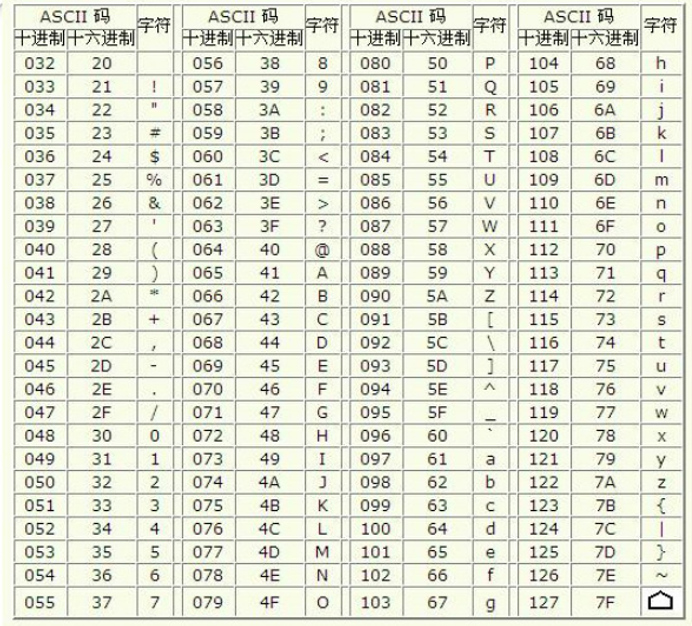
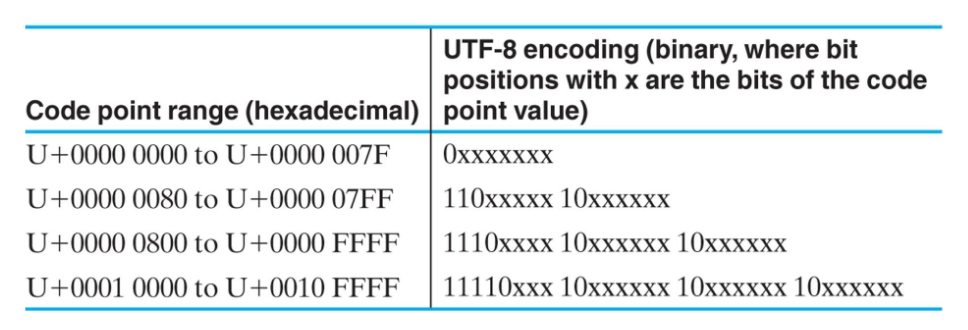

### 壹  数制转换

#### 述：
##### 吾言十半五，尔称二进一。
##### 君我恍恍一幕隔，终是难得语。
##### 我欲破其障，所言君可识。
##### 阳阴阵阵排一线，竟得合君制。

###### · 数制：
· 数的表示规则称为“<font color="#ffc000">数制</font>”
· **基底**：一个数制所包含的数字符号的个数：
	1. 二进制只有两个基底：0，1
	2. 八进制有八个基底：0，1，2，3，4，5，6，7
	3. 十进制有十个基底：0，1，2，3，4，5，6，7，8，9
	4. 十六进制有十六个基底：0，1，2，3，4，5，6，7，8，9，A，B，C，D，E，F
· **权**：数字符号的位置所决定的值
###### · 按位计数制：
· 任何一个数值，都是<font color="#ffff00">各位数字本身的值与其权之积的总和</font>，是一种按位计数制
· 常见的按位计数制表示：二进制、八进制、十进制、十六进制：
（1001）<sub>2</sub> 表示二进制，也可以写作：1001<font color="#00b0f0"><sub>B</sub></font>
（1001）<sub>8</sub> 表示八进制，也可以写作：1001<font color="#00b0f0"><sub>O</sub></font> 或 1001<font color="#00b0f0"><sub>Q</sub></font>
（1001）<sub>10</sub> 表示十进制，也可以写作：1001<sub><font color="#00b0f0">D</font></sub>
（1001）<sub>16</sub> 表示十六进制，也可以写作：1001<font color="#00b0f0"><sub>H</sub></font>
###### · 二进制：
· 二进制的基底为 2，计数规则为“逢二进一”
例：（110.11）<sub>2</sub> = 1 × 2<sup>2</sup> + 1 × 2<sup>1</sup> + 0 × 2<sup>0</sup> + 1 × 2<sup>-1</sup> + 1 × 2<sup>-2</sup> = 6.75
· 2<sup>10</sup>（1024）千，记为 "K"
· 2<sup>20</sup>（1,048,576）兆，记为 "M"
· 2<sup>30</sup>（1,073, 741,824）十亿，记为 "G"
· 2<sup>40</sup>（1,099,511,627,776）万亿，记为 "T"
###### · 八进制：
· 八进制的基底为 8，计数规则为“逢八进一”
· 一个八进制位相当于三个二进制位
例：（702.41）<sub>8</sub> = 7 × 8<sup>2</sup> + 0 × 8<sup>1</sup> + 2 × 8<sup>0</sup> + 4 × 8<sup>-1</sup> + 1 × 8<sup>-2</sup> = 450.515625
###### · 十六进制：
· 十六进制的基底为 16，计数规则为“逢十六进一”
· 一个十六进制位相当于四个二进制位
例：（70F.4A）<sub>16</sub> = 7 × 16<sup>2</sup> + 0 × 16<sup>1</sup> + 15 × 16<sup>0</sup> + 4 × 16<sup>-1</sup> + 10 × 16<sup>-2</sup> = 1807.2890625
###### · 数字系统的信号广泛采用两个离散值的进制：
· 数字： 0 和 1
· 文字（符号）：真 T 假 F
· 文字（符号）：高 H 低 L
· 文字（符号）：开 On 关 Off
###### · 数字系统的二进制实现：
· 通过特定的物理量（电压）的取值进行按位设置
· 一个二进制数字称为一位（bit）
· 数字系统的信息是通过一组一组的位来表示

###### · 四种进制关系：
| 十进制 | 二进制 | 八进制 | 十六进制 |
| ---- | ---- | ---- | ---- |
| 0 | 0 | 0 | 0 |
| 1 | 1 | 1 | 1 |
| 2 | 10 | 2 | 2 |
| 3 | 11 | 3 | 3 |
| 4 | 100 | 4 | 4 |
| 5 | 101 | 5 | 5 |
| 6 | 110 | 6 | 6 |
| 7 | 111 | 7 | 7 |
| 8 | 1000 | 10 | 8 |
| 9 | 1001 | 11 | 9 |
| 10 | 1010 | 12 | A |
| 11 | 1011 | 13 | B |
| 12 | 1100 | 14 | C |
| 13 | 1101 | 15 | D |
| 14 | 1110 | 16 | E |
| 15 | 1111 | 17 | F |
| 16 | 10000 | 20 | 10 |

###### · 十进制数转换为非十进制数：
1. 十进制整数转换为二进制：<font color="#ffff00">除以二取余</font>
例：215 => 除以二得 107 余 <font color="#ffc000">1</font> => 53 余 <font color="#ffc000">1</font> => 26 余 <font color="#ffc000">1</font> => 13 余 <font color="#ffc000">0</font> => 6 余 <font color="#ffc000">1</font> => 3 余 <font color="#ffc000">0</font> => 1 余 <font color="#ffc000">1</font> => 0余<font color="#ffc000">1</font>
<<——————————————————————————————————————————————
从右往左取余数，得到对应的二进制数为：11010111
2. 十进制小数转换为二进制：<font color="#ffff00">乘以二取整</font>
例：0.6875 => 乘二得 <font color="#ffc000">1</font>.375 变 0.375 => <font color="#ffc000">0</font>.75 => <font color="#ffc000">1</font>.5 变 0.5 => <font color="#ffc000">1</font>
—————————————————————————————>>
从左到右取整数，得到对应的二进制数为：0.1011
3. 十进制数转换为其他进制数同理，只是乘或除以的数不同

· <font color="#ffc000">程序实现</font>：
```C++
十进制转二进制：
void Decimal_to_Binary(double t)
{
	int integer[100];    //存放二进制整数位
	int decimal[100];    //存放二进制小数位
	int k1=t;    //取 t 的整数位
	double k2=t-k1;    //取 t 的小数位

	int i=-1;
	while(k1)
	{
		i++;
		integer[i]=k1%2;
		k1/=2;
	}

	int d=-1;
	while(k2)
	{
		d++;
		decimal[d]=k2*2;
		k2*=2;
		if(k2>=1) k2-=1;
	}

	for(int j=i; j>=0; j--) printf("%d",integer[j]);
	printf(".");
	for(int j=0; j<=d; j++) printf("%d",decimal[j]);
	printf("\n");
	return;
}
```

###### · 二进制数、八进制数和十六进制数的转换：
1. 二进制数 => 八进制数：<font color="#ffff00">三位一划分</font>
（11 101 010 011. 101 11）<sub>2</sub> =>（3523.56）<sub>8</sub>
2. 八进制数 => 二进制数：<font color="#ffff00">一位分三位</font>
（3523.56）<sub>8</sub> =>（11 101 010 011. 101 11<font color="#00b050">0</font>）<sub>2</sub> 
3. 二进制数 => 十六进制数：<font color="#ffff00">四位一划分</font>
（1111 0101 0011. 1011 1）<sub>2</sub> =>（F53.B8）<sub>16</sub>
4. 十六进制数 => 二进制数：<font color="#ffff00">一位分四位</font>
（F53.B8）<sub>16</sub> =>（1111 0101 0011. 1011 1<font color="#00b050">000</font>）<sub>2</sub>
· <font color="#00ffb0">N 进制转 N<sup>m</sup> 进制的方法：m 位一划分（N 与 m 为正整数）</font>

· <font color="#ffc000">程序实现</font>：二进制转八进制
```C++
void Binary_to_Octal(char Binary[])
{
	int integer[100];    //存储八进制整数部分
	int decimal[100];    //存储八进制小数部分
	
	int length=strlen(Binary);    //二进制字符数组长度
	int point=0;
	while(Binary[point]!='.'&&point<length) point++;    //确定小数点的位置
	int point_1=point;

	//整数部分的处理：
	int i=0, j=0, k=0;
	while(point>0)
	{
		switch(point%3)
		{
			case 1: integer[i]=Binary[0]-48, k=1, point-=1, j--; break;
			case 2: integer[i]=(Binary[0]-48)*2+Binary[1]-48, k=2, point-=2, j--; break;
			default: integer[i]=(Binary[k+3*j]-48)*4+(Binary[k+3*j+1]-48)*2+Binary[k+3*j+2]-48, point-=3; break;
		}
		i++;
		j++;
	}
	for(int l=0; l<=i-1; l++) printf("%d",integer[l]);
	putchar('.');

	//小数部分的处理：
	int d=0;
	while(length-1-point_1>=3)
	{
		decimal[d]=(Binary[point_1+1]-48)*4+(Binary[point_1+2]-48)*2+Binary[point_1+3]-48;
		point_1+=3;
		d++;
	}
	switch(length-1-point_1)
	{
		case 1: decimal[d]=(Binary[point_1+1]-48)*4; break;
		case 2: decimal[d]=(Binary[point_1+1]-48)*4+(Binary[point_1+2]-48)*2; break;
		default: break;
	}
	for(int l=0; l<=d; l++) printf("%d",decimal[l]);
	putchar('\n');
	return;
}
```
· <font color="#ffc000">二进制转十六进制</font>：
```C++
void Binary_to_Hexadecimal(char Binary[])
{
	int integer[100];    //存储十六进制整数部分
	int decimal[100];    //存储十六进制小数部分
	
	int length=strlen(Binary);    //二进制字符数组长度
	int point=0;
	while(Binary[point]!='.'&&point<length) point++;    //确定小数点的位置
	int point_1=point;

	//整数部分的处理：
	int i=0, j=0, k=0;
	while(point>0)
	{
		switch(point%4)
		{
			case 1: integer[i]=Binary[0]-48, k=1, point-=1, j--; break;
			case 2: integer[i]=(Binary[0]-48)*2+Binary[1]-48, k=2, point-=2, j--; break;
			case 3: integer[i]=(Binary[0]-48)*4+(Binary[1]-48)*2+Binary[2]-48,
				k=3, point-=3, j--; break;
			default: integer[i]=(Binary[k+4*j]-48)*8+(Binary[k+4*j+1]-48)*4+(Binary[k+4*j+2]-48)*2+Binary[k+4*j+3]-48, point-=4; break;
		}
		i++;
		j++;
	}
	for(int l=0; l<=i-1; l++)
	{
		if(integer[l]>=10) printf("%c",integer[l]+55);
		else printf("%d",integer[l]);
	}
	putchar('.');

	//小数部分的处理：
	int d=0;
	while(length-1-point_1>=4)
	{
		decimal[d]=(Binary[point_1+1]-48)*8+(Binary[point_1+2]-48)*4+(Binary[point_1+3]-48)*2+Binary[point_1+4]-48;
		point_1+=4;
		d++;
	}
	switch(length-1-point_1)
	{
		case 1: decimal[d]=(Binary[point_1+1]-48)*8; break;
		case 2: decimal[d]=(Binary[point_1+1]-48)*8+(Binary[point_1+2]-48)*4; break;
		case 3: decimal[d]=(Binary[point_1+1]-48)*8+(Binary[point_1+2]-48)*4+(Binary[point_1+3]-48)*2;
		default: break;
	}
	for(int l=0; l<=d; l++)
	{
		if(decimal[l]>=10) printf("%c",decimal[l]+55);
		else printf("%d",decimal[l]);
	}
	putchar('\n');
	return;
}
```
· <font color="#ffc000">八进制转二进制</font>：
```C++
void Octal_to_Binary(char Octal[])
{
	int integer[100];    //存储二进制的整数部分
	int decimal[100];    //存储二进制的小数部分
	
	int length=strlen(Octal);    //二进制字符数组长度
	int point=0;
	while(Octal[point]!='.'&&point<length) point++;    //确定小数点的位置
	
	//整数部分的处理：
	int i=0, j=0;
	while(j<point)
	{
		switch(Octal[j]-48)
		{
			case 0: integer[i]=0, integer[i+1]=0, integer[i+2]=0; break;
			case 1: integer[i]=0, integer[i+1]=0, integer[i+2]=1; break;
			case 2: integer[i]=0, integer[i+1]=1, integer[i+2]=0; break;
			case 3: integer[i]=0, integer[i+1]=1, integer[i+2]=1; break;
			case 4: integer[i]=1, integer[i+1]=0, integer[i+2]=0; break;
			case 5: integer[i]=1, integer[i+1]=0, integer[i+2]=1; break;
			case 6: integer[i]=1, integer[i+1]=1, integer[i+2]=0; break;
			default: integer[i]=1, integer[i+1]=1, integer[i+2]=1; break;
		}
		i+=3, j++;
	}
	int t=0;
	while(!integer[t]&&t<point) t++;    //去首零
	for(int l=t; l<=i-1; l++) printf("%d",integer[l]);
	putchar('.');

	//小数部分的处理：
	j=point+1;
	int d=0;
	while(j<length)
	{
		switch(Octal[j]-48)
		{
			case 0: decimal[d]=0, decimal[d+1]=0, decimal[d+2]=0; break;
			case 1: decimal[d]=0, decimal[d+1]=0, decimal[d+2]=1; break;
			case 2: decimal[d]=0, decimal[d+1]=1, decimal[d+2]=0; break;
			case 3: decimal[d]=0, decimal[d+1]=1, decimal[d+2]=1; break;
			case 4: decimal[d]=1, decimal[d+1]=0, decimal[d+2]=0; break;
			case 5: decimal[d]=1, decimal[d+1]=0, decimal[d+2]=1; break;
			case 6: decimal[d]=1, decimal[d+1]=1, decimal[d+2]=0; break;
			default: decimal[d]=1, decimal[d+1]=1, decimal[d+2]=1; break;
		}
		d+=3, j++;
	}
	t=d-1;
	while(!decimal[t]&&t>point) t--;    //去尾零
	for(int l=0; l<=t; l++) printf("%d",decimal[l]);
	putchar('\n');
	return;
}
```
· <font color="#ffc000">十六进制转二进制</font>：
```C++
void Hexadecimal_to_Binary(char Hexadecimal[])
{
	int integer[100];    //存储二进制的整数部分
	int decimal[100];    //存储二进制的小数部分
	
	int length=strlen(Hexadecimal);    //二进制字符数组长度
	int point=0;
	while(Hexadecimal[point]!='.'&&point<length) point++;    //确定小数点的位置

	//整数部分的处理：
	int i=0, j=0;
	while(j<point)
	{
		switch(Hexadecimal[j]-48)
		{
		case 0: integer[i]=0, integer[i+1]=0, integer[i+2]=0, integer[i+3]=0; break;
		case 1: integer[i]=0, integer[i+1]=0, integer[i+2]=0, integer[i+3]=1; break;
		case 2: integer[i]=0, integer[i+1]=0, integer[i+2]=1, integer[i+3]=0; break;
		case 3: integer[i]=0, integer[i+1]=0, integer[i+2]=1, integer[i+3]=1; break;
		case 4: integer[i]=0, integer[i+1]=1, integer[i+2]=0, integer[i+3]=0; break;
		case 5: integer[i]=0, integer[i+1]=1, integer[i+2]=0, integer[i+3]=1; break;
		case 6: integer[i]=0, integer[i+1]=1, integer[i+2]=1, integer[i+3]=0; break;
		case 7: integer[i]=0, integer[i+1]=1, integer[i+2]=1, integer[i+3]=1; break;
		case 8: integer[i]=1, integer[i+1]=0, integer[i+2]=0, integer[i+3]=0; break;
		case 9: integer[i]=1, integer[i+1]=0, integer[i+2]=0, integer[i+3]=1; break;
		case 17: integer[i]=1, integer[i+1]=0, integer[i+2]=1, integer[i+3]=0; break;
		case 18: integer[i]=1, integer[i+1]=0, integer[i+2]=1, integer[i+3]=1; break;
		case 19: integer[i]=1, integer[i+1]=1, integer[i+2]=0, integer[i+3]=0; break;
		case 20: integer[i]=1, integer[i+1]=1, integer[i+2]=1, integer[i+3]=1; break;
		case 21: integer[i]=1, integer[i+1]=1, integer[i+2]=1, integer[i+3]=0; break;
		default: integer[i]=1, integer[i+1]=1, integer[i+2]=1; integer[i+3]=1; break;
		}
		i+=4, j++;
	}
	int t=0;
	while(!integer[t]&&t<point) t++;    //去首零
	for(int l=t; l<=i-1; l++) printf("%d",integer[l]);
	putchar('.');

	//小数部分的处理：
	j=point+1;
	int d=0;
	while(j<length)
	{
		switch(Hexadecimal[j]-48)
		{
		case 0: decimal[d]=0, decimal[d+1]=0, decimal[d+2]=0, decimal[d+3]=0; break;
		case 1: decimal[d]=0, decimal[d+1]=0, decimal[d+2]=0, decimal[d+3]=1; break;
		case 2: decimal[d]=0, decimal[d+1]=0, decimal[d+2]=1, decimal[d+3]=0; break;
		case 3: decimal[d]=0, decimal[d+1]=0, decimal[d+2]=1, decimal[d+3]=1; break;
		case 4: decimal[d]=0, decimal[d+1]=1, decimal[d+2]=0, decimal[d+3]=0; break;
		case 5: decimal[d]=0, decimal[d+1]=1, decimal[d+2]=0, decimal[d+3]=1; break;
		case 6: decimal[d]=0, decimal[d+1]=1, decimal[d+2]=1, decimal[d+3]=0; break;
		case 7: decimal[d]=0, decimal[d+1]=1, decimal[d+2]=1, decimal[d+3]=1; break;
		case 8: decimal[d]=1, decimal[d+1]=0, decimal[d+2]=0, decimal[d+3]=0; break;
		case 9: decimal[d]=1, decimal[d+1]=0, decimal[d+2]=0, decimal[d+3]=1; break;
		case 17: decimal[d]=1, decimal[d+1]=0, decimal[d+2]=1, decimal[d+3]=0; break;
		case 18: decimal[d]=1, decimal[d+1]=0, decimal[d+2]=1, decimal[d+3]=1; break;
		case 19: decimal[d]=1, decimal[d+1]=1, decimal[d+2]=0, decimal[d+3]=0; break;
		case 20: decimal[d]=1, decimal[d+1]=1, decimal[d+2]=0, decimal[d+3]=1; break;
		case 21: decimal[d]=1, decimal[d+1]=1, decimal[d+2]=1, decimal[d+3]=0; break;
		default: decimal[d]=1, decimal[d+1]=1, decimal[d+2]=1; decimal[d+3]=1; break;
		}
		d+=4, j++;
	}
	t=d-1;
	while(!decimal[t]&&t>point) t--;    //去尾零
	for(int l=0; l<=t; l++) printf("%d",decimal[l]);
	putchar('\n');
	return;
}
```

###### · 二进制运算：
1. 二进制加法进位，逢二进一
2. 二进制减法借位，高位退一
3. 二进制乘法：0×0=0，0×1=0，1×0=0，1×1=1


### 贰  数的表示

#### 述：
##### 清清浊浊运天功，虚虚实实人事通。
##### 有有无无时空转，阴阴阳阳万相生。

###### · 二进制编码：
· 通过 0 与 1 排列的组合方式表示数据，n 位二进制编码可以表示 2<sup>n</sup> 个数据
· 二进制编码既可以表示数值型数据，也可以表示非数值型数据（如字符、控制符、音频、图像、视频等）
· 表示 M 个数据需要二进制位数最少为：log<sub>2</sub>M 向上取整
###### · 数值数据的表示：
1. 机器数：整数或小数的二进制编码表示
2. 符号数：最高位 0 表示正数，最高位 1 表示负数
3. 无符号数：每一位都作为权

| 十进制 | 符号-数值 |
| ---- | ---- |
| +3 | 0011 |
| +2 | 0010 |
| +1 | 0001 |
| +0 | 0000 |
| -0 | 1000 |
| -1 | 1001 |
| -2 | 1010 |
| -3 | 1011 |
| -4 | 1100 |

· （无）符号数三种编码形式：原码、反码、补码：
给定一个 n 位的二进制无符号数 N（真值）：
1. <font color="#ffc000">原码</font>：N  对应的机器数
2. <font color="#ffc000">反码</font>：（2<sup>n</sup>-1）-N  对应的机器数
3. <font color="#ffc000">补码</font>：2<sup>n</sup> -N  对应的机器数（丢弃高位）
例：N=5 属于 4 位二进制无符号数，<font color="#ffc000">原码</font>为 0101，<font color="#ffc000">反码</font>为 1010，<font color="#ffc000">补码</font>为 1011
如果是带符号数，则第一位是符号，剩下 n-1 位，有以下两种表示方式：
1. 符号-数值
2. 符号-补码
有符号数的补码求法：
1. 正数：原码、反码、补码一样
2. 负数：原码取反，但是符号位不动，加一，如果有溢出则丢弃高位

| 十进制 | 符号-补码 | 符号-数值 |
| ---- | ---- | ---- |
| +7 | 0111 | 0111 |
| +6 | 0110 | 0110 |
| +5 | 0101 | 0101 |
| +4 | 0100 | 0100 |
| +3 | 0011 | 0011 |
| +2 | 0010 | 0010 |
| +1 | 0001 | 0001 |
| +0 | 0000 | 0000 |
| -0 | —— | 1000 |
| -1 | 1111 | 1001 |
| -2 | 1110 | 1010 |
| -3 | 1101 | 1011 |
| -4 | 1100 | 1100 |
| -5 | 1011 | 1101 |
| -6 | 1010 | 1110 |
| -7 | 1001 | 1111 |
| -8 | 1000 | —— |

###### · 浮点法表示小数：
· 小数的二进制编码采用**浮点法**，小数点的位置可以任意移动，编码分为 *阶* 和 *尾数* 两部分
· 阶有一位数符和剩余位的阶码，尾数有一位数符和剩余位的尾数

                            （图一：浮点法的二进制编码结构）
例：32 位浮点数，用 8 位作阶，24 位作尾数：
72.45 × 10<sup>5</sup> 
=（0.1101110）<sub>2</sub> ×（2<sup>23</sup>）<sub>10</sub>
=（0.1101110）<sub>2</sub> ×（2）<sub>10</sub> ^（10111）<sub>2</sub>
=> 32位：【0】【0010111】【0】【1101110……】


### 叁  字符表示

#### 述：
##### 逆势启笔开新程，不偏不倚下中锋。
##### 停滞迂回缓缓探，一撇一捺描人生。

###### · 西文字符编码：
· **西文字符编码**：用二进制编码表示数字、字母、字符等
英文：ASCLL 码
7 位二进制编码，94 个可打印字符 + 32 个控制字符 = 128 个

（图二：标准 ASCLL 码表）

###### · 汉字字符编码：
· **汉字字符编码**：用二进制编码表示汉字字符等
· 根据用途差异具有以下形式：
1. 输入码：在键盘上利用数字、符号或拼音字母将汉字以代码的形式输入的代码
2. 国标码：我国 1981 年公布的“中华人民共和国国家标准信息交换汉字编码（GB2312—80）”代码，包含 6763 个汉字和 682 个其他基本图形字符，共 7445 个字符
3. 机内码：一个汉字被计算机系统内部处理和存储而使用的代码
4. 字形码：一个汉字供显示器和打印机输出的字形点阵代码

（图三：“英”字的机内码和字形码）

###### · 统一字符编码：
· **统一字符编码**：Unicode：统一码，万国码（16 位）；UCS：通用字符集（32位）
例：Unicode 不同的编码方案：
1. UTF-8：变长 1~4 字节，与 ASCLL 码兼容
2. UTF-16：变长 2 或者 4 字节
3. UTF-32：定长 4 字节

（图四：UTF-8 编码形式示例，其中 “code point” 表示代码点，字符集中的一个数字偏移量，与显示的字形或字符相对应）


### 肆  其他编码

#### 述：
##### 言虚言实几字差，看真看假在验码。
##### 一纸声息来复去，何人能解其中法？

###### · BCD 码：
· **BCD 码**：二进制编码的十进制数，用 4 位二进制数表示十进制的 10 个数字，又称“8421 码”

| 十进制符号 | BCD 码 | 十进制编码 | BCD 码 |
| ----- | ----- | ----- | ----- |
| 0     | 0000  | 5     | 0101  |
| 1     | 0001  | 6     | 0110  |
| 2     | 0010  | 7     | 0111  |
| 3     | 0011  | 8     | 1000  |
| 4     | 0100  | 9     | 1001  |

例：用 BCD 码表示 15：0001 0101
· 注意：BCD 码数制有十个基底，本质上是**用二进制表示的十进制**

###### · 奇偶校验码：
· 为了检验数据传输过程中可能存在的错误，通常在二进制编码中额外增加一个校验位，用于表示编码中 1 的个数是基数还是偶数：
1. 偶校验：偶数个“1”，对应的校验位是“0”
2. 奇校验：奇数个“1”，对应的校验位是“0”

| 传输数据    | 偶校验       | 奇校验       |
| ------- | --------- | --------- |
| 1000001 | 0 1000001 | 1 1000001 |
| 1010100 | 1 1010100 | 0 1010100 |

· 带有奇偶校验位的检验码称为奇偶校验码，通常表示为原始二进制编码附加奇偶校验位
	· 奇校验码：原编码+校验位，总共有奇数个“1”
	· 偶校验码：原编码+校验位，总共有偶数个“1”

· 奇偶校验码是最简单的错误检验码，但无法确定哪一位出错

                             （图五：奇偶校验码原理示意）

###### · 格雷码：
· 在一组数的编码中，若任意两个相邻的代码只有一位二进制数不同，则称这种编码为*格雷码*（Gray code）
· 美国贝尔实验室 Frank Gray 在 1953 年获得格雷码的专利

| 十进制 | 二进制  | Gray |
| --- | ---- | ---- |
| 0   | 0000 | 0000 |
| 1   | 0001 | 0001 |
| 2   | 0010 | 0011 |
| 3   | 0011 | 0010 |
| 4   | 0100 | 0110 |
| 5   | 0101 | 0111 |
| 6   | 0110 | 0101 |
| 7   | 0111 | 0100 |
| 8   | 1000 | 1100 |
| 9   | 1001 | 1101 |
| 10  | 1010 | 1111 |
| 11  | 1011 | 1110 |
| 12  | 1100 | 1010 |
| 13  | 1101 | 1011 |
| 14  | 1110 | 1001 |
| 15  | 1111 | 1000 |

· 用途 1：在模-数转换过程中减少错误编码，是一种可靠性编码，如光学轴角编码器

               （图六：光学轴角编码器，格雷码编码使得光透过的白色区域连接成一体）
· 用途 2：低功耗

                   （图七：相邻数值转换时，格雷码转换的二进制位仅有一位）

· 格雷码的编码方式：
n 位（偶数）二进制计数序列中的数值：
	· 前 2<sup>n-1</sup> 个数值：左边最高位为 0，往右各位由<font color="#00b0f0">原二进制编码</font>的每一位与它左边相邻位的偶校验构成
	· 后 2<sup>n-1</sup> 个数值：前一半逆序排列，并将左边最高位设为 1

                               （图八：格雷码的编码方式）

                               （图九：n 较小时的格雷码表）

###### · 现代典型计算系统中的数据表示：

                           （图十：IA-32/64 架构和 MIPS 架构）

                           （图十一：ARM 架构和 RISC V 架构）

                       （图十二：IA-32 和 ARM 架构下的单精度浮点数）

