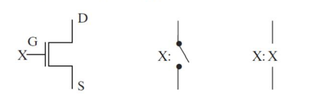
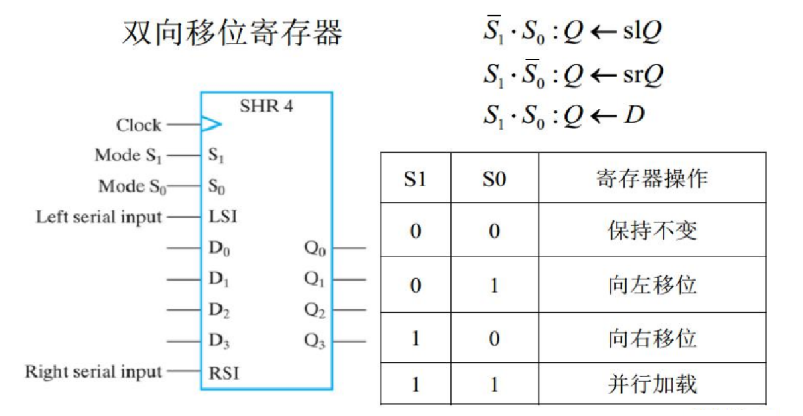

### 壹  数字硬件实现

#### 述：
#####
#####

###### · 集成电路：
· 数字电路是采用集成电路（IC）构建而成
· IC 是一种硅半导体晶体，俗称芯片，包含实现逻辑门和存储单元的电子元件
· 芯片通过表面上的包含字母和数字的名字辨识

                          （图一：集成电路的结构概况与表面示例）
· 芯片采用陶瓷或塑料封装，由内部电路引出与外部电路相连的接线（引脚）
· 引脚构成了芯片的接口：脚跟、脚趾、脚侧

· 集成电路可以按照逻辑门的集成度区分：
1. 小规模集成（SSI）：几个独立的基本门
2. 中规模集成（MSI）：10~100 个门
3. 大规模集成（LSI）：100~几千个门
4. 超大规模集成（VLSI）：几千~几亿个门

（图二：小规模集成、中规模集成、大规模集成、超大规模集成的集成电路示例）

###### · CMOS 电路：
· 采用硅的互补金属氧化物半导体（CMOS）作为工艺实现的集成电路
· 具有密度高、性能高、功耗低的特点
· CMOS 的工艺基础是 MOS 晶体管

                       （图三：硅的互补金属氧化物半导体（CMOS）电路）

· 两种 CMOS 晶体管模型：
1. n 沟道：触点习惯上为常开
2. p 沟道：源级和漏级位置互换，触点习惯上为常闭

                            （图四：n 沟道 CMOS 晶体管模型）

                            （图五：p 沟道 CMOS 晶体管模型）

· CMOS 是大多数集成电路（电子电路）的实现基础
· 例：开关电路：

                         （图六：用 CMOS 实现开关电路的示例）

###### · 设计空间：
· 电路设计是将逻辑门实现的逻辑电路映射道晶体管实现的电子电路，是从逻辑级别道电路级的转换过程
· 实现特定设计的技术定义了可用的基本元件及其属性，而设计空间描述了所用技术及其参数的集合：扇入、扇出、噪声容限、门的成本、传播延迟、功耗等工艺参数

· 扇入：一个门可能的输入数：通常不超过 4~5 个，大扇入门使用低扇入门连接而成
· 扇出：一个门输出驱动的标准负载数：大扇出门使用多个门并行实现
· 成本：晶体管大小、数目等因素

                （图七：两个 4 输入与非门和反相器合成 7 输入与非门的电路设计）

###### · 可编程逻辑器件：
· 可编程逻辑器件（PLD）包含了用来实现逻辑功能的结构和控制内部连接或存储所需的信息
· 可以通过硬件编程（programming）实现新功能：
1. 只读存储器（ROM）
2. 可编程逻辑阵列（PLA）
3. 可编程阵列逻辑（PAL）
4. 现场可编程门阵列（FPGA）

· 可编程实现技术：
1. 永久性、固化编程：
	1. 熔丝
	2. 反熔丝
	3. 掩膜编程
2. 可重编程
	1. 变成点的存储单元
	2. 晶体管开关

· 晶体管开关：
	1. 光可擦除（UVEPROM）：采用紫外线照射，浮置山上的电荷即可泄漏掉
	2. 电可擦除（EEPROM）：采用高于正常值的电压擦除
		· 闪存技术（Flash）：EEPROM 能在字节水平上进行删除和重写而不是整个芯片擦写，而闪存的大部分芯片需要块擦除

· 可编程器件的三种基本结构：
1. 可编程只读存储器（PROM）
2. 可编程阵列逻辑（PAL）
3. 可编程逻辑阵列（PLA）

                    （图八：可编程器件的三种基本结构的输入到输出过程）

· 只读存储器（ROM）：本质上是“永久”存储二进制信息的器件，非易失性（断电 / 通电）

                       （图九：只读存储器（ROM）的工作模式）

                          （图十：$2^5\times 8$ ROM 内部逻辑结构）

· 可编程逻辑阵列（PLA）：
1. 与门阵列代替译码器，不提供变量的全译码
2. 通过编程阐释输入变量的乘积项

                      （图十一：可编程逻辑阵列（PLA）的工作模式）

                    （图十二：3 输入 2 输出的可编程逻辑阵列内部逻辑图）

· 可编程阵列逻辑（PAL）：
1. 或门阵列固定、与门阵列可编程
2. 无法共享与门输出

                       （图十三：可编程阵列逻辑（PAL）的示例）

· 现场可编程门阵列（FPGA）：
1. 包含可编程逻辑块、可编程互联和可编程输入 / 输出引脚等三个可编程部件
2. 可采用反熔丝、闪存、SRAM 等方式进行配置

                           （图十四：现场可编程门阵列的结构）

· 可编程逻辑块：采用查找表（Look - Up Table，LUT）实现组合逻辑函数，$2^k\times 1$ 的存储器记录带有 $k$ 个变量的函数的真值表

           （图十五：多路复用器查找表（实现布尔函数 $F(A,B,C)=\sum m(3,5,6,7)$））
· 香农展开式定理：$$f(x_1,x_2,\ldots,x_k)=x_k\cdot f(x_1,x_2,\ldots,x_{k-1},1)+\overline{x_k}\cdot f(x_1,x_2,\ldots,x_{k-1},0)$$

                          （图十六：用多路复用器实现布尔函数）

### 贰  寄存器及传出

#### 述：
#####
#####

###### · 寄存器的概念：
· 寄存器是一组用于完成特定数据处理任务的触发器以及附加的组合门电路：
1. 触发器：锁存数据，一个触发器存储一位二进制
2. 门电路：数据处理
· 寄存器的主要作用是在数据处理过程中保持信息；对于通用计算机，用于临时保存没有保存在内部存储器中的数据

                         （图十七：4 位寄存器的逻辑图和符号）

· 寄存器的符号表示：
1. 地址寄存器（AR）：保存存储单元地址
2. 程序计数器（PC）：存放下一条指令所在单元的地址
3. 指令寄存器（IR）：临时放置从内存里面取得的程序指令
4. 其他：寄存器 2（R2）

· $n$ 位寄存器中的单个触发器通常从 $0$ 到 $n-1$ 编号：
1. 小端格式：最低位 $0$ 位在最右端
2. 大端格式：最低位 $0$ 位在最左端
3. 例如 $16$ 位程序计数器，PC（L）或 PC（7:0）表示低字节；PC（H）或 PC（15:8）表示高字节

                            （图十八：$16$ 位程序计数器示例）

###### · 加载（loading）操作：
· 将新信息传送至寄存器的过程，可以用一个单独的控制信号来控制时钟脉冲对寄存器施加影响

                             （图十九：加载操作）

· 并行加载寄存器如果寄存器中所有位都是在公用时钟脉冲下同时加载的，称为并行加载

                                  （图二十：并行加载）

###### · 寄存器传输：
· 一般数字系统由*数据通路*和*控制单元*两种类型的模块所构成：
1. 数据通路：数据处理操作
2. 控制单元：操作的执行顺序

                       （图二十一：数字系统的数据通路和控制单元）

· 一个寄存器可以完成一个或多个基本操作：加载、计数、加法、减法、移位等
· 寄存器传输是指在寄存器之间、寄存器与存储器之间通过数据处理逻辑传输信息

                               （图二十二：寄存器传输）

· 寄存器传输操作是对寄存器中存储的数据进行移动和处理，由以下三个基本方面进行描述：
1. 系统中的寄存器组
2. 对寄存器中存储数据执行的操作（微操作）
3. 系统中操作执行顺序的控制
· 符号表示 $R_2\leftarrow R_1$：
1. 将寄存器 1（源寄存器）的内容传输到寄存器 2（目的寄存器）
2. 只改变目的寄存器 2 的内容，不改变寄存器 1

· 寄存器传输语音（RTL）：描述寄存器并定义对寄存器存储内容进行的各种操作

| 符号        | 含义        | 示例                                    |
| :-------- | :-------- | :------------------------------------ |
| 字母（或带有数字） | 一个寄存器     | $AR,R_2,IR$                           |
| 圆括号       | 寄存器的一部分   | $R_2(1),R_2(7:0)$                     |
| 箭头        | 数据的传输     | $R_2\leftarrow R_1$                   |
| 逗号        | 隔开同时进行的操作 | $R_2\leftarrow R_1,R_1\leftarrow R_2$ |
| 方括号       | 定义存储器地址   | $DR\leftarrow M[AR]$                  |

· 寄存器传输语言（RTL）：
与 VHDL 和 Verilog 的对比：

| 操作符 | Text RTL       | VHDL                | Verilog    |
| :-- | :------------- | :------------------ | :--------- |
| 关系  | $=$            | $<=$                | $assign =$ |
| 转移  | $\leftarrow$   | $<=$                | $<=$       |
| 加号  | $+$            | $+$                 | $+$        |
| 减号  | $-$            | $-$                 | $-$        |
| 与   | $\wedge$       | $and$               | $\&$       |
| 或   | $\vee$         | $or$                | $\vert$    |
| 异或  | $\oplus$       | $xor$               | ^          |
| 非   | $\overline{A}$ | $not$               | ~          |
| 左移位 | $Sl$           | $Sll$               | $<<$       |
| 右移位 | $Sr$           | $Srl$               | >>         |
| 向量  | $A(3:0)$       | $A(3\ down\ to\ 0)$ | $A[3:0]$   |
| 连接  | $\|$           | $\&$                | $\{,\}$    |

· 每一条寄存器传输语句都预先假定存在可以执行传输操作的逻辑和硬件结构：$$if\ (K_1=1)\ then\ (R_2\leftarrow R_1)$$简写为 $K_1$：$R_2\leftarrow R_1$

                          （图二十三：寄存器传输发生时刻）

###### · 微操作：
1. 传输微操作：将二进制数据从一个寄存器传输到另一个寄存器
2. 算术微操作：对寄存器中的数据进行算术操作
3. 逻辑微操作：对寄存器中的数据进行位操作
4. 移位微操作：对寄存器中的数据进行移位
· 传输微操作不改变二进制的值，而算术微操作、逻辑微操作、移位微操作都产生新的二进制的值

① 传输微操作：将二进制数据从一个寄存器（源寄存器）传输到另一个寄存器（目的寄存器），不改变二进制数据的值 $R_2\leftarrow R_1$

② 算术微操作：加法、减法、递增、递减、求补等基本算术运算

| 符号名称                                 | 描述                                       |
| :----------------------------------- | :--------------------------------------- |
| $R_0\leftarrow R_1+R_2$              | 寄存器 $R_1$ 的值与寄存器 $R_2$ 的值相加，结果传输给 $R_0$  |
| $R_2\leftarrow \overline{R_2}$       | 对寄存器 $R_2$ 的值求反码                         |
| $R_2\leftarrow\overline{R_2}+1$      | 对寄存器 $R_2$ 的值求补码                         |
| $R_0\leftarrow R_1+\overline{R_2}+1$ | 寄存器 $R_1$ 的值加上寄存器 $R_2$ 值的补码，结果传输给 $R_0$ |
| $R_1\leftarrow R_1+1$                | 寄存器 $R_1$ 的值加 $1$                        |
| $R_1\leftarrow R_1-1$                | 寄存器 $R_1$ 的值减 $1$                        |
· 加减法器的逻辑和硬件结构：

                         （图二十四：加减法器的逻辑和硬件结构）

③ 逻辑微操作：对寄存器数据的按位逻辑运算

| 符号名称                          | 描述     |
| :---------------------------- | :----- |
| $R_0\leftarrow\overline{R_1}$ | 逻辑按位取反 |
| $R_0\leftarrow R_1\wedge R_2$ | 逻辑按位与  |
| $R_0\leftarrow R_1\vee R_2$   | 逻辑按位或  |
| $R_0\leftarrow R_1\oplus R_2$ | 逻辑按位异或 |

                          （图二十五：算术微操作与逻辑微操作）
· 掩蔽清除（masking out）：

                        （图二十六：掩蔽清除（masking out））

④ 移位微操作：源寄存器的内容进行向右或向左横向移动：
· 左移：向最高位移动
· 右移：向最低位移动

                            （图二十七：移位微操作的示例）

· 移入位：左移位操作的寄存器最右端的位，右移位操作的寄存器最左端的位
· 移除位：左移位操作的源寄存器最左端的位，右移位操作的源寄存器最右端的位

| 源寄存器 $R_2$ | 移位后：目的寄存器  |
| :--------- | :--------- |
| $10011110$ | $00111100$ |

###### · 微操作实现：
· 寄存器使用方式：
1. 专用逻辑：由一个源寄存器实现的组合逻辑，从而可以把微操作当作寄存器的一部分
2. 共享逻辑：针对目的寄存器阻来实现微操作的组合逻辑，实现多个目的寄存器的共享

· 寄存器微操作：
1. 基于多路复用器的传输
2. 移位寄存器
3. 行波计数器
4. 同步二进制计数器
5. 其他类型计数器：BCD 码计数器、任意计数序列
（计数器：在时钟脉冲的激励下，能遍历预先规定好的状态序列的一种寄存器）

· 基于多路复用器的传输：利用同一寄存器在不同时刻接受多个不同源的数据

                           （图二十八：基于多路复用器的传输）

                   （图二十九：4 位寄存器电路框图和具有 n 个源的多路复用器）

· 移位寄存器：具有单向或双向移动存储数据功能的寄存器，每一个触发器的输出连接下一个触发器的输入，使用相同时钟脉冲输入触发移位操作

                                （图三十：移位寄存器）
具有并行加载功能的移位寄存器：通过使移位寄存器的所有触发器输出可访问，能够将串行移位操作进入的信息从触发器的输出端并行读出

                      （图三十一：具有并行加载功能的移位寄存器分析）

                     （图三十二：具有并行加载功能的移位寄存器结构示意）
双向移位寄存器：

                           （图三十三：双向移位寄存器分析）

                          （图三十四：双向移位寄存器结构示意）

· 计数器（counter）：能够在输入脉冲序列的激励下遍历指定状态序列的寄存器，$n$ 位二进制计数器的计数范围为 $0$ 到 $2^n-1$
计数器分为两种类型：
1. 行波计数器：加载到触发器输入端的值不是公用时钟脉冲，而是其他触发器的输出信号
2. 同步计数器：所有触发器的输入端都是加载的公用时钟脉冲

                            （图三十五：$4$ 位行波计数器）

                    （图三十六：同步二进制计数器下的串行和并行计数器）

                       （图三十七：具有并行加载功能的二进制计数器）
任意计数序列能反复遍历 $6$ 个状态的计数器：$$DA=A\oplus B,\ DB=C,\ DC=\overline{B}\ \overline{C}$$

                               （图三十八：任意计数序列）

###### · 寄存器单元设计：
· 将一位的迭代组合电路单元与一个触发器连接起来就构成了一个具有两个状态的时序电路，称为*寄存器单元*
· 将一个寄存器单元复制 n 份组合在一起，构成具有某种或者几种相关操作功能的 *n 位寄存器*

· 例：寄存器 $A$ 具有如下寄存器传输功能：$$\begin{cases}AND:A\leftarrow A\wedge B\\ EXOR:A\leftarrow A\oplus B\\ OR:A\leftarrow A\vee B\end{cases}$$

                      （图三十九：寄存器实现传输功能的分析示例）
$$D_i=A(t+1)_i=AND\cdot A_i\cdot B_i+EXOR\cdot(A_i\overline{B_i}+\overline{A_i}B_i)$$$$+OR\cdot(A_i+B_i)+\overline{AND}\cdot\overline{EXOR}\cdot\overline{OR}\cdot A_i$$
===>$$\begin{cases}C_1=OR+AND+\overline{EXOR}\\ C_2=OR+EXOR\\ C_3=C_2+\overline{AND}\\ D_i=C_1A_iB_i+C_3A_i\overline{B_i}+C_2\overline{A_i}B_i\end{cases}$$

                        （图四十：寄存器实现传输功能的电路结构示例）

### 叁  多寄存器传输

#### 述：
#####
#####

###### · 传输类型：
· 数字系统中多个寄存器之间传输数据时可以采用*多路复用器*和*总线*两种方式：
1. 多路复用器：共享逻辑实现的不同时刻寄存器接收不同来源数据
	1. 优点：逻辑简单
	2. 缺点：逻辑电路的大小和数量巨大
2. 总线：一组通用连线作为共享传输的通路；通常情况下，如果一组多路复用器的输出作为公共通路为多个目的的寄存器共享，那么这些输出线就称为总线
	1. 优点：电路简单
	2. 缺点：逻辑复杂

                        （图四十一：多路复用器和单总线的结构）

###### · 总线构建方式：
1. 两态总线：
采用一堆控制输入信号实现一条总线在寄存器之间进行数据传输
	· Select：哪个寄存器作为总线输出
	· Load：哪个作为目的寄存器

                                （图四十二：两态总线）

2. 三态总线：
采用三态缓冲器取代多路复用器，减少连接的数量
	· 三态缓冲器：除了逻辑 0 和逻辑 1，还可以提供称为高阻态的第三种输出值（Hi - Z），能够作为双向输入 / 输出

                        （图四十三：三态缓冲器的逻辑符号和真值表）

                        （图四十四：三态缓冲器构成多重输出线）

· 通过将多个三态缓冲器的输出连接在一起形成一位总线，其中的信号可以双向传播

                   （图四十五：多个三态缓冲器的输出连接在一起形成以为总线）

                       （图四十六：多路复用器总线和三台总线结构对比）

### 肆  寄存器传输控制

#### 述：
#####
#####

###### · 串行传输：
1. 并行传输：所有数据同时传输
2. 串行传输：每次只传输一位数据——通过移位寄存器可将寄存器 A 中的数据通过串行的方式传输至寄存器 B

                           （图四十七：串行传输的模拟信号）

                       （图四十八：移位寄存器 A 向 B 串行转移数据）

· **并行 VS 串行**：
1. 并行模式下寄存器中的值可以任意改变，并且所有位都可以在一个时钟脉冲周期内并行传输；处理速度快
2. 串行模式下寄存器只有一个串行输入端和一个串行输出端，数据一次只能传输一位；处理速度慢，但只需较少的硬件资源即可完成相应操作

###### · 串行加法：
· 借助一个全加器实现加法操作：

                        （图四十九：借助一个全加器实现加法操作）

###### · 寄存器传输系统：
· 控制单元用于决定微操作执行顺序的控制信号，而其本身也是一种时序电路：
1. 可编程系统：处理器的部分输入形成指令序列；执行一条指令也就是激活所需要在数据通路中执行的微操作序列
2. 不可编程系统：不依赖于指令序列，仅通过当前输入和数据通路中的状态为决定所需执行的操作

· 传输控制系统的一般设计过程：
1. 系统说明书
2. 定义外部数据和控制信号
3. 画出状态机图
4. 定义内部控制和状态信号
5. 画出模块图
6. 设计寄存器传输逻辑
7. 设计控制单元逻辑
8. 检查系统正确性

· 例：码表

                                （图五十：码表的示例）
1. 功能相对单一的跑表，用于短距离计时
① 计时上限 $99.99$ 秒
② 将最短时间存储在寄存器中
③ START：计时器清零
④ STOP：停止计时并显示
⑤ CSS：比较当前的最短计时；将最小值记录在寄存器中；将最小值计时显示于 LCD
⑥ RESET：寄存器值设为最大 $99.99$

2. 系统所需外部控制输入信号、外部数据输出信号、寄存器等

         （图五十一：码表系统的外部控制输入信号、外部数据输出信号、寄存器符号与功能）

3. 系统状态机图

                       （图五十二：码表系统中的 Moore 型状态机图）               

4. 定义控制和状态信号

                       （图五十三：码表系统的定义控制和状态信号）

                       （图五十四：码表的定义控制和状态信号状态机图）

5. 画出模块图

                               （图五十五：码表的模块图）

6. 设计寄存器
① $4$ 位 $BCD$ 码计数器：$4$ 个 $1$ 位的 $BCD$ 码计数器级联构成
② $16$ 位并行加载功能的寄存器
③ $16$ 位 $2-1$ 多路复用器

                          （图五十六：码表设计寄存器的架构）

7. 设计控制单元

                          （图五十七：码表控制单元的状态机图）

###### · 微程序控制：
· 用存储在存储器中的字（word）作为控制单元的二进制控制值称为微程序控制
1. 每个字包含一条微指令，用于指定系统中的一条或者多条微操作
2. 一系列微指令组成微程序
	1. 控制单元和数据通路所执行的微操作存储在 ROM 给定地址的字当中
	2. 系统启动时可以加载倒 RAM 中

· 微程序存储在控制存储器：
1. 控制地址寄存器：指定微指令存储地址
2. 控制数据寄存器：保存当前执行的微指令
3. 下一地址产生器：生成下一条微指令地址
4. 序列发生器：下一地址生成器与控制地址寄存器的组合

· 微程序控制的一般组织结构：

                          （图五十八：微程序控制的一般组织结构）

###### · 重点结语：
- CMOS 晶体管模型
- 寄存器传输
- 寄存器微操作：加载、计数、加法、减法、移位
- 多寄存器传输
- 寄存器传输控制：串行传输、设计方法

### 伍  存储器

#### 述：
#####
#####

###### · 存储器的概念：
· 存储器是数字计算机的重要组成部分，指能够存储二进制信息的单元集合，以及存储和恢复新信息的电路：
1. 随机访问存储器（RAM）：存储即将用到的新信息
2. 只读存储器（ROM）：只能执行读操作

· **随机访问存储器**：存储器的任何一个存储单元的内容都可以被存取，存取时间是相同的，与存储单元的物理位置无关；二进制信息被分组存储在存储器中，每个组称为一个字（0 和 1 的序列），是信息写入和读出的基本单位（字节：8 位一组；字长：字的位数，例如 16 位=2 字节；地址：存储器中每个字分配的唯一编号；字是由地址线进行选择；Write：输入存储器；Read：从存储器输出）

                            （图五十九：随机访问存储器）

###### · 存储器特征：
· 静态与动态：
1. 静态存储器（SRAM）保持信息直到断电
2. 动态存储器（DRAM）以电容电荷的形式存储信息
· 易失性与非易失性
1. 掉电就会丢失存储信息的存储器称为易失性存储器（SRAM 与 DRAM）
2. 掉电后仍保持原有存储信息的称为非易失性存储器（磁盘）
· 一位静态 RAM 单元逻辑：
	· 存储部分：SR 锁存器模拟
	· Select：使能信号

                          （图六十：一位静态 RAM 单元逻辑）

                            （图六十一：静态 RAM 位片）

###### · 读写操作：
1. 读操作：从存储器取出已保存字的副本
	1. 将要读的字的二进制地址加载到地址线
	2. 激活读入信号
2. 写操作：将要存储的字送的存储器中保存
	1. 将目标字的二进制地址加载到地址线
	2. 将要存入存储器的数据信息加载到数据输入线
	3. 激活写输入信号

· 存储器电路通过芯片选择信号来选择要读写的芯片，采用 $R/\overline{W}$ 信号指定相应的操作

| 片选 $CS$ | $Read/\overline{Write}(R/\overline{W})$ | 存储器操作                   |
| :------ | :-------------------------------------- | :---------------------- |
| 0       | ×                                       | None                    |
| 1       | 0                                       | Write to selected word  |
| 1       | 1                                       | Read from selected word |

###### · 定时波形：
· 读操作访问时间：从地址请求到数据输出的最大时间间隔
· 写周期时间：从地址请求到完成存储一个字的最大时间间隔
· 例：CPU 时钟频率为 50 MHz，访问时间为 65 ns，写周期时间为 75 ns，那么每个存储请求至少需要 4 个时钟脉冲

· 存储周期定时图：

                            （图六十二：存储周期定时图）

###### · 小结：
· 随机访问存储器特征：动态与静态，易失性与非易失性
· 读写操作：控制输入，定时波形

