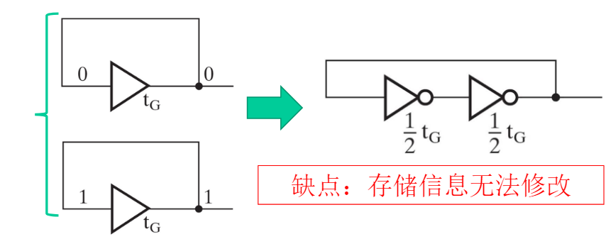
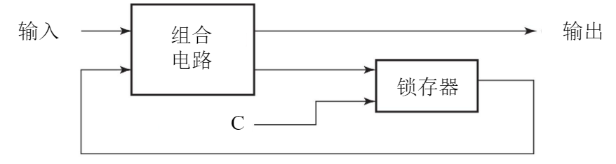
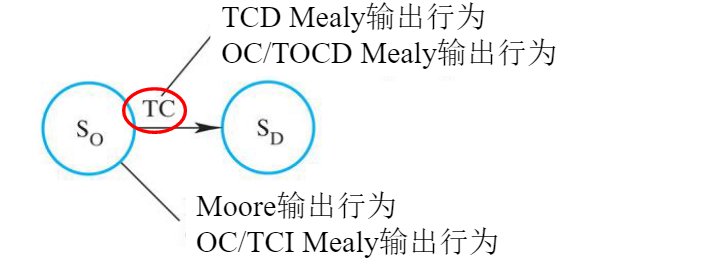

### 壹  时序电路简介

#### 述：
##### 去岁常坐此园中，四时风光各不同。
##### 亦如古今多少事，轮回往复无始终。

###### · 时序电路：
· 时序电路任何时刻的稳态输出，不仅取决于该时刻的输入，而且与前一时刻电路的状态有关
· 时序电路由存储元件和组合电路连接而成：
1. 存储元件：存储二进制信息（当前状态）的电路
2. 组合电路：多输出（下一状态等）的转换电路

                              （图一：时序电路的简单结构）
$$输出=F\ (输入,\ 状态)$$

· *组合电路*：
· 输入：从外部输入信号 + 当前状态
· 输出：往外部输出信号 + 下一状态

· *存储单元*：
· 输入：下一状态
· 输出：**新**的当前状态

· *简单例子：缓冲器实现的存储器*：
· 缓冲器：将输入值直接输出（假设传播延迟 $t_G$ ）

                         （图二：缓冲器的例子及缓冲器的缺点）
· 存储器：

                           （图三：存储器的例子及存储器的缺点）
· 补充：逻辑门的延迟，一般以 ns 为单位

                           （图四：逻辑门的延迟以 ns 为单位）

###### · 时序电路类型：
· *同步时序电路*：
· 同步时序电路有一个时钟统一控制存储元件，状态只会在时钟上升/下降的边沿发生
· **触发器**是基本存储元件

                                （图五：触发器基本结构）

· *异步时序电路*：
· 状态可以在任意时间发生变化
· **锁存器**是基本存储元件

                                （图六：锁存器基本结构）

### 贰  基本存储单元

#### 述：
##### 关隘重重险山出，排石罗阵当去路。
##### 一入机玄深如海，高兜低转不知数。

###### · 基本存储单元：
· 在电路供电状态下能够无限期保存二进制数据，实现时序电路中存储元件的“记忆”功能

                            （图七：时序电路的基本存储单元）

###### · 锁存器（Latch）：
· 锁存器是构成存储元件的基础，把信号暂存以维持某种状态，锁存器分为：
1. $S-R$ 锁存器
2. $\overline{S}-\overline{R}$ 锁存器
3. 时钟 $S-R$ 锁存器
4. $D$ 锁存器
……
通过锁存器可以构成触发器等更复杂的存储元件

① $S-R$ 锁存器（基本或非门锁存器）：
· 交叉耦合的两个或非门得到一个 $S-R$ 锁存器

                         （图八：$S-R$ 锁存器的电路实现和真值表）

                        （图九：$S-R$ 锁存器的时序行为分析）

② $\overline{S}-\overline{R}$ 锁存器（基本与非门锁存器）：
· 交叉耦合的两个或非门得到一个 $\overline{S}-\overline{R}$ 锁存器

                        （图十：$\overline{S}-\overline{R}$ 锁存器的电路实现和真值表）

                        （图十一：$\overline{S}-\overline{R}$ 锁存器的时序行为分析）

③ 时钟 $S-R$ 锁存器（带控制的 $S-R$ 锁存器）：
· 在 $\overline{S}-\overline{R}$ 锁存器基础上添加额外控制信号 $C$，以此开启或关闭（触发）锁存器的功能

                     （图十二：时钟 $S-R$ 锁存器的电路实现和真值表）

                       （图十三：时钟 $S-R$ 锁存器的时序行为分析）

④ $D$ 锁存器：
· 在时钟 $S-R$ 锁存器的基础上，添加一个反相器

                        （图十四：$D$ 锁存器的电路实现和真值表）

                            （图十五：$D$ 锁存器是“透明”的）

· *锁存器作为存储单元的问题*：
· 时钟信号 $C=1$ 时，由锁存器输出到组合电路的反馈通路使得锁存器的输入存在不断变化的可能，使得存储元件进入不稳定状态

                        （图十六：锁存器对于输入信号 $C$ 的接收）
· 例子：组合电路 + $D$ 锁存器：

                        （图十七：组合电路 + $D$ 锁存器的分析）

###### · 触发器（Trigger）：
· 输入信号值的改变可以控制内部锁存器的状态，这种现象称为触发（trigger）
· 触发器：泛指用于记忆 1 位二进制信号的基本单元电路，锁存器是触发器的基本构成部分：
	· 脉冲式触发触发器：主从 $S-R$ 锁存器、主从 $D$ 触发器
	· 边沿触发式触发器：边沿触发的 $D$ 触发器、……
	· 直接输入
	· ……

① 脉冲触发式触发器（主从触发器）：
· 主从 $S-R$ 触发器：
1. 由两个时钟 $S-R$ 锁存器串联而成，其中第二个锁存器的时钟信号由反相器取反
2. 从左到右的输入到输出路径被时钟信号不同取值切断：

          （图十八：脉冲触发式触发器从左到右的输入到输出路径被时钟信号不同取值切断）
· 优点：
如下例子中 $Y$ 驱动 $D$ 的行为在主从 $D$ 触发器中会被阻止：

                        （图十九：脉冲触发式触发器的优点示例）
· 缺点：
	· 触发器输出的改变被脉冲宽度延迟，使得整个电路变慢
	· $C=1$ 时 1 箝位（1st- catching）问题：

                   （图二十：脉冲触发式触发器在 $C=1$ 时的 1 箝位问题）

② 边沿触发式触发器：
· 采用边缘触发来代替主从触发
· 边沿触发器忽略在常数水平的脉冲，只有在*时钟信号转换*的时候被触发
· 边沿触发式 $D$ 触发器是目前使用最广泛的触发器

                      （图二十一：边沿触发式和脉冲触发式的区别）

· *负边沿触发的 $D$ 触发器*：1 跳变到 0 触发
· 将主从 $S-R$ 触发器的第一个时钟 $S-R$ 锁存器换成时钟 $D$ 锁存器：
	· 触发器输出的改变和脉冲的负边沿联结在一起
	· 用 $D$ 代替 $S$ 和 $R$，$S-R$ 主从触发器的延迟被避免，消除了 1st- catching 行为

                        （图二十二：负边沿触发的 $D$ 触发器）

· *正边沿触发的 $D$ 触发器*：0 跳变到 1 触发
· 给负边沿触发的 $D$ 触发器的时钟信号增加一个反相器：
	· 输出端 $Q$ 变成在正时钟边沿符合时间限制的 $D$ 值
	· 对大多数时序电路，被看作是标准触发器

                        （图二十三：正边沿触发的 $D$ 触发器）

③ 直接输入：
· 直接置位或者预置，以及直接复位或者清零
· 在时钟正常运行之前，将触发器设置成一个初始状态

                   （图二十四：具备直接置位和复位功能的正边沿 $D$ 触发器）

· 存储单元的标准图形符号：

                        （图二十五：存储单元的标准图形符号）

### 叁  时序电路分析

#### 述：
#####
#####

###### · 时序电路基本模型：
· 电路输入、输出及当前状态的时序模型：
	 · 当前状态（时间 t ）存储在触发器存储元件
	 · 下一状态（时间 t+1 ）是当前状态和输入的布尔函数
	 · 时间 t 时的输出是 t 时状态（或有 t 时输出）的布尔函数

                   （图二十六：时序电路输入、输出及当前状态的时序模型）
· 例子：

              （图二十七：$x(t)$ 为输入，$y(t)$ 为输出，$(A(t),B(t))$ 为状态的例子）

###### · 状态表：
· 输入、输出、状态构成的多变量表：
	· 由以下四个部分组成;
		1. *当前状态*：状态变量的合法值
		2. *输入*：合法的输入组合
		3. *下一状态*：基于当前状态和输入的（t+1）时的状态值
		4. *输出*：基于当前状态和输入（有时）的输出值
	· 从真值表的角度理解：
		· 输入：输入 + 当前状态
		· 输出：输出 + 下一状态
· 状态表可以用下一状态和输出函数推导

· *一维状态表*：
· 输出栏是在当前时刻状态和输入的组合下的输出值；当前状态和输入合并在一个组合栏中
· 例子：

                            （图二十八：一维状态表的示例）

· *二维状态表*：
· 当前状态列在表的左侧，输入则从左到右列在表的第一行组成二维表描述下一状态及输出
· 例子：

                            （图二十九：二维状态表的示例）
· 如果交换后两行顺序，状态行和输入列的符合格雷码的顺序，则与卡诺图匹配

###### · 状态图：
· 采用图形式表示状态表中的输入信息：
1. 每个状态用一个圆圈表示
2. 每个状态转移用当前状态和下一状态之间的有向线段表示
3. 在有向线段上标注出输入，表示造成状态转移的原因

                                （图三十：状态图的示例）

                    （图三十一：电路图、状态表与状态图的对应关系示例）

· *状态图有两种类型*：Moore 型电路状态图，Mealy 型电路状态图：

                （图三十二：状态图的两种类型：Moore 和 Mealy 型电路状态图）

· 状态图的绘图：
1. 包含输出的圆圈上：状态 / 输出（Moore 型输出只依赖状态）
2. 包含输出的有向线段上：输入 / 输出（Mealy 型输出决定于状态和输出）

                  （图三十三：状态图在 Moore 型和 Mealy 型的绘图示例）
· Moore 型电路输出只依赖于当前状态，状态图对应于一维状态表：

           （图三十四：Moore 型电路输出只依赖于当前状态，状态图对应于一维状态表）

· 问题：下面状态图属于哪种类型？

                     （图三十五：大型电路状态图容易混淆的问题示例）

· *等价状态*：
· 如果两个状态对每一个输入都产生相同的输出，并且下一状态也是一致的，那么这两个状态是等价的

                             （图三十六：等价状态的示例）
· 彼此等价的两个状态可以合并为一个新状态：

                  （图三十七：彼此等价的两个状态可以合并为一个新状态—Ⅰ）

                  （图三十八：彼此等价的两个状态可以合并为一个新状态—Ⅱ）

· *混合型*：
· 在实际设计中，一个电路可能有些输出是 Moore 型的，有些是 Mealy 型的
· 两种类型之间的转换：

                       （图三十九：Moore 型到 Mealy 型的转换）

###### · 时序电路分析：
· 示例：

                            （图四十：时序电路分析的示例）

                       （图四十一：时序电路分析要求状态和输出函数）

                           （图四十二：时序电路分析要求状态表）

                          （图四十三：时序电路分析要求状态图）

### 肆  时序电路设计

#### 述：
#####
#####

· **设计准则——组合电路 v.s. 时序电路**：

| 组合电路    | 时序电路    |
| :------ | :------ |
| 1. 规范化  | 1. 规范化  |
| 2. 形式化  | 2. 形式化  |
| 3. 优化   | 3. 状态分配 |
| 4. 工艺映射 | 4. 优化   |
| 5. 验证   | 5. 工艺映射 |
|         | 6. 验证   |

###### 1. 规范化：
· 描述电路的时序行为（规格）
· 规格说明的形式：
1. 文字描述
2. 数学描述
3. 硬件描述语言
4. 表格描述
5. 方程描述
6. 图描述
· 序列识别器：001101011101……：
	· 一个时序电路，其能在输入序列中发现目标序列时产生特定的输出，如识别一个输入序列 1101 的出现

###### 2. 形式化：
· 状态：一系列加载到电路的历史输入的抽象
· 初始状态：提供一个硬件机制使电路从任何未知状态进入初始状态

                        （图四十四：形式化的初始状态复位信号）
· 获得状态图或状态表（以上述序列器为例）：
1. 针对序列识别器开发一个过程，这个过程能将问题描述转化成状态图
2. 下一步，状态图会被转换成状态表，根据状态表来进行电路设计

· 序列识别器：001101011101……：
	· 一个时序电路，其能在输入序列中发现目标序列时产生特定的输出，如识别一个输入序列 1101 的出现
【分析】
1. 初始状态，没有任何的序列发生
2. 增加一个状态来识别第一个信号
3. 当有后续符号发生时，增加新的状态来识别
4. 最终状态表示输入序列发生
5. 加入状态转移弧，来指定当一个字符没有按照目标顺序出现时的动作
6. 增加其他的在非序列输入上的状态转移弧，来转移到指定输入子序列发生的状态
· 1111101 包含 1101，“11” 是目标序列的子序列，因此时序机在接受下一个字符时必须记住其已经遇到了两个 “1”
· 序列 1101101 也包含 1101，其中初始子序列和最后子序列有重叠，即 **1101**101 或 110**1101**
· 序列 1101 每次都需要被识别出来

                       （图四十五：序列识别器形式化为状态图—Ⅰ）

                       （图四十六：序列识别器形式化为状态图—Ⅱ）

                       （图四十七：序列识别器形式化为状态图—Ⅲ）
各状态的意义：
A：无子序列被识别
B：观察到子序列 1
C：观察到子序列 11
D：观察到子序列 110

                       （图四十八：序列识别器形式化为状态图—Ⅳ）

                     （图四十九：序列识别器由状态图得到状态表—Ⅰ）

                      （图五十：序列识别器由状态图得到状态表—Ⅱ）

· *Mealy 型和 Moore 型的转化*：

                   （图五十一：序列识别器 Mealy 型和 Moore 型的转化）

                         （图五十二：Moore 型具有更多的状态）

###### 3. 状态分配（状态赋值）：
· 通过编码将形式化得到的所有状态分配唯一的代码：
	· $m$ 个状态至少需要 $n$ 位二进制：$n\geq \lceil log_2m \rceil$
	· 至多存在 $2^n-m$ 个未使用的状态
· 常用的分配方式：
	· 计数赋值：$A(00)$、$B(01)$、$C(10)$、$D(11)$
	· 格雷码赋值：$A(00)$、$B(01)$、$C(11)$、$D(10)$
	· 单热点（one-hot）赋值：针对 m 个状态中的每个状态使用一个触发器，因此产生 m 位长的代码（其中 1 位为 1，剩余为 0 ）
· 对于序列识别器：
	· 一个时序电路，其能在输入序列中发现目标序列时产生特定的输出，如识别一个输入序列 1101 的出现

**【计数赋值】**
$A(00)$、$B(01)$、$C(10)$、$D(11)$
赋值后的状态表：

| 当前状态 | x=0 时下一状态 | x=1 时下一状态 | x=0 时输出 | x=1 时输出 |
| :--- | :-------- | :-------- | :------ | :------ |
| 0 0  | 0 0       | 0 1       | 0       | 0       |
| 0 1  | 0 0       | 1 0       | 0       | 0       |
| 1 0  | 1 1       | 1 0       | 0       | 0       |
| 1 1  | 0 0       | 0 1       | 0       | 1       |
|      |           |           |         |         |

**【格雷码赋值】**
$A(00)$、$B(01)$、$C(11)$、$D(10)$
赋值后的状态表：

| 当前状态 | x=0 时下一状态 | x=1 时下一状态 | x=0 时输出 | x=1 时输出 |
| :--- | :-------- | :-------- | :------ | :------ |
| 0 0  | 0 0       | 0 1       | 0       | 0       |
| 0 1  | 0 0       | 1 1       | 0       | 0       |
| 1 1  | 1 0       | 1 1       | 0       | 0       |
| 1 0  | 0 0       | 0 1       | 0       | 1       |

**【单热点赋值】**
$A(0001)$、$B(0010)$、$C(0100)$、$D(1000)$
赋值后的状态表：

| 当前状态 | x=0 时下一状态 | x=1 时下一状态 | x=0 时输出 | x=1 时输出 |
| :--- | :-------- | :-------- | :------ | :------ |
| 0001 | 0001      | 0010      | 0       | 0       |
| 0010 | 0001      | 0100      | 0       | 0       |
| 0100 | 1000      | 0100      | 0       | 0       |
| 1000 | 0001      | 0010      | 0       | 1       |

###### 4. 优化：
1. 确定触发器的输入方程：选择触发器类型，并且根据状态表中的下一状态推导出触发器输入方程，也就是状态方程
2. 确定输出方程：根据状态表中的输出推导输出方程
3. 优化：对方程进行优化

· *计数赋值下的情况示例*：

                       （图五十三：以两个 D 触发器作为优化示例）

                    （图五十四：两个 D 触发器电路卡诺图及门成本）

· *格雷码赋值下的情况示例*：

                    （图五十五：两个 D 触发器电路用格雷码赋值的示例）

                （图五十六：两个 D 触发器电路在格雷码赋值下的卡诺图及门成本）

· *单热点赋值下的情况示例*：
· 四个 $D$ 触发器（$D_{0123}$）
· 单热点赋值
· 输入 $Y_{0123}$
· 输出 Z
————————>
· 四个状态的编码：$(Y_0,Y_1,Y_2,Y_3)=0001,0010,0100\ 和\ 1000$
· 在方程中，仅仅需要包含是 1 的变量（如编码为 0001 的状态可以被表示为 $Y_0$，而不是 $\overline{Y_3}\ \overline{Y_2}\ \overline{Y_1}\ Y_0$ ）
· 提供了简化的分析和设计
· 组合逻辑可能会简单，但是触发代价会更高，可能不是代价低的方案

               （图五十七：四个 D 触发器电路在单热点赋值下的卡诺图及布尔函数）

###### 5. 工艺映射：
· 2 个具有 Reset 的 D 触发器
· 3 个与门和一个或门

                   （图五十八：2 个具有 Reset 的 D 触发器映射前的初始电路）
$$\begin{cases}D_1=Y_1Y_2+XY_2\\ D_2=X\\ Z=XY_1\overline{Y_2}\end{cases}$$

                  （图五十九：2 个具有 Reset 的 D 触发器映射后的最终电路）

###### 6. 验证：
· 时序电路可以通过呈现电路产生的原始状态图或状态表进行验证
· 手工验证：对于较小的电路，可直接加载各种状态与输入的组合，并验证输出和下一状态是否正确
· 模拟验证：通过一个输入组合序列和时钟信号，并在时钟上升沿后验证输出和下一个状态值

· 序列识别器：001101011101……：
	· 一个时序电路，其能在输入序列中发现目标序列时产生特定的输出，如识别一个输入序列 1101 的出现

**【手工验证】**
· 4 个状态和 2 个输入需要验证 8 种状态与输入组合：
	· 复位状态：加载 1，初始状态 $A(0,0)$
	· $X$ 输入 0，输出为 0，下一状态 $A(0,0)$
	· 在状态 $A$ 下，$X$ 输入 1，输出为 0，下一状态 $B(0,1)$

**【模拟验证】**
· 加载所有状态与输入组合对的输入序列
· 生成相应的输入序列和下一状态序列

                            （图六十：模拟验证波形的示例）

### 伍  状态机设计

#### 述：
#####
#####

###### 1. 传统的状态图和状态表：
· **有限状态机（Finite State Machine，FSM）**：包含三个集合 $I$、$O$ 和 $S$，两个函数 $f$ 和 $g$
· $I$ 是输入的组合集合
· $O$ 是输出的组合集合
· $S$ 是状态集合
· $f$ 是下一个状态函数 $f(I,S)$
· $g$ 是输出函数 $f(S)$（Moore 模型）或者 $f(I,S)$（Mealy 模型）
· FSM 是时序电路分析的基本数学模型
· 传统的状态图和状态表是两种表示 FSM 的方式，两种方式都需要
1. 在定义下一状态时，都需要针对每个状态枚举所有的输入集合
2. 在定义 Mealy 输出时，都需要针对每个状态枚举所有的输入集合
3. 针对每个状态 Moore 或输入—状态对（Mealy），枚举所有对应的输出
· 对于状态图，所有的 Mealy 输出都需要在有向线段上指定
· 这些对于很少输入和输出的时序电路是可接受的，对具有大量输入和输出的电路，状态表和状态图两种表达方式都难以处理（只允许在有向线段输出使得 Mealy 的输出变得复杂）
· 采用状态机图（state machine diagram，SMD）

                        （图六十一：状态图和状态机图的比较）

###### 2. 状态机图模型：
· 状态机图和传统状态图类似，使用了状态结点和有向线段作为转移弧
· 增加了在状态上定义 Mealy 输出的标识
· 基于输入条件、转移条件、输出条件产生输出行为：
1. 输入条件：采用输入变量的布尔表达式或方程来表示，其值为 0 或 1
2. 转移条件（Transition condition，TC）：在转移弧上的输入条件
3. 输出条件（Output condition，OC）：如果其等于 1，则造成输出行为发生，否则输出行为不发生
$$\begin{cases}S_0\rightarrow S_1,\ 无条件转换\\ S_1\rightarrow S_0,\ \overline{A}=1\\ S_2\rightarrow S_0,\ A+B=1 \end{cases}$$
· *转移条件*：
	· 无条件转移：在弧上没有转移条件或者转移条件包含常量 1
	· 条件转移：在弧上有一个或者多个转移条件，如果任何一个转移条件为 1，则转移发生

                            （图六十二：状态机图通用模板）
· *输出行为*：
· Moore 输出行为，是无条件的，只依赖于状态，用一条线和相应的状态连接
· 非转移条件依赖（Transition condition-independent，TCI）：Mealy 输出行为由输出条件和斜线驱动，和相应的状态连接；如果输入状态为 1，则输出行为发生
· 转移条件依赖（Transition condition-independent，TCD）：Mealy 输出行为和相应的状态转移连接；如果输出条件为 1，则输出行为发生
· 转移和输出条件依赖（Transition and output condition-dependent，TOCD）：Mealy 输出行为由输出条件和斜线驱动，和相应的状态转移条件相连；如果转移条件和输出条件都为 1，则输出行为发生
· *输出行为对于单变量*：
· 依附于状态的变量 Z 的出现意味着 Z=1，否则 Z=0
· 依附于转移条件（可能是输出条件）的变量 Z 的出现意味着当条件满足时 Z=1；除非 Z 是 Moore 输出或者 TCI 标签的一部分，否则 Z=0
· 单独的默认值语句可以用来显式地制定 Z 的默认值为 0 或 1
· *输出行为对于向量变量*：
· 依附于状态的方程 “Z=向量值” 的出现，指定了 Z 的值
· 依附于转移条件（可能是输出条件）的方程 “Z=向量值” 的出现，指定的 Z 的值；依附于转移的 Z 的值也可以被 Moore 输出指定或者作为 TCI 的一部分；否则 Z 的值为默认值
· *总结*：给定一个状态，一个输出行为在如下情况发生：
1. 无条件（Moore）
2. TCI 并且输出条件（output condition，OC）为 1
3. TCD 并且转移条件（translation condition，TC）为 1
4. TOCD 并且 TC 和 OC 为 1
· Moore 和 TCI 输出动作和一个状态相连，适用于从这个状态出发的状态转移

                           （图六十三：转移和输出条件例子）

· 状态机图使用：
· 状态机图看起来复杂，但注意如下：
1. 只有无条件输出类型是适用于纯 Moore 型
2. TCD 输出表示传统的 Mealy 模型，随着状态的增加，复杂度提高
3. 混合 Moore 和 Mealy，以及 TCI 和 TOCD 可以简化状态图和状态表

                                （图六十四：状态机表）

###### 3. 约束检查：

【TC 状态】
1. 约束一：对状态 $S_i$，从 $S_i$ 出发的所有可能 TC 对 $(T_{ij},T_{ik})$，$T_{ij}\cdot T_{ik}=0$——不重
2. 约束二：对状态 $S_i$，对所有可能的 TCs，$\Sigma T_{ij}=1$——不漏

【OC 状态】
1. 约束一：对状态 $S_j$，在其上或者其状态转移上有一致的输出变量但不同值的输出行为，相应的输出条件对 $(O_{ij},O_{ik})$ 是互斥的，即 $O_{ij}\cdot O_{ik}=0$——不重
2. 约束二：对每个输出变量，在状态 $S_i$ 上或者在 $S_i$ 状态转移上的输出条件必须覆盖所有可能的输入变量组合，$\Sigma O_{ij}=1$——不漏

· 违反约束的例子：

                             （图六十五：违反约束的例子）

· 约束检查的例子：

                            （图六十六：约束检查的例子）

###### 4. 状态机图应用和设计：

· 基于状态机图设计过程：
1. 定义电路的输入输出变量，并且定义每个变量 0 和 1 的含义
2. 画出电路状态机图或者写出状态机表（如果使用的是状态机图，将其转换成状态机表）
3. 从状态机表推导出电路的下一状态和输出的优化方程

· **例 1——控制滑动门：**：
1. 规范化：
	· 设计一个控制滑动门的时序电路
	· 接近、存在、阻力时自动打开
	· 手动按钮打开
	· 控制盒里面的锁

                                （图六十七：控制滑动门）
2. 输入和输出：

                        （图六十八：控制滑动门的输入和输出）
3. 状态机图：

                         （图六十九：控制滑动门的状态机图）
4. 状态机表，状态赋值：

                       （图七十：控制滑动门的状态机表和状态赋值）
5. 输出方程，优化：
$$BT=\overline{Y_1}\cdot \overline{Y_2}\cdot LK$$$$CD=Y_1\cdot\overline{Y_2}+\overline{Y_1}\cdot\overline{Y_2}\cdot\overline{LK}\cdot\overline{CL}\cdot\overline{X}=(Y_1+\overline{LK}\cdot\overline{CL}\cdot\overline{X})\cdot\overline{Y_2}$$$$OD=\overline{Y_1}\cdot Y_2+Y_1\cdot Y_2\cdot\overline{OL}\cdot X=(\overline{Y_1}+\overline{OL}\cdot X)\cdot Y_2$$

· **例 2——电梯控制**：
1. 规格化，输入输出：

                       （图七十一：电梯控制的规格化和输入输出）

2. 状态：
· 初始状态：U（Up），Dn（Down），Hd（Hold）
· 在 Hd 状态需要的系列动作：开门，使用定时器等待乘客，关门
· 将 Hd 扩展成三个状态：Hd_A，Hd_B，Hd_C
· 状态向量：$(\ U,\ Dn,\ Hd\_C,\ Hd\_B,\ Hd\_A\ )$

3. 状态机图（SMD）：

                           （图七十二：电梯控制的状态机图）

4. 状态机表（SMT）：

                           （图七十三：电梯控制的状态机表）

5. 方程：

                   （图七十四：电梯控制的方程：触发输入—左，输出—右）

