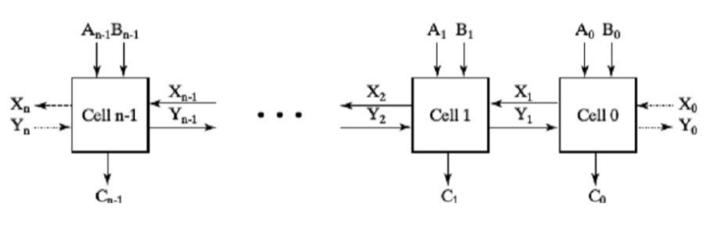

### 壹  逻辑组合电路的设计流程

#### 述：
##### 构为行之起，构以行为成。
##### 无构行弗远，无行构终空。

###### · 组合逻辑电路的结构：
· 一个组合逻辑电路有 m 个布尔输入，n 个布尔输出，n 个转换函数（每一个转换函数将 $2^m$ 个输入组合映射到一个输出，当前的输出依赖于当前的输入组合）
![[数字逻辑图/数字逻辑图3-1.png|500]]
                      （图一：组合逻辑电路的输入、输出与转换函数）

###### · 组合逻辑电路的设计过程：
1. 规范化：指定组合电路行为
2. 形式化：用真值表对输入输出形式化
3. 优化：优化逻辑，减少门输入成本，如卡诺图优化
4. 工艺映射：将优化后逻辑映射到实现工艺
5. 验证：验证设计正确性

###### · 设计一个 BCD 码到余三码转换电路的设计过程：
1. 规范化：
	1. 输入：0 到 9 的 BCD 码表示，分别为 0000-1001
	2. 输出：0 到 9 的余三码表示，在 BCD 码上加 0011
2. 由于只有四位，用真值表很容易表示
	1. 变量：BCD 码：ABCD
	2. 变量：余三码：WXYZ
![[数字逻辑图/数字逻辑图3-2.png|300]]
                            （图二：BCD 码转余三码的真值表）
3. 优化目标：门输入成本（逻辑图中门的输入端的个数）—> 采用卡诺图优化
![[数字逻辑图/数字逻辑图3-3.png|650]]
                      （图三：由真值表得到卡诺图：Z 为 1 时的输入）
![[数字逻辑图/数字逻辑图3-4.png|400]]
                   （图四：由真值表得到卡诺图：W、X、Y、Z 取 1 时的输入）
· 卡诺图化简：
①确定主蕴含项
②对质主蕴含项逻辑和
③加上其他主蕴含项：选择规则为尽可能减少主蕴含项的重叠，并保证所选择的主蕴含项至少覆盖一个没有被其他主蕴含项覆盖的最小项

· 卡诺图优化结果：$$\begin{cases}W=A+BC+BD\\ X=\overline{B}C+\overline{B}D+B\overline{C}\overline{D}\\ Y=CD+\overline{C}\overline{D}\\ Z=\overline{D}\end{cases}$$
· 门输入成本：$G=7+10+6+0=23$

· 进一步优化思想：共享电路：$$\begin{cases}T_1=C+D\\ W=A+BT_1\\ X=\overline{B}T_1+B\overline{C}\overline{D}\\ Y=CD+\overline{C}\overline{D}\\ Z=\overline{D}\end{cases}$$
· 门输入成本：$G=2+4+7+6+0=19$

· 进一步优化：$\overline{T_1}=\overline{C}\overline{D}=\overline{C+D}$
$$\begin{cases}T_1=C+D\\ W=A+BT_1\\ X=\overline{B}T_1+B\overline{T_1}\\ Y=CD+\overline{T_1}\\ Z=\overline{D}\end{cases}$$
· 门输入成本：$G=2+4+6+4+0=16$
![[数字逻辑图/数字逻辑图3-5.png|550]]
                        （图五：BCD 码转余三码：优化的电路结果）

4. 工艺映射：
	1. 给定设计好的电路概要图（含与门、或门、反相）
	2. 映射到与非门：库中含反相器和 n-输入与非门，n=2，3，……
	3. 映射到或非门：库中含反相器和 n-输入或非门，n=2，3，……

· 映射到与非门：
	1. 用与非门替换掉与门和或门
![[数字逻辑图/数字逻辑图3-6.png|350]]
                            （图六：用与非门替换掉与门和或门）
	2. 将反相器推过电路中的扇出点
![[数字逻辑图/数字逻辑图3-7.png|350]]
                          （图七：将反向想起推过电路中的扇出点）
	3. 抵消掉反相器对
![[数字逻辑图/数字逻辑图3-8.png|350]]
                                （图八：抵消掉反相器对）
	4. 重复第 2 步和第 3 步，直到 a 和 b 之间只存在一个反相器：
		a. 电路输入或与非门的输出
		b. 与非门输入
例：
![[数字逻辑图/数字逻辑图3-9.png|600]]
                                （图九：与非门的替换）
![[数字逻辑图/数字逻辑图3-10.png|600]]
                               （图十：反相门推过扇出点）
![[数字逻辑图/数字逻辑图3-11.png|600]]
                               （图十一：反相对的抵消）

· 映射到或非门：
	1. 用或非门替换掉与门和或门
![[数字逻辑图/数字逻辑图3-12.png|350]]
                           （图十二：用或非门替换掉与门和或门）
	2. 用反相器推过电路中的扇出点
	3. 抵消掉反相器对
	4. 重复第 2 步和第 3 步，直到 a 和 b 之间只存在一个反相器：
		a. 电路输入或或非门的输出
		b. 或非门输入
![[数字逻辑图/数字逻辑图3-13.png|550]]
                            （图十三：映射到或非门的变换）

5. 验证：人工逻辑分析，模拟

· 人工逻辑分析：
	1. 找出实现电路真值表或方程式
	2. 将实现电路的真值表和规范真值表进行比较
	3. 证明实现电路的方程式和规范方程式等价
![[数字逻辑图/数字逻辑图3-14.png|600]]
                     （图十四：人工逻辑分析的方程式法和真值表法）

· 模拟：
	· 以一种硬件描述语言 Verilog 为例：
	①使用 Verilog 对电路进行编程实现
	②编写测试程序，即 TestBench ——产生模拟信号，将产生信号加到实现电路上
	③将输出与期望值比较
	· 使用图编辑器或者文本编辑器对实现电路进行一个门级表示
	· 采用波形编辑器或者文本编辑器来输入一个测试，这个测试是输入组合的一个序列：
		· 如果所有的相应是正确的，那就能保证实现电路的正确性
		· 由于所有可能的输入组合的短缺，因此生成这样的一个测试有一定难度
![[数字逻辑图/数字逻辑图3-15.png|300]]
                    （图十五：模拟：输入 BCD 码到余三码转换器的原理图）

###### · BCD 码的检错：
· 设计一个电路来检测用 BCD 码表示的十进制数的一个错误：
1. 当输入的 BCD 码是 6 种无效码种的一个，返回值 1
2. 当输入的 BCD 码合法时，返回值 0
· BCD 码的四位从左到右表示为：A,B,C,D
· 通过真值表和卡诺图，得到输出的表达式：OUTPUT = AB + AC

### 贰  组合逻辑功能模块
#### 述：
##### 
#####

###### 1. 组合功能模块：
· 组合功能模块：
	· 在电路设计中经常使用的公共模块
	· 每个功能模块对应一个组合电路实现
· 按集成度高低的不同：
	· 小规模集成电路（SSI）：10-100 个晶体管
	· 中规模集成电路（MSI）：100-1000 个晶体管
	· 大规模集成电路（LSI）：1000-100000 个晶体管
	· 超大规模集成电路（VKSI）：100000 个晶体管以上
· 芯片（集成电路）工艺（nm）：
	· 晶体管栅级的宽度，也称栅长
	· 栅长越短
		· 同尺寸的硅片可集成更多晶体管
		· 频率越高，功耗越低
· 目前水平：5 nm，迈向 3 nm
· 芯片产业链：
	· 制造设备：光刻机、蚀刻机和薄膜沉积
	· 设计
	· 生产
	· 封测
· 制造设备：
	· 蚀刻机：中微半导体 7 nm
	· 光薄膜沉积：北方华创 28 nm
	· 光刻机：
		· 上海微电子 90 nm，荷兰 ASML（阿斯麦）5 nm
		· 差距最大
· 芯片设计：
	· 华为海思，5 nm，ARM 架构需要授权
· 芯片生产：
	· 台积电：3 nm
	· 中芯国际：14 nm
· 芯片封测：
	· 技术含量相对较低
	· 长电科技、华天科技、通富微电
	· 世界第一梯队

###### 2. 基本逻辑函数：
1. *单变量函数*：
· 一个变量 X 的函数
· 可以在输入处用作工作快
![[数字逻辑图/数字逻辑图3-16.png|550]]
                                （图十六：单变量函数）

2. *多位函数*：
· 1 位函数的向量
· 粗线代表总线，其是一个向量信号，如下图的 (b)
· 可以从总线中分割出一个位子集，如下图的 (c) 和 (d)
![[数字逻辑图/数字逻辑图3-17.png|500]]
                                  （图十七：多位函数）

3. *使能函数*：
· 是否允许信号从输入传到输出
· 引入使能信号 EN：
	· EN=1 允许信号传输
	· EN=0 阻止信号传输
		· 输出用固定值替代，可能是 0 或者 1
![[数字逻辑图/数字逻辑图3-18.png|450]]
                           （图十八：使能函数的固定值输出）

###### 3. 译码和译码器：
· *译码*：
	· 输入 n 位，输出 m（ n ≤ m ≤ 2n ）位
	· 例：输入二进制码，在输出中将对应位置 1，010 —> 00000100
· *编码*：
	· 输入最大的 m （ n ≤ m ≤ 2n ）位，输出 n 位
	· 例：输入中某位为 1，输出中编码出位置，00000100 —> 010
· *译码和编码互逆*

· *译码器*：
	· 实现译码功能的电路
	· n-m 译码器
	· 例：输入：1 的位置的编码，如 010；输出：只有一位是 1 的输出，如 00000100

· 如何设计一个 1-2 译码器？
![[数字逻辑图/数字逻辑图3-19.png|350]]
                            （图十九：设计一个 1-2 译码器）

· 设计一个 2-4 译码器：
![[数字逻辑图/数字逻辑图3-20.png|500]]
                            （图二十：设计一个 2-4 译码器）
![[数字逻辑图/数字逻辑图3-21.png|450]]
                        （图二十一：1-2 译码器和 2-4 译码器的联系）

· n-2n 译码器的展开：
	· 需要 2n 个与门
	· 每个输出与门被两个译码器驱动（这两个译码器输入相等或相差 1 ）
	· 将这两个译码器按照同样过程展开
	· 直至到 1-2 译码器
· 上述过程可经修改应用到输出 ≠2n 的译码器【分级思想+与门组合】

· 例：3-8 译码器：
	· 需要 8 个输出与门
	· 每个输出与门被两个译码器驱动
	· 最相近的两个译码器：1-2 译码器和 2-4 译码器
	· 2-4 译码器：
		· 需要 4 个输出与门
		· 每个输出与门被两个译码器驱动
		· 最相近的两个译码器：两个 1-2 译码器
![[数字逻辑图/数字逻辑图3-22.png|400]]
                                （图二十二：3-8 译码器）

· 例：构建一个 7-128 译码器：
	· 需要 128 个输出与门
	· 每个输出与门被两个译码器驱动
	· 最相近的两个译码器：4-16 译码器和 3-8 译码器
	· 4-16 译码器：
		· 需要 16 个输出与门
		· 每个输出与门被两个译码器驱动
		· 最相近的两个译码器：两个 2-4 译码器

· 带有使能的译码器：
	电路增加使能信号-EN
![[数字逻辑图/数字逻辑图3-23.png]]
                              （图二十三：带有使能的译码器）
（注意 X 也能表示 0 或 1 ）
带有使能的 2-4 译码器也被称为 “1-4 多路分配器”：
	· EN 为输入数据，$A_1A_0$ 为输出端选择信号（可以看作使能信号）
	· 将数据输出到选择输出端
同一电路，两个视角
![[数字逻辑图/数字逻辑图3-24.png|350]]
                              （图二十四：1-4 多路分配器）

###### 4. 基于译码器的组合电路：
· 实现一个函数，其中有 n 个变量
	· 最小项之和的表达式，即标准型
	· 一个 n-2n 译码器，译码器输出对应最小项
	· 一个或门，将最小项“或”起来
· 方法 1：得到函数的真值表，如果 1 在真值表中，就连接译码器输出和、或门
· 方法 2：得到输出函数的最小项，将最小项用或门连接起来
![[数字逻辑图/数字逻辑图3-25.png|450]]
                              （图二十五：1 位二进制加法器）

###### 5. 编码和编码器：
· *译码*：
	· 输入 n 位，输出 m（ n ≤ m ≤ 2n ）位
	· 例：输入二进制码，在输出中将对应位置 1，010 —> 00000100
· *编码*：
	· 输入最大的 m （ n ≤ m ≤ 2n ）位，输出 n 位
	· 例：输入中某位为 1，输出中编码出位置，00000100 —> 010
· *译码和编码互逆*

· *编码器*：
	· 实现编码功能的电路
	· m-n 编码器
	· 例：输入：只有一位是 1 的输入，如 00000100；输出：1 的位置的编码，如 010

· 例：十进制 - BCD 编码器：
	· 输入：10 位代表从 0 到 9 $(D_0,\ldots,D_9)$
	· 输出：4 位 BCD 码
	· 函数：若输入位 $D_i$ 是 1，则输出 $(A_3,A_2,A_1,A_0)$ 是 i 的 BCD 码
	· 如何得到电路：真值表 -> 卡诺图优化 -> 优化 —— 但是 10 个输入？
· $A_j$ 什么时候是 1 ？—— i 的二进制中 $A_j$ 位是 1
· 输入 $D_i$ 是布尔方程 $A_j$ 的一项：

| 十进制符号 | BCD 码 | 十进制符号 | BCD 码 |
| :---- | :---- | :---- | :---- |
| 0     | 0000  | 5     | 0101  |
| 1     | 0001  | 6     | 0110  |
| 2     | 0010  | 7     | 0111  |
| 3     | 0011  | 8     | 1000  |
| 4     | 0100  | 9     | 1001  |
· 布尔方程：
$A_3=D_8+D_9$
$A_2=D_4+D_5+D_6+D_7$
$A_1=D_2+D_3+D_6+D_7$
$A_0=D_1+D_3+D_5+D_7+D_9$
（ $D_i$ 的角标十进制转二进制 —> 根据二进制中 “1” 的位置将 $D_i$ 写到对应的 $A_j$ 下面，用 “+” 连接）

· 例：八-二进制编码器的布尔方程：
$A_0=D_1+D_3+D_5+D_7$
$A_1=D_2+D_3+D_6+D_7$
$A_2=D_4+D_5+D_6+D_7$

· 当输入中不止一位 1：01001000，则编码器输出：多个位编码的或 ——> 不能正常工作
· 思想：选择最重要的输入位编码：
1. 能接受所有输入组合
2. 能产生有意义的输出
3. 优先编码器

· *优先编码器*：
· 优先编码器将读取输入序列的第一个 “1” 进行编码输出，例如：01001000 输出 6 而不是 3

· 例：4 输入优先编码器：
输入：$D_3$，$D_2$，$D_1$，$D_0$
输出：$A_1$，$A_0$，$V$（$V$ 表示是否有 1 出现）

                       （图二十六：4 输入优先编码器的输入和输出）
· 在图二十六中，$X$ 表示 0 或 1，表示条目对应乘积项而不是最小项

                      （图二十七：4 输入优先编码器的卡诺图优化）

                       （图二十八：4 输入优先编码器的电路设计）

· 例：5 输入优先编码器：
输入：$D_4$，$D_3$，$D_2$，$D_1$，$D_0$
输出：$A_2$，$A_1$，$A_0$，$V$（$V$ 表示是否有 1 出现）

                        （图二十九：5 输入优先编码器的输入和输出）
——如何得到电路？
——真值表—>卡诺图优化—>优化————但是 5 个输入？
——可以直接从表中读出方程，并进行优化————**观察法**

                      （图三十：5 输入优先编码器用观察法写布尔方程）

· **观察法**（以写 $A_1$ 的布尔方程为例）：
1. 首先写二进制在 $A_1$ 位置为 1 的所有十进制输入：2，3
	（在 5 输入编码器中输入范围是 $D_0$ 到 $D_4$ ）
2. 如果不是优先编码器，则直接有 $A_1=D_3+D_2$
3. 对于优先编码器，要排除 $D_i$ 前面的位置的干扰：$$A_1=\overline{D_4}D_3+\overline{D_4}\ \overline{D_3}D_2$$根据吸收律：$\overline{D_3}$ 可以被“吸收”掉：$$A_1=\overline{D_4}D_3+\overline{D_4}\ \overline{D_3}D_2=\overline{D_4}D_3+\overline{D_4}D_2=\overline{D_4}\ (D_3+D_2)$$

###### 6. 多路复用器：
· 选择：计算机系统的关键功能模块
· 执行选择的电路：
1. 输入一组待选择的数据和一组用来进行选择的选择信号
2. 输出只有一个
· 执行选择的逻辑电路被称为多路复用器

· *多路复用器*：从输入选择信息并输出
输入：
1. 待选择数据：最多 $2^n$ 个输入（$I_{2^n-1}$，…，$I_0$）
2. 选择信号：n 个（$S_{n-1}$，…，$S_0$）
一个输出

· 例：2-1 多路复用器
输入：
	· 待选择数据：$2^1$ 个，$I_0$，$I_1$
	· 选择信号：$n=1$ 个，$S_0$
		· $S_0=0$ 选择输入 $I_0$
		· $S_0=1$ 选择输入 $I_1$
输出：$Y$
方程：$$Y=\overline{S}I_0+SI_1$$

                        （图三十一：2-1 多路复用器的电路实现）

· *$2^n-1$ 多路复用器的结构*：
1. n - $2^n$ 译码器
2. $2^n$ 使能（2 输入与门）
3. $2^n$ 输入或门
后面两个看作 $2^n\times 2$ 与-或门：
	· $2$ 表示与门输入数量
	· $2^n$ 表示与门的数量
	· $1$ 个 $2^n$ 输入的或门

· 例：$2^2-1$ 多路复用器
	· $2-2^2$ 译码器
	· $2^2\times 2$ 与-或门
$$Y=\overline{S_1}\ \overline{S_0}I_0+\overline{S_1}S_0I_1+S_1\overline{S_0}I_2+S_1S_0I_3$$

                        （图三十二：三变量布尔代数最小值表）

                        （图三十三：$2^2-1$ 多路复用器的电路）
· 位宽展开：4-1 四位多路复用器
	· 选择位向量而不是单个位
	· 平行地使用四个 $2^2\times 2$ 与-或

                        （图三十四：4-1 四位多路复用器的电路）

###### 7. 基于复用器的组合电路：
· 实现 m 个函数，包含 n 个变量
· 方法 1：m 位宽 $2^n-1$ 多路复用器
· 方法 2：m 位宽 $2^{n-1}-1$ 多路复用器

· *方法 1：m 位宽 $2^n-1$ 多路复用器*：
1. 先得到函数的真值表
2. 根据真值表：
	1. 将函数输入 $S_{n-1}$，…，$S_0$ 作为选择信号
	2. 真值表中的值作为多路复用器的待选择数据
	3. 将多路复用器的输出标识成函数输出
· 例：格雷码到二进制转换：
真值表如下所示：

| Gray A，B，C | Binary x，y，z |
| :--------- | :----------- |
| 0 0 0      | 0 0 0        |
| 1 0 0      | 0 0 1        |
| 1 1 0      | 0 1 0        |
| 0 1 0      | 0 1 1        |
| 0 1 1      | 1 0 0        |
| 1 1 1      | 1 0 1        |
| 1 0 1      | 1 1 0        |
| 0 0 1      | 1 1 1        |
重新排列使得输入按计数顺序
	y 和 z 可以通过一个双位 8-1 多路复用器实现：
	1. 将 A，B，C 连接到选择信号
	2. 将 y 和 z 连接到两个输出
	3. 将他们各自的真值连接到待选择数据

                        （图三十五：格雷码转二进制 y 的输出）

                         （图三十六：格雷码转二进制 z 的输出）

· *方法 2：m 位宽 $2^{n-1}-1$ 多路复用器*：
1. 先得到函数的真值表：
	1. 基于 n-1 个变量值，将真值表中的行配对：n-1 个变量一致
	2. 设剩下的变量为 $X$
	3. 每一配对中，将输出表达成 $(0,1,X,\overline{X})$
2. 根据真值表：
	1. 将 n 个变量作为选择信号
	2. $(0,1,X,\overline{X})$ 作为待选择数据
	3. 将多路复用器的输出标识成函数输出
· 例：格雷码到二进制转换：
	· 首先画出真值表：x=C，y 和 z 比较复杂
	· 重排真值表，使得输入按照计数升序：

                   （图三十七：格雷码到二进制转换重排真值表-两两分组）

### 叁  算术功能模块

#### 述：
#####
#####

###### 1. 迭代组合电路：
· 例：设计一个电路来处理 32 位二进制加法：
如果按照“传统方法”，则面临输入量大，真值表行数非常多，布尔函数方程极为复杂这样的问题，因此这种思路在实际中不可行
——改进：基本思想为利用规律性来简化设计
类似的算术功能有以下规律：
1. 对二进制向量进行操作
2. 对每一位进行同样的子函数操作
设计子函数功能模块，重复使用得到总体功能
单元：子函数模块
迭代阵列：相互连接的单元的阵列

                     （图三十八：算术功能组合电路的迭代阵列示意）

###### 2. 二进制加法器：
· *半加器*：2 输入按位加功能模块
· 输入：$X$ 与 $Y$
· 输出：和位 $S$，进位 $C$

                          （图三十九：半加器的简单运算原理）

                         （图四十：半加器的真值表及卡诺图）
通过上述真值表及卡诺图可以得到多种表示，其中最常用的表示为：$$S=X\oplus Y$$$$C=X\cdot Y$$

                        （图四十一：半加器的和位与进位电路表示）
其他实现：
$$1.\begin{cases}S=X\overline{Y}+\overline{X}Y\\ C=XY\end{cases}$$$$2.\begin{cases}S=\overline{(C+\overline{X}\cdot\overline{Y})}\\ C=XY\end{cases}$$$$3.\begin{cases}S=(X+Y)\cdot (\overline{X}+\overline{Y})\\ C=XY\end{cases}$$$$4.\begin{cases}S=(X+Y)\cdot\overline{C}\\ C=\overline{(\overline{X}+\overline{Y})}\end{cases}$$

· *全加器*：3 输入按位加功能模块
· 输入：$X$，$Y$，进位 $Z$
· 输出：和位 $S$，进位 $C$

                        （图四十二：全加器的真值表及卡诺图）
卡诺图化简得到：$$S=X\overline{Y}\ \overline{Z}+\overline{X}Y\overline{Z}+\overline{X}\ \overline{Y}Z+XYZ$$$$C=XY+XZ+YZ$$
$S$ 是三位异或函数（奇函数）：$$S=X\oplus Y\oplus Z$$$C$ 是 $C=XY+(X\oplus Y)Z$
项 $X\cdot Y$ 是进位生成，项 $X\oplus Y$ 是进位传播

                               （图四十三：全加器概要图）
在图四十三中，$A$，$B$，$C$ 即为 $X$，$Y$，$Z$

· *行波进位加法器*：二进制加法迭代阵列
· 例：4 位行波进位加法器

                              （图四十四：4 位全加法器）

###### 3. 二进制减法器：
· 减法可以按照补码的加法执行：取反加 1
· 电路如下所示，计算 $A+B$ 和 $A-B$：
	$S=1$，减法
	$S=0$，加法

                           （图四十五：二进制减法器的电路）

· *补码（Radix complement）*：
一般的减法：将减数 $N$ 从被减数 $M$ 中减去 $(M-N)$：
1. 如果最高位没有借位，则 $M\ge N$，则结果非负
2. 如果最高位产生借位，则 $N\textgreater M$，则 $M-N+2^n$ 从 $2^n$ 中减去，并且给结果加上符号

                               （图四十六：减法运算示意）
一般的减法太复杂，优化目标：共享加法和减法的逻辑
$2^n-N$ 是 $N$ 的补码
n 位 r 进制补码定义：$r^n-N$
2 进制补码定义：$2^n-N$
反码加 1 是补码

· *补码实现减法*：
数值的符号-补码表示：
1. 首位表示符号：1-负，0-正
2. 剩余位：二进制编码
例：-9 的表示：
符号-数值：10001001
符号-补码：11110111

加法：
1. 将两个数（包含符号数）相加，丢弃进位
2. 如果相加的两个数符号位相同，而结果的符号不同，则有溢出发生
3. 结果的符号见第一步
减法：
· 将减数变成补码格式（包括符号位），然后按照加法进行

· *补码加/减法器*：
$S=1$：减法，$B$ 的反码通过 XOR 来得到，同时将 $C_0$ 置为 1
$S=0$：加法，$B$ 直接通过门，不改变

                           （图四十七：补码加/减法器电路）

###### 4. 溢出检测：
· 溢出发生的原因：对于 n 位的加法或者减法，结果需要 n+1 位来存储，可能发生在：
1. 对两个同符号数进行相加
2. 对两个异符号数进行相减

                                （图四十八：溢出的示例）
溢出检查可以通过检测符号位的进位输入和符号位的进位输出是否一致来判断

                          （图四十九：溢出正确与错误的情况）
最简单的溢出检测实现：

                           （图五十：最简单的溢出检测实现）

###### 5. 其他算术功能：
1. *压缩*：
压缩是一种简化一个功能模块的电路逻辑来实现另外一个功能模块的技术：
· 新函数可以通过在原函数上输入值实现，输入值固定为基本函数
· 在这里基本函数值 0 和 1（不包含 $X$）
· 通过固定 0 和 1 后，布尔方程和逻辑电路图可以通过已有的规则化简

· 例：将一个波形进位加法器压缩成一个递增器，n=3

                  （图五十一：将一个波形进位加法器压缩成一个递增器，n=3）

2. *递增*：
· 对一个算术变量固定值（固定值通常为 1 ）
· 例子：$A+1$，$B+4$
· 功能模块被称为“递增器”

3. *递减*：
· 对一个算术变量固定值（固定值通常为 1 ）
· 例子：$A-1$，$B-4$
· 功能模块被称为“递减器”

4. *乘/除以 $2^n$*：
乘以 100：左移 2 位
除以 100：右移 2 位，剩下的保留

                            （图五十二：二进制乘除法的示意）

5. *乘以常数*：
例：$B(3:0)$ 乘以 $101$

                              （图五十三：乘以常数的示意）

6. *零填充*：
对 m 位的操作数填充 0 以使其变成 n 位（n>m），可以左填充，也可以右填充
· 例子：11110101 填充为 16 位：
1. 左填充：0000000011110101
2. 右填充：1111010100000000

7. *符号扩展*：
在操作数左端填充符号位
· 例子：
1. 正操作数：01110101 扩展到 16 位：0000000001110101
2. 负操作数：11110101 扩展到 16 位：1111111111110101

