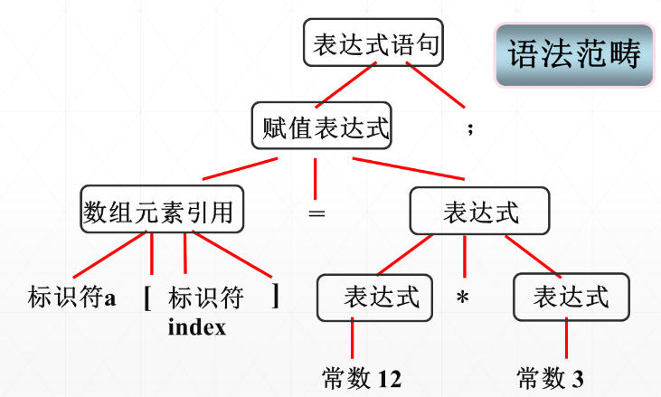
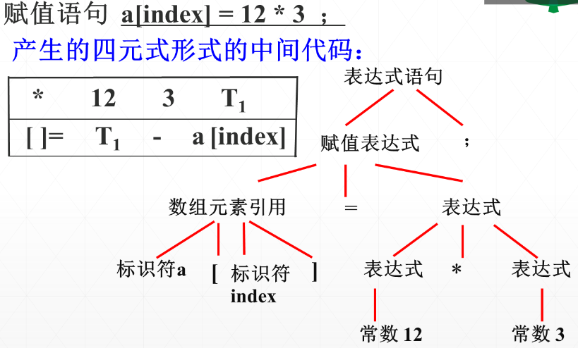
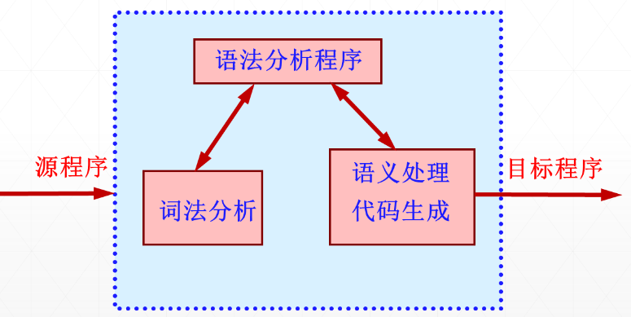

### 壹  程序设计语言与编译程序

#### 述：
#####
#####

###### ⚪ 程序设计语言的演化：
- 二十世纪四十年代（1940），机器语言
- 二十世纪五十年代（1950）早期，汇编语言
- 二十年代五十年代（1950）后期，高级程序设计语言：
	- 科学计算 FORTRAN
	- 商业数据 处理 Cobol
	- 符号计算 Lisp
- 二十世纪六十年代以后，更多的高级程序设计语言
- 程序设计语言的演化过程：编程更容易、自然、功能更强大

###### ⚪ 程序设计语言分类标准：演化方式：
- 第一代：机器语言
- 第二点：汇编语言
- 第三代：高级程序设计语言
	- 设计基础与冯 · 诺依曼体系结构有关，程序由描述问题求解过程的语句组成，按语句顺序执行语句对应的命令，又称命令时语言或过程式语言
	- 例子：Fortran、Cobol、Lisp、C、C++、C#、Java
- 第四代：说明性语言
	- 特定应用设计的语言，程序语句描述做什么
	- 例子：NOMAD（生成报告）、SQL（数据库查询）、Postscript（文本排版）
- 新一代：提高冯 · 诺依曼体系结构约束，扩展到新型领域
	- 以命令式、逻辑式、函数式为主，具有跨平台能力、高校资源管理能力，以及支持能够极大缩短代码量的高级操作等特性
	- 例子：量子编程语言 QCL，神经网络编程语言 Latte、人工智能编程语言 Haskell、嵌入式编程语言 MCL

###### ⚪程序设计语言分类标准：描述方式：
- 命令（强制）式：编程告诉计算机如何完成工作
	- 面向过程语言
	- 面向对象语言
- 声明式：编程告诉计算机要完成哪些工作
	- 函数式语言：ML、Haskell
	- 逻辑编程语言：Prolog

###### ⚪ 程序设计语言分类标准：数据类型：
- 第一种分类方式（类型检查时机）：
	- 静态类型：
		- 运行前（编译时）类型检查
	- 动态类型：
		- 运行时检查类型
- 第二种分类方式（隐式类型转换）：
	- 强类型：
		- 不允许隐式数据类型转换
	- 弱类型：
		- 允许隐式数据类型转换

                           （图一：按照数据类型的两种分类方式对编译语言分类）

###### ⚪ 程序设计语言分类标准：实现方式：
- 编译型
- 解释型

###### ⚪ 程序设计语言分类标准：按照应用领域：
- 科学计算
- 商业应用
- 系统编程

###### ⚪ 程序设计语言分类标准：运算单元：
- 冯 · 诺依曼语言
- 面向对象语言
- 脚本语言

###### ⚪ 什么是好的语言：
- 不断有新的语言涌现
- 语言演化：不断发现有更好的方式做事情
- 特殊目的：为了特定的应用领域和问题设计新的语言（大数据、人工智能）
- 个人喜好
- 表达方式强大：在某一方面抽象程度高
- 新手容易学习
- 容易实现
- 小机器上也可以实现、容易移植
- 开源且社区活跃
- 强大的编译器支持
- ……

###### ⚪ 什么是 Compiler 编译程序（器）：
- 定义：将某一种程序设计语言写的<font color="#ff3333">程序</font>（源程序）翻译成等价的另一种语言的<font color="#ffcb00">程序</font>（目标程序）的<font color="#e50ad4">程序</font>，称之为编译程序或编译器（compiler）
- 借助 Compiler 可以执行高级语言编写的程序
- Compiler 是语言处理系统
- 人、机交互的工具
- 源程序（source program）：被翻译（编译）的程序称为源程序
- 源语言（source language）：编写源程序的语言是源语言（源语言一般是汇编语言或高级程序设计语言）
- 目标程序（target program）：源程序京工翻译（编译）后生成的程序称之为目标程序
- 目标语言（target language）：目标程序的描述语言称为目标语言
- **重新定义**：将<font color="#ff3333">源程序</font>翻译成等价的<font color="#ffcb00">目标程序</font>的<font color="#e50ad4">程序</font>，称之为编译程序或编译器（compiler）
- 宿主语言：编译程序的实现语音
- 宿主机（目标机）：编译程序的运行环境（运行编译程序的计算机）

###### ⚪ Compiler 编译器的作用地位：
- 1. 人、机交互的基本界面
- 2. 软件科学的重要分支
- 3. 用户直接关心的工具

                                     （图二：编译器的作用地位）


### 贰  编译程序的表示和分类

#### 述：
#####
#####

###### 一、编译程序的分类：
- 分类 A：编译程序（源语言类型）：
	- 汇编程序：接受汇编源程序，将其翻译成等价的机器语言表示的目标程序
	- 编译程序：接受某语言的源程序，将其直接翻译成等价的目标代码
- 分类 B：编译程序（执行模式）：
	- 解释程序：接受某语言的源程序，将其直接翻译成目标代码且执行（没有输出等价的目标程序，每次执行都需要重新处理源程序，类似于自然语言的口译）
	- 编译程序：接受某语言的源程序，将其直接翻译成等价的目标代码（由编译程序生成一个与源程序等价的目标程序，它可以完全取代源程序，该目标程序可以运行任意次，类似于自然语言的笔译）
- 分类 C：变成程序（用途、实现技术）：
	- 并行编译器
	- 优化型编译器
	- 交叉型编译器
	- 诊断型编译器
	- 可重定向编译器

                               （图三：解释执行和编译执行的处理过程）

###### 二、编译程序的表示（体现编译程序的三个要素）：
- 1）函数表示：$$T=C(S)$$其中 $T$ 为目标语言，$C$ 为宿主语言，$S$ 为源语言
- 2）T 型图表示
- 3）符号表示
、                                               （图四：编译程序的 T 型图表示和符合表示）
- T 型图组合：
	- $X$ 语言的作用是将 $C$ 语言翻译成 $L$ 语言，而 $C$ 语言和 $L$ 语言一定是等价的，故当 $C$ 语言的作用是将 $A$ 语言翻译成 $B$ 语言，那么 $L$ 语言的作用一定是将 $C$ 语言翻译成 $L$ 语言

                                       （图五：T 型图的组合）

- **例题**：用 T 型图描述将 $A$ 机器上已经运行的 $L$ 语言的编译程序移植到 $B$ 机器上的过程
- *分析*：

             （图六：用 T 型图描述将 $A$ 机器上已经运行的 $L$ 语言的编译程序移植到 $B$ 机器上的过程）


### 叁  编译程序的结构与编译过程

#### 述：
#####
#####

###### ⚪ 编译阶段与自然语言的翻译对比：

| 编译语言   | $\Leftrightarrow$ | 自然语言翻译   |
| :----- | :---------------- | :------- |
| 词法分析   | $\Leftrightarrow$ | 查字典、识别单词 |
| 语法分析   | $\Leftrightarrow$ | 分析识别句子   |
| 产生中间代码 | $\Leftrightarrow$ | 翻译初稿     |
| 代码优化   | $\Leftrightarrow$ | 对初稿润色修饰  |
| 目标代码生成 | $\Leftrightarrow$ | 译文定稿     |

###### ⚪ 编译程序的逻辑结构（经典划分）：

                              （图七：编译程序的逻辑结构（经典划分））

###### ⚪ 1. 词法分析（lexical analyse）：
- **依据**此法规则
- **识别**出读入的源程序中有独立意义的源语言单词，用某种特定的数据结构（属性字或记号）进行**表示**

                                   （图八：词法分析的主要原理）
- 词法分析就是对输入的符号串形式的源程序进行最初的加工处理，属于一种线性分析
- **属性字**：类型标识和内码两个数据项

- **例**：有如下 C 代码行（源程序），进行词法分析：
```C
a[index] = 12 * 3 ;
```

| 序号  | 符号      | 属性字流    |
| :-- | :------ | :------ |
| 1   | `a`     | <标识符，1> |
| 2   | `[`     | <左方括号，> |
| 3   | `index` | <标识符，2> |
| 4   | `]`     | <右方括号，> |
| 5   | `=`     | <赋值，>   |
| 6   | `12`    | <整常数，1> |
| 7   | `*`     | <乘号，>   |
| 8   | `3`     | <整常数，2> |
| 9   | `;`     | <分号，>   |
识别出 9 个单词

###### ⚪ 2. 语法分析（Syntax analysis）：
- **依据**语法规则
- 对属性字流进行**语法检查**
- **识别出**对应的语法范畴
- 通常结果表示为语法分析**树**或抽象语法**树**
- 线性结构 $\Rightarrow$ 层次结构

- - **例**：有如下 C 代码行（源程序），进行词法分析：
```C
a[index] = 12 * 3 ;
```

                           （图九：C 语句 `a[index]=12*3;` 的语法分析树）

###### ⚪ 3. 语义分析（semantic analysis）与中间代码生成：
- **依据**语义规则
- 对识别出的语法范畴进行语义**检查和处理**
- **翻译**成**等价**的某种中间代码或目标代码
- <font color="#e50ad4">整个编译程序完成的最实质性的翻译任务</font>

                    （图十：赋值语句 `a[index]=12*3;` 产生的四元式形式的中间代码）

###### ⚪ 4. 代码优化（optimization）：
- **不改变**源程序语义的基础上
- 对当前程序**加工变换**（中间代码或目标代码）
- 以期**获得高效**（运行时间的缩短和存贮空间的节省）的目标代码

                         （图十一：赋值语句 `a[index]=12*3;` 四元式代码优化）

###### ⚪ 5. 目标代码生成（code generator）：
- **根据**中间代码及编译过程中产生的各种表格的有关信息，**生成**所期望的目标代码程序
- 目标代码一般为特定机器和机器语言代码或汇编语言代码
- 要充分考虑计算机硬件和软件所提供的资源，生成叫高质量的目标程序

                        （图十二：语句 `a[index]=12*3;` 生成汇编语言目标代码）

###### ⚪ 6. 表格管理和出错处理：
- 表格管理：
	- 公共辅助部分
	- 对各种量进行管理，登记在相应的表格
- 出错处理：
	- 公共辅助部分
	- 对源程序中的各种错误检查、定位、定性、报告，尽可能将错误限制在尽可能小的范围内，保障编译继续

###### ⚪ 定义：遍（Pass 趟）：
- 对源程序或源程序的中间形式从头到尾扫描一遍，并做有关分析加工，生成新的与源程序等价的中间形式或生成目标程序
- 遍数多的优点：
	- 编译程序逻辑结构清晰
	- 减少对主存容量的要求
	- 优化准备充分
- 遍设置的考虑因素：
	- 宿主机存储容量
	- 编译程序功能的强弱
	- 源语言的繁简及约束
	- 优化因素
	- 设计、实现的环境、工具及人员因素等


### 肆  编译程序结构的实例模型

#### 述：
#####
#####

###### ⚪ 一遍扫描的编译程序结构模型（Pascal 编译器）：

                           （图十三：Pascal 编译器的一遍扫描结构模型）

###### ⚪ AHPL 模拟器（两遍扫描的编译程序结构模型）：

                            （图十四：AHPL 模拟器的两遍扫描结构模型）

###### ⚪ PDP - 11 C 编译器结构模型（三遍扫描的编译程序结构模型）：

                           （图十五：PDP - 11 C 编译器的三遍扫描结构模型）

###### ⚪ GCC 与 LLVM：
- 两种开源模拟器（https://godbolt.org/）
- GCC（GNU compiler collection）：支持多种前端编程语言，目标代码可以在几乎所有处理器平台运行
- LLVM（Low Level Virtual Machine）：编译器框架，可以作为多种编程语言的后端，为这些语言提供与具体编程语言无关的优化，同时也可以生成适用于不同 CPU 的代码（例：clang）

                                   （图十六：GCC 编译器的结构）

                                  （图十七：LLVM 3 阶段架构）


### 伍  编译程序的构造与实现

#### 述：
#####
#####

###### ⚪ 编译程序构造要素：
- 源语言
- 目标语言
- 编译方法、技术与工具

###### ⚪ 编译程序的生成：
- 1. 使用编程语言
- 2. 移植方式
- 3. 自编译（用源语言作为宿主语言）
- 4. 自动生成：
	- 词法分析器自动生成器 LEX、FLEX
	- 语法分析器自动生成器 YACC、Bison
	- 语法制导翻译器
	- 代码自动生成器
	- 数据流分析装置

                               （图十八：PASCAL 语言编译器的自编译）

###### ⚪ 本章提要：
- 编译程序的定义
- 源程序的两种运行模式
- 编译程序的分类与表示
- 术语：
	- 源语言
	- 源程序
	- 目标语言
	- 目标程序
	- 宿主语言
	- 宿主机（目标机）
	- 遍
- 编译程序的组成结构，各部分间的逻辑关系和主要功能
- 编译程序的构造要素
- 编译程序的组织和生成

