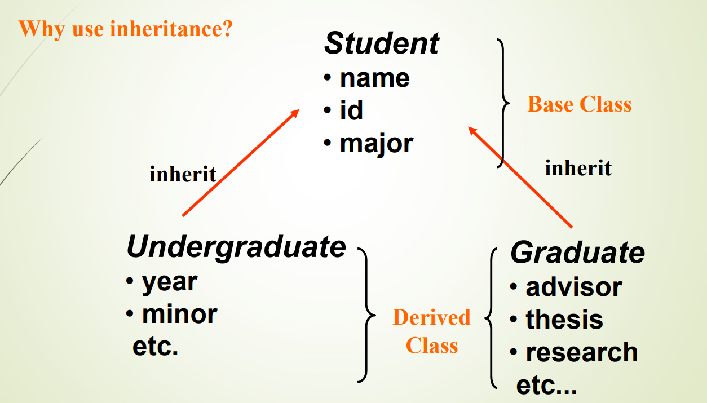
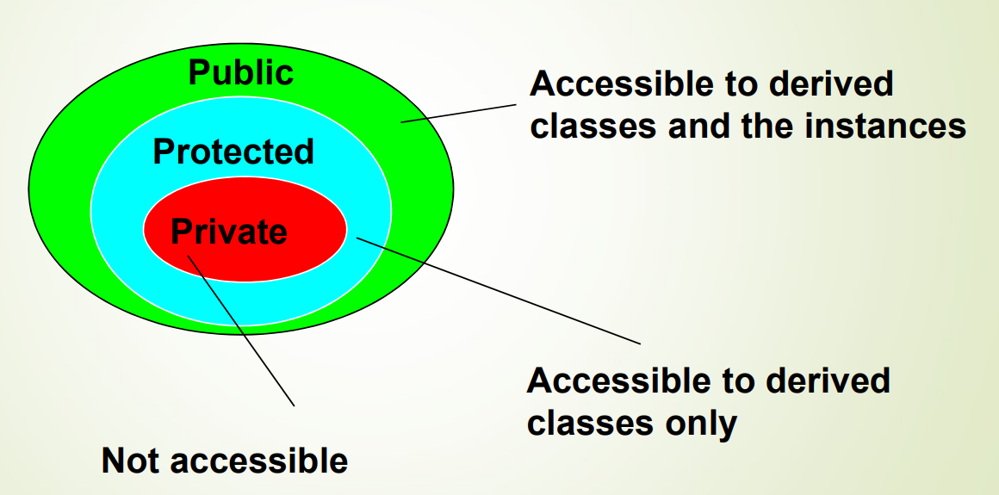
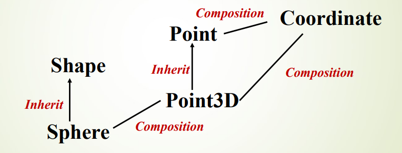
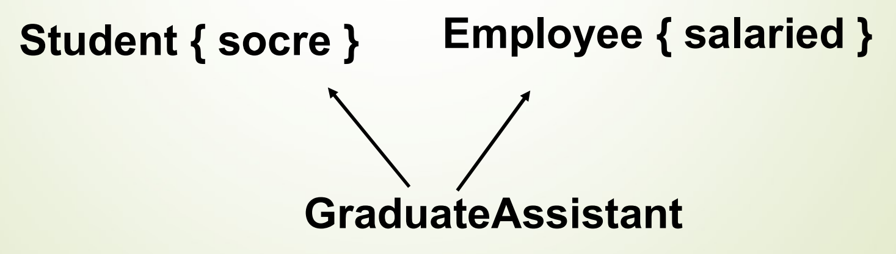
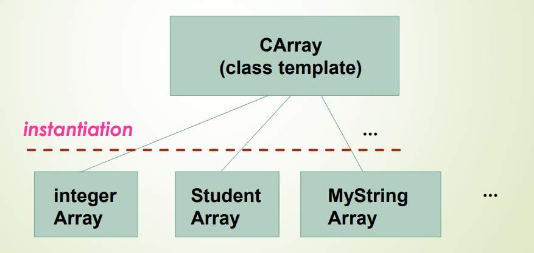
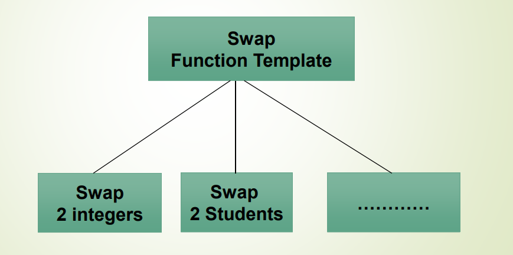

### 壹  操作符重载

#### 述：
#####
#####

###### · 函数重载：
· 函数的多态性：不同的函数具有相同的名称
· 在 C++ 中，一个类的成员函数，不仅由其名称标识，还由其形参的数量和类型以及关键字 const 标识

· <font color="#00ddff">程序 3 - 1</font> ：函数重载实现不同类型数据加和
```C++
#include<iostream>
using namespace std;

class Math
{
	public:
	int add(int a, int b)    //计算两个整数的和
	{
		cout<<"Calling int add(int, int)"<<endl;
		return a+b;
	}

	float add(float a, float b)    //计算两个浮点数的和
	{
		cout<<"Calling float add(float, float)"<<endl;
		return a+b;
	}

	int add(int a, int b, int c)    //计算三个整数的和
	{
		cout<<"Calling int add(int, int, int)"<<endl;
		return a+b+c;
	}
};

int main()
{
	Math math;
	//调用不同的 add 函数
	int sum1=math.add(5,3);
	float sum2=math.add(4.5f, 2.7f);
	int sum3=math.add(2,4,6);
	cout<<sum1<<endl<<sum2<<endl<<sum3<<endl;
	//输出:
	// 8
	// 7.2
	// 12
	return 0;
}
```

###### · 操作符重载：

· <font color="#00ddff">程序 3 - 2</font> ：函数调用的不直观性
```C++
#include<iostream>
#include<cmath>
using namespace std;

class complex    //复数类
{
	private:
	double re, im;    //复数的实部和虚部

	public:
	complex(double x=0, double y=0)
	{
		re=x, im=y;
	}

	complex Add(const complex& c)
	{
		double t1=re+c.re;
		double t2=im+c.im;
		return complex(t1,t2);
	}

	double modular()    //求复数的模长
	{
		return sqrt(re*re+im*im);
	}
};

int main()
{
	complex c, c1, c2(5.5, 2);    // c 和 c1 默认赋值为 0+0i，c2 被赋值为 5.5+2i
	c=c1.Add(c2);    //实现复数的加法，但是这样的函数调用没有 “c=c1+c2” 的写法简便
	cout<<c.modular()<<endl;    //输出复数模长（输出结果为：5.85235）
	return 0;
}
```

· 操作符重载（Operator Overloading）让涉及到类的代码更容易编写，尤其是更容易阅读
· 如上例，可以将操作符 “+” 重载，实现复数类中实部与虚部分别相加的功能
· 说明：操作符重载只是“语法糖”（包装），本质上是调用函数的另一种方式
· 注意：只有包含类类型的表达式才能有重载操作符，仅包含内置数据类型的表达式中使用的所有操作符都不能更改

· 操作符函数的名称是关键字 “*operator*” 后跟操作符本身
· 形式：
```C++
Return-type operator @ (argument list)
{
	// code realization
}
```

· *可重载的操作符*：
1. 单目运算符：
~~~C++
new, delete, new[], delete[], ++, --, (), [], +, -, *, &, !, ~
~~~
2. 双目运算符：
```C++
+, -, *, /, %, =, +=, -=, *=, /=, %=, &, |, ^, ^=, &=, |=, ==, !=, >, <, >=, <=, ||, &&, <<, >>
```

· *不允许重载的操作符*：
```C++
. 成员选择
.* 用指针进行成员选择
:: 域解析
?: 条件运算符
sizeof 内存计量
typeid 获取表达式类型
```
· 增量重载的语法：
![[C++图/C++图3-1.png|450]]
                                （图一：增量重载的语法）
· “int” 实参用于指示函数是否被调用以执行后缀的 “++” 或 “--” 操作
· 这个 “int” 参数实际上从未被使用；它只是一个虚拟参数，用于区分前缀和后缀应用

· <font color="#00ddff">程序 3 - 3</font> ：增量运算符的前缀和后缀重载
```C++
#include<iostream>
using namespace std;

class CDate
{
	public:
	CDate() {Year=2024, Month=3, Day=31;}
	void display() {cout<<Day<<endl;}
	CDate operator ++ () {Day++; return *this;}    //前缀
	CDate operator ++ (int) {CDate temp; temp.Day=Day++; return temp;}    //后缀
	
	private:
	int Year, Month, Day;
};

int main()
{
	CDate D,D1,D2;
	D1=D++;    //后缀时可以写成：D1 = D.operator ++ (0);
	cout<<"D=";
	D.display();
	cout<<"D1=";
	D1.display();

	D2=++D;    //前缀时可以写成：D2 = D.operator ++ ();
	cout<<"D=";
	D.display();
	cout<<"D2=";
	D2.display();

	//输出：
	// D=32
	// D1=31
	// D=33
	// D2=33
	return 0;
}
```

· 赋值重载：
```C++
void CDate:: operator = (const& CDate date)
{
	Year=date.year;
	Month=date.month;
	Day=date.day;
}
```
此时 `D1=D++;` 可以写成：
```C++
D1.operator = (D.operator ++(0));
```

· C++ 会给每个类默认赋值，那么什么时候需要“手动”定义赋值呢？

· <font color="#00ddff">程序 3 - 4</font> ：默认“浅拷贝”的问题
```C++
#include<iostream>
using namespace std;

class pointer
{
	private:
	int *p;

	public:
	pointer(int x) {p=new int(x);}
	~pointer() {if(p!=nullptr) delete p;}
};

int main()
{
	pointer p(10), q(20);
	q=p;    //指针随着浅拷贝被复制，可能会导致一些问题
	return 0;
}
```

· <font color="#00ddff">程序 3 - 5</font> ：赋值操作符重载对浅拷贝的改善
```C++
#include<iostream>
using namespace std;

class pointer
{
	public:
	int *p;
	pointer(int x) {p=new int(x);}
	~pointer() {if(p!=nullptr) delete p;}

	pointer(const pointer& other)    //拷贝构造函数
	{
		p=new int(*other.p);
	}

	pointer& operator = (const pointer& other);
};

pointer& pointer:: operator = (const pointer& other)
{
	if(this!=&other)    //保证两个对象的地址指针不同（避免自我赋值）
	{
		delete p;    //释放 p
		p=new int(*other.p);    //重新分配赋值
	}
	return *this;    //返回 “this” 所指向的内容（对象自身）
}

int main()
{
	pointer p(10), q(20);

	//打印原始对象的值
	cout<<"Original objects:\n";
	cout<<"p: "<<*p.p<<endl;
	cout<<"q: "<<*q.p<<endl;

	q=p;
	//打印赋值后的对象的值
	cout<<"\nObjects after assignment:\n";
	cout<<"p: "<<*p.p<<endl;
	cout<<"q: "<<*q.p<<endl;
	
	*p.p=30;
	//打印修改后的对象的值
	cout<<"\nModified object p:\n";
	cout<<"p: "<<*p.p<<endl;
	cout<<"q: "<<*q.p<<endl;

	//输出：
	// Original objects:
	// p: 10
	// q: 20

	// Objects after assignment:
	// p: 10
	// q: 10

	// Modified object p:
	// p: 30
	// q: 10
	return 0;
}
```

###### · 成员与非成员的重载：

· <font color="#00ddff">程序 3 - 6</font> ：成员重载运算符进行复数加法
```C++
#include<iostream>
using namespace std;

class complex
{
	public:
	complex(double x=0, double y=0)
	{
		re=x, im=y;
	}
	friend complex operator + (const complex& a, const complex& b);
	void value()
	{
		cout<<re<<'+'<<im<<'i'<<endl;
	}

	private:
	double re, im;
};

complex operator + (const complex& a, const complex& b)    // “+” 重载
{
	double m=a.re+b.re;
	double n=a.im+b.im;
	return complex(m,n);
}

int main()
{
	complex x(10, 20);
	complex z;

	z=x+3;    //允许
	// z=3+x;    //这条语句可能会出现错误
	z.value();    //输出：13+20i
	return 0;
}
```

· 解释：
1. z=x+3 中，编译器会先寻找适合的运算符重载，在上面的代码中已经定义了一个接受两个 complex 类型参数的 operator+ 函数；代码中定义了一个接受两个 double 类型参数的 complex 构造函数，编译器默认把 “3” 视作 double，并隐式转换为 complex 类型的对象：complex c(3,0)
2. z=3+x 中，编译器会首先考虑 “3” 的类型是什么，在通常语义下，“3” 是一个 int 型常量，没有与 complex 类型进行运算的运算符重载（由于将 “3” 识别成 int，而不是 complex 接受的 double 型参数，故此时的 “3” 无法隐式转换为 complex）；如果一定要安全执行这条语句，可以改成：
	`z=(double)3+x;`
· 注意：
如果构造函数定义的是这样的（显式定义构造函数）：
	`explicit complex(double x=0, double y=0);`
	那么意味着，double 无法隐式转换成 complex（explicit 定义的构造函数只支持显式构造）
	此时 `z=(double)3+x;` 和 `z=x+(double)3;` 语句都将失效
可以“告诉”编译器，我们有意转换：
	`z=(complex)3+x;` 这样可以解决这个问题，或者调用 C++ 中的 static_cast 进行类型转换：
	`z=static_cast<complex>(3)+x;`

· <font color="#00ddff">程序 3 - 7</font> ：运算符重载实现复数加法的功能扩展
```C++
#include<iostream>
using namespace std;

class complex
{
	public:
	complex(double x=0, double y=0)
	{
		re=x, im=y;
	}
	friend complex operator + (const complex& a, const complex& b);
	void value()
	{
		cout<<re<<'+'<<im<<'i'<<endl;
	}

	complex& operator += (const complex& c)    // “+=” 的完善
	{
		re+=c.re;
		im+=c.im;
		return *this;
	}

	private:
	double re, im;
};

complex operator + (const complex& a, const complex& b)    // “+” 重载
{
	double m=a.re+b.re;
	double n=a.im+b.im;
	return complex(m,n);
}

int main()
{
	complex x(10, 20);
	complex z(3, 6);

	z+=3;
	z.value();    //输出：6+6i
	z+=x;
	z.value();    //输出：16+26i
	complex y=x+z;
	y.value();    //输出：26+46i
	return 0;
}
```

###### · 下标操作符的重载：
· 操作符 $[\ ]$ 函数可用于为类对象赋予下标意义
· $operator[\ ]$ 函数的参数（下标）可以是任何类型
· 注意：$operator[\ ]$ 函数必须作为类的成员函数重载，并且只有一个参数

· <font color="#00ddff">程序 3 - 8</font> ：下标运算符的重载
```C++
#include<iostream>
using namespace std;

class vector
{
	public:
	vector(int s) {v=new int[s]; capacity=s; Size=0;}
	~vector() {if(v!=nullptr) delete[] v;}
	int& operator [] (int i) {return v[i];}
	
	private:
	int *v;
	int capacity;    //存储容量
	int Size;    //目前元素个数
};

int main()
{
	vector a(5);
	a[2]=12;
	//等同于 a.operator[](2)=12;
	cout<<a[2]<<endl;    //输出：12
	return 0;
}
```

###### · 函数调用操作符的重载：
· 函数调用：$expression\ (expression-list)$，可以表述为一个二元操作：
	· 表达式作为左操作数
	· 参数列表作为右操作数

· <font color="#00ddff">程序 3 - 9</font> ：函数调用运算符的重载，以实现 $f(x,y)=x\cdot y+5$
```C++
#include<iostream>
using namespace std;

class F
{
	public:
	double operator () (double x, double y) {return x*y+5;}
};

int main()
{
	F f;
	cout<<f(5.2, 2.5)<<endl;    //输出：18
	// f(5.2, 2.5) 也可以写成 f.operator () (5.2, 2.5);
	return 0;
}
```

###### · 输出流操作符的重载：
· 操作符 << 可以定义为一个二元操作符
· 通常，操作符 << 被定义为类的友元成员函数，并有两个参数：一个是输出流的引用，一个是对象

· <font color="#00ddff">程序 3 - 10</font> ：输出流运算符的重载
```C++
#include<iostream>
using namespace std;

class complex
{
	public:
	complex(double x=0, double y=0) {re=x, im=y;}
	friend ostream& operator << (ostream& os, const complex& a);
	
	private:
	double re, im;
};

ostream& operator << (ostream& os, const complex& a)
{
	os<<a.re<<"+"<<a.im<<"i"<<endl;
	return os;
}

int main()
{
	complex C(10,20);
	cout<<C<<endl;
	return 0;
}
```

###### · 解引用操作符的重载：
· 解引用操作符 —> 可以定义为一元后置操作符
· 通常，解引用操作符 —> 没有参数

· <font color="#00ddff">程序 3 - 11</font> ：解引用操作符的重载
```C++
#include<iostream>
using namespace std;

class Student
{
	public:
	int age, ID;
};

class Prt_Rec    //定义一个 Student 的指针
{
	public:
	Prt_Rec()
	{
		S=new Student;
		S->age=0;
		S->ID=0;
	}
	Student* operator -> () {return S;}
	~Prt_Rec() {delete S;}
	
	private:
	Student *S;
};

int main()
{
	Prt_Rec PR;
	PR->age=20;    //同：(PR.operator->())->age=20;
	PR->ID=001;    //同：(PR.operator->())->ID=001;
	return 0;
}
```

###### · 重载感叹号操作符以实现阶乘运算：

· <font color="#00ddff">程序 3 - 12</font> ：重载感叹号操作符以实现阶乘运算
```C++
#include<iostream>
using namespace std;

class N
{
	public:
	N(int k) {n=k;}
	~N() {};
	int operator ! ()
	{
		int all=1;
		for(int i=n; i>=1; i--)
		{
			all*=i;
		}
		return all;
	}
	
	private:
	int n;
};

int main()
{
	N p(5);
	cout<< !p <<endl;
	return 0;
}
```

###### · 转换操作符：

· <font color="#00ddff">程序 3 - 13</font> ：从基本类型到类类型的隐式转换
```C++
#include<iostream>
using namespace std;

class complex
{
	public:
	complex(double x=0, double y=0) {re=x, im=y;}
	void value() {cout<<re<<"+"<<im<<"i"<<endl;}
	friend complex operator + (const complex& a, const complex& b);

	private:
	double re, im;
};

complex operator + (const complex&a, const complex& b)
{
	double m=a.re+b.re;
	double n=a.im+b.im;
	return complex(m,n);
}

int main()
{
	complex x(10,20);
	complex z;
	z=x+3;
	z.value();    //输出：13+20i
	z=3+x;
	z.value();    //输出：13+20i
	return 0;
}
```

· 这样的写法会出现编译错误：
```C++
int main
{
	complex obj(1,2);
	int x;
	x=obj;
	return 0;
}
```
· complex 类类型变量无法直接隐式转换为一个 int 型变量
· 为了解决这个问题，引入了“转换操作符”
· 转换操作符的标准定义方式为：
```C++
operator type () {/* Code */};
（其中的 “type” 表示转换目标类型）
```
· 定义转换操作符后，上述编译错误代码段即可正常编译：

· <font color="#00ddff">程序 3 - 14</font> ：转移操作符将 “im” 为 0 的“复数 complex 类”类型转换为 int 类型
```C++
#include<iostream>
using namespace std;

class complex
{
	public:
	complex(double x=0, double y=0) {re=x, im=y;}
	void value() {cout<<re<<"+"<<im<<"i"<<endl;}
	operator int ()    //转换操作符：将 complex 类类型转换为 int 型
	{
		if(im==0) return re;
		return -999999;
	}
	
	private:
	double re, im;
};

int main()
{
	complex obj(1,2);
	int x;
	x=obj;
	cout<<x<<endl;    //输出：-999999
	obj.value();    //输出：1+2i

	complex obj_2(4,0);
	int y=obj_2;
	cout<<y<<endl;    //输出：4
	obj_2.value();    //输出：4+0i

	return 0;
}
```

·<font color="#00ddff"> 程序 3 - 15</font> ：有理分数向小数的转换
```C++
#include<iostream>
using namespace std;

class Rational    //有理数
{
	public:
	Rational(double x=0, double y=1)
	{
		Numerator=x;
		Denominator=y;
	}
	operator double ()    //转换操作符：将 Rational 类类型转换为 double 型
	{
		return Numerator/Denominator;
	}
	
	private:
	double Numerator;    //分子
	double Denominator;    //分母
};

int main()
{
	Rational r(100,200);
	double d;
	d=r;
	cout<<d<<endl;    //输出：0.5
	return 0;
}
```

· 注意：转换操作符只有在一定条件下才会自动调用：

1. *当需要转换为目标类型的时候*：比如在算术运算中，如果一个操作数是你定义的类类型，而另一个操作数是转换操作符目标类型，那么转换操作符将被调用以将类类型转换为目标类型
· 例：沿用上述 程序 3 - 15，重新定义 main 函数
```C++
int main()
{
	Rational r1(100,200), r2;
	double d=r1;
	r2=r1+d;
	cout<<r2<<endl;    //输出：1
	return 0;
}
```
这里面由于算术运算中一个操作数是 Rational 类类型，另一个操作数是目标类型 double 型，此时转换操作符被调用，将 r2 转换为 double 类型，进而可以用 “cout” 直接输出

2. *当需要一个目标类型的时候*：例如在条件语句中或者函数调用中，如果目标类型是转换操作符的目标类型，那么转换操作符会被调用以转换对象
· 例：沿用上述 程序 3 - 15，重新定义 main 函数
```C++
int main()
{
	Rational r(400,100);
	cout<<sqrt(r)<<endl;    //输出：2
	return 0;
	//注意需要调用 "cmath" 库
}
```
函数 $sqrt\ (double\ s)$ 的调用需要的目标参数类型为 double，与转换操作符的定义目标类型相符，故将 “Rational r” 转换为 “double r”

3. *当你显式请求转换的时候*：比如在强制类型转换中，可以使用转换操作符来将对象转换为目标类型
· 例：沿用上述 程序 3 - 15，重新定义 main 函数
```C++
int main()
{
	Rational r(30,10);
	cout<<(double)r<<endl;    //输出：3
	return 0;
}
```
此处使用了强制类型转换的显示转换请求，将 “Rational r” 转换成 double 型，转换操作符函数自动生效

· <font color="#ffc000">不建议总使用自动转换</font>：
1. 代码难以理解和调试
2. 存在潜在的性能损失
3. 可能导致意外的行为
4. 代码健壮性差，较为脆弱

·<font color="#00ddff"> 程序 3 - 16</font> ：有理数到整数：自动转换向主动转换的改进
```C++
#include<iostream>
using namespace std;

class Rational    //有理数
{
	public:
	Rational(double x=0, double y=1)
	{
		Numerator=x;
		Denominator=y;
	}
	double Todouble()    //主动调用函数
	{
		return Numerator/Denominator;
	}
	friend Rational operator + (Rational& left, Rational& right)
	{
		return Rational(left.Numerator+right.Numerator, left.Denominator+right.Denominator);
	}
	
	private:
	double Numerator;    //分子
	double Denominator;    //分母
};

int main()
{
	Rational r1(100,200), r2;
	double d=r1.Todouble();
	r2=r1;
	cout<<r2.Todouble()+d<<endl;    //输出：1
	return 0;
}
```

·<font color="#00ddff"> 程序 3 - 17</font> ：条件中向布尔类型的转换
```C++
#include<iostream>
using namespace std;

class Vector
{
	public:
	Vector(int s=0) {v=new int[s], Size=s;}
	~Vector() {if(v!=nullptr) delete[]v;}
	int& operator [] (int i) {return v[i];}
	operator bool ()
	{
		return (Size>0);
	}
	int value(int i) {return v[i];}

	private:
	int *v;
	int Size;    //元素个数
};

int main()
{
	Vector vec(6);
	if(vec) vec[2]=12, cout<<vec[2]<<endl;    //输出：12
	else cout<<"No element in vec."<<endl;
	return 0;
}
```


### 贰  动态对象创建

#### 述：
#####
#####

###### · 对象创建的过程：
· 当创建 C++ 对象时，会发生：
1. 为对象分配存储空间：
	· 栈（stack）：局部变量内存分配（静态存储区）
	· 堆（heap）：动态存储分配（动态存储区）
2. 调用构造函数来初始化该存储

###### · new 和 delete 的重载：
· new 和 delete 的使用：
```C++
MyClass *fp=new MyClass(1, 2);
MyClass *fp=new MyClass;
delete fp;
MyClass *fp=new MyClass[10];
delete[] fp;
```

· <font color="#00ddff">程序 3 - 18</font> ：new 与 delete 功能的全局重载实现
```C++
#include<cstdio>
#include<malloc.h>
using namespace std;

int NUM=0;

void* operator new (size_t size)    //分配内存并返回指针
{
	void* t=malloc(size);
	NUM++;
	//如果这是一个类的类型，会调用构造函数
	return t;
}

void* operator delete (void* p)
{
	//如果这是一个类的类型，先调用析构函数
	NUM--;
	if(p!=nullptr)
	{
		printf("%d, %d\n", *(int*)p, NUM);
		//这里不用 cout，因为创建 cout 时会调用全局 operator new
		free(p);
	}
}

int main()
{
	int *a=new int(10);
	int *b=new int(20);
	int *c=new int(30);
	delete a;
	delete b;
	delete c;
	//输出：
	//10, 2
	//20, 1
	//30, 0
	return 0;
}
```

· 何时需要重载 new 与 delete？
1. 当需要在操作符 new 和 delete 中运行特殊代码时
2. 当需要在磁盘中分配巨大的存储空间作为虚拟内存空间时

· 虽然在 C++ 中使用栈上的自动对象非常方便和高效，但要解决一般的编程问题，即必须能够在程序执行期间的任何时刻创建和销毁对象，特别是要能够响应来自程序外部的信息
· C 语言中的动态内存分配虽然可以从堆中获取存储空间，但不提供在 C++ 中所需的易用性和构造保证
· 使用 new 和 delete 实现动态内存分配：通过将动态对象创建纳入语言的核心，并提供了 new 和 delete 操作符，用户可以轻松地在堆上创建对象，就像在栈上创建对象一样
· 此外，还可以获得更大的灵活性：如果默认的 new 和 delete 操作符不满足需求，尤其是效率不够高时，可以修改它们的行为，对 new 和 delete 进行重载；还可以修改当堆空间耗尽时的处理方式

· 总的来说，通过引入 new 和 delete 操作符，C++ 提供了更方便、更灵活的动态内存管理机制，使得在程序执行过程中能够更加自由地创建和销毁对象，并且可以根据需要定制内存管理的行为


### 叁  继承与组合

#### 述：
#####
#####

###### · 组合（composition）语法：
· 组合就是将一个类的对象作为另一个类的对象，并嵌入这个新类中
· 组合实现了彼此之间的 *“has - a”* 关系
· 组合的例子：
```C++
enum PRIORITY {LOWER, EQUALITY, HIGHER};

class CExpression
{
	public:
	CExpression(string s="");
	double value;
	void SetExpression(string s);
	void Print();

	private:
	string m_strExpr;
	CMyStack stackOperator;    // CMyStack 类的对象：“操作符”
	CMyStack stackOperand;    // CMyStack 类的对象：“操作数”
	PRIORITY Precede(char first, char second);
	bool isNumber(char ch);
	double Compute(double x, double y, char ch);
};
```

· <font color="#00ddff">程序 3 - 19</font> ：组合的实现与应用
```C++
#include<iostream>
using namespace std;

class X
{
	int i;
	
	public:
	X() {i=0;}
	void set(int ii) {i=ii;}
	int read() const {return i;}
	int permute() {return i=i*47;}    //先自乘 47 赋值，后返回 i 的值
};

class Y
{
	int i;
	
	public:
	X x;    //组合：被嵌入对象
	Y() {i=0;}
	void f(int ii) {i=ii;}
	int g() const {return i * x.read();}
	void permute() {cout<<x.permute()<<endl;}
};

int main()
{
	Y y;
	y.f(47);
	y.x.set(37);
	y.permute();    //输出：1739
	cout<<y.g()<<endl;    //输出：81773
	return  0;
}
```

· 通过组合，一个类可以使用其他类的功能，而不必继承它们的行为
· 这种方式更加灵活，可以避免类之间的紧耦合关系

###### · 继承——基类与派生类：

                              （图二：类的继承关系的示例）

· **基类（base class）** 是先前定义的用于定义新类的类
· 基类也称为 **超类（super class）**、**父类（father class）** 或 **祖先类（ancestor class）**
· **派生类（derived class）** 继承基类的所有（存在例外）数据和成员函数
· 派生类的对象可以调用基类的成员函数和成员数据
· 派生类也称为 **子类（subclass）** 或 **后代（posterity）**

###### · 单继承（single inheritance）：
· 单继承是指派生类只有一个基类
· 单继承实现了彼此之间的 *“is - a”* 关系
· 单继承的语法：
```C++
class derived_class_name : accessing_control base_class
{
	// define data member and function member
}
Here the accessing_control may be as:
	public, private and protected
```

· <font color="#00ddff">程序 3 - 20</font> ：子类对父类的继承
```C++
#include<iostream>
using namespace std;

class employee
{
	private:
	string name;    //名字

	protected:
	short department;    //部门

	public:
	employee(string n, short d) {name=n, department=d;}
	void print()
	{
		cout<<"name: "<<name<<";"<<endl;
		cout<<"department: "<<department<<endl;
	}
};

class manager : public employee
{
	short level;

	public:
	manager() : employee("Zhang San", 2) {};
	void meeting(int num) {cout<<num<<", "<<department<<endl;};
};

int main()
{
	employee E("Li Si", 1);
	manager M;
	E.print();
	//输出：
	// name: Li Si;
	// department: 1
	
	/* E.meeting(2); 这句代码是错误的：在 C++ 中，父类不能直接访问子类的内容 */
	/* M.name="Wang Ermazi"; 这句代码也是错误的，“name” 这个变量是私有的，子类不能访问 */
	
	M.print();
	//输出：
	//name: Zhang San;
	//department: 2
	M.meeting(3);    //输出：3, 2
	return 0;
}
```

· 对于 程序 3 - 20 的解读：
`class manager : public employee;`
如果一个派生类 manager，有一个 public 的基类 employee，则：
1. manager 的对象可以访问 employee 中 public 的成员函数和成员数据
2. manager 的成员函数可以访问 employee 中 public 和 protected 的成员函数和成员数据
3. 成员函数和 manager 对象不能访问 employee 中 private 的成员函数和数据

· 在面向对象编程中，子类继承父类，即子类派生自父类
· 这意味着子类可以拥有父类的所有成员变量和成员函数，并且可以扩展或修改它们

· **访问控制——protected**：
· 关键字 `protected` 用于定义类的一部分，其中类的对象不能访问 protectd 的成员函数和数据
· 但<font color="#ffff00">该类的派生类的成员函数可以访问 protected 的成员函数和数据</font>

                 （图三：public，protected 和 private 各自允许的访问者）

· **不能自动继承的函数**：
1. 构造函数和析构函数不能继承
2. 如果基类具有构造函数，则必须由派生类调用构造函数
3. 默认构造函数可以隐式调用
4. 但是，如果基类的所有构造函数都需要参数，则必须显式调用该基类的构造函数
5. 基类构造函数的参数在派生类构造函数的定义中指定
6. 成员函数 `operator = (const classType& obj)` 还没有被继承，因为它的操作看起来像拷贝构造函数

· <font color="#00ddff">程序 3 - 21</font> ：派生类显式调用基类的构造函数
```C++
#include<iostream>
#include<string>
using namespace std;

class Base
{
	public:
	Base(int value) : baseValue(value)    //基类构造函数
	{
		cout<<"Base class constructor called with value: "<<baseValue<<endl;
	}

	private:
	int baseValue;
};

class Derived : public Base
{
	public:
	Derived(int baseValue, int derivedValue) : Base(baseValue), derivedValue(derivedValue)
	{
		cout<<"Derived class constructor called with value: "<<derivedValue<<endl;
	}

	private:
	int derivedValue;
};

int main()
{
	Derived d(10,20);
	//输出：
	// Base class constructor called with value: 10
	// Derived class constructor called with value: 20
	return 0;
}
```

· <font color="#00ddff">程序 3 - 22</font> ：继承中的赋值重载
```C++
#include<iostream>
using namespace std;

class Base
{
	protected:
	int value;
	
	public:
	Base(int x) {value=x;}
	void operator = (const Base& bb)
	{
		this->value=bb.value;
	}
};

class Derived : public Base
{
	private:
	int der;
	
	public:
	Derived(int x, int y) : Base(x) {der=y;}
	void operator = (const Derived& dd)
	{
		this->der=dd.der;
	}
	friend ostream& operator << (ostream& os, const Derived dd)
	{
		return os<<dd.value<<", "<<dd.der<<endl;
	}
};

int main()
{
	Derived d1(11,22);
	Derived d2(33,44);
	d1=d2;
	cout<<d1<<endl;    //输出：11, 44
	return 0;
}
```

· **构造函数和析构函数调用的顺序**：
1. 类对象“从底自上”构造：先基类，再成员，后派生类本身
2. 析构函数相反：先派生类本身，再成员，后基类

· 一个示例——尝试实现以下关系：

                           （图四：继承与组合关系练习应用示例）
· 程序如下面的 程序 3 - 23 ：

· <font color="#00ddff">程序 3 - 23</font> ：构造函数与析构函数相反的调用顺序
```C++
#include<iostream>
using namespace std;

class Coordinate
{
	public:
	Coordinate() {cout<<"Coordinate,"<<endl;}
	~Coordinate() {cout<<"~Coordinate,"<<endl;}
};

class Point
{
	public:
	Point() {cout<<"Point,"<<endl;}
	~Point() {cout<<"~Point,"<<endl;}
	
	private:
	Coordinate x;
};

class Point3D : public Point
{
	public:
	Point3D() {cout<<"Point3D"<<endl;}
	~Point3D() {cout<<"~Point3D"<<endl;}
	
	private:
	Coordinate z;
};

class Shape
{
	public:
	Shape() {cout<<"Shape,"<<endl;}
	~Shape() {cout<<"~Shape,"<<endl;}
};

class Sphere : public Shape
{
	public:
	Sphere() {cout<<"Sphere"<<endl;}
	~Sphere() {cout<<"~Sphere"<<endl;}
	
	private:
	Point3D center;    //中心
	unsigned radius;    //半径
};

int main()
{
	Sphere S;
	return 0;
}

//可视输出：
// Shape,
// Coordinate,
// Point,
// Coordinate,
// Point3D
// Sphere
// ~Sphere
// ~Point3D
// ~Coordinate,
// ~Point,
// ~Coordinate,
// ~Shape,
```

· **继承与组合的结合**：

· <font color="#00ddff">程序 3 - 24</font> ：继承与组合的结合
```C++
#include<iostream>
#include<string>
using namespace std;

class employee
{
	private:
	string name;
	
	protected:
	short department;
	
	public:
	employee(string s="") {name=s;}
	void print()
	{
		cout<<"name: "<<name<<endl;
	}
};

class Team
{
	private:
	string m_name;
	
	public:
	Team(string s) {m_name=s;}
	string TeamName() {return m_name;};
};

class manager : public employee
{
	private:
	Team T;
	
	public:
	manager() : employee("the name"), T("DefaultTeamName") {}
	string GetTeamName() {return T.TeamName();}
};

int main()
{
	employee E("this is a name");
	manager M;
	E.print();    //输出：name: this is a name
	M.print();    //输出：name: the name
	cout<<M.GetTeamName()<<endl;    //输出：DefaultTeamName
	return 0;
}
```

###### · 向上转型（upcasting）：
· 继承最重要的方面不是它提供新类的成员函数，它是新类和基类之间表达的关系
· 向上转型（upcasting）是指将子类的对象或指针转换为父类的类型
· 在面向对象编程中，子类继承自父类，因此子类对象或指针可以被视为父类对象或指针的一种特殊形式
· 这种转换是隐式的，不需要任何显式的转换操作符，将子类对象或指针赋值给父类对象或指针时，编译器会自动进行类型转换；这种转换通常用于实现多态性，即通过父类指针或引用来访问子类对象的特定行为

· <font color="#00ddff">程序 3 - 25</font> ：向上转型（upcasting）的实例
```C++
#include<iostream>
using namespace std;

class Instrument
{
	private:
	int a;

	public:
	void play() const {cout<<"3 5-5 5-5 6-5 3-2--"<<endl;};
};

class Wind : public Instrument
{
	private:
	int b;
};

void tune(const Instrument& i)
{
	i.play();
}

int main()
{
	Wind flute;
	tune(flute); //upcasting：隐式将子类 Wind 的对象转换为父类 Instrument 对象作为 tune() 参数
	//输出：
	// 3 5-5 5-5 6-5 3-2--
	return 0;
}
```

· `static_cast <new type> (expression)`：
主要用于内置数据类型和类型安全检查之间的相互转换
例如：`double b=3.14;  int a=static_cast<int>b;`

· `const_cast <new_type*/&> (expression)`：
只用于添加/删除变量的指针/引用
例如下面的 程序 3 - 26 和 程序 3 - 27 ：

· <font color="#00ddff">程序 3 - 26</font> ：用 const_cast <new_type&> (expression) 去除 const 特性
```C++
#include<iostream>
using namespace std;

class Shape
{
	public:
	int x;
	int y;
	Shape(int xx, int yy) {x=xx, y=yy;}
};

void fun(Shape& s) {cout<<s.x<<", "<<s.y<<endl;}

int main()
{
	const Shape s(1,2);
	fun(const_cast<Shape&>(s));  //用引用类型的转换去除 const 特性，给函数 fun() 传递正确参数
	//输出：1, 2
	return 0; 
}
```

· <font color="#00ddff">程序 3 - 27</font> ：用 const_cast <new_type*> (expression) 去除 const 特性
```C++
#include<iostream>
using namespace std;

int main()
{
	const int a=10;
	int *p=const_cast<int*>(&a);
	//将 a 的地址转换为一个指向非 const 整数的指针，并将其赋值给 p
	cout<<*p<<endl;    //输出：10
	*p=4;
	cout<<*p<<endl;    //输出：4
	cout<<a<<endl;    //输出：10
	return 0;
}
```

· `dynamic_cast<new_type*/&>`：
主要用于基类和派生类的指针或引用之间的相互转换
（特别是从基类到派生类的转换）
例：
```C++
int main()
{
	Shape shape;
	Sphere *ps=dynamic_cast<Sphere>(&shape);
	return 0;
}
```
· 注意：类 Shape 中必须包含*虚函数（virtual function）*
· dynamic_cast 可用于类型安全检查

· `reinterpret_cast<new_type>`：
主要用于不同类型的数据之间的转换
例：
```C++
int main()
{
	int p=0xff44;
	// int *pb=static_cast<int*>(p); 这句是错的，static_cast 不支持整数像指针的转换
	int *pc=reinterpret_cast<int*>(p);    //可以
}
```

###### · 多继承（multiple inheritance）：
· 一个类可以有多个直接基类，即在类定义的“：”后面指定多个类
· 使用多个直接基类通常称为多重继承（多继承）

（图五：多继承的示例）

· 多继承的语法：
```C++
class derived_class_name : accessing_control base_class_1, ……, accessing_control base_class_N;
{
	// define data member and function member
};

Thereinto the accessing_control may be as：public, private and protected
```

· 问题 1：如果在基类 A 和基类 B 中存在同名函数 fun()，并且派生类 C 的对象调用 fun()，那么将会调用哪个 fun() 呢？
```C++
class A
{
	public:
	void fun();
};

class B
{
	public:
	void fun();
};

class C : public A, public B {};

int main()
{
	C obj;
	obj.fun();    //有歧义的
	return 0;
}
```

· 解决方式 1：显式声明添加到成员函数中：
```C++
int main()
{
	C obj;
	obj.A::fun();    //调用 A 中的 fun()
	obj.B::fun();    //调用 B 中的 fun()
	return 0;
}
```

· 解决方式 2：在派生类 C 中定义一个新函数
```C++
class C : public A, public B
{
	public:
	void fun()    //重新定义 fun() 函数
	{
		A::fun();
		B::fun();
	}
};
```

###### · 虚拟继承（virtual inheritance）：

· 问题 2：派生类 D 有两个基类，这两个基类有相同的基类 A，当类 D 的对象调用类 A 的成员函数时，就会出现问题
```C++
class A
{
	public:
	void fun();
};

class B : public A
{
	public:
	void FB();
};

class C : public A
{
	public:
	void FC();
};

class D : public B, public C {};

int main()
{
	D obj;
	obj.FB();    //正确
	obj.FC();    //正确
	obj.fun();    //有歧义的
	return 0;
}

· 这种情况被称为“菱形继承（diamond inheritance）”

D -> C
↓    ↓
B -> A

```

· 解决方法：把基类定义为*虚拟基类（virtual base class）*：
```C++
class A
{
	public:
	void fun();
};

class B : virtual public A
{
	public:
	void FB();
};

class C : virtual public A
{
	public:
	void FC();
};

class D : public B, public C {};

int main()
{
	D obj;
	obj.FB();    //正确
	obj.FC();    //正确
	obj.fun();    //没有歧义
	return 0;
}
```

· **虚拟继承的机制**：继承 A 类的 B 类和 C 类会共享一个 A 类对象，而不是每个继承者都有自己的 A 类对象，在 D 类中访问 A 类的成员就不会产生二义性

· <font color="#00ddff">程序 3 - 28</font> ：用虚拟继承消除多继承的二义性
```C++
#include<iostream>
using namespace std;

class Shape    //图形类
{
	public:
	string color;
};

class Circle : virtual public Shape    //圆形类
{
	public:
	Circle(double r) : radius(r) {}
	double getArea() {return 3.14*radius*radius;}
	
	private:
	double radius;
};

class Rectangle : virtual public Shape    //矩形类
{
	public:
	Rectangle(double l, double w) : length(l), width(w) {}
	double getArea() {return length*width;}
	
	private:
	double length;
	double width;
};

class Square : public Circle, public Rectangle    //正方形类
{
	public:
	Square(double s) : Circle(s), Rectangle(s,s) {}
};

int main()
{
	Square square(5);
	square.color="Red";
	cout<<"Square color: "<<square.color<<endl;    //虚拟函数消除歧义
	cout<<"Circle area: "<<square.Circle::getArea()<<endl;
	cout<<"Rectangle area: "<<square.Rectangle::getArea()<<endl;
	//输出：
	// Square color: Red
	// Circle area: 78.5
	// Rectangle area: 25
	return 0;
}
```


### 肆  多态性与虚函数

#### 述：
#####
#####

###### · 虚函数（virtual function）：

· <font color="#00ddff">程序 3 - 29</font> ：根据引用的类型选择重名函数调用哪个
```C++
#include<iostream>
using namespace std;

class Instrument
{
	public:
	void play() const {cout<<"Instrument::play()"<<endl;}
};

class Wind : public Instrument
{
	public:
	void play() const {cout<<"Wind::play()"<<endl;}
};

class Stringed : public Instrument
{
	public:
	void play() const {cout<<"Stringed::play()"<<endl;}
};

void tune(const Instrument& i)
{
	i.play();
}

int main()
{
	Wind flute;
	tune(flute);
	Stringed guitar;
	tune(guitar);
	//输出：
	// Instrument::play()
	// Instrument::play()
	return 0;
}
```

· 发现的问题：
没有调用 Wind 类和 Stringed 类中的 play() 函数

· 解决：
```C++
class Instrument
{
	public:
	virtual void play() const {cout<<"Instrument::play()"<<endl;}
};

void tune(const Instrument& instru) {instru.play();}
```

· 当在基类中的函数声明前加上关键字 `virtual` 时，它表明这个函数是一个虚函数
· 虚函数的存在允许派生类重新定义基类中的函数，并且在运行时确定使用的是哪个版本的函数
（虚函数允许派生类重写基类中的函数，并使得派生类中重名函数得以运行）
· 上述虚函数 play() 定义了类的接口，即类对外提供的公共行为
· 这意味着无论是基类还是派生类的实例，都可以通过调用 play() 函数来表现这个类的特定行为

· <font color="#00ddff">程序 3 - 30</font> ：用虚函数声明基类中的函数
```C++
#include<iostream>
using namespace std;

class Instrument
{
	public:
	virtual void play() const {cout<<"Instrument::play()"<<endl;}
};

class Wind : public Instrument
{
	public:
	void play() const {cout<<"Wind::play()"<<endl;}
};

class Stringed : public Instrument
{
	public:
	void play() const {cout<<"Stringed::play()"<<endl;}
};

void tune(const Instrument& i)
{
	i.play();
}

int main()
{
	Wind flute;
	tune(flute);
	Stringed guitar;
	tune(guitar);
	//输出：
	// Wind::play()
	// Stringed::play()
	return 0;
}
```

· 注意：
1. 重载虚函数时函数定义必须相同：包括相同的返回类型，相同的函数名，相同的参数数，相同的参数序列和相同的参数类型
2. 虚函数必须是成员函数
3. 友元函数不能被定义成虚函数
4. 析构函数可以定义为虚函数，但构造函数不能用 virtual 修饰
5. 当父类中含有虚函数，则其子类中重写函数全部为虚函数

· <font color="#00ddff">程序 3 - 31</font> ：虚函数重写函数参数必须相同
```C++
#include<iostream>
using namespace std;

class Base
{
	public:
	virtual void vf1() {cout<<"Base 1"<<endl;}
	virtual void vf2() {cout<<"Base 2"<<endl;}
	virtual void vf3() {cout<<"Base 3"<<endl;}
	void f() {cout<<"Base f"<<endl;}
};

class Derived : public Base
{
	public:
	void vf1() {cout<<"Derived 1"<<endl;}
	void vf2(int a) {cout<<"Derived 2: "<<a<<endl;}
	// char vf3() {cout<<"Derived 3"<<endl; return '0';} 这行是错误的
	void f() {cout<<"Derived f"<<endl;}
};

int main()
{
	Derived d;
	Base *bp=&d;
	bp->vf1();    //输出：Derived 1  //【virtual 发挥作用，调用 Derived 中的 vf1】
	bp->vf2();    //输出：Base 2  //【virtual 修饰函数的重新参数不完全相同，未发挥作用】
	bp->f();    //输出：Base f  //【未被 virtual 修饰】
	return 0;
}
```

###### · override 关键字：
· `override` 是 C++ 11 引入的一个关键字，用于显式地标记派生类中的虚函数，以确保它重写（覆盖）了基类中的虚函数：
1. 提高代码可读性：通过使用 override 关键字，明确指示派生类中的函数是重写了基类中的虚函数，使代码更加清晰易懂
2. 编译器检查：编译器会检查派生类中使用 override 关键字的函数是否真正重写了基类中的虚函数（如果派生类中的函数与基类中的虚函数的签名不匹配，或者派生类中的函数没有重写基类中的虚函数，编译器会报错，从而避免潜在的错误）

· <font color="#00ddff">程序 3 - 32</font> ：虚函数与 “override” 关键字的使用
```C++
#include<iostream>
using namespace std;

class Person
{
	private:
	string ID, name;
	
	public:
	virtual void Lesson()
	{
		cout<<"Person has a lesson."<<endl;
	}
};

class Teacher : public Person
{
	public:
	virtual void Lesson() override
	{
		cout<<"Teacher teaches."<<endl;
	}
};

class Student : public Person
{
	public:
	virtual void Lesson()
	{
		cout<<"Student does exercises."<<endl;
	}
};

class Instruct    //指导
{
	public:
	void Teaching(Person& p)
	{
		p.Lesson();
	}
};

int main()
{
	Teacher teacher;
	Student student;
	Instruct instruct;
	instruct.Teaching(teacher);    //输出：Teacher teaches.
	instruct.Teaching(student);    //输出：Student does exercises.
	return 0;
}
```

###### · 虚析构函数（virtual destructor）：
· 误用析构函数导致的结果可能是“灾难性”的，特别是当它包含 delete 语句时
· 析构函数不能被继承（当然，构造函数也不能被继承）

· <font color="#00ddff">程序 3 - 33</font> ：销毁派生类对象时调用基类析构函数
```C++
#include<iostream>
using namespace std;

class Item
{
	public:
	Item() {id=0;}
	~Item() {cout<<"Item deleted"<<endl;}
	
	private:
	int id;
};

class BookItem : public Item
{
	public:
	BookItem() {title=new char[50];}
	~BookItem()
	{
		cout<<"BookItem deleted"<<endl;
		if(title!=nullptr) delete[] title;
	}
	
	private:
	char* title;
};

int main()
{
	Item *p;
	p=new Item();
	delete p;    //输出：Item deleted
	p=new BookItem();
	delete p;    //输出：Item deleted
	return 0;
}
```

· <font color="#00ddff">程序 3 - 34</font> ：虚析构函数的调用
```C++
#include<iostream>
using namespace std;

class Item
{
	public:
	Item() {id=0;}
	virtual ~Item() {cout<<"Item deleted"<<endl;}
	
	private:
	int id;
};

class BookItem : public Item
{
	public:
	BookItem() {title=new char[50];}
	~BookItem()
	{
		cout<<"BookItem deleted"<<endl;
		if(title!=nullptr) delete[] title;
	}
	
	private:
	char* title;
};

int main()
{
	Item *p;
	p=new Item();
	
	delete p;
	//输出：
	// Item deleted
	
	p=new BookItem();
	
	delete p;
	//输出：
	// BookItem deleted
	// Item deleted
	
	return 0;
}
```

· 派生类的创建是在基类的基础之上的，将派生类对象 “delete” 后，先调用派生类析构函数，再调用基类析构函数
· 基类的析构函数若无 “virtual” 修饰，则不会调用派生类的析构函数（前提是使用指针 “delete” 语句）

###### · 函数调用绑定（function call binding）：
· 将函数调用连接到函数体称为绑定（binding）
· 当绑定在程序运行之前（由编译器和链接器）执行时，它被称为 *早期绑定（early binding）* 或 *静态绑定（static binding）*

· <font color="#00ddff">程序 3 - 35</font> ：静态绑定
```C++
#include<iostream>
using namespace std;

class Person
{
	private:
	string ID, name;
	
	public:
	void lesson()
	{
		cout<<"Person has a lesson."<<endl;
	}
};

class Teacher : public Person
{
	public:
	void lesson()
	{
		cout<<"Teacher is teaching."<<endl;
	}
};

class Student : public Person
{
	public:
	void lesson()
	{
		cout<<"Student is listening."<<endl;
	}
};

class Instruct
{
	public:
	void Teaching(Person& p)
	{
		p.lesson();
	}
};

int main()
{
	Teacher teacher;
	Student student;
	Instruct instr;
	instr.Teaching(teacher);
	//输出：Person has a lesson.
	return 0;
}
```
· 在调用 Instruct 类的 Teaching 时，会静态地将它们当做 Person 类的对象来处理，因为 Instruct 的 Teaching 函数早已定义为传入的参数为 Person 类类型，故在编译时就确定调用 Person 类中的 lesson 函数

· *后期绑定（late binding）* 在运行时发生，基于对象的类型
· 后期绑定也称为 *动态绑定（dynamic binding）* 或 *运行时绑定（runtime binding）*

· <font color="#00ddff">程序 3 - 36</font> ：动态绑定
```C++
#include<iostream>
using namespace std;

class Person
{
	private:
	string ID, name;
	
	public:
	virtual void lesson()
	{
		cout<<"Person has a lesson."<<endl;
	}
};

class Teacher : public Person
{
	public:
	virtual void lesson() override
	{
		cout<<"Teacher is teaching."<<endl;
	}
};

class Student : public Person
{
	public:
	void lesson()
	{
		cout<<"Student is listening."<<endl;
	}
};

class Instruct
{
	public:
	void Teaching(Person& p)
	{
		p.lesson();
	}
};

int main()
{
	Teacher teacher;
	Student student;
	Instruct instr;
	instr.Teaching(teacher);
	//输出：Teacher is teaching.
	return 0;
}
```
· 动态绑定在运行时根据对象的实际类型动态确定调用哪个版本的函数
· lesson() 函数在基类 Person 中被声明为虚函数，故运行时实际调用的是 Teacher 类中的 lesson()

###### · 后期绑定的实现：

· <font color="#00ddff">程序 3 - 37</font> ：类成员虚函数的空间占用
```C++
#include<iostream>
using namespace std;

class NoVirtual
{
	int a;
	
	public:
	void x() const {}
	int i() const {return 1;}
};

class OneVirtual
{
	int b;
	
	public:
	virtual void x() const {}
	int i() const {return 1;}
};

class TwoVirtuals
{
	int c;
	
	public:
	virtual void x() const {}
	virtual int i() const {return 1;}
};

int main()
{
	cout<<"int: "<<sizeof(int)<<endl;
	cout<<"void*: "<<sizeof(void*)<<endl;
	cout<<"NoVirtual: "<<sizeof(NoVirtual)<<endl;
	cout<<"OneVirtual: "<<sizeof(OneVirtual)<<endl;
	cout<<"TwoVirtuals: "<<sizeof(TwoVirtuals)<<endl;
	//输出：
	// int: 4
	// void*: 4
	// NoVirtual: 4
	// OneVirtual: 8
	// TwoVirtuals: 8
	return 0;
}
```

· 结果分析：
1. `NoVirtual` 类中的函数都是非虚函数，非虚函数的调用是静态绑定的，编译器可以在编译时确定调用哪个函数，而不需要在运行时查找虚函数表，故 `NoVirtual` 类中的函数不会引入额外的指针或虚函数表，它的大小仅由成员变量的大小决定，因此是 4 字节
2. 虚函数本身不会增加对象本身的大小，虚函数在对象中不存储具体的实现，而是通过虚函数表（vtable）来实现的；但是为了支持虚函数的调用，编译器会在对象中增加一个指向虚函数表的指针，而指针在该平台上占用 4 个字节；类 `OneVirtual` 中有一个成员变量 “int b”，有一个虚函数指针，故大小为 8 字节
3. 很多编译器对类的布局进行了优化，将多个虚函数共享同一个虚函数表指针，因此在这种情况下，虚函数表指针只会出现一次，而不是针对每个虚函数都有一个指针，故含有两个虚函数的类 `TwoVirtuals` 的大小也是 8 字节，而不是 12 字节

· <font color="#00ddff">程序 3 - 38</font> ：对象即成员的地址
```C++
#include<iostream>
using namespace std;

class NoVirtual
{
	public:
	int a;
	void x() const {}
	int i() const {return 1;}
};

class OneVirtual
{
	public:
	int b;
	virtual void x() const {}
	int i() const {return 1;}
};

int main()
{
	NoVirtual nov;
	OneVirtual onev;
	
	cout<<"NoVirtual: "<<&nov<<endl;
	cout<<"NoVirtual:a "<<&nov.a<<endl;
	cout<<"OneVirtual: "<<&onev<<endl;
	cout<<"OneVirtual:b "<<&onev.b<<endl;
	//输出：
	// NoVirtual: 0x73ff0c
	// NoVirtual:a 0x73ff0c
	// OneVirtual: 0x73ff04
	// OneVirtual:b 0x73ff08
	return 0;
}
```

· 结果分析：
1. 对象 `nov` 的地址是 `0x73ff0c`，这个地址同时也是 `nov` 的成员变量 `a` 的地址，因为 `a` 是 `NoVirtual` 类的唯一成员，对象的地址就是该成员变量的地址
2. 对象 `onev` 的地址是 `0x73ff04`，因为 `OneVirtual` 类中有一个虚函数，编译器会为其分配额外的内存来存储指向虚函数表的指针，这个指针通常放在对象布局的开始处，然后才是成员变量 `b`，故 `b` 的地址比对象 `onev` 的地址“大” 4 个字节

· `i.adjust(1);` 的汇编语言：
```Assembly
mov esi, esp               ; 平衡栈
push 1                     ; 调用 adjust 的参数
mov eax, dword ptr [i]     ; this，对象 i 的地址
mov edx, dword ptr [eax]   ; 从地址 si 指向的字中获取数据，它是 VPTR（虚函数表指针）
mov ecx, dword ptr [i]     ; this，对象 i 的地址
mov eax, dword ptr [edx+8] ; 获取 adjust 的地址
call eax                   ; 调用地址为 eax 的函数
cmp esi, esp               ; 平衡栈
```
· 为什么倒数第三行有一个 “+8” ？
· 假设 `edx` 寄存器中存储的是指向对象的 VPTR 的指针，那么`[edx]` 将访问 VPTR 中的第一个指针，`[edx+4]` 将访问 VPTR 中的第二个指针，以此类推，`[edx+8]` 访问的是 VPTR 中的第三个指针

· 这段汇编代码说明了在 C++ 中调用虚函数的实现细节：
· 在 C++ 中，通过虚函数表（vtable）来实现多态性
· 虚函数表是一个指针数组，存储了每个虚函数的地址
· 当调用一个虚函数时，实际上是通过对象的虚函数表来查找对应的函数地址并进行调用

###### · 变量返回类型：
· 重载虚函数时必须有相同的函数定义：包括 *相同的返回类型*，*相同的函数名*，*相同的参数数*，*相同的参数序列* 和 *相同的参数类型*
· 虚函数必须是成员函数
· 友元函数不能被定义成虚函数

· <font color="#ffc000">当基类的函数返回一个指向基类的指针或引用时，如果在派生类中重写了这个函数，并且派生类的对象被赋值给了基类的指针或引用，那么调用这个函数时会使用派生类的版本</font>

· <font color="#00ddff">程序 3 - 39</font> ：基类指针调用虚函数在派生类重写的版本
```C++
#include<iostream>
using namespace std;

class Base
{
	public:
	virtual void func()
	{
		cout<<"Base::func()"<<endl;
	}
};

class Derived : public Base
{
	public:
	void func() override
	{
		cout<<"Derived::func()"<<endl;
	}
};

Base* createObject() {return new Derived();}
//将 Derived 类类型隐式转换成 Base* 类型（向上转型）

int main()
{
	Base* ptr=createObject();
	ptr->func();    //调用的是 Derived 类中重写的 func() 函数
	//输出：Derived::func()
	return 0;
}
```

###### · 抽象类与纯虚函数：
· **纯虚函数（pure virtual function）** 是包含一个由 “=0” 指定的纯说明符的虚函数，它通常被定义为派生类的接口
· 纯虚函数没有函数体，因此不能在基类中直接定义它的实现，它是在基类中声明但没有实现的虚函数
· **抽象类（abstract class）** 是一种在 C++ 和其他面向对象编程语言中的概念，它是一种不能直接实例化的类，主要用于定义接口、规范子类的行为
· 抽象类通常包含纯虚函数：
```C++
class Number    //抽象类
{
	public:
	Number(int i) {val=i;}
	virtual void Show() =0;    //纯虚函数

	protected:
	int val;
};
```

· <font color="#00ddff">程序 3 - 40</font> ：抽象类用于定义接口
```C++
#include<iostream>
using namespace std;

class Number    //抽象类用于定义接口
{
	public:
	Number(int i) {val=i;}
	virtual void Show() =0;

	protected:
	int val;
};

class Hextype : public Number
{
	public:
	Hextype(int i) : Number(i) {}
	void Show() {cout<<hex<<val;}    //十六进制输出
};

class Dectype : public Number
{
	public:
	Dectype(int i) : Number(i) {}
	void Show() {cout<<dec<<val;}    //十进制输出
};

void Show(Number& n) {n.Show();}

int main()
{
	Dectype d(50);
	Show(d);
	cout<<endl;
	Hextype h(16);
	Show(h);
	//输出：
	// 50
	// 10
	return 0;
}
```

· 抽象类 `Number` 主要用于定义一个接口，以规范其派生类的行为
· 在抽象类 `Number` 中，纯虚函数 `Show()` 的存在，告诉派生类（例如 `Hextype` 和 `Dectype`）：**你们需要提供一个 `Show()` 函数的实现，但是具体怎么实现由你们自己决定**

· *对于抽象类的注意点*：
1. 抽象类只能作为其他类的基类，不能作为派生类
2. 抽象类代表了某种概念（描述一种抽象概念或行为），而无法创建成具体的对象（不能定义实例）
3. 抽象类的派生类可以用于实例化对象

###### · 纯虚析构函数：
· 一般来说，不需要提供纯虚函数的源代码，但是在特殊情况下，可以在基类中为纯虚函数提供定义
· 可能有一段公共代码，我们希望部分或全部派生类定义调用它，而不是在每个函数中重复该代码：

· 虚析构函数的调用规则：
1. 当基类的析构函数是虚函数时，删除一个指向派生类对象的基类指针时，会调用派生类的析构函数
2. 如果派生类没有自己的析构函数，则会调用基类的虚析构函数

· <font color="#00ddff">程序 3 - 41</font> ：纯虚析构函数的使用
```C++
#include<iostream>
using namespace std;

class Pet
{
	public:
	virtual ~Pet() =0;
};

//不要在类中实现
Pet::~Pet() {cout<<"~Pet()"<<endl;}

class Dog: public Pet
{
	public:
	~Dog() {cout<<"~Dog()"<<endl;}
};

int main()
{
	Pet *p=new Dog();
	delete p;    //虚析构函数调用
	//输出：
	// ~Dog()
	// ~Pet()
	return 0;
}
```

· **虚析构函数和纯虚析构函数的比较**：
· 纯虚析构函数强制派生类提供自己的析构函数实现，而虚析构函数则提供了一个默认的实现，但允许在基类指针删除派生类对象时调用派生类的析构函数
· 派生类必须提供对基类纯虚析构函数的的实现，否则派生类也会称为抽象类

· <font color="#00ddff">程序 3 - 42</font> ：纯虚析构函数强制派生类提供自己的实现
```C++
#include<iostream>
using namespace std;

class Animal
{
	public:
	virtual ~Animal() =0;
	virtual void speak() const =0;
};

Animal::~Animal()
{
	cout<<"~Animal()"<<endl;
}

class Dog : public Animal
{
	public:
	void speak() const override
	{cout<<"Woof!"<<endl;}
};

class Cat : public Animal
{
	private:
	int* data;
	
	public:
	Cat() : data(new int(42)) {}
	~Cat() override
	{
		cout<<"~Cat()"<<endl;
		delete data;
	}
	
	void speak() const override
	{
		cout<<"Meow!"<<endl;
	}
};

int main()
{
	Animal* dog=new Dog();
	dog->speak();    //输出：Woof!
	delete dog;    //输出：~Animal()
	
	Animal* cat=new Cat();
	cat->speak();    //输出：Meow!
	delete cat;
	//输出：
	// ~Cat()
	// ~Animal()
	return 0;
}
```

###### · 向下转型（downcasting）：
· C++ 提供了一种特殊的显式强制转换 `dynamic_cast`，这是一种类型上安全的向下强制转换操作
· 当使用 `dynamic_cast` 尝试向下强制转换为特定类型时，只有强制转换正确且成功时，返回值才会是指向所需类型的指针，否则返回 0

· <font color="#00ddff">程序 3 - 43</font> ：用 “dynamic_cast” 实现向下转型
```C++
#include<iostream>
using namespace std;

class Pet {public: virtual ~Pet() {} };
class Dog : public Pet {};
class Cat : public Pet {};

int main()
{
	Pet* b=new Cat();    //向上转型
	Dog* d1=dynamic_cast<Dog*>(b);    //向下转型，比 C 风格的 Dog* d1=(Dog*)b; 更安全
	//注意：Dog* 的向下转型是失败的
	Cat* d2=dynamic_cast<Cat*>(b);    //向下转型（最后一次转换后，b 成为 cat* 类型数据）

	cout<<"d1= "<<d1<<endl;
	cout<<"d2= "<<d2<<endl;
	delete b;    //自动调用基类析构函数
	return 0;

	//程序输出示例：
	// d1= 0
	// d2= 0xd61128
}
```

· 结果分析：
1. 最初所创建的 `b` 是一个指向 `Cat` 类型的 `Pet` 类型指针，第一次的向下转型 `dynamic_cast<Dog*>(b)` 会失败（因为指向的是 `Cat` 类型，不匹配），`d1` 返回空指针 0
2. 第二次向下转型成功，返回 `d2` 实际内存地址


### 伍  模板

#### 述：
#####
#####

###### · 模板（template）：

· 以下三种写法接口不同，但是底层算法相同，都是取绝对值的函数：
```C++
int abs(int x) {return x>=0? x: -x;}
float abs(float x) {return x>=0? x: -x;}
double abs(double x) {return x>=0? x: -x;}
```
· 模板为提供了定义家族函数或类的方法，这些函数或类共享相同的功能，但可能因内部使用的数据类型而有所不同
· 类模板（class template）是为任意数量的相关类生成源代码的框架
· 函数模板是生成相关函数的框架

· 语法：
```C++
template <class T>
class class-name {/* …… */}

template <typename T>
class class-name {/* …… */}
```
T 是一个模板参数

· <font color="#00ddff">程序 3 - 44</font> ：模板中一个参数
```C++
#include<iostream>
#include<string>
using namespace std;

class Student
{
	public:
	string name;
	int id;
};

template <class T>
class MyClass
{
	public:
	T val;
	
	MyClass(T value) : val(value) {}
	
	T getValue() const {return val;}

	void setValue(T value) {val=value;}
};

int main()
{
	MyClass<int> intObj(10);
	cout<<"Integer Value: "<<intObj.getValue()<<endl;
	
	Student student;
	student.name="John";
	student.id=1001;
	MyClass<Student> studentObj(student);
	cout<<"Student Name: "<<studentObj.getValue().name<<endl;
	cout<<"Student ID: "<<studentObj.getValue().id<<endl;
	//输出：
	// Integer Value: 10
	// Student Name: John
	// Student ID: 1001
	return 0;
}
```

· <font color="#00ddff">程序 3 - 45</font> ：模板中多个参数
```C++
#include<iostream>
using namespace std;

template <class T1, class T2>
class Circle
{
	private:
	T1 x,y;
	T2 radius;
	
	public:
	T2 GetArea() {return 3.14*radius*radius;}
	Circle(T1 a, T1 b, T2 c) : x(a), y(b), radius(c) {}
};

int main()
{
	Circle<int, double> circle(10, 20, 12.3);
	cout<<circle.GetArea()<<endl;    //输出：475.051
	return 0;
}
```

###### · 泛型编程（Generic Programming）：

                                   （图六：泛型编程）

· <font color="#00ddff">程序 3 - 46</font> ：泛型编程
```C++
#include<iostream>
using namespace std;

template<class T>
class CArray
{
	public:
	CArray(unsigned sz);
	~CArray();
	T& operator [] (unsigned index);
	
	private:
	T* value;
	unsigned Size;
};

template<class T>
CArray<T>::CArray(unsigned sz)
{
	value=new T[sz];
	Size=sz;
}

template<class T>
T& CArray<T>::operator [] (unsigned i)
{
	return value[i];
}

template<class T> CArray<T>::~CArray()
{
	if(value) delete[] value;
}

int main()
{
	CArray<int> dice(6);
	for(int i=0; i<6; i++) cin>>dice[i];
	for(int i=0; i<6; i++) cout<<dice[i]<<endl;
	return 0;
}
```

###### · 函数模板：
· 可以定义未指定类型的函数

                               （图七：函数的泛型编程）

· <font color="#00ddff">程序 3 - 47</font> ：函数泛型编程
```C++
#include<iostream>
#include<cstring>
using namespace std;

template<class TParam>
void Swap(TParam& x, TParam& y)
{
	TParam temp;
	temp=x;
	x=y;
	y=temp;
}

class Student
{
	public:
	Student(const char* name)
	{
		Name=new char[strlen(name)+1];
		strcpy(Name, name);
	}
	Student() {}
	~Student()
	{
		if(Name!=nullptr)
		{
			delete[] Name;
			Name=nullptr;
		}
	}
	const char* GetName() {return Name;}

	private:
	char* Name;
};

int main()
{
	int m=10, n=20;
	Student S1("2022001"), S2("2022002");
	
	cout<<m<<", "<<n<<endl;
	Swap(m,n);    //用 int 调用
	cout<<m<<", "<<n<<endl;
	Swap(S1,S2);    //用 Student 调用
	cout<<S1.GetName()<<", "<<S2.GetName()<<endl;
	return 0;
}
```

###### · 模板中的迭代器：
· **迭代器（iterator）** 是一种在编程中用于遍历容器（如数组、链表、集合等）元素的对象
· 迭代器提供了一种抽象的方式来访问容器中的元素，而不需要了解容器的内部实现细节
· 通过迭代器，可以逐个访问容器中的元素，并且在不同的容器类型之间实现通用的遍历算法
· 无论容器是否提供直接访问元素的方法，迭代器都提供了访问元素的标准方法

· <font color="#00ddff">程序 3 - 48</font> ：vector 容器的迭代器
```C++
#include<iostream>
#include<vector>
using namespace std;

int main()
{
	vector<int>vec={71,23,5,68,41};
	for(vector<int>::iterator it=vec.begin(); it!=vec.end(); it++)
	{
		cout<<*it<<endl;
	}
	//输出：
	// 71
	// 23
	// 5
	// 68
	// 41
	return 0;
}
```

· <font color="#00ddff">程序 3 - 49</font> ：自定义字符串容器 CMyString 及其迭代器 Iterator
```C++
#include<iostream>
using namespace std;

class CMyString
{
	public:
	CMyString(const char* = nullptr);
	~CMyString();

	class Iterator;    // 向前引用，对后续的友元类进行声明
	friend Iterator;

	//将类 Iterator 定义在类 CMyString 中，目的是说明该迭代器仅为当前类服务。
	class Iterator
	{
		public:
		Iterator(CMyString& str, bool isEnd=false)
		{
			p=str.m_pString;    //指向第一个元素
			if(isEnd) p+=str.m_iSize-1;    //指向最后一个元素
		}
		Iterator operator ++ ()    //重载 ++ 为前缀运算符
		{
			p++;
			return *this;
		}
		Iterator operator ++ (int)    //重载 ++ 为后缀运算符
		{
			Iterator temp(*this);
			p++;
			return temp;
		}
		Iterator operator -- ()    //重载 -- 为前缀运算符
		{
			p--;
			return *this;
		}
		Iterator operator -- (int)    //重载 -- 为后缀运算符
		{
			Iterator temp(*this);
			p--;
			return temp;
		}
		bool operator < (const Iterator& it) {return p<it.p+1;}
		char& operator * () {return *p;}

		private:
		char* p;    //当前容器元素的地址
	};  // end of Iterator

	Iterator Begin() {return  Iterator(*this);}    //重置迭代器指向容器的第一个元素
	Iterator End() {return Iterator(*this, true);}    //重置迭代器指向容器的最后一个元素

	protected:
	char* m_pString;    //保存字符串
	int m_iSize;    //字符串长度
};

// CMyString的构造函数，用于保存指定的字符串
CMyString::CMyString(const char* ch)
{
	if(ch==NULL) m_iSize=0;
	else
	{
		for(m_iSize=0; ch[m_iSize]!='\0'; m_iSize++);    //求字符串长度
	}
	m_pString=new char[m_iSize+1];
	for(int i=0; i<m_iSize; i++) m_pString[i]=ch[i];    //保存字符串
	m_pString[m_iSize]='\0';
}

// 析构函数，释放程序中动态申请的内存空间。
CMyString::~CMyString()
{
	if(m_pString != nullptr) delete[] m_pString;
}

int main()
{
	CMyString str("CMyString");
	for(CMyString::Iterator it=str.Begin(); it<str.End(); it++) cout<<*it<<' ';
	cout<<endl;
	return 0;
}
```

· 注：不建议对迭代器的拷贝构造函数进行重载，特别是在迭代器被定义为 `Iterator *p` 的情况下：迭代器是用于遍历数据结构的对象，对其拷贝构造函数的重载可能会引入复杂性和意外行为，而且通常不符合迭代器的预期行为

