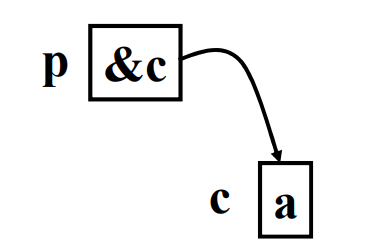
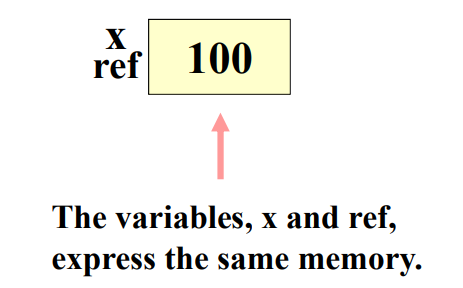

### 壹  异常处理

#### 述：
#####
#####

###### · 对待一个错误的的不同选择：
· 忽略错误（Ignore the rror）
· 立即终止（Terminate immediately）
· 设置错误标志，由调用者检查（Set an error flag，check by the caller）
· 异常处理（Exception handing）

###### · 异常与异常处理：
· **常见的异常**：
1. 数组访问越界（out-of-bound array subscript）：
```C++
int a[100], index;
cin>>index;
for(int i=0; i<=index; i++) cin>>a[i];
```
2. 算术溢流（arithmetic overflow）：
```C++
int i=1;
while(i>0) i++;
```
3. 零作分母（dividing by zero）：
```C++
double div(double x, double y) {return x/y;}
div(25,0);
```

· <font color="#00ffb0">程序 4 - 1</font> ：非异常处理方式解决零作分母的问题
```C++
#include<iostream>
using namespace std;

double Div(double a, double b)
{
	if(b==0)
	{
		cout<<"Untenable arguments to Div():"<<endl;
		exit(0);
	}
	return a/b;
}

int main()
{
	double x,y,z;
	cout<<"Enter two numbers"<<endl;
	cin>>x>>y;
	z=Div(x,y);
	cout<<x<<"/"<<y<<"="<<z<<endl;
	return 0;
}
```

· **异常处理**是一种允许调用程序在执行过程中检测并可能从错误中恢复的机制

· <font color="#00ffb0">程序 4 - 2</font> ：用异常处理方式解决零作分母的问题
```C++
#include<iostream>
using namespace std;

double Div(double a, double b)
{
	if(b==0) throw "Divided by zero";
	return a/b;
}

int main()
{
	double x,y,z;
	cout<<"Enter two numbers:"<<endl;
	cin>>x>>y;
	try
	{
		z=Div(x,y);
		cout<<x<<"/"<<y<<"="<<z;
	}
	catch(const char* info)
	{
		cout<<info<<endl;
	}
	return 0;
}
```

· 异常处理的结构：
```C++
try
{
	statement-list
}
catch(exception 1)
{
	statement-list 1
}
catch
{
	statement-list 2
}
catch(……)
{
	statement-list……
}
自顶到底的运行
```

· <font color="#00ffb0">程序 4 - 3</font> ：用异常传递数据
```C++
#include<iostream>
using namespace std;

class CError
{
	private:
	int index;
	
	public:
	CError(int i) {index=i;}
	string Info()
	{
		switch(index)
		{
			case 0:
				return "Lower Error";
				break;
			case 1:
				return "Upper Error";
				break;
			case 2:
				return "Subscription Error";
				break;
		}
		return "Info";
	}
};

class CArray
{
	private:
	int* v, lower, upper;
	
	public:
	CArray(int l, int u) : lower(l), upper(u)
	{
		if(lower<0) throw CError(0);
		if(upper<0) throw CError(1);
		v=new int[upper-lower+1];
	}
	int& operator [] (int);
	~CArray() {if(v) delete[] v;}
};

int& CArray::operator [] (int i)
{
	if(i>=lower&&i<upper)
	{
		return *(v+i-lower);
	}
	throw CError(2);
}

int main()
{
	try
	{
		CArray arr(0, 10);
		arr[9]=90;
	}
	catch(CError error)
	{
		cout<<error.Info()<<endl;
	}
	return 0;
}
```

###### · 多个异常处理：
· 大多数执行异常处理的程序必须处理不止一种类型的异常
· 一个 `try` 可以后跟多个处理程序 `catch`，每个 `catch` 匹配不同的异常类型

· <font color="#00ffb0">程序 4 - 4</font> ：多个 “catch” 处理多个异常
```C++
#include<iostream>
using namespace std;

class CError
{
	private:
	int index;
	
	public:
	CError(int i) {index=i;}
	string Info()
	{
		switch(index)
		{
			case 0:
				return "Lower Error";
				break;
			case 1:
				return "Upper Error";
				break;
			case 2:
				return "Subscription Error";
				break;
		}
		return "Info";
	}
};

class CArray
{
	private:
	int* v, lower, upper;
	
	public:
	CArray(int l, int u) : lower(l), upper(u)
	{
		if(lower<0) throw CError(0);
		if(upper<0) throw CError(1);
		v=new int[upper-lower+1];
	}
	int& operator [] (int);
	~CArray() {if(v) delete[] v;}
};

int& CArray::operator [] (int i)
{
	if(i>=lower&&i<upper)
	{
		return *(v+i-lower);
	}
	throw CError(2);
}

double Div(double a, double b)
{
	if(b==0)
	{
		throw "Untenable arguments to Div()";
		return a/b;
	}
}

int main()
{
	try
	{
		CArray arr(0, 10);
		arr[9]=90;
	}
	catch(CError error)
	{
		cout<<error.Info()<<endl;
	}
	catch(string info)
	{
		cout<<info<<endl;
	}
	return 0;
}
```

· **无 “catch” 时的编译器运行**：
· 如果没有 `catch` 与 `try` 块生成的异常匹配，则继续搜索下一个封闭的 `try` 块
· 如果没有找到 `catch`，则程序错误：
```C++
void Callfun(array& a)
{
	try
	{
		fun(a);
	}
	// Error if no catch！
}
```

###### · 标准异常类 std::exception：
· `std::exception` 是 C++ 标准库中定义的标准异常类的基类
· 它提供了一个通用的接口，使得派生类可以覆盖 `what()` 函数以提供有关异常的描述信息
· `std::exception` 本身不表示具体的异常情况，而是为其他具体的异常类提供了一个公共的基类
· 当定义自己的异常类时，通常会从 `std::exception` 派生，以便自己定义的异常类能够与标准异常类一样被捕获和处理，也能够提供相应的描述信息

· *标准异常类提供的一些标准的异常类型*：

| 标准异常类型                   | 含义                               |
| :----------------------- | :------------------------------- |
| `std::bad_alloc`         | 表示动态内存分配失败，通常由 `new` 操作符抛出       |
| `std::bad_cast`          | 表示在 `dynamic_cast` 运行时类型转换失败时抛出  |
| `std::bad_excption`      | 表示由于未知原因导致的异常                    |
| `std::bad_function_call` | 表示尝试调用无效函数对象时抛出                  |
| `std::bad_typeid`        | 表示在使用 `typeid` 运算符获取类型信息时发生错误时抛出 |
| `std::logic_error`       | 表示逻辑错误的异常基类，如参数错误等               |
| `std::runtime_error`     | 表示运行时错误的异常基类，如文件不存在、IO 错误等       |

· `what()` 函数通常用来获取关于异常的一些描述性信息，比如异常的原因、错误消息等
· 下面这个例子中，用 `what()` 函数获取了异常的描述信息，并将其打印到控制台上
```C++
try
{
	throw runtime_error("Something went wrong!");
	//假设这个程序有运行时异常
}
catch(const exception& e)
{
	cout<<"Exception caught: "<<e.what()<<endl;
}
//输出：
// Exception caught: Something went wrong!
```

· <font color="#00ffb0">程序 4 - 5</font> ：继承标准异常类的异常处理
```C++
#include<iostream>
#include<exception>
using namespace std;

//自定义异常类 CMyException，继承自标准异常类 exception
class CMyException : public exception
{
	public:
	//重写标准异常类的 what() 函数，用于返回异常描述信息
	//这种写法声明了无参数函数 what() 的四个信息：
	// 1. 这是一个虚函数    2. 这个函数返回类型为一个字符串
	// 3. 这是一个常函数    4. 这个函数不会抛出异常（throw() 括号中内容为空）
	virtual const char* what() const throw()
	{
		return "CMyException";
		//返回一个固定的字符串作为异常描述信息
	}
};

int main()
{
	try
	{
		throw CMyException();    //抛出一个 CMyException 类型的异常
	}
	catch(const CMyException& my)    //捕获 CMyException 类型的异常
	{
		cout<<my.what()<<endl;
	}    //异常在上面这个 catch 块已经被成功捕获并执行，下面的捕获将不再生效
	catch(const exception& e)    //捕获标准异常类的异常
	{
		cout<<e.what()<<endl;
	}
	//这个程序的可见输出仅有一行：CMyException
	return 0;
}
```


### 贰  面向对象的总结

####
#####
#####

###### · 零、面向对象的编程的核心——类：

```C++
class MyBase
{
	private:
		【属性（Attribute）】
		· 内置类型（Build-in type）
		· 静态变量（Static）
		· 常量（Const）
		· 子对象（Subobject）
		· 指针（Pointer）
		· 引用（Reference）
	public:
		【方法（Method）】
		· 构造函数（Constructor）
		· 拷贝构造函数（Copy constructor）
		· 初始化列表（Initialization list）
		· 析构函数（Destructor）
		· 常量成员函数（Const member function）
		· 静态成员函数（Static member function）
		· 函数重载（Overloading function）
		· 操作符重载（Overloading operator）
		· 虚函数（Virtual function）
		· 友元函数（Friend function）
};

class MyDerived : public MyBase
	【继承】
	· 公有继承（Public inheritance）
	· 多继承（Multiple inheritance）
	· 二义性（Ambiguous）
	· 多态性（Polymorphism）
	· 纯虚函数（Pure virtual function）
	· 抽象类（Abstract class）
{
	private:
		// Attributes
	public:
		// Methods
};
【模板（Template）】
```

###### · 一、类型和声明（Types and Declarations）：

· *基本类型（Basis Types）*：

| 基本数据类型   | 说明        |
| :------- | :-------- |
| `char`   | 字符类型      |
| `int`    | 整数类型      |
| `float`  | 单精度浮点数    |
| `double` | 双精度浮点数    |
| `void`   | 无类型 / 空类型 |
| `bool`   | 布尔型       |
· `void` 类型不允许定义变量，它只用于表示函数的返回值

· *指针（Pointer）*：
· 对于类型 $T$，$T^*$ 是“指向 $T$ 的指针” 的类型
· $T^*$ 类型的变量可以保存 $T$ 类型对象的地址
```C++
char c='a';
char* p=&c;
// p 保存着 c 的地址
```

                               （图一：p 保存着 c 的地址）

· *引用（Reference）*：
· 引用是对象的替代名称

· <font color="#00ffb0">程序 4 - 6</font> ：C++ 中的引用
```C++
#include<iostream>
using namespace std;

int main()
{
	int x=100;
	int &ref=x;
	cout<<"x="<<x<<endl;
	cout<<"ref="<<ref<<endl;
	// x=100
	// ref=100
	return 0;
}
```

                            （图二：x 与 ref 共享同一个地址）

· *动态分配（Dynamic allocation）*：
· `new` 用于动态分配内存，`delete` 用于动态释放内存

· <font color="#00ffb0">程序 4 - 7</font> ：动态内存分配
```C++
#include<iostream>
using namespace std;

int main()
{
	int *p;
	p=new int;
	*p=10;
	// 等同于 int *p=new int(10);
	cout<<"Dynamically allocate memory."<<endl;
	delete p;
	return 0;
}
```

· *常量（Const）*：
· 在 C 语言中定义常量时，通常使用宏定义的方法：
```C++
#define Pi 3.14
//没有等号，没有分号
```
· 在 C++ 中通常使用关键字 `const`，用于定义不可改变的值：
```C++
const double Pi=3.14;
```
· 使用 const 关键字可以使程序员清晰地知道 “Pi” 是哪种类型的数据
· 在宏观定义中，Pi 只是一个符号，表示 3.14，而不是一个双精度浮点型（double）
· 注意：常量必须初始化

· *静态数据类型（Static）*：
· 如果希望函数的一个局部变量在程序的整个生命周期中都存在，可以其定义为静态，并给它一个初始值
· 静态变量的初始化仅在函数第一次调用时执行，并且在函数调用之间数据的值能够保存
· 静态变量在函数作用域之外不可访问

· <font color="#00ffb0">程序 4 - 8</font> ：静态数据类型
```C++
#include<iostream>
using namespace std;

int f()
{
	static int a=5;
	return a++;
}

int main()
{
	cout<<f()<<endl;    //输出：5
	cout<<f()<<endl;    //输出：6
	cout<<f()<<endl;    //输出：7
	return 0;
}
```

· <font color="#00ffb0">程序 4 - 9</font> ：静态数据类型是一种局部变量
```C++
#include<iostream>
using namespace std;

int val=1;

int fun()
{
	static int val=10;
	val++;
	return val;
}

int main()
{
	cout<<fun()<<endl;    //输出：11
	cout<<fun()<<endl;    //输出：12
	cout<<val<<endl;    //输出：1
	return 0;
}
```

###### · 二、函数（Functions）：

· *参数传递（Argument passing）*：
· 当调用函数时，将为其形式参数（formal argument）留出存储空间，并且每个形式参数都由相应的实际参数（actual argument）初始化
· 在 C++ 中，传递参数有三种主要的方法:
1. 按值传参（call by value）
```C++
void f(int a);
```
2. 指针传参（call by pointer）
```C++
void f(int *a);
```
3. 引用传参（call by reference）
```C++
void f(int &a);
```

· *返回值（value return）*：
1. void 指针：可以灵活选择类型
```C++
double f() {return 1;}
//隐式将返回值 1 转换成 double 类型
void* fp()
{
	int local=1;
	return &local;
	//这种写法不太安全，因为这个指针指向的地址将在函数结束后被销毁，出现“指针悬挂”现象
}
```

2. 返回变量的引用
```C++
int& fun()    OK！
{
	static int val=10;
	return val;
	//返回对变量的替身
}
```
· 注意：如果 val 不是静态变量，则其生命周期在函数结束时结束，如果函数返回对非静态局部变量的引用，那么引用将指向已经被销毁的内存空间，这样的引用称为悬空引用
```C++
int& fun()    Not OK！
{
	int val=10;
	return val;
	//这是非常容易出错的写法，val 会在函数调用后被销毁
}
```
```C++
int& fun(int m)    Not OK！
{
	m*=2;
	return m;
	//按值传参，其实函数内部为形参创建的还是一个临时变量，函数内的 m 也会随调用结束而被销毁
}
```
```C++
int& fun(int &m)    Not OK！
{
	int &r=m;
	return r;
	// r 在函数调用结束后会被销毁
}
```
```C++
int& fun(int m)    Not OK！
{
	int &r=m;
	return r;
	// r 在函数调用结束后会被销毁
}
```
· 正确的写法：
```C++
int& fun(int &m)    OK！
{
	m*=2;
	return m;
	//引用传参，不创建变量的“替身”，函数调用结束后 m 不会被销毁
}
```

· *函数名重载（Overloaded function names）*：
· 对不同数据类型或不同参数数量的操作使用相同的名称称为重载（overloading）
· 注意：作为<font color="#ffc000">类的成员函数</font>，关键字 const 可以判断重载函数（非成员函数不能用 const 重载）：
```C++
class Example
{
	public:
	void foo() { /* 修改对象状态 */ }
	void foo() const { /* 不修改对象状态 */ }
};
```
· 调用时根据对象是否是 const 类型区分：
```C++
int main()
{
	Example e1;
	const Example e2;
	e1.foo();    //调用非 const 函数
	e2.foo();    //调用 const 函数
	return 0;
}
```

· *命名空间（Namespace）*：
· 名称空间是一种表示逻辑分组的机制
· 如果一些声明根据某些标准在逻辑上属于一起，则可以将它们放在一个公共名称空间中
```C++
namespace calculator
{
	double Add(double x, double y)
	{
		return x+y;
	}
	void Print(double x)
	{
		cout<<"Result is"<<x<<endl;
	}
}

①
double x=calculator::Add(10,20);

②
using namespace calculator;
double x=Add(10,20);
```

###### · 三、对象与类（Objects and Classes）：

· *成员访问控制（Controlling Member Access）*：
```C++
class class_name
{
	public:    //该类的接口（interface）
	// public members
	private:    //该类的内部属性（inner attributes）
	// private members
	protected:    //子类的接口
	// protected members
};
```

· *构造函数（Constructor）*：
· 构造函数通过与类本身具有相同的名称来识别
· 构造函数由 C++ 自动调用
· 构造函数用来创建对象
· 如果不定义构造函数，C++ 提供默认的构造函数（不带参数的）
```C++
class Point
{
	public:
	Point() {}    //可定义可不定义，会有默认构造函数

	private:
	int x, y;    //坐标	
}
```

· <font color="#00ffb0">程序 4 - 10</font> ：构造函数的初始化作用
```C++
#include<iostream>
#include<string>
using namespace std;

class Person
{
	private:
	string name;
	int age;
	
	public:
	Person(string n, int a)
	{
		name=n;
		age=a;
	}
	
	void displayInfo()
	{
		cout<<"Name: "<<name<<endl;
		cout<<"Age: "<<age<<endl;
	}
};

int main()
{
	Person person1("A", 30);
	Person person2("B", 25);
	person1.displayInfo();
	person2.displayInfo();
	//输出：
	// Name: A
	// Age: 30
	// Name: B
	// Age: 25
	return 0;
}
```

· *拷贝构造函数（Copy constructor）*：
· 拷贝构造函数构造的时机：
1. 初始化对象（initialize object）
2. 当参数是一个对象
3. 当函数的返回类型是一个类类型

· 默认的拷贝构造函数只会逐个成员变量进行简单的复制：
· 对于指针等资源，可能会导致浅拷贝（shallow copy）问题

· <font color="#00ffb0">程序 4 - 11</font> ：拷贝构造函数
```C++
#include<iostream>
#include<string>
using namespace std;

class Person
{
	private:
	string name;
	int age;
	
	public:
	Person(const Person &other)
	{
		name=other.name;
		age=other.age;
		cout<<"Copy constructor called"<<endl;
	}
	
	Person(string n, int a) : name(n), age(a) {}
	//构造函数
	
	void  displayInfo()
	{
		cout<<"Name: "<<name<<endl;
		cout<<"Age: "<<age<<endl;
	}
};

int main()
{
	Person person1("A", 30);
	Person person2(person1);
	person1.displayInfo();
	person2.displayInfo();
	//输出：
	// Copy constructor called
	// Name: A
	// Age: 30
	// Name: A
	// Age: 30
	return 0;
}
```

· *析构函数（Destuctor）*：
· 注意：
1. 析构函数没有返回类型
2. 析构函数在对象被销毁时调用
3. 析构函数没有参数
4. 一个类中只能有一个析构函数
5. <font color="#ffff00">调用析构函数的顺序与调用构造函数的顺序相反</font>

· <font color="#00ffb0">程序 4 - 12</font> ：析构函数
```C++
#include<iostream>
using namespace std;

class MyClass
{
	public:
	MyClass()
	{
		cout<<"Constructor called"<<endl;
	}
	~MyClass()
	{
		cout<<"Destructor called"<<endl;
	}
};

int main()
{
	MyClass obj;
	//输出：
	// Constructor called
	// Destructor called
	return 0;
}
```

· *this 指针（Pointer：this）*：
· 在大多数情况下，不必要显式地使用 `this` 指针，因为编译器会隐式地为每个成员函数传递一个指向当前对象的指针
· 有时候使用 `this` 指针可以提高代码的清晰度和可读性，尤其是当成员变量和参数同名时，可以使用 `this` 指针来明确指示成员变量

· <font color="#00ffb0">程序 4 - 13</font> ：this 指针的使用
```C++
#include<iostream>
using namespace std;

class Point
{
	public:
	void SetPoint(int x, int y)
	{
		this->X=x;
		this->Y=y;
		//指针 “this”赋值为所建对象的地址
	}
	~Point() {cout<<X<<endl<<Y<<endl;}

	private:
	int X, Y;
};

int main()
{
	Point P;
	P.SetPoint(1, 2);
	//输出：
	// 1
	// 2
	return 0;
}
```

· *静态成员（static member）*：
· 静态成员有关键字 `static` 声明
· 成员数据和成员函数都可以声明为静态
· 静态成员的特点：
1. 此类型的所有对象只存在一个副本
2. 静态变量由封闭类（enclosing class）控制（本质上还是一个局部变量，不可在类外直接访问）
3. <font color="#ffff00">静态函数只能直接访问静态成员，不能访问非静态成员</font>（本质上属于这个类，但不属于具体的对象）

· <font color="#00ffb0">程序 4 - 14</font> ：静态成员和静态函数
```C++
#include<iostream>
using namespace std;

class MyClass
{
	public:
	static int staticVar;
	
	static void staticFunction()
	{
		cout<<"Static variable: "<<staticVar<<endl;
	}
	
	void nonStaticFunction()
	{
		cout<<"Static variable: "<<staticVar<<endl;
	}
};

int MyClass::staticVar=42;    //静态成员变量定义并初始化

int main()
{
	MyClass::staticFunction();
	//输出：Static variable: 42
	MyClass obj;
	obj.nonStaticFunction();
	//输出：Static variable: 42
}
```

###### · 四、操作符重载（Operator Overloading）：

· *操作符重载（Operator overloading）*：
· 运算符重载是指在类操作数上使用标准运算符（如 +、-、= 等）时，赋予这些运算符新的含义的技术
· 简单来说，就是在类中重新定义标准运算符的行为，以便能够用于类对象之间的操作
· 实际上，这是一种函数的命名方式
· 通过重载相同名称的一些常规运算符，使得编程代码更易读

· <font color="#00ffb0">程序 4 - 14</font> ：加减操作符的重载
```C++
#include<iostream>
using namespace std;

class complex
{
	public:
	complex(double x=0, double y=0)
	{
		re=x, im=y;
	}
	complex operator + (complex &c)
	{
		re+=c.re, im+=c.im;
		return *this;
	}
	complex operator - (complex &c)
	{
		re-=c.re, im-=c.im;
		return *this;
	}
	
	private:
	double re, im;
};

int main()
{
	complex c, c1, c2;
	c=c1+c2;
	//等同于：c=c1.operator + (c2)
	c=c1-c2;
	return 0;
}
```

· *友元（Friend）*：
· 友元函数（friend function）是可以访问类的私有成员的函数，但它不属于一个类，事实上，它不是一个局部函数
· 友元类（friend class）：
	· 在类 A 中声明 B 为友元类，则类 B 可以访问 A 的私有成员
	· 同时可以在类 B 中声明类 A 为友元类，则类 A 可以访问 B 的私有成员
	· 但是友元的声明是单向的（即如果不两个类中都声明友元，则无法得到双向访问效果）

· <font color="#00ffb0">程序 4 - 15</font> ：友元类
```C++
#include<iostream>
using namespace std;

class A
{
	friend class B;
	
	private:
	int privateMemberA;
	
	public:
	A(int val) : privateMemberA(val) {}
	
	void displayPrivateMember()
	{
		cout<<"Private member of A"<<privateMemberA<<endl;
	}
};

class B
{
	public:
	void accessPrivateMemberA(A &objA)
	{
		cout<<"Accessing private memeber of A from class B: "<<objA.privateMemberA<<endl;
	}
};

int main()
{
	A objA(42);
	B objB;
	objB.accessPrivateMemberA(objA);    // B 访问 A 的私有变量
	//输出：Accessing private memeber of A from class B: 42
	return 0;
}
```

· <font color="#ffff00">如果重载一元操作符，必须将其定义为成员函数</font>
· <font color="#ffff00">如果重载二元操作符，可以将其定义为成员函数或友元函数</font>
· <font color="#ffff00">友元声明可以放在类声明的私有部分或公有部分，在哪里并不重要</font>

· *转换运算符（Conversion Operator）*：
· C++ 中如果要实现下面两种转换：
1. 将自定义的类对象隐式地转换为基本类型
2. 将新类转换为之前定义的类的类型

· <font color="#00ffb0">程序 4 - 16</font> ：转换运算符
```C++
#include<iostream>
using namespace std;

class Rational
{
	public:
	Rational(double x=0, double y=1)
	{
		Numerator=x;    //分子
		Denominator=y;    //分母
	}
	operator double ()
	{
		return Numerator/Denominator;
	}
	
	private:
	double Numerator, Denominator;
};

int main()
{
	Rational r(100, 200);
	double d=r;
	cout<<d<<endl;    //输出：0.5
	return 0;
}
```

###### · 五、派生类（Derived Class）：

· *访问控制：公有（Accessing controlling：public）*：
· 例，对于：`class manager : public employee`：
manager 是一个派生类，它有一个公共的基类，则有：
1. manager 类的对象可以访问 employee 类的 public 成员函数和成员数据
2. manager 的成员函数可以访问 employee 的 public 和 protected 成员函数和成员数据
3. manager 类的对象和成员函数不能访问 employee 类的 private 成员函数和数据

· *派生类中的构造函数和析构函数（Constructors and destructors during derived）*：
1. 基类的构造函数和析构函数不能被派生类继承
2. 如果基类定义了构造函数，派生类的构造函数必须在其成员初始化列表中调用基类的构造函数，以确保基类部分被正确初始化；如果不显式调用基类的构造函数，编译器将会尝试调用基类的默认构造函数（如果存在），否则会报错
3. 派生类的构造函数可以隐式地调用基类的构造函数
4. 如果基类中的所有构造函数都需要参数（即没有无参构造函数），那么在派生类的构造函数中必须显式调用基类的某一个构造函数，以确保基类的对象正确初始化
5. 在派生类的构造函数定义中，需要指定基类构造函数的参数
6. 基类的成员函数和派生类的成员函数一样，都可以被调用和使用

· 继承中构造函数和析构函数的过程：
	· 类对象是由下向上构造的：
		1. 先构造基类
		2. 再构造成员函数
		3. 最后构造派生类
	· 类对象是由上到下析构的：
		1. 先销毁派生类
		2. 再销毁构造函数
		3. 最后销毁基类
	· 成员和基类按照在类中声明的顺序构造，并按照相反的顺序销毁

· <font color="#00ffb0">程序 4 - 17</font> ：派生类中的构造函数和析构函数
```C++
#include<iostream>
using namespace std;

class Base
{
	public:
	Base(int val)
	{
		cout<<"Base constructor with value "<<val<<endl;
	}
	~Base()
	{
		cout<<"Base destructor"<<endl;
	}
	void baseFunction()
	{
		cout<<"Base function called"<<endl;
	}
};

class Derived : public Base
{
	public:
	Derived(int val) : Base(val)
	{
		cout<<"Derived constructor with value "<<val<<endl;
	}
	~Derived()
	{
		cout<<"Derived destructor"<<endl;
	}
	void derivedFuctoin()
	{
		cout<<"Derived function called"<<endl;
	}
};

int main()
{
	Derived derivedObj(10);
	//输出：
	// Base constructor with value 10
	// Derived constructor with value 10
	derivedObj.baseFunction();
	// Base function called
	derivedObj.derivedFuctoin();
	// Derived function called
	
	// Derived destructor
	// Base destructor
	return 0;
}
```

· *虚函数（Virtual function）*：

· <font color="#00ffb0">程序 4 - 18</font> ：虚函数的作用
```C++
#include<iostream>
using namespace std;

class A
{
	public:
	void f() {g();}
	virtual void g() {cout<<"It's A::g()."<<endl;}
};

class B : public A
{
	public:
	void g() {cout<<"It's B::g()."<<endl;}
};

int main()
{
	A a;
	B b;
	a.f();
	b.f();
	//输出：
	// It's A::g().
	// It's B::g().
	return 0;
	
	//如果不用 virtual 修饰类 A 中的 g()
	//则两行输出均为：It's A::g().
}
```

· 重载虚函数时必须用相同的函数定义，这个“相同”包括以下条件：
1. 相同的返回类型（same returning type）
2. 相同的函数名称（same function name）
3. 相同数量的参数（same arguments number）
4. 相同类型的参数（same argument type）
· 虚函数必须是一个成员函数
· 友元函数（friend function）不能定义为虚函数
· 析构函数可以定义为虚函数，但构造函数不能

· *多重继承（Multiple inheritance）*：
· 一个类可以有多个直接基类，也就是说，在类声明的 `:` 符号后面指定多个类
· 使用多个直接基类通常称为多重继承（multiple inheritance）

· 问题 1 ：如果在基类 A 和基类 B 中存在同名函数 fun()，此时派生类 C 的对象调用 fun()，将会掉哦用调用哪个 fun() ?

· <font color="#00ffb0">程序 4 - 19</font> ：指定调用消除多重继承的二义性
```C++
#include<iostream>
using namespace std;

class A
{
	public:
	void fun() {cout<<'A'<<endl;};
};

class B
{
	public:
	void fun() {cout<<'B'<<endl;};
};

class C : public A, public B
{
	private:
	int c;
	char ch;
};

int main()
{
	C obj;
	obj.A::fun();    //指定调用消除多重继承的二义性
	return 0;
}
```

· <font color="#00ffb0">程序 4 - 20</font> ：重写同名函数消除多重继承的二义性
```C++
#include<iostream>
using namespace std;

class A
{
	public:
	void fun() {cout<<'A'<<endl;};
};

class B
{
	public:
	void fun() {cout<<'B'<<endl;};
};

class C : public A, public B
{
	private:
	int c;
	char ch;
	
	public:
	void fun() {B::fun();}
};

int main()
{
	C obj;
	obj.fun();
	return 0;
}
```

· 问题 2 ：派生类 D 有两个基类 B 和 C，这两个基类有同一个基类 A（菱形继承），当类 D 的对象调用类 A 的成员函数时，就会出现“走哪条路”的问题

· <font color="#00ffb0">程序 4 - 21</font> ：“菱形继承”中的二义性
```C++
#include<iostream>
using namespace std;

class A
{
	public:
	void fun() {cout<<'A'<<endl;};
};

class B : public A
{
	public:
	void FB() {cout<<'B'<<endl;}
};

class C : public A
{
	public:
	void FC() {cout<<'C'<<endl;}
};

class D : public B, public C
{
	private:
	int d;
	char dh;
};

int main()
{
	D obj;
	obj.FB();    // OK！
	obj.FC();    // OK！
	// obj.fun(); 有二义性
	obj.C::fun();    // OK！
	return 0;
}
```

· *抽象类（Abstract class）*：
· 纯虚函数（pure virtual function）：在 C++ 中，通过在虚函数声明末尾添加 “= 0” 来声明一个纯虚函数
· 纯虚函数没有函数体，它的存在仅仅是为了提供一个接口，要求任何继承该类的派生类必须实现该函数
· 只要含有一个纯虚函数的类就成为抽象类，抽象类不可以实例化为对象
· 析构函数可以被声明为纯虚的

· 抽象类举例：
```C++
class Number
{
	public:
	Number(int i) {val=i;}
	virtual void Show() =0;    //纯虚函数
	
	protected:
	int val;
};
```

###### · 六、模板（Template）：

· *模板（Template）*：
· 模板提供了一种定义一组函数或类的方式，这些函数或类在功能上是相同的，但是它们内部使用的数据类型可能不同
· 模板允许定义通用的函数或类，其中一些元素（如参数类型、返回类型或成员变量类型）可以用占位符来代替，这些占位符可以在实例化时被具体的数据类型替换
· 可以使用相同的模板代码来处理不同类型的数据，从而避免了重复编写功能类似但数据类型不同的代码
· 函数可以根据未指定的类型（unspecified type）定义，编译器根据函数调用中传递的参数类型生成函数的不同版本

· <font color="#00ffb0">程序 4 - 22</font> ：函数模板（function template）
```C++
#include<iostream>
#include<string>
using namespace std;

template<typename T>
T Max(T a, T b)
{
	return a>b? a: b;
}

int main()
{
	int intMax=Max((int)3, (int)5);
	cout<<"Max of 3 and 5 is: "<<intMax<<endl;
	double doubleMax=Max<double>((double)3.14, (double)2.71);
	cout<<"Max of 3.14 and 2.71 is: "<<doubleMax<<endl;
	string stringMax=Max("apple", "orange");
	cout<<"Max of 'apple' and 'orange' is: "<<stringMax<<endl;
	//输出：
	// Max of 3 and 5 is: 5
	// Max of 3.14 and 2.71 is: 3.14
	// Max of 'apple' and 'orange' is: apple
	return 0;
}
```

· *类模板（Class template）*：
· 类模板声明的方式：
```C++
template <class T>
class MyClass
{
	private:
	T val;
	…………
};
```

· <font color="#00ffb0">程序 4 - 23</font> ：类模板（class template）
```C++
#include<iostream>
#include<string>
using namespace std;

template <class T>
class MyClass
{
	public:
	MyClass(T v) : val(v) {}    //构造函数
	void Print()
	{
		cout<<"Value: "<<val<<endl;
	}
	void Print2()
	{
		cout<<"Value: "<<val.getName()<<endl;
	}
	
	private:
	T val;
};

class Student
{
	public:
	Student(string n) : name(n) {}
	string getName() const {return name;}

	private:
	string name;
};

int main()
{
	MyClass<int> x(10);
	x.Print();    //输出：Value: 10
	MyClass<Student> aStudent(Student("John"));
	aStudent.Print2();    //输出：Value: John
	return 0;
}
```


###### · 七、补充：

· *友元函数（Friend function）的共用*：
· 在 C++ 中，一个友元函数可以被定义在两个不同的类中
· 一个类可以声明另一个类的成员函数为其友元函数，反之亦然

· <font color="#00ffb0">程序 4 - 24</font> ：一个友元函数可以被定义在两个不同的类中
```C++
#include<iostream>
using namespace std;

class B;

class A
{
	private:
	int a;
	
	public:
	A(int A) : a(A) {}
	friend void foo(A& oa, B& ob);    //声明 foo 函数为 A 和 B 的友元函数
};

class B
{
	private:
	int b;
	
	public:
	B(int B) : b(B) {}
	friend void foo(A& oa, B& ob);    //声明 foo 函数为 A 和 B 的友元函数
};

void foo(A& oa, B& ob)
{
	cout<<"Calling foo "<<oa.a+ob.b<<endl;
}

int main()
{
	A objA(1);
	B objB(2);
	foo(objA, objB);    //输出：Calling foo 3
	return 0;
}
```

· <font color="#00ffb0">程序 4 - 25</font> ：一个类将另一个类的成员函数声明为自己的友元函数
```C++
#include<iostream>
using namespace std;

class B;

class A
{
	public:
	void displayB(B& objB);    //声明类 B 的成员函数为友元函数
};

class B
{
	private:
	int privateDataB=20;
	
	public:
	friend void A::displayB(B& objB);    //将 A 的成员函数声明为 B 的友元函数
};

void A::displayB(B& objB)
{
	cout<<"Value of privateDataB in class B accessed from class A: ";
	cout<<objB.privateDataB<<endl;
}

int main()
{
	A objA;
	B objB;
	objA.displayB(objB);    //在 A 的成员函数中访问了 B 的私有成员
	return 0;
}
```

