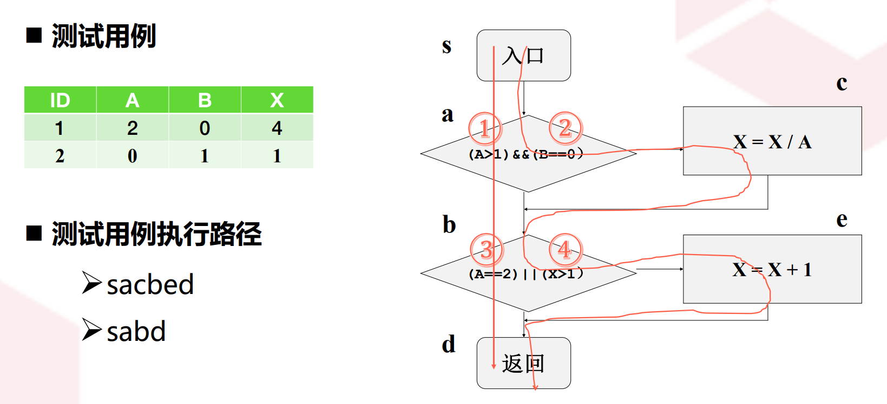
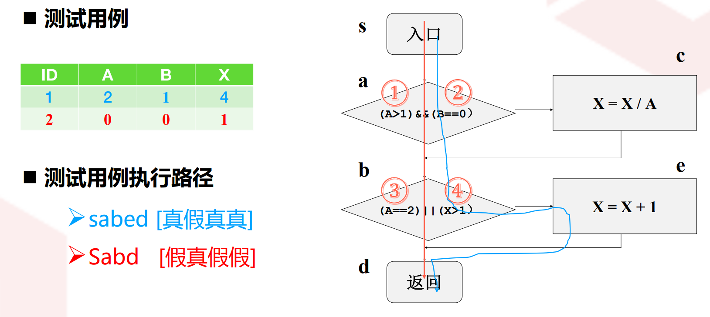

### 壹  软件测试入门

#### 述：
##### 日复夜来流光轮，闻窗惊觉秋已深。
##### 寒虫尚知终前鸣，坎坷如我却沉声。
##### 辞乡飘云无故友，空庭邀月是知音。
##### 辗转今宵强欲寝，冀望明朝得宽心。

###### 1. 软件缺陷与软件危机：

· <font color="#e36c09">议题 1 - 1</font>：软件缺陷的特点：
1. 软件缺陷危害巨大
2. 软件缺陷目前还无法完全避免

· 【常见软件缺陷】：
· 内存溢出（如 float 向 int 的转换）
· 数据单位问题
· Windows 蓝屏缺陷
· 应用程序崩溃
· 内存不可写缺陷（指针的滥用）
· 手机 APP 出错，提示“是否上传缺陷报告”

· <font color="#e36c09">议题 1 - 2</font>：什么是软件危机（Software crisis）：
1. 根本原因：软件规模迅速膨胀
	1. 规模变大
	2. 复杂程度变高
2. 巨大挑战：
	1. 成本越来越高
	2. 软件质量越来越差
	3. 项目成功率持续走低

- 小结
	- 软件缺陷危害严重但无法完全避免
	- 软件规模和复杂性的增长是软件危机的根本原因
	- 软件危机的核心表现是低生产率和不可靠的软件质量
	- 软件测试是目前解决软件缺陷问题的最有效途径

###### 2. 软件测试的概念与定义：

· 【软件测试的常见概念定义】：
· 保证程序和相应的规范说明一致
· 发现软件中的缺陷
· 确保系统合理地执行
· ISO9000 定义：软件测试是一种基于机器的，对代码执行测试、确认测试的活动

· <font color="#e36c09">议题 1 - 3</font>：什么是软件测试：
1. 完整定义：软件测试是发现并指出软件中存在缺陷的过程（这个过程指明和标注问题存在的正确位置，详细记录导致问题出现的操作步骤，及时存储当时的错误状态）
2. 确保系统合理地执行
3. 测试对象：包含建模、需求、设计等阶段所产生的大量输出制品及程序代码

· <font color="#e36c09">议题 1 - 4</font>：软件测试的流程：
1. 首先要发现问题
2. 发现问题后要记录问题，看看是不是新错误
3. 新错误要在跟踪系统上跟踪问题（前三步是测试人员完成的）
4. 将问题记录转发给开发人员，开发人员要再现问题，确认问题
5. 开发人员修复问题
6. 开发人员修复后要去跟踪问题

· <font color="#e36c09">议题 1 - 5</font>：IEEE（1983）729 软件缺陷一个标准的定义：
1. 从产品内部看，软件缺陷是软件产品开发或维护过程中所犯的错误
2. 从外部看，软件缺陷是系统所需要实现的某种功能的失效或违背

· <font color="#e36c09">议题 1 - 6</font>：软件缺陷的主要类型：
1. 功能、特性没有实现或部分实现（该实现的没实现）
2. 实际结果与预期结果不一致（实现了但是实现错了）
3. 运行出错，包括运行中断、系统崩溃、界面混乱（系统运行错误）
4. 用户不能接受的其他问题，如存取时间过程、界面不美观（未满足非功能性指标）

· <font color="#e36c09">议题 1 - 7</font>：软件缺陷产生的原因：
1. 技术原因：架构有瑕疵、算法有问题、代码有错误
2. 非技术原因：需求理解不到位、需求变化、需求不一致、需求不完整

· 【软件测试不等于代码测试】：
· 软件测试找出来的软件缺陷，肯定不限于代码上的缺陷

· 【软件缺陷的构成】
· 不同阶段的缺陷比例：
	· 需求：54%
	· 设计：25%
	· 代码：15%
	· 其他：6%

· 【缺陷修复成本】：
· 需求阶段去修复，成本很小
· 设计阶段去修复，成本会增加
· 编程阶段去修复，成本增加一个数量级
· 软件缺陷修复的时机越晚，修复的成本就越高，因此要尽早及时进行修复

- 小结：
	- 软件测试是发现并指出软件中存在缺陷的过程
	- 软件缺陷是软件产品开发或维护中所犯的错误，是系统所需要实现某种功能的失效或违背
	- 应该尽快尽早测试以降低软件开发成本

###### 3. 软件测试模型：

· <font color="#e36c09">议题 1 - 8</font>：瀑布模型：
1. 需求—>设计—>开发—>测试
2. 水流顺着台阶，一阶一阶顺流而下
3. 特点：不可逆，简单直观

· <font color="#e36c09">议题 1 - 9</font>：为什么软件测试应该尽快尽早：
1. 大部分软件缺陷在软件开发早期就已出现
2. 软件缺陷的生命周期越短越好（节约成本）（最后阶段再测试，为时晚矣！）

· <font color="#e36c09">议题 1 - 10</font>：“V”模型的执行顺序：
1. 获得用户需求，马上准备验收测试方案
2. 获得系统需求，马上准备系统测试方案
3. 得到系统总体设计，马上准备集成测试方案
4. 得到详细设计，马上准备单元测试方案
5. 进行编码开发
6. 有代码后，开始执行单元测试
7. 依次执行：集成测试、系统测试、验收测试

· <font color="#e36c09">议题 1 - 11</font>：“V”模型的缺陷：
1. 没有从根本上解决尽快测试尽早测试的要求
2. 软件开发完后才开始执行测试，发现软件缺陷
3. 根本原因：“V”模型走的是传统瀑布模型

· <font color="#e36c09">议题 1 - 12</font>：迭代模型（RUP，Rational Unified Process）的迭代过程：
1. Inception：概念建模阶段，相当于需求分析
2. Elaboration：详细展开阶段，相当于设计阶段
3. Construction：构造，是开发或者编码实现阶段
4. Transition：迁移，也就是交付阶段

· <font color="#e36c09">议题 1 - 13</font>：迭代模型的优点
1. 迭代模型的每个迭代都包含了测试工作
2. 可以很早就执行测试活动，尽早尽快地发现软件的缺陷，及时快速低成本修复软件缺陷
3. 随着迭代推进，测试任务会越来越多

- 小结：
	- 软件测试需要遵循一定的模型
	- 传统上以瀑布模型和“V”模型为主
	- 迭代模型更有利实现尽快尽早测试

###### 4. 软件测试分类：

· <font color="#e36c09">议题 1 - 14</font>：软件测试的多维度分类：
1. 根据测试方法：
	1. 黑盒测试
	2. 白盒测试
2. 根据测试阶段：
	1. 单元测试
	2. 集成测试
	3. 系统测试
	4. 验收测试
3. 根据测试目标：
	1. 功能测试：测试软件系统是否满足用户的功能性需求
		1. 用户需要的功能是否已经实现
		2. 用户要求的功能需求，其实现是否正确
	2. 性能测试：测试软件系统是否满足用户的性能需求：
		1. 系统响应时间
		2. 内存消耗量
		3. 能量消耗量
	3. 可靠性测试：测试系统的可靠性是否满足用户要求：
		1. 故障率
		2. 重启次数
		3. 无故障运行时间长度

- 小结：
	- 软件测试的分类是多维度的
	- 可以按照测试方法、测试阶段、测试目的进行不同的分类

###### 5. 测试用例：

· <font color="#e36c09">议题 1 - 15</font>：什么是测试用例：
1. 测试用例是指对软件产品执行一项特定测试任务的描述
2. 内容包括：测试目标、测试环境、输入数据、测试步骤、预期结果、测试脚本等
3. 简化版定义：完成被测软件的某个执行所需的输入值（含交互式输入，如点击鼠标）
4. 作用：指导测试的实施：
	1. 规划、准备测试数据的依据（输入）
	2. 评估测试结果的度量基准（预期输出）
	3. 编写测试脚本的“设计规格说明书”（需求与代码）
5. 多样形式：步骤列表、数据矩阵、测试脚本、检查单（静态测试）

- 小结：
	- 测试用例是软件测试中的核心概念
	- 测试用例是指对一项特定的软件产品进行测试的任务描述
	- 测试用例有不同的表现形式

###### 6. 软件测试的信息流：

· 【测试信息流】：
· 测试—>结果分析—>排错 / 可靠性分析

· <font color="#e36c09">议题 1 - 16</font>：软件测试过程的三类输入：
1. 软件配置：包括软件需求规格说明、软件设计规格说明、源代码等
2. 测试配置：包括测试计划、测试用例、测试驱动程序等
3. 测试工具：为测试的实时提供某种服务的基础性工具（例如测试数据自动生成程序、静态分析程序、动态分析程序、测试结果分析程序，以及驱动测试的工作台等）

- 小结：
	- 软件测试是系统工程，需要遵循一定的流程

###### 7. 软件测试的原则和常见误区：

· <font color="#e36c09">议题 1 - 17</font>：软件测试的原则：
1. 尽早地和不断地进行软件测试
2. 程序员应避免检查自己的程序
3. 完全测试程序（枚举所有可能情况并全部进行测试）是不可能的
4. 软件测试是有风险的行为
5. 在设计测试用例时，应当包括合理的输入条件和不合理的输入条件
6. 充分注意测试中的群集现象（一组相关或相似的缺陷在测试过程中集中出现的现象）
7. 严格执行测试计划，排除测试的随意性
8. 应当对每一个测试结果做全面检查
9. 妥善保存测试文档等
10. 并非所有软件缺陷都能修复
11. bug 的“80%”原则（大多数情况下，少数代码模块或功能可能会占据大部分缺陷的来源）

· <font color="#e36c09">议题 1 - 18</font>：软件测试的常见误区：
1. 调试和测试是一样的（错）
2. 软件测试对象就是程序（错）
3. 软件测试是测试人员的事情，与开发人员无关（错）
4. 好的软件质量是通过测试得到的（错）
5. 把不合格的开发人员安排做测试（错）
6. 关注于测试的执行而忽略测试的设计（错）
7. 测试自动化是万能的（错）
8. 测试是为了证明软件的正确性（错，测试是发现缺陷的过程，没有缺陷也不能证明正确性）

- 小结：
	- 软件测试需要遵循一定的原则
	- 软件测试需要避免常见误区


### 贰  静态测试技术

#### 述：
##### 闲意捉笔几句成，俯仰炼酌文初通。
##### 偶然会友把盏问，可愿慷慨赠新名？

###### 1. 静态测试技术概述：

· <font color="#00ffb0">议题 2 - 1</font>：静态测试与动态测试的不同：
1. 动态测试需要运行被测程序，静态测试不运行程序本身
2. 动态测试方法的三部分：构造测试用例、运行程序、分析程序的输出结果，静态测试通常不需要测试用例，但需要静态检查表
· 答题方法：$X$ 和 $f$ 的角度

· <font color="#00ffb0">议题 2 - 2</font>：静态测试的目标及内容：
1. 检查需求文档，是否切合实际，是否自相矛盾，是否清晰明确
2. 检查详细设计文档，是否符合概要设计的要求
3. 检查代码风格，是否符合规范（较高的可读性）
4. 检查程序设计和结构，是否合理、可行
5. 检查业务逻辑，是否有逻辑缺陷
· 答题方法：“需求-设计-开发-检测”流

· <font color="#00ffb0">议题 2 - 3</font>：静态测试的方法：
1. 同行评审：由软件工作产品创建者的同行们检查该工作产品，识别产品的缺陷，改进产品的不足
2. 数据流测试：检查程序的控制流程，根据事件的顺序，探索跟踪变量的值以及变量的使用情况等（开发者自己执行，看看数据在程序的各个组件之间是如何流动的，它们的流动是否合理，是否有异常情况，通常用于核心算法的测试）
· 联想方法：“flower” and “flow”

· <font color="#00ffb0">议题 2 - 4</font>：同行评审的三种形式：
1. 走读（Walkthrough）：（同行）
	1. 特点：同行评审中最自由的一种形式
	2. 主要目的：评价软件制品（比如软件代码）（意在提高软件质量）
	3. 其他目的：技术的交换、参与人员的技术培训、设计思想的介绍等（向他人学习）
	4. 评价方面：代码正确性、效率、可读性（可读性是动态测试无法评价的方面）
	5. 走读成员：项目内部的其他开发人员（往往需要通读，很难请专家来专门负责）
	6. 方式：对照检查表（Checklist）检查代码
2. 小组评审（Team Review）：（领导）
	1. 组织：参与者主要是公司技术领导或权威及公司外部专家（走读往往是平级的）
	2. 适用范围：主要适用于需求文档和概要设计（高层次的比较抽象的软件制品）
	3. 目标：给出意见和建议：确认某个制品是否符合要求，是否可以进入下一个阶段，如何提高制品的质量，如何符合要求
3. 审查（Inspection）：（专职部门、员工）
	1. 组织：公司内部设计、开发、测试、质量等部门中工作性质相关的员工
	2. 适用范围与目的：检查针对实际产品或半成品，发现存在的错误
	3. 形式：遵循一个严格的过程，人员经过培训，检查过程有标准（未必看懂代码，可采用代码度量、质量指标等）

| 分类                 | 走读                    | 小组评审                              | 审查                           |
| :----------------- | :-------------------- | :-------------------------------- | :--------------------------- |
| 目标                 | 检测缺陷：<br>找出可替换的方法     | 评估产品的价值和市场可行性；<br>评估需求规格和设计规格的正确性 | 检测和识别缺陷                      |
| `组织者 /`<br>`会议主持人` | `作者`                  | `公式技术领导`                          | `测试或质量主管`                    |
| 评审员                | 同组项目成员                | 公司内技术权威或公司外行业专家                   | 项目负责人、公司设计人员、<br>质量管理人员、测试人员 |
| `人员规模`             | `2-7`                 | `3人或更多`                           | `3-6人`                       |
| 数据收集               | 可选                    | 可选                                | 正式要求                         |
| `记录员`              | `可选（作者自己）`            | `可选（建议性意见）`                       | `缺陷列表：缺陷总结`                  |
| 活动计划               | 有                     | 有                                 | 有                            |
| `活动前准备`            | `评审员会议前`<br>`不需要阅读作品` | `评审员会议前阅读作品`                      | `评审员会议前阅读作品`                 |
| 适用范围               | 代码、详细设计               | 概要设计、需求规格                         | 代码、详细设计、概要设计                 |

· <font color="#00ffb0">议题 2 - 5</font>：同行评审的正式与非正式：
1. 非正式：注重灵活（请同事帮忙走读代码，私下协调）
2. 正式：注重规范（在 Github 上发起请求，对方接受请求，并把评审结果发回到 Github）

- **小结**：
	- 静态测试是不需要运行被测试软件的一种测试手段
	- 同行评审是静态测试的主要手段
	- 同行评审可以分为走读、小组评审和审查

###### 2. 代码走读：

· <font color="#00ffb0">议题 2 - 6</font>：代码走读关注的方面：
1. 代码风格和规则：独立于业务逻辑（独立于软件的功能）
2. 程序设计和结构
3. 业务逻辑（软件功能）
· 口诀：“业务表里”

· <font color="#00ffb0">议题 2 - 7</font>：代码风格和规则检查的工作：
1. 程序风格的一致性、规范性（制定标准、规定循环）
2. 标识符定义的一致性、规范性：
	1. 规范性：保证变量命名能够见名知意，并且简洁；长度适当、命名规范、容易记忆、能够拼写
	2. 一致性：用相同的标识符代表相同功能的软件实体，不要用相同的标识符表示不同功能的软件实体
3. 程序是否清晰、简洁、容易理解（冗长的程序并不一定就不清晰，但是是必要的，如窗口创建初始化）
4. 代码的注释（版权、作者、函数功能、参数意义）：
	1. 是否完整
	2. 是否清晰简洁
	3. 是否正确地反映代码功能
	4. 是否做了多余的注释

· 【注释文档的完整性】：
	· 对包、类、属性、方法、参数、返回值的注释是否正确且容易理解
	· 参数类型、参数的限定值的注释是否正确，特别是对于形参与返回值中关于神秘数值的注释是否清晰（神秘数值比如：返回 1 代表什么，返回 2 代表什么，3 代表什么），对于返回结果集（Result Set）的注释

· <font color="#00ffb0">议题 2 - 8</font>：程序设计和结构检查的工作：
1. 模块接口的正确性检查：
	1. 确定形参个数、数据类型、顺序是否正确（当形参数据类型相同时，顺序尤其重要）
	2. 确定返回值类型及返回值的正确性
	3. 以详细设计为基准（程序与详细设计是否一致）
2. 输入参数是否有正确性检查（不能假定真实情况下输入总是合法的）：
	1. 在代码前对输入参数做一个正确性检查（如抛出异常）
	2. 缺少参数正确性检查的代码是造成软件系统不稳定的主要原因之一
3. 调用其他方法接口的正确性：
	1. 检查实参类型正确与否、传入的参数值正确与否、参数的个数正确与否
	2. 检查返回值正确与否，有没有误解返回值表示的意思
	3. 利用代码对每个被调用的方法的返回值用显示代码做正确性检查
	4. 如果被调用方法出现异常或错误，程序应该给予反馈并添加适当的出错处理代码（准确错误提示，妥当处理）
4. 保证表达式、SQL 语句的正确性：
	1. 检查所编写的 SQL 语句的语法、逻辑的正确性
	2. 对表达式应该保证不含二义性，对于容易产生歧义的表达式或运算符优先级：`《`、`=`、`&&`、`||`、`++`、`--`、`》`等，可以采用括号运算符 `()` 避免二义性
5. 检查常量和全局变量使用的正确性：
	1. 检查常量或全局变量的取值和数据类型
	2. 保证常量的每次引用，是否保持数值和类型的一致性
6. 检查数字是否进行了命名：
	1. 包括各种常数、数组的大小、字符位置以及程序中出现的以文字形式写出的数值
	2. 为了提高软件的可读性，需要定义一些命名的常量来存储这些数字
7. 检查代码是否可以优化、算法效率是否最高（或可以提高）
	1. 是否可以用 1 条 SQL 语句代替程序中的多条 SQL 语句的功能
	2. 循环是否必要，循环中的语句是否可以抽出程序之外等

· 【输入参数如何做正确性检查】：
示例：当参数错误，不终止程序的执行，只终止这个函数
```C++
void strFunction(const char* destStr, const char* cerStr)
{
	assert((destStr!=NULL) && (cerStr!=NULL));
	if(NULL==destStr || NULL==cerStr)
	{
		cout<<"invalid argument(s).";
		return;
	}
}
```

· 【出错处理是否妥当】：
	· 出错的描述是否难以理解
	· 出错的描述不足以对错误进行定位，不足以确定错误的原因
	· 显示的错误信息与实际的错误原因不符
	· 对错误条件的处理不正确（比如提示错误后，有些任务应当终止，而不是继续执行）
	· 在对错误进行处理之前，错误条件已经引起系统的干预（处理太晚了）
· 示例：出错信息提示
```C++
char *str1="1", *str2=NULL;
try{
	int num1 = parseNumber(str1);
	int num2 = parseNumber(str2);
	printf("sum is %d\n", num1+num2);
} catch (NumberParseException) {printf("输入不是整数\n");}
```

- 小结：
	- 代码走读是代码静态测试主要方法（最常见）
	- 代码走读主要包括格式检查、设计和结构检查、业务逻辑检查
	- 代码走读依赖于检查列表
	- 详细设计依赖于静态测试


### 叁  黑盒测试方法

#### 述：

##### 未睹江流却晓源，不见云行但知归。
##### 茅堂山远亦观世，天下三分尽付谁？

###### 1. 等价类测试：

· <font color="#ffc000">议题 3 - 1</font>：什么是黑盒测试：
1. 黑盒测试又称数据驱动测试
2. 把测试对象看作一个黑盒子，测试人员完全不考虑程序内部的逻辑结构和内部特性，只依据程序的需求规格说明书，检查程序的功能是否符合它的功能说明

· <font color="#ffc000">议题 3 - 2</font>：黑盒测试技术按照选择测试用例的不同策略分类：
1. 等价类划分测试
2. 边界值分析测试
3. 输入组合法测试
4. 因果图测试
5. 基于状态的测试

· <font color="#ffc000">议题 3 - 3</font>：什么是等价类：
1. 如果软件的行为对于一组值来说的相同的，那么这组值就叫做等价类（这是软件对不同输入的处理逻辑上来区分不同的输入）
2. 测试相同目标或者暴露相同软件缺陷的一组测试用例

· 【等价类】：
	· 从软件的需求归约看输入的等价性
	· 从程序运行的角度看输入的等价性
· 示例：根据成绩评定等级：
```C++
void Grade(int score)
{
	if(score>=90) {putchar('A'); return;}
	if(score>=80) {putchar('B'); return;}
	if(score>=70) {putchar('C'); return;}
	if(score>=60) {putchar('D'); return;}
	putchar('F');
	return;
}
```
· 由此可以看到，下面几个输入可以划分等价类：
~~~
等价类 1： 90，95，98，100
等价类 2： 80，84，88，89
等价类 3： 70，72，76，78
等价类 4： 60，63，68，69
等价类 5： 0，23，46，59
· 每个等价类的输入触发的业务逻辑是一样的
~~~
· 但是等价类输入并不一定对应相同的输出，如下面的程序：根据成绩 score 计算奖励：
```C++
double Reward(int score)
{
	if(score>=90) return 4*score;
	if(score>=80) return 2*score;
	if(score>=70) return 1.0*score;
	if(score>=60) return 0.5*score;
	return 0;
}
```

· <font color="#ffc000">议题 3 - 4</font>：等价类测试：
0. 把所有可能的输入数据划分成若干部分（等价类），然后从每一个等价类中选取少数有代表性的数据作为测试用例

· <font color="#ffc000">议题 3 - 5</font>：等价类测试用例选择指导原则：
1. 设计一个测试用例，尽可能多地覆盖尚未覆盖的有效等价类，重复这个步骤，直到覆盖所有有效等价类为止
2. 设计一个测试用例，尽可能少地（大于等于一）覆盖尚未被覆盖的无效等价类（如成绩大于 100 或小于 0），重复这个步骤，直到所有无效等价类都被覆盖为止

· 【等价类测试案例】：

                   （图一：测试用例尽可能多地覆盖尚未覆盖的有效等价类）

                   （图二：测试用例尽可能少地覆盖尚未覆盖的无效等价类）

- 小结：
	- 等价类测试是黑盒测试的重要手段
	- 软件的行为对于一组值来说是相同的，那么这组值就叫作等价类
	- 等价类测试方法就是把所有输入划分为若干等价类，从每个等价类中选择若干典型输入作为测试用例

###### 2. 边界值测试：

· <font color="#ffc000">议题 3 - 6</font>：边界值测试的定义：
0. 针对各种边界情况设计测试用例（测试本质上都是设计测试用例）

· <font color="#ffc000">议题 3 - 7</font>：五点式边界值：
1. 最小值
2. 最大值
3. 中间值
4. 比最小值大一点
5. 比最大值小一点

· 【输入范围在 0 到 100 时的边界值】：
~~~
· 最小值：0
· 最大值：100
· 中间值：50
· 比最小值大一点：1
· 比最大值小一点：99
~~~

· 如果输入范围是 0 到 ∞：
· 计算机中，每一种数据类型，因为它对应的存储区大小是固定的，因此就一定有一个上限
· int 类型的上限，如果是 32 位无符号的，那么它的最大值应该是 2 的 32 次方减一
~~~
· 最小值：0
· 最大值：Max(int)
· 中间值：可以是最大和最小值的平均数，也可使是中间区域的某个值，比如选择 99
· 比最小值大一点：1
· 比最大值小一点：Max(int)-1
~~~

                            （图三：边界值测试的常用思路）
· 对于图三中的情况，要删除相同的测试用例（三遍都是 100 的情况）

· 【边界值测试的常用思路】：
· 选定一个变量，让它遍历 5 个边界值，而其他的变量全部锁定为中间值
· 每次遍历，就一定会产生一个特殊的测试用例，在这个测试用例里面，所有的输入变量都取中间值（如图三中等边三角形的重复用例）

· <font color="#ffc000">议题 3 - 8</font>：七点式边界值：
1. 最小值
2. 最大值
3. 中间值
4. 比最小值大一点
5. 比最大值小一点
6. 比最小值小一点
7. 比最大值大一点

· 【七点法边界值中超出测试范围点的作用】：
· 如果超出了测试范围，程序能不能准确地进行区分？
· 能不能准确地识别出这是一个非法输入？
· 很多情况下程序会忽略这种区分，从而导致软件缺陷

                     （图四：七点式边界值测试法测试三角形判定程序）

- 小结：
	- 边界值测试：针对各种边界情况设计测试用例
	- 可以采用 5 点式边界值测试
	- 也可以采用 7 点式边界值测试，测试无效输入

###### 3. 等价类边界值测试：

· 【等价类边界值测试】：

                     （图五：等价类边界值测试的用例设计（五点式））

                     （图六：较为复杂的等价类边界值测试的用例设计）
· 图六中只有“年龄”可以使用边界值，其他几个属性都是离散的，没有边界值的概念
· 如果其他属性也有边界值，那么此时要注意，用最少的测试用例覆盖全部有效等价类的边界值
· 对于无效等价类，也应该覆盖其边界值，比如 1 岁以下，有 0 岁、-1 岁、-10 岁，-∞ 等边界值

- 小结
	- 等价类边界值测试方法是结合等价类和边界值的测试方法
	- 每个等价类的边界值都应该予以覆盖
	- 等价类边界值测试充分性优于等价类测试和边界值测试（测试更加全面）

###### 4. 因果图测试：

· <font color="#ffc000">议题 3 - 9</font>：因果图的基本元素：
1. 因果图是一个有向无环图
2. 因果图的基本元素：
	1. 原因 $C_i$
	2. 结果 $E_i$
	3. 原因和结果之间的因果关系
	4. 原因和原因之间的关系
	5. 结果和结果之间的关系
3. 原因是表示程序的输入满足了某个特定的有意义的触发条件（输入特殊字符、按了某个按钮）
4. 结果是表示程序的输出满足了某个有意义的触发条件（如程序异常、程序中断，或者输出某个表格某个数值等）
5. 原因建议用 $C_i$ 的形式表示，结果建议用 $E_i$ 的形式表示，中间节点建议用 $M_i$ 的形式表示
6. 带箭头的实线边表示原因和结果之间的关系，或者中间状态与原因、结果之间的关系
7. 用虚线表示原因和原因之间、结果和结果之间的关系，这种关系叫做“$E$”，实际上是 “Exclusive” 的锁写，就是排他性（比如图七中原因 $C_1$ 和 $C_2$ 不能同时出现）
8. $C_i==0$ 表示该原因没有出现，$C_i==1$ 表示该原因出现 / 发生；$E_i==0$ 表示该结果没有出现，$E_i==1$ 表示该结果出现；所有的节点都是一个布尔值

                               （图七：简单因果图的示例）

· <font color="#ffc000">议题 3 - 10</font>：因果图中的关系：
1. 原因和结果之间的关系：
	1. 恒等关系：直接从 $C_i$ 到 $E_j$ 用实线箭头连接，如果 $C_i$ 是 $1$，那么 $E_j$ 必须是 1；如果 $C_i$ 是 $0$，那么 $E_j$ 必须是 $0$
	2. 非：从 $C_i$ 到 $E_j$ 的有向实线上加一个波浪号“~”，如果 $C_i$ 是 $1$，则 $E_j$ 为 $0$；如果 $C_i$ 是 $0$，那么 $E_j$ 为 $1$
	3. 或：若 $C_1$ 或 $C_2$ 或 $C_3$ 是 $0$，则 $E_j$ 为 $1$；否则 $E_j$ 为 $0$，因果图中用一个弧线加离散数学里面的“或”符号表示（或关系不是一对一的关系，两个原因时可以省略弧线，把“或”符号写在夹角）
	4. 与：若 $C_1$、$C_2$、$C_3$ 都是 $1$，则 $E_j$ 为 $1$；否则 $E_j$ 为 $0$，因果图中用一个弧线加离散数学里面的“与”符号表示（或关系不是一对一的关系，两个原因时可以省略弧线，把“与”符号写在夹角）
2. 原因和原因之间的关系：
	1. 约束—异：将字母 $E$ 用虚线连接到原因 $C_i$ 和 $C_j$，表示 $C_i$ 和 $C_j$ 最多只有一个是 $1$
	2. 约束—或：将字母 $I$ 用虚线连接到原因 $C_i$ 和 $C_j$，表示 $C_i$ 和 $C_j$ 至少有一个是 $1$，不能同 $0$
	3. 约束—唯一：将字母 $O$ 用虚线连接到原因 $C_i$ 和 $C_j$，表示 $C_i$ 和 $C_j$ 中只有一个是 $1$，$O$ 约束就是 $E$ 约束和 $I$ 约束共同作用的简化标记
	4. 约束—要求：$C_i$ 用带箭头的虚线弧指向 $C_j$，上面标注字母 $R$，表示若 $C_i$ 为 $1$（出现）时，$C_j$ 必须为 $1$（出现）；$R$ 约束是有方向的
3. 结果和结果之间的关系（很少见）：
	1. 强制（$M$ 约束）：类似于 $R$ 要求约束，不同点在于，如果 $E_i$ 指向 $E_j$，$M$ 约束表示如果 $E_i$ 为 $1$，则 $E_2$ 必须为 $0$；$M$ 约束也是有方向的

                      （图八：原因和结果间的恒等、非、或、与关系图示）

                     （图九：原因和原因间的异、或、唯一、要求关系图示）

                           （图十：结果和结果间的强制要求关系）

· <font color="#ffc000">议题 3 - 11</font>：因果图测试方法：
1. 方法：利用图解法分析输入的各种组合情况，进而据此设计测试用例
2. 优点：检查输入条件的各种组合以及输入条件之间的互相制约关系，特别适合程序输入之间具有复杂关系的软件测试工作

· <font color="#ffc000">议题 3 - 12</font>：因果图测试执行步骤：
1. 首先从程序规格说明书的描述中，找到“因”（软件的输入条件，程序输入中的某些关键节点、关键事件）和“果”（输出结果或程序状态的改变，即对输入的一种反映）（“因”一般都是肯定句，没有否定句）
2. 找出因果关系、约束关系，画出因果图
3. 将因果图转换为判定表
4. 为判定表中的每一列设计一个测试用例

· 【因果图示例一】：
· 程序规格说明书：
· 输入的第一个字符必须是“#”或“!”，第二个字符必须是“F”，在此情况下进行文件的修改
· 如果第一个字符不是“#”或“!”，则给出信息：“错误命令”
· 如果第二个字符不是“F”，则给出信息：“错误操作类型”
· 分析：
· 原因 $C_1$：输入第一个字符是“#”；原因 $C_2$：输入第一个字符是“!”；原因 $C_3$：输入第二个字符是“F”
· 结果 $E_1$：给出“错误命令”；结果 $E_2$：进行文件的修改；结果 $E_3$：给出“错误操作类型”
· 第一个字符不可能既是“#”又是“!”，所以 $C_1$ 和 $C_2$ 之间存在互斥关系

                            （图十一：简单因果图绘制示例）

                            （图十二：将因果图转换为判定表）

                           （图十三：通过判定表设计测试用例）

                          （图十四：测试用例需要给出预期输出）

· 【因果图示例二】：
· 程序设计说明书：饮料的自动售货机
· 若投入 $5$ 角钱或 $1$ 元钱的硬币，押下〖橙汁〗或〖啤酒〗的按钮，则相应的饮料就送出来
· 若售货机没有零钱找，则一个显示〖零钱找完〗的红灯亮，这时在投入 $1$ 元硬币并押下按钮后，饮料不送出来而且 $1$ 元硬币也退出来
· 若有零钱找，则显示〖零钱找完〗的红灯灭，在送出饮料的同时退还 $5$ 角硬币

                         （图十五：饮料的自动售货机的因果图）

                         （图十六：饮料的自动售货机的判定表）

- 小结：
	- 因果图测试是黑盒测试的重要手段
	- 因果图测试方法：利用图解法分析输入的各种组合情况，进而据此设计测试用例
	- 因果图测试方法步骤：① 找因果，② 画关系，③ 转判定表，④ 选用例

###### 5. 组合测试：

· 【为什么要遍历所有的输入组合】：
· 现有研究表明，很多程序的错误都是由参数之间的相互作用导致的

· <font color="#ffc000">议题 3 - 13</font>：组合测试的简化：
1. 原因：组合测试理论上要遍历所有的输入组合，耗费许多时间与精力
2. 简化理论支持：
	1. 70% 以上的错误是由 2 个以内的参数相互作用而引发的
	2. 90% 以上的错误是由 3 个以内的参数相互作用而引发的
3. 简化测试的思想：
	1. 两两组合解决 70% 的错误
	2. 三个组合解决 90% 的错误

· <font color="#ffc000">议题 3 - 14</font>：组合测试的基本思想：
1. 从统计学的角度对测试实验进行设计
2. 该方法设计的测试用例以参数及参数之间的交互为覆盖标准，虽然不能够进行完全的测试，但是利用该方法进行的测试得到的结果在一定程度上反映系统的内部规律，具有一定的代表性

· <font color="#ffc000">议题 3 - 15</font>：什么是配对测试（pairwise）：
1. 任意两个输入元素的任意组合都应该被覆盖
2. 在测试效率和测试覆盖率之间做出平衡组合
3. 理论基础：70% 以上的错误是由 2 个以内的参数相互作用而引发的
4. 配对测试是目前市面上主流的组合测试方法
5. 求解配对测试用例的方法：正交实验设计法

· 【正交实验设计法】：

                          （图十七：配对测试的正交实验设计法）

- 小结：
	- 输入组合测试方法是黑盒测试技术的一种
	- 输入组合测试方法强调不同输入的互相影响
	- 配对测试用最经济的手段保证较高的错误发现能力

###### 6. 基于状态机的测试和其他黑盒测试方法：

· <font color="#ffc000">议题 3 - 16</font>：什么是基于状态机的测试：
1. 以软件的状态机图为基础，以覆盖状态机元素（状态、转换、动作、事件）为目标的一种软件测试方法
2. 适合于状态数量比较少、事件明晰的软件系统
3. 状态机测试也是一种覆盖测试，可以采用不同的覆盖标准

· <font color="#ffc000">议题 3 - 17</font>：基于状态机的测试覆盖标准：
1. 覆盖所有事件
2. 覆盖所有状态
3. 覆盖所有动作
4. 覆盖左右转换（迁移）
5. 覆盖所有长度为 n 的转换系列
6. 覆盖所有转换回路
7. 覆盖所有路径

                            （图十八：基于状态机的测试方法）

· <font color="#ffc000">议题 3 - 18</font>：其他黑盒测试方法：
1. 瞎测、瞎点：模拟无经验用户瞎测，目的是搞垮软件
2. 凭直觉测试：凭经验和直觉，哪些输入可能是程序员容易搞错的？比如边界值、异常值等
3. 集中测试法：在有错的模块“使劲”测试（错误的“八二原则”：80% 的错误出现在 20% 的代码里面）

- 小结：
	- 输入组合测试是以输入的组合情况为目标的覆盖率测试：
		- 首先它覆盖了测试
		- 其次它覆盖的目标是输入的组合情况
	- 基于状态机的测试是以覆盖状态机中的某种元素为目标的测试
	- 黑盒测试是功能性测试的重要手段


### 肆  白盒测试方法及错误定位

#### 述：
##### 浅塘微波映淡云，斜风白石苇丝轻。
##### 日出照水光入底，绿草红鱼一鉴明。

###### 1. 白盒测试：

· <font color="#ff337d">议题 4 - 1</font>：什么是白盒测试：
1. 关键特征：允许测试人员看到软件内部结构，主要是源代码
2. 白盒测试把测试对象看作一个透明的盒子，所以又称“玻璃盒测试”
3. 测试人员利用程序内部的逻辑结构及有关信息，设计或选择测试用例，对程序所有逻辑路径进行测试
4. 白盒测试又称为结构测试或逻辑驱动测试
5. 通过在不同点检查程序的状态，确定实际的状态是否与预期的状态一致

· <font color="#ff337d">议题 4 - 2</font>：白盒测试的核心思想：
0. 需要根据代码的逻辑结构和代码元素，比如语句、判定、分支、路径等关键的结构和元素，来设计和选择测试用例

· <font color="#ff337d">议题 4 - 3</font>：白盒测试的常用方法：
1. 语句覆盖
2. 判定覆盖
3. 条件覆盖
4. 判定 / 条件覆盖
5. 条件组合覆盖
6. 路径覆盖

· <font color="#ff337d">议题 4 - 4</font>：白盒测试的优点：
1. 迫使测试人员去仔细思考软件的实现
2. 揭示隐藏在代码中的错误
3. 对代码的测试比较彻底
4. 分析代码过程中可以顺带优化代码

· <font color="#ff337d">议题 4 - 5</font>：白盒测试的缺点：
0. 昂贵（人力 / 开发周期）（需要花费大量的精力和时间去充分理解代码）

- 小结：
	- 白盒测试利用程序内部的逻辑结构及有关信息，设计或选择测试用例
	- 白盒测试与黑盒测试各有优缺点
	- 白盒测试的优点是测试比较彻底，缺点是比较昂贵

###### 2. 基于覆盖率的白盒测试：

· <font color="#ff337d">议题 4 - 6</font>：不同白盒测试技术之间的主要区别：
1. 覆盖目标不一样
2. 覆盖标准不一样（语句、判定、路径等）

· <font color="#ff337d">议题 4 - 7</font>：基于覆盖率的白盒测试基本思想：
1. 设计足够多的测试用例，使被测试程序中的代码元素（如语句、条件、分支、路径）至少被执行（覆盖）一次
2. 完成相关覆盖率的情况下，测试用例数目越少越好

- 小结：
	- 白盒测试主要依赖于覆盖率测试方法
	- 覆盖率测试的核心思想是以最少的测试用例覆盖所有指定的代码元素或者结构

###### 3. 语句覆盖：

· <font color="#ff337d">议题 4 - 8</font>：语句覆盖基本原理：
0. 使用尽可能少的测试用例，使被测试程序中每个语句（可执行的语句，不包括注释、标记等，注释不会被编译，标记如 “@override” 只会影响编译器，不直接作为可执行语句）至少执行一次

· <font color="#ff337d">议题 4 - 9</font>：程序的控制流图要素：
1. 圆角矩形：表示程序的入口和出口
2. 菱形：表示分支节点
3. 直角矩形：表示一系列的线性执行语句（同一个直角矩形中的所有语句，或者都执行，或者都不执行）

· 【基于语句覆盖的测试实例 Ⅰ】
```C++
float Compute(float A, float B, float X)
{
	if(A>1&&B==0)
		X=X/A;
	if(A==2||X>1)
		X=X+1;
	return X;
}
```
· 分析：
· 此函数输入参数有三个，$A$，$B$，$X$，都是浮点数 float 类型
· 返回值也是一个 float 浮点数
· 函数的主题由两个 if 语句和一个 return 语句构成
· 函数声明本身一般不用算，因为它表示调用的接口
· 除此之外，一共只有 5 条语句
· 目标是找到足够多的测试数据，使这 5 条语句都至少执行一次
· 先将程序转化成控制流图：

                            （图十九：简单程序的控制流图示例）
· 基于流程图设计测试用例：把流程图中不同的路都试试：

                           （图二十：把流程图中不同的路都试试）
· 但是语句测试的基本原理是：使用尽可能少的测试用例，使被测试程序中每个语句至少执行一次
· 还能在三个测试用例的基础上更进一步减少，比如用一条路触发每一个 if 语句，最后返回
· 例如，选择 $A=2$，$B=1$，$X=4$，输出结果是 $3$

· 注意：一般会要求各处测试用例并写出每一条测试用例对应的执行路径是什么（可以画，也可以字母描述）

· 【基于语句覆盖的测试实例 Ⅱ】：
```C++
package dubo;

public class Comparator
{
	public int min(int x, int y, int z)
	{
		int min = x;
		if(y<min)
			min=y;
		if(z<min)
			min=z;
		return min;
	}
};
```
· 分析：
· 这个类就一个函数，输入参数 $X$，$Y$，$Z$，三个都是整数，返回一个最小的整数

             （图二十一：根据代码控制流程图选择测试用例，并给出测试用例执行路径）

· 【基于语句覆盖的测试实例 Ⅲ】：根据三角形三边判断三角形类型：
```C++
package dubo;
public class Triangle
{
	public TriType ReturnTriangleType(int x, int y, int z)
	{
		if(x>=y+z)
			return TriType.noTriangle;
		if(y>=x+z)
			return TriType.noTriangle;
		if(y>=x+z)
			return TriType.noTriangle;
		if(x==y)
			if(x==z)
				return TriType.equilateralTrianble;
			else
				return TriType.iosocelesTriangle;
		else if(y==z)
			return TriType.iosocelesTriangle;
		else if(x==z)
			return TriType.iosocelesTriangle;
		else
			return TriType.triangle;
	}
};
enum TriType
{
	equilateralTriangle, isoscelesTriangle, triangle, noTriangle
}
```
· 分析：
· 函数名字：ReturnRriangleType
· 输入参数： $X$，$Y$ 和 $Z$（都为整数）

          （图二十二：三角形判定问题的测试用例设计，这个例子至少需要 8 个测试用例）
· 这个流程图上有 8 根线进入返回节点，所以至少需要 8 个测试用例
· 遵循规律：美新加一个测试用例，就多覆盖一条直接进入返回节点的边

- 小结：
	- 语句覆盖是最常见最基础的覆盖率测试方法之一
	- 语句覆盖就是要用尽可能少的测试用例，使被测试程序中每个语句至少执行一次

###### 4. 分支覆盖与条件覆盖：

· <font color="#ff337d">议题 4 - 10</font>：什么是分支覆盖：
1. 分支覆盖又称判定覆盖
2. 要求以最少的测试用例，使被测试程序中不仅每个语句至少执行一次，而且每个判定的每种可能的结果都至少执行一次
3. 要求覆盖控制流程图上每一条从菱形出来的边

· 【判定和条件】：
· 示例：
```C++
float Compute(float A, float B, float X)
{
	if(A>1&&B==0) X/=A;
	if(A==2||X>1) X+=1;
	return X;
}
```
· 判定：if 或者 while 以及 for 的整个判别式（如 if ( A > 1 && B == 0 ) ）
· 条件：判别式里面的基本逻辑单元（如 A > 1，如 B == 0 ）
· 控制流程图上，分支对应菱形每一条输出的边

· 决定控制流走向的是判定
· 每个判定可由多个条件用逻辑运算符号组合

· <font color="#ff337d">议题 4 - 11</font>：分支覆盖和语句覆盖的关系：
1. 分支覆盖要求以最少的测试用例，使被测试程序中不仅每个语句至少执行一次，而且每个判定的每种可能的结果都至少执行一次
2. 在控制流程图上走完了所有的分支，就一定走完了所有的语句
3. 一般完成了分支覆盖，就一定完成了语句覆盖（抛出异常等情况除外）

                      （图二十三：用最少的测试用例覆盖所有的分支）

                    （图二十四：稍微复杂情况下分支覆盖的用例选取）

· <font color="#ff337d">议题 4 - 12</font>：什么是条件覆盖：
0. 条件覆盖是要以最少的测试用例，使被测试程序中每个判定表达式中的每个条件都取到各种可能的结果

· 【条件覆盖的测试用例选取】：

                （图二十五：条件覆盖要求，设计最少的测试用例覆盖所有的条件）
· 一个测试用例，不可能让同一个条件的真和假同时成立
· 一个测试用例可以覆盖好几个条件

       （图二十六：第一个测试用例让四个条件均为 true，第二个测试用例让四个条件均为 false）

      （图二十七：最小值函数的条件覆盖，用例一让两个条件都满足，用例二让两个条件都不满足）

        （图二十八：每个判定语句都是单条件时，分支覆盖和条件覆盖的测试用例选取方法相同）

- 小结：
	- 分支覆盖和条件覆盖：
		- 分支覆盖就是以最少的测试用例，使被测试程序中不仅每个语句至少执行一次，而且每个判定的每种可能的结果都至少执行一次
		- 条件覆盖则是以最少的测试用例，使被测试程序中每个判定表达式中的每个条件都取到各种可能的结果

###### 5. 条件判定覆盖和条件组合覆盖：

· 【实现条件覆盖未必实现判定覆盖】：
· 比如当一个判定语句是 $X$ 和 $Y$ 的取值的异或关系是否为真
· 条件覆盖取这两种测试用例，用来覆盖每一个条件的取值：
	1. $X=1,\ Y=1$
	2. $X=0,\ Y=0$
· 此时条件覆盖的两种测试用例对于判定语句 `if(X&&!Y||!X&&Y)` 取值都是 false
· 判定覆盖的两种测试用例往往会如下取：
	1. $X=1,\ Y=1$
	2. $X=1,\ Y=0$
· 此时判定覆盖的两种测试用例对于 if 语句取值不同，但对于 $X$ 的条件取值没有覆盖到真假两面

                       （图二十九：判定覆盖但条件不覆盖的例子）

                        （图三十：条件覆盖但判定不覆盖的例子）
· 图二十六选取的两个测试用例是条件四真和条件四假的，可以同时满足条件覆盖和判定覆盖

· <font color="#ff337d">议题 4 - 13</font>：什么是条件判定覆盖：
1. 条件判定覆盖是以最少的测试用例，使得判定表达式中的每个条件都取到各种可能的结果，而且每个判定表达式也都取到各种可能的结果
2. 条件判定覆盖等于条件覆盖 + 判定覆盖，要同时满足条件覆盖和判定覆盖

· <font color="#ff337d">议题 4 - 14</font>：什么是条件组合覆盖：
1. 条件组合覆盖是要以最少的测试用例，使得判定表达式中条件的各种可能组合都至少出现一次
2. 组合覆盖要求不同条件的不同取值进行组合
3. 条件组合覆盖往往只要求对同一个分支下的条件进行组合，不考虑跨分支组合（不然太多）

· 【条件组合覆盖的讨论】：

                      （图三十一：测试用例同时覆盖跨分支条件组合）

· 【条件组合覆盖和条件判定覆盖的关系】：
· 条件组合要求所有条件一起进行不同的组合枚举
· 条件判定要求判定必须有真和假
· 整个判定表达式为真或假的情况，只不过是条件组合里面的一种特例
· 条件组合覆盖比条件判定覆盖更严格、更全面

- 小结：
	- 条件判定覆盖和条件组合覆盖：
		- 条件判定覆盖是以最少的测试用例，完成条件覆盖和判定覆盖
		- 条件组合覆盖是以最少的测试用例，使得判定表达式中条件的各种组合都至少出现一次

###### 6. 路径覆盖：

· <font color="#ff337d">议题 4 - 15</font>：什么是路径覆盖：
1. 路径覆盖是用最少的测试用例，使得程序的每条可能路径都至少执行一次
2. 若程序中有环，则每个环至少经过一次
3. 覆盖目标是执行路径
4. 为了简化，一般不考虑多次经过同一循环的路径

· 【执行路径的分析】：

                        （图三十二：测试用例执行路径的简单分析）
· 两个串联的分支节点，每个分支节点有两条分支
· 路径的总数是这些分支的排列组合，$2\times2=4$，一共 $4$ 条不同的路径
· 串联 $n$ 个分支形成总共 $2^n$ 条路径

                  （图三十三：并联分支下的执行路径不需要排列组合计算）

- 小结：
	- 路径覆盖：用最少的测试用例，使得程序的每条可能路径都至少执行一次
	- 若程序中有循环，则每个环至少经过一次

###### 7. 错误定位、断点和调试、猜测：

· <font color="#ff337d">议题 4 - 16</font>：什么是错误定位（Fault Localization）：
1. 错误定位是找出程序错误的准确位置的行为（一系列的行为活动，目的是找出程序中的错误）
2. 软件测试只能告知是否有错，但是不会告知错在哪里（代码可能成千上万行）
3. 主要方法：断点和调试，还有一种是盲猜法

· 【断点有时会干扰程序允许，使得无法进行调试】：
· 并发程序：很多错误和并发有关，打断点会使得并发情况和真实不一样，原来有错的程序现在可能没错了
· GUI 程序的调试：GUI 展现或隐藏时会有一系列的事件发生，需要系统和程序去响应这些事件，而进入断点模式会自动把焦点给到 IDE 环境，使原来的 GUI 程序失去了焦点，无法和用户进行交互
· 此时可以使用插桩的办法来打印或者记录变量情况（前提是提示信息必须准确）

· <font color="#ff337d">议题 4 - 17</font>：什么是插桩：
1. 又称软件探针（Software Probe）
2. 在软件特定的位置插入一些语句（打印语句或写日志语句），用来获取软件的运行信息并反馈给测试者

· <font color="#ff337d">议题 4 - 18</font>：猜测法错误定位重点关注部分（高度可疑部分）：
1. 函数调用语句：子函数的调用语句是测试的重点，一方面由于在调用子函数时可能引起接口引用错误，另一方面可能是子函数本身的错误
2. 判定转移 / 循环语句：判定语句常会由于边界值与比较优先级等问题引起错误或失效而做出错误转移，因此判定转移 / 循环语句也是一共重要的测试点
3. 复杂算法段：出错的概率常与算法的复杂度成正比，所以越复杂的算法越需要做重点跟踪，比如递归、回溯等算法
4. SQL 语句：对于数据库的应用程序来说，SQL 语句常常会在模块中占比较重要的业务逻辑，而且比较复杂，因此 SQL 语句属于比较容易出现错误的语句：
	1. 捕获并检查生成的 SQL 语句是否正确
	2. 将 SQL 脚本放入数据库执行看效果

- 小结：
	- 错误定位是修正软件缺陷的必经之路
	- 错误定位需要高度的技巧
	- 断点和调试以及盲猜是错误定位的基本方法

###### 8. 程序切片和基于测试用例的错误定位：

· <font color="#ff337d">议题 4 - 19</font>：什么是程序切片：
1. 与某个输出有关的所有语句和位置构成程序称为源程序的一个切片（影响某个输出的所有语句的集合）
2. 给定一个程序 $P$ 和 $P$ 中一个变量集合 $V$，变量集合 $V$ 在语句 $n$ 上一个切片，记 $S(V,n)$，是 $P$ 中对 $V$ 变量值做出贡献所有语句集合：
	1. 赋值定义变量 $V$
	2. 对 $V$ 变量的赋值所使用的变量具有影响语句
	3. 与变量 $V$ 相关的控制流控制语句（如 if，for 等）

· 【如何对程序进行切片】：
· 示例：
```C++
1  Program Commission(INPUT,OUTPUT)
2  Dim locks,stocks,barrels as Integer
3  Dim lockPrice,stockPrice,barrelPrice as Real
4  Dim totalLocks,totalStocks,totalBarrels as Integer
5  Dim lockSales,stockSales,barrelSales as Real
6  Dim sales,commission as Real
7  lockPrice=45.0
8  stockPrice=30.0
9  barrelPrice=25.0
10  totalLocks=0
11  totalStocks=0
12  totalBarrels=0
13  Input(locks)
14  While(locks)
15      Input(stocks,barrels)
16      totalLocks=totalLocks+locks
17      totalStocks=totalStocks+stocks
18      totalBarrels=totalBarrels+barrels
19      Output("Locks:" ,locks)
20      Input(locks)
21  EndWhile
22  Output(“Locks sold:“ ,totalLocks)
```
· 出现了很多次的变量：$locks$
· 第 $19$ 行 output 直接输出了变量 $locks$
· $locks$ 直接影响了整个程序的输出
· 假定第 $19$ 行输出的 $locks$ 和预期不一致，则要寻找第 $19$ 行 $locks$
· 程序切片是和位置有关的
· 切片表示需要 $2$ 个参数，第一个参数指明变量名，第二个参数指明该变量的位置
· 在第 $13$ 行做切片 $S_1$，$locks$ 的取值完全取决于 input，和其他语句无关，则其切片只有这一行
· 第 $14$ 行的 $locks$ 受第 $13$ 行和 $20$ 行的影响，同时循环里的变量也受这个循环本身，即第 $14$ 和 $21$ 行的影响
· 因此切片 $S_2:S(locks,14)=\{13,14,20,21\}$
· 第 $16$ 行和第 $19$ 行的 locks 和第 $14$ 行一样，受到第 $13$，$14$，$20$，$21$ 行影响：$S_3:S(locks,16)=\{13,14,20,21\}$，$S_4:S(locks,19)=\{13,14,20,21\}$
· 第 $20$ 行的 $locks$ 只取决于输入值，故此处切片：$S_5:S(locks,20)=\{20\}$

· <font color="#ff337d">议题 4 - 20</font>：程序切片的作用：
1. 如果变量与预期不一致，一定是它的切片中某个（些）语句有问题
2. 大幅度缩减错误定位范围（不看整个代码，只看切片就行）

· 【程序切片的寻找示例】：
· 示例：
```C++
1  x=1;
2  y=2;
3  z=y-2;
4  r=x;
5  z=x+y;
```
· 如果最后 $z$ 的实际值与预期值不一致：
· $z$ 的值和 $x$ 与 $y$ 的值有关
· $x$ 的值受第 $1$ 行影响，$y$ 的值受第 $2$ 行影响
· 注意：第 $5$ 行对 $z$ 进行了重新赋值，第 $3$ 行的赋值将对 $z$ 不产生任何影响
· 得到程序切片：$S:S(z,5)=\{1,2,5\}$

· <font color="#ff337d">议题 4 - 21</font>：什么是测试用例：
1. 给定程序输入 $X$，预期输出 $Y$，实际输出 $Y^{'}$
2. 用于获知某个程序（某个函数）是否有错
3. 需要强调，程序或函数有错，不意味着每个测试用例都出错（实际上，失败的测试用例一般是占少数比例的）

· 【基于测试用例的错误定位】：
· 示例：输入三个整数 $x$，$y$ 和 $z$，返回中间值的数：
```C++
int mid(int x, int y, int z)
{
	int m;
	m=z;
	if(y<z)
	{
		if(x<y) m=y;
		else if(x<z) m=y;  /\/\/\  错误行：应当是 “m=x” ！
	}
	else
	{
		if(x>y) m=y;
		else if(x>z) m=x;
	}
	return m;
}
```

                        （图三十四：基于测试用例进行错误定位）
· 不同测试用例去跑，第二列开始，每一列一个测试用例；最底下表示成功还是失败
· 打勾与否表示是否经过测试用例，打勾经过，没打勾没经过

· 【每个语句的可疑度】：
· 经过语句失败测试用例数目越多，越可疑
· 经过语句成功测试用例数目越多，越不可疑
· 可疑度排序：
	· 如果经过两条语句 A 和 B 的失败测试用例数目一样，经过成功测试用例数目更少更可以
	· 如果经过两条语句 A 和 B 的成功测试用例数目一样，经过失败测试用例数目更多更可以
· 在图三十四中，把失败的测试用例经过的语句记为集合 $S$：每条语句只有一条失败测试用例，经过的成功测试用例数目越大，可疑度越小；数目越小，可疑度越大
· 由此可以找到最可疑的语句：`m=y`，事实上也的确是这个语句出错了

· <font color="#ff337d">议题 4 - 22</font>：语句 $s$ 的可疑度 $Sus(s)$ 计算公式：
$$Sus(s)=\frac{fail(s)/totalfail}{fail(s)/totalfail+pass(s)/totalpass}$$即分子是经过 $s$ 的错误测试用例个数除以所有错误测试用例个数；分母是分子的错误测试用例占比加上通过用例个数除以所有通过测试用例个数（正确测试用例占比）
· 简记：“踩雷率除以踩雷率加成功率”

· 【可疑度的计算】：
· 在图三十四中，每一行语句的可疑度计算结果如下：
~~~
1/2=0.5
1/2=0.5
1/2=0.5
5/7≈0.714
0
5/7≈0.714
5/6≈0.833    // 这一行的 m=y 的确值得推敲
0
0
0
0
~~~

- 小结：
	- 错误定位是修正软件缺陷的必经之路
	- 错误定位需要高度的技巧
	- 程序切片和测试用例都是错误定位的有力武器

### 伍  集成测试的概念和方法

#### 述：
##### 一日朽溃千里堤，轻风未雨却成衣。
##### 即寝唯恐秋夜扫，撑伞旋花莫入泥。

###### 1. 集成测试的概念和方法：

· <font color="#00b0f0">议题 5 - 1</font>：什么是集成测试：
1. 集成测试是按测试阶段划分出的一种测试活动
2. 集成测试是把测试的类、方法搅在一起，判断能否构成完整系统
3. 测试的依据是总体设计，也叫概要设计
4. 又称组装测试或联合测试
5. 概念：集成测试是测试能否将所有模块按照设计要求组装成系统或子系统，就是把系统的各个零碎的零件拼装在一起，看看能否正常运转

· <font color="#00b0f0">议题 5 - 2</font>：集成测试的目的：
1. 测试各个子功能组能否组合起来，能否达到预期要求的系统
2. 测试一个模块的功能是否会对另一个模块的功能产生不利的影响（比如它们是否都读写了某个特定的文件？是否独占了 CPU 或网络接口等？）
3. 测试全局数据结构是否有问题（只有一个模块的时候，全局数据跟本地数据没有区别；多个模块时，全局数据是有可能产生冲突的）
4. 单个模块的误差累积是否会放大，从而达到不能接受的程度（计算机对数值的表示和计算是有精度的，单个模块的误差会在多个模块下被积累放大）

· 【集成测试的概念】：
· 单元测试是把图三十五上单元 1 到单元 8 都进行了独立测试，确保各自的功能没问题
· 集成测试是把 8 个单元捆在一起，测试是否实现从输入到输出的一连串的运转，尤其关注单元与单元之间的接口，比如单元 1 和单元 2 的数据能否自由流动？单元 1 出来的数据能符合单元 2 的要求吗？单元 2 的速度跟得上单元 1 吗？单元 2 自动找到单元 1 的输出吗？单元 1 写操作和单元 2 读操作是否同步，会不会读错数据？

                       （图三十五：单元测试和集成测试对象的不同）
· 在图三十五中，单元测试针对每个独立单元进行独立的测试活动，集成测试把 8 个单元合并运行，测试是否连成一个串，实现一个完整的处理链条

· <font color="#00b0f0">议题 5 - 3</font>：集成测试与单元测试的区别：
1. 测试对象：
	1. 集成测试组装的对象比单元测试的对象级别要高
	2. 单元测试的测试对象是一个个独立的单元，而集成测试的测试对象是一系列相互影响、相互支持的单元
2. 关注点（测试目的）：
	1. 集成测试关注模块间的接口以及单元合并后的总体功能
	2. 单元测试关注测试单元本身的功能实现
3. 测试依据：
	1. 集成测试的依据是概要设计
	2. 单元测试的依据是详细设计

· <font color="#00b0f0">议题 5 - 4</font>：集成测试与系统测试的区别：
1. 测试对象：
	1. 系统测试的测试对象是整个系统
	2. 集成测试的测试对象是一系列相互交互的模块
2. 测试目的：
	1. 系统测试的目的是以用户的角度测试整个系统的功能及非功能性
	2. 集成测试的目的是找出模块接口上的问题
3. 测试依据：
	1. 系统测试的测试依据是需求规格说明书
	2. 集成测试的测试依据是概要设计

· <font color="#00b0f0">议题 5 - 5</font>：软件测试的四个阶段：
1. 单元测试测的是最小代码单元，比如类、方法等，测试的依据是详细设计
2. 集成测试是把测试的类、方法搅在一起，判断能否构成完整系统，测试依据是总体设计，也叫概要设计
3. 系统测试是把所有软件元素糅合为一个系统，进行系统测试，目的是确定系统符合系统需求
4. 验收测试是请客户参与测试，确认软件符合客户的需求

                           （图三十六：软件开发的“V”模型）

· <font color="#00b0f0">议题 5 - 6</font>：集成测试的方法：
1. 集成测试分成静态测试和动态测试：
	1. 静态测试：
		1. 测试对象：总体 / 概要设计（检查概要设计是否符合系统要求）
		2. 测试依据：系统需求
		3. 测试目的：概要设计是否合理、是否与需求相吻合，包括：体系结构、程序界面、数据结构、开发语言和工具的选择
		4. 测试方法：采用同行评审的形式（审查或小组评审）（走读不太适合概要设计，主要用于源代码级别的单元测试）
	2. 动态测试：
		1. 测试对象：将一系列功能相关的单元集成在一起（通过测试用例判断集成是否正确）
		2. 测试依据：概要设计
		3. 测试目的和方法：用测试用例的方式去检查各个模块能否一起工作

· <font color="#00b0f0">议题 5 - 7</font>：动态测试两种不同的的集成策略：
1. 非增量式：一次性把所有模块按设计要求放在一起，看看它们是否满足概要设计（比如 100 个类，每个类单独测试过了，将 100 个类放在一起，看看它们能否一起工作，能否像概要设计一样工作）
	1. 优点：简单（一次集成所有模块）
	2. 缺点：发现错误后难以定位（模块太多）
2. 增量式：逐步组装成较大的系统，在组装过程中边连接边测试
	1. 优点：发现问题易于定位
	2. 缺点：测试周期比较长，测试成本比较高

· <font color="#00b0f0">议题 5 - 8</font>：增量式集成的策略：
1. 自顶向下：从主控模块开始，沿着软件的控制层次向下移动，从而逐渐把各模块结合起来（可以使用深度优先的策略或宽度优先的策略）
	1. 优点：能够在测试阶段的早期实现并验证系统的主要功能，而且能在早期发现上层模块的接口错误（主控模块影响广泛，且不容易修复，自顶向下利于减少成本）
2. 自底向上：从程序模块结构的最底层的模块开始组装
	1. 优点：较早发现低层关键模块中的错误，而且用这种方法在早期可以充分展开人力（多模块并行测试和组装）
3. 混合式集成策略：对软件结构中较上层，使用自顶向下的策略；对软件结构中较下层，使用自底向上的策略
	1. 优点：一方面可以测试系统的高层功能和接口，另一方面可以并发地测试大量的底层单元

                     （图三十七：自顶向下的增量式集成深度优先策略）

                     （图三十八：自顶向下的增量式集成广度优先策略）

- 小结：
	- 集成测试是测试能否将所有模块按照设计要求组装成系统或子系统
	- 集成测试包括静态测试和动态测试
	- 集成测试有增量式和非增量式两种方式


### 陆  系统测试的概念和方法

#### 述：
##### 大人似虎，炳变条明之；
##### 君子如豹，文蔚力行之；
##### 小人风草，革面尽从之；
##### 得之天意，上下顺迎之。

###### 1. 系统测试的概念和方法：

· <font color="#e50ad4">议题 6 - 1</font>：什么是系统测试：
1. 系统测试，是验收测试之前的最后一个测试，也是由乙方，也就是开发公司主导的最后一个测试
2. 定义：将待测的软件作为一个整体，与硬件、支持软件和人员等其他系统元素结合在一起，验证该整体是否与软件需求规约（规格说明书）相一致
3. 目的：通过与系统的需求定义作比较，发现实际软件与软件需求不符合或矛盾的地方
4. 对象：整个产品系统，不仅包括被测的软件，还要包含其所依赖的硬件以及与其发生交互的软件 / 系统 / 人员（如操作系统、虚拟机、运行时库、工作站、支付系统）

· <font color="#e50ad4">议题 6 - 2</font>：系统测试与单元测试的区别：
1. 测试对象：
	1. 系统测试组装的对象是整个产品系统
	2. 单元测试的对象是最小可测单元
2. 测试目的：
	1. 系统测试的目的是发现与系统需求不一致的地方
	2. 单元测试关注测试单元本身的功能实现
3. 测试依据：
	1. 系统测试依据系统需求
	2. 单元测试依据详细设计

· <font color="#e50ad4">议题 6 - 3</font>：系统测试与验收测试的区别：（测试对象基本上都是整个软件系统）
1. 测试人员：
	1. 系统测试需要专业测试人员完成
	2. 验收测试由用户代表主导完成（需要开发、测试、销售人员帮助，但主体是用户）
2. 测试目的：
	1. 系统测试要确保软件产品与需求规约一致
	2. 验收测试要确保软件的功能和性能如同用户所期待的那样
3. 测试依据：
	1. 系统测试依赖需求规格说明书
	2. 验收测试依赖用户需求

· <font color="#e50ad4">议题 6 - 4</font>：系统测试的方法：
1. 静态测试：
	1. 测试对象：系统需求
	2. 测试依据：用户需求（看看系统需求是否完整、清晰、合理，符合用户需求）
	3. 测试目的：
		1. 确保系统需求的描述是否符合规范、完整、无二义性
		2. 系统需求是否与用户需求相吻合
		3. 系统功能的取舍是否合理
	4. 测试方法：小组评审（同行评审）
	5. 强调：静态系统测试不需要基于可运行的产品系统，从而在尽可能早的阶段发现问题，降低软件开发成本
2. 动态测试：
	1. 测试对象：整个产品系统（当作一个黑盒子）
	2. 测试依据：系统需求（通过测试用例判断产品系统是否满足系统需求）
	3. 强调：动态测试基于最后可以运行的产品系统，所以它必须等开发工作都完成以后才能开始；动态的系统测试需要关注系统的方方面面，包括功能性和非功能性的一些指标，包括安全性、可靠性等
	4. 子类型：功能测试、性能测试、负载测试、安全性测试、可靠性测试等

                     （图三十九：系统测试的需求开发和需求管理）

· <font color="#e50ad4">议题 6 - 4</font>：动态系统测试的子类型：
1. 功能测试：系统测试中最基本的测试，根据产品的需求规格说明书，验证产品的功能实现是否符合产品的需求规格（关注点在于功能是否实现、功能实现得对不对）
2. 性能测试：通过自动化的测试工具模拟多种正常、峰值以及异常负载条件来对系统的各项性能指标进行测试，主要包括负载测试和压力测试：
	1. 通过负载测试，确定系统在满足各项性能指标的情况下所能承受的最大负载（负载测试是找出最大可承受的负载）
	2. 压力测试是测试系统在极限（超大负载或超少资源）情况下系统的稳定性和鲁棒性（压力测试是观察系统在极限状态下的表现）
3. 系统测试可能还需要包括可靠性测试、安全性测试、兼容性测试以及本地化测试等（通常可选，取决于软件系统的特性以及企业的需求）

- 小结：
	- 系统测试是将待测软件作为一个整体，评估其与软件需求的一致性
	- 系统测试包括静态测试和动态测试
	- 系统测试既要测试系统的功能，也要测试系统的非功能属性


### 柒  测试报告与缺陷跟踪系统

#### 述：
##### 水动风生波澜起，千林万柱一损去。
##### 平地高楼欢复烈，大厦倾之几叹嘘。

###### 1. 测试报告与缺陷跟踪系统：

· 【软件开发不同阶段的产品】：
· 软件开发最终的产出是软件
· 需求分析最终的产出是需求报告

· <font color="#00b050">议题 7 - 1</font>：软件测试最终产出的是测试报告：
1. 测试报告是对测试目标、测试过程和测试结果的一个文档化的说明
2. 第三方权威测试报告也可作为软件质量的一个证明

· 【测试报告的示例】：

          （图四十：测试国家重点研发计划支持下开发的智能化软件重构工具测试报告示例）
· 报告首页：文档编号，有项目编号、项目及名称、版本号等基本内容
· 测试报告的内容：
	· 项目概况
	· 测试结论
	· 测试依据与环境
	· 测试结果
		· 安全性测试
		· 功能性测试
		· 性能测试等

· <font color="#00b050">议题 7 - 2</font>：什么是项目概要：
0. 项目概要就是介绍一下被测的软件是什么东西，它的背景、功能和需求等

· <font color="#00b050">议题 7 - 3</font>：什么是测试结论：
1. 测试结论是测试报告的核心部分，最有价值的部分
2. 主要包括：怎么测试的，从测试中可以得出什么结论

· <font color="#00b050">议题 7 - 4</font>：什么是测试依据与环境：
1. 要标识一下测试准信的准则是什么
2. 说明软件运行的环境，包括 CPU、操作系统、内存配置等

· <font color="#00b050">议题 7 - 5</font>：什么是测试结果：
1. 测试报告的主体，占绝大部分篇幅
2. 记录下每个测试用例，包括测试用例的目标、测试用例的初始化、测试结果的评估标准、测试过程（列出完整的操作过程和测试数据，说明预期结果）以及实际结果（是否与预期结果相一致）

· 【缺陷跟踪系统】：
· Jira 介绍：
	· Jira 是 Atlassian 公司出品的项目管理工具，诞生于 2003 年
	· Jira 主要用于跟踪和管理软件开发过程中的缺陷
	· 官网地址：https://www.atlassian.com/zh/software/jira

                              （图四十一：Jira 软件系统）
· 事务类型：
	· 缺陷
	· 改进
	· 任务
	· 新增功能
	· 长篇故事
· 描述：
	· 预置条件
	· 重现步骤
	· 期望结果
	· 真实结果
· 优先级：
	· Highest
	· High
	· Low
	· Lowest
· 事务创建完成后，项目首页出现创建的事务
· 状态：
	· To do（刚刚创建，还没处理）
	· In progress（已经给程序员，但是还没搞定）
	· In review（程序员修复了，等待测试人员确认）
	· Done（测试人员确认结束）
· 从历史记录区，可以看到该缺陷状态变化过程

- 小结：
	- 测试报告是对测试目标、测试过程和测试结果的一个文档化的说明
	- 缺陷跟踪系统完整记录缺陷的完整生命周期
	- Jira 是典型的缺陷跟踪系统


### 捌  智能化的软件测试

#### 述：
##### 动如明烛，静如渊池；
##### 上行唯朗，下行唯实；
##### 纵衡网乱，条纲矢直；
##### 怀恩以得，怀宽以失。

###### 1. 智能化的软件测试：

· <font color="#fac08f">议题 8 - 1</font>：什么是软件测试和人工智能：
1. 人工智能：研究、开发用于模拟、延申和扩展人的智能的理论、方法、技术及应用系统的一门新的技术科学
2. 软件测试是发现并指出软件中存在缺陷的过程


                        （图四十二：软件测试面临的困难和挑战）

· <font color="#fac08f">议题 8 - 2</font>：如何利用人工智能实现测试自动化：
1. 自动判定测试运行结果的对错
2. 自动验证测试报告
3. 挑选测试报告
4. 进行程序修复

· <font color="#fac08f">议题 8 - 3</font>：基于智能技术的软件测试：
1. 第一种方案：人工手动设计测试用例，智能自动化运行测试用例，自动化判定测试用例是否通过
2. 第二种方案：自动化方法设计测试用例，自动化运行测试用例，大部分由人工判断测试用例是否通过

· <font color="#fac08f">议题 8 - 4</font>：如何自动判定测试用例运行结果对比：
1. 蜕变测试
2. 根据常识

· <font color="#fac08f">议题 8 - 5</font>：如何自动修复软件缺陷：
1. 随机大法（基于变异的修复方法）：
	1. 变异算子：给定数学符号替换为其他数学符号
	2. 从本项目内部其他地方拷贝一个条件替换
	3. 从其他开源软件随机拷贝替换
	4. 基于测试用例验证补丁的有效性
2. 基于模式的修复：
	1. 获取大量的程序缺陷以及补丁（修复代码）
	2. 利用数据挖掘 / AI 的方法学习缺陷修复的模式
	3. 给定一个缺陷，AI 可预测该使用哪个修复模式

- 小结：
	- 软件测试面临诸多挑战
	- AI 技术是解决软件测试难题的有效途径之一
	- AI 技术已初步应用于测试结果判定、缺陷报告验证、缺陷自动修复等

